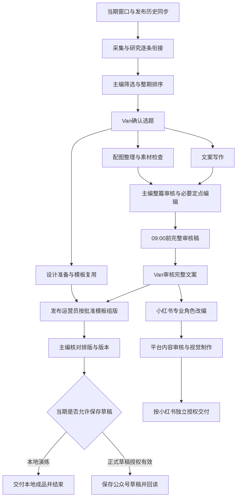

# CSW《营事编集室》角色与新流程优化方案

版本：v1.1｜日期：2026年9月14日｜供Van与开发评审

v1.1补充：公众号与小红书的数据—运营闭环，详见第7.4至7.10节；保留原文件名，方便继续引用。

**本文件是完整的改造建议，尚未实施。** 本轮只形成文档，没有修改角色、代码、后台配置或飞书内容，没有恢复自动监控。

## 1. 建议先做什么

保留飞书作为沟通与人审入口，复用现有岗位、情报来源与已能工作的内容工具。优先修选题决策、任务依赖、成果到件后的接续、共享记录和运行故障。暂不把迁移平台或全员更换模型作为正式生产的前置工程。

建议采用以下五项核心变化：

1. **研究员从采集开始就参与价值筛选，主编在送Van前完成审美与整期取舍。** 有来源、有图片、能写足字数，只代表可制作，不能替代CSW是否值得报道的判断。
2. **公众号日常人审集中为选题、完整文案两类决定。** 中间资料、文件格式、机械组包由系统和岗位负责；已授权条目可继续，不因整期其他条目不足而全部停住。
3. **主编保留最终编辑责任，增加有限的定点编辑权。** 固定模板的组版与打包交给发布运营员及程序；主编不再成为全部文件搬运的必经点。
4. **实际发布记录、编辑反馈和任务决定进入共享记录。** 人工制作的上线内容同样自动同步，减少用户复制链接和重复解释偏好的负担。
5. **用可靠事件驱动任务，用最新记录生成进度。** 交件、批准、补件应触发下一步；每五分钟发消息本身不能证明任务在推进。

### 业务成功标准

| 项目 | 目标与边界 |
|---|---|
| 更新日 | 周一至周五；周一最近72小时，周二至周五最近24小时 |
| 09:00目标 | 北京时间09:00前，向Van送达达到规范的完整公众号审核稿，含总标题、摘要、导读、全部正文和对应图片 |
| 用户参与 | 确认选题；审核完整文案；日常不再承担找图、逐条调度、重复组稿与催办 |
| 最终交付 | 全文批准后，按正式生产授权送入正确公众号草稿箱，并真实回读 |
| 发表 | 草稿保存与公开发布分开；本方案不授予公开发布权限 |
| 数量 | 当期采用用户明确数量。以最近演练的6主2备、6则成稿评估容量，不把旧默认5则15图或本次1条测试当作新长期标准 |
| 质量 | 沿用《营事编集室核心迁移资料包》及Van已明确规范；每条300–500字、背景／核心信息／编辑判断三段 |

**09:00完整审核稿和公众号后台送达是两个时点。** 若Van在09:00后审核，则后台交付应按批准后的约定时长计算。不能同时承诺“09:00才送审”和“09:00已经完成需审核后才能执行的保存”。

## 2. 依据、已知结果与未核实事项

本方案依据三类材料：用户提供的角色配置核对摘要、旧daily_news v1流程核对摘要，以及本助手只读查看的飞书群消息和用户反馈。**没有独立登录服务器读取全部SOUL.md、当前r12工作流或任务数据库。** 开发应核对实际部署版本后落实修改。

| 证据 | 能支持的结论 | 不能直接推出的结论 |
|---|---|---|
| 旧流程摘要：10阶段、每阶段主编与Van双审 | 旧设计正常一轮就有10次Van决定、20道审核，主编还承担合成与通知 | 当前r12必然与旧版所有依赖完全一致 |
| 9月13日六则稿经历多版返工；外部椅套样稿校准后获批 | 判断标准执行不稳，反复退回没有自动形成可靠改进 | 文案永远不具备能力，或某个模型一定不适用 |
| 9月14日Van否决NANGA、Coleman、STATIC，保留HxO | 近期重复、审美、差异价值是实际选择依据 | 永久禁用这些品牌、幕帘或攀岩裤 |
| 主编已记HxO保留，后续报表又称仅候选未批 | 决定记录与状态报告发生不一致 | 已确认具体代码根因是缓存或硬编码 |
| HxO单条正式派工报告13:42；13:49–13:50送稿；14:37本地初版交付 | 单条写作、审核、组版具备完成能力；初版本地交付早于14:50目标 | 整期六则产能、选题质量或09:00生产已通过 |
| 新头尾图补件设计师报告14:59完成；15:00–15:01群中可见补件；主编15:22交新版 | 补件接续与审核合成拖延，15:10新增修改目标未达 | 原14:50目标也未完成；须区分初版与新增修改 |
| Van15:28批准，主编15:33收尾 | 单条本地最终版已验收，主编表示停止五分钟汇报 | 后台保存、公开发布或整套正式流程已获批 |
| 压缩多次出现402、超阈值，收尾仍有错误 | 运行问题仍未取得已修复证据 | 所有内容问题都是压缩造成，或一定是主模型账户余额不足 |
| 15:24报告“#63执行任务已派出” | 需核查状态映射和授权门槛 | 已实际保存或发布公众号；群聊未见相应证据 |

这里有三类成本要分开记：正常的人审等待、系统本可继续却停住的等待、用户新增修改造成的额外工作。不得把它们混成一个“总耗时”解释。

## 3. 首要改造：让选题更接近CSW的编辑判断

### 3.1 采集和研究交错进行

采集员取得一条可追溯原文、发布时间与一张可判断外观的预览后，即可交研究员初筛。研究员不必等整包所有图片、所有字段和所有条数全部通过后再开始。

研究员先判断是否值得继续投入。进入主编候选短名单的条目，再补齐写作所需关键事实及最终配图。已有图片直接复用，最终仍按当期要求提供有效配图，不借流程优化降低交付质量。

这减少“先为不合适选题下载、查证、打包，再整包退回”的成本。采集工具仍复用现有智能体能力；Van此前介绍的ChatGPT、Saveclip、秀米等人工补位路径不列为本轮集成要求。

### 3.2 把编辑价值与可制作性分别判断

| 判断层 | 具体问题 | 执行责任 |
|---|---|---|
| 事实与时效 | 原始披露时间是否在窗口内；品牌、产品和事件是否明确；主要事实有无支持 | 收集员整理，研究员核验 |
| CSW吸引力 | 最值得看的变化是什么；外观、设计、品牌文化或使用关系有什么具体看点；为什么会被Van选中 | 研究员提出，主编看图与原文后取舍 |
| 历史与组合 | 最近是否写过同产品／同角度；本期是否品牌、品类或表达重复 | 研究员查询，主编决定整期组合 |
| 制作可行性 | 信息是否足够支持三段有效内容；图片是否对应；关键事实和素材有哪些缺口 | 文案接单前反馈，收集员定点补齐 |

不用一个总分把这些差异抹平。可靠来源可以降低核验成本，不能抵消用户明确不喜欢的设计；配图齐全也不能把缺少看点的商品变成主推选题。

不强制每一条都写技术升级。设计、审美、文化或使用关系可以构成编辑价值，但必须落在可见、可核的具体内容上。没有前代资料，就准确描述本次披露，不编造“升级”“首次”或更好用的比较。

### 3.3 选题呈现要让Van快速作决定

每条候选采用一张视觉预览加简短说明，主编先完成排序。卡片包含：

- 品牌／产品或事件、原始发布时间、主要来源。
- 一句话说明具体变化或本次值得报道的内容。
- 一句话说明CSW读者为什么要看，必要时指出可见设计特点。
- 最近最相关的一条已发内容及本次差别；未检到时附历史覆盖范围。
- 建议采用／备选及真正影响成稿的缺口。

后台保留完整证据，群内不展开长篇打分和流水账。研究员可以用清楚的工作标题标识选题，不被“正式标题归文案”限制成难以理解的型号清单；正式编辑标题仍由文案负责。

### 3.4 将本次反馈转成可执行、可纠正的经验

| 本次选择 | 后续应该执行的动作 | 不应固化成的规则 |
|---|---|---|
| NANGA近期写过 | 送选题前实际查近期文章及采用角度；区分未同步与已知未用 | NANGA永久降级或禁止 |
| Coleman外观不合意 | 主编看图后评估审美匹配，不能只转述功能 | 所有透明幕帘或所有Coleman都不适合 |
| STATIC缺少特别之处 | 说明具体差异，缺乏变化和设计吸引力时降低优先级 | 攀岩裤一概不能报道 |
| HxO保留且稿件通过 | 记录该条采用结果及已明确理由；从成稿中提炼有证据的尺寸取舍示例 | 推定Van喜欢全部木椅、全部北欧风格 |

历史范例按用途分开：已发布文章展示真实选择和表达；外部校准稿展示判断方法；独立首稿展示当前岗位能力。不得把外部样稿当作文案独立生产实绩。

### 3.5 偏好学习怎样验收

analyst将已有正常审核中的“采用／不采用／原因”与同批候选关联。用户没有选某条但没说原因，不自动标为不喜欢；未发布也不等于被否决。模型推测的偏好单独标“待观察”，不得覆盖Van明确意见。

用已有不同日期的候选与最终选择做一次离线回放，分开检查：

1. 用户实际选过的内容是否进入过情报池；没有进入，属于覆盖不足。
2. 已在池中的好题为何被淘汰；属于排序或判断问题。
3. 已知近期发布的同角度内容为何再次推荐；属于检索或使用问题。
4. 事实齐全但Van不要的候选为何被高排；属于编辑价值误判。

回放时按当时可知的资料与历史记录判断，不让当天最终文章提前泄露答案。无需Van再逐条填写评分表。之后随真实生产记录每期首轮选题采用比例、重复推荐、用户另找选题的数量及筛选耗时。现有一批反馈可作案例，不能当稳定准确率。

## 4. 建议的新主流程

这是业务依赖建议，不要求开发把图中的每个方框都增加为一个需要人审的新阶段。内部任务可保留细分以便追责，Van面对的公众号日常内容决定集中为选题、完整文案两类。

### 4.1 旧阶段如何调整

| 旧阶段 | 建议处理 | 直接收益 |
|---|---|---|
| 01采集→双审→02研究 | 采集与研究逐条交接；取消Van对原始资料包的例行审批 | 好题不用等整包补齐，用户直接看成熟方案 |
| 02选题双审 | 主编先审，Van只作正式选题决定；单条决定与整期数量分别记录 | 不再反复问已经保留的条目 |
| 03全文 | 保留文案生产、主编审核、Van全文终审；自动完成格式核验 | 原质量标准继续执行 |
| 04视觉必须等全文全部通过 | 选题批准后可整理图片、准备模板；最终封面和嵌字依据已批准内容锁定 | 能并行的工作提前完成 |
| 05主编合成并录自审 | publisher承担模板组版／打包，chief核结果；程序生成清单和链接 | 主编集中精力看内容和交付 |
| 06后台保存后再次全套双审 | 在正式草稿授权内执行并回读，异常才升级；不重复请求已批准正文 | 减少纯操作确认 |
| 07依赖06但内容来自05 | 直接依赖已批准内容版本，由xhswriter承接 | 公众号后台故障不阻塞平台改编 |
| 08小红书视觉 | designer依据平台已审文案制作；模板复用与创作任务分开 | 减少不必要重复生成 |
| 09主编合成并录自审 | publisher／程序组包，chief审核 | 两个平台采用一致的交付责任 |
| 10小红书草稿 | 独立平台授权、保存与回读；不挡公众号09:00稿件 | 交付目标可以分别衡量 |

固定模板通过一次后，日常由主编核排版，避免每天再增加独立的Van版式闸。首次模板、用户主动要求的视觉修改、影响表达的重要改版仍交Van确认。9月14日的验版是本次演练动作，不能悄悄固化成每日额外审批。

小红书重新表达后仍须接受对应文案审核，公众号通过不能自动视为小红书全文通过。可在同一“完整文案”任务中呈现两个平台的版本，或另排小红书审核时段；不得为了等小红书而推迟公众号送审。

## 5. 全部九个角色的调整

以下是供开发合并进实际角色文件和流程协议的条款。先核查现有文件及优先级，替换冲突旧条款；不要将新规则简单追加在大量旧禁令后面。

部分内容标准已经存在于初版配置，例如文案的读者判断、主编的实审与交付责任。对这些要求，改造重点是共享版本、实际输入、触发机制和结果验证，不是再次添加同一句要求。chief定点编辑权、publisher承担组版、xhswriter接入固定平台改编，则属于明确的职责或权限变更。

| 修改方式 | 能解决什么 | 仍然解决不了什么 |
|---|---|---|
| 只改角色文字 | 权限冲突、岗位理解和内容取舍口径 | 引擎依赖、重复人审、状态误报和无法唤醒 |
| 只改引擎 | 等待、派工、版本及授权状态 | CSW审美判断、证据运用和自然文风 |
| 角色、引擎、共享数据同步修改 | 同时改善判断依据与执行衔接 | 实际生产仍需验证，不能凭配置写完验收 |

### 5.1 全岗位共同条款

> 开工读取共享核心规范的有效版本、当期明确范围、最新人审决定、当前交付物与相关历史。岗位记忆不能替代这些记录。
>
> 对已授权范围内的必要核验、改用可用来源、整理文件和修正交接字段，主动推进；只把确需用户改变范围、取舍或授予新权限的决定交主编。遇到一处缺口，继续其他不依赖该缺口的工作。
>
> 交付以真实文件、任务提交和通知为准。出现重复退回时改变具体处理方法，不以重新叙述要求、延长截止时间或生成自检报告代替修改。
>
> 已批准内容按具体版本保持；改动涉及事实、选题或编辑意思时标明受影响范围。不得用新版本文件覆盖旧批准对象。
>
> 内部演练、后台草稿、公开发布是不同授权。只获得本地演练授权时，任何下游任务解锁都不等于可以进入后台。

### 5.2 主编 chief／editor

**保留**：内容方向、选题取舍、派工、实审、时间管理、向Van送审和对整期结果负责。原配置已具备这些职责，问题在执行机制与负担，不是缺少“老大”称号。

**替换绝对不改稿的限制**：

> 文案负责首稿和主要修订；主编可对已有证据支持的局部事实归属、时态、重复、标题导读关联与句子表达作定点编辑。保留首稿与修改差异，修改后审核全文连贯性。新增事实必须有来源；不可为赶时限编造、降质量或代Van批准。
>
> 首次正式审核集中指出全部影响通过的问题，区分必须修改与可选润色。允许一轮明确修订；同类问题仍未解决时，选择定点编辑、已批准备选替换或报告具体缺口，不继续无限同样退回。复杂修订需要重新估算影响，不能假报完成。

建议定点编辑预算为10分钟内，作为调度目标，不是到时自动放行条件。在独立成稿能力测试中，chief编辑过的结果须标协作完成；在正式生产中记录其实际投入，不能把代写劳动藏在“审核通过”里。

**增加实际执行责任**：看到新交付或人审决定后，优先处理接续；需要向Van请求决定时，说明只影响哪些任务，并继续其他已授权工作。选题送审前亲自看图、原文和近期组合，不只检查研究员分数。

**减少负担**：固定组包、重复下载核对、状态文字、日历更新由程序生成或publisher执行。chief仍对结果审核，不亲自扮演调度程序。

### 5.3 情报收集员 collector

**保留**：可追溯来源、原始发布时间、变更事实、来源去重、配图整理及当期24／72小时窗口。

**增加**：

> 先取得可判断内容价值的原文与预览，逐条交研究员。对候选的补证围绕真正缺失的主张进行；切换至已授权来源或同产品其他可用页面，不把一个页面失败当作整期停止条件。
>
> 保留原始披露时间与转载时间的差别。晚抓到的旧内容不能改成当天新闻。能否采用同品牌新事件由研究员和主编判断，不只按品牌名称机械去重。

**删减**：候选初筛前为全部低潜力内容完整下载三图、复制历史全包的要求。最终已选条目仍满足当前图片标准。

**交付**：轻量情报记录、来源原文、预览、时间和缺口。当前“昨日提案未发默认降权”调整为按真实结果区分：明确否决、待核验、当日容量不足、未决定；不能一律当作不喜欢或失去价值。

### 5.4 选题研究员 researcher

**保留**：事实核验、时效、排序、编辑角度、读者价值和写作依据。

**增加**：

> 在采集进行中判断价值。对每个主推条目实际读取视觉素材和相关已发记录，解释具体设计／文化／使用看点，先淘汰只有资料完整却缺少编辑吸引力的内容。
>
> 不强行给每个产品找前代升级对照，不因一条素材无法支持长技术分析就虚构参数需求。给文案的判断方向必须由现有事实支持，写出可解释的使用条件或认识增量。

**调整评分**：先明确采用、备选或淘汰原因，再用评分辅助排序；总分不能压过明确否决理由。

**交付**：一份适合Van快速比较的选题方案，加后台证据记录。原始包数量不足时仍交可用条目及缺口，不把整包失败等同于每条都不能研究。

### 5.5 文案 deepwriter／writer

**保留**：公众号总标题、摘要、导读、每条300–500字三段正文，按原最高规范写作；资深户外潮流媒体编辑风格。

**增加**：

> 开写前检查素材是否支持背景、核心事实及具体判断。资料不足时定点核源；不将面料、尺寸、重量等一整套参数清单设为所有资讯必须具备的前提。
>
> 判断可以引用前文事实，但应增加适用条件、选择依据或具体影响。逐段检查信息职责，防止删除一处同义句后又在另一处补回。审校说明和无必要免责留在证据记录，不写进读者正文。
>
> 标题和导读降低理解成本。专业知识体现于取舍与解释，避免用机构术语、参数清单或无来源体验显示专业。

**交付方式**：逐条完成后提交可审版本供chief提前实审，同时保留完整当期稿；总标题、摘要、导读在组稿时统一完成，不等后台保存后再补。统一现行字数口径，禁止各角色临时改变计数方式来解释合格。

**职责转移**：常规小红书改编移交xhswriter，deepwriter维护公众号内容和共同事实依据，避免同时重复生产同一平台稿。

### 5.6 设计师 designer

**保留**：封面、平台视觉、原始品牌资产、手机可读性、真实素材对应和必要创作。

**增加**：维护经Van确认的顶部横幅、尾部品牌介绍、封面与正文模板，带版本与用途；选题确认后即可整理可复用图和准备版式，最终文字及封面主张绑定批准版本。

**调整生成要求**：日常原图排版、原LOGO使用、固定模板替换无需默认重新生图。明确要求生成图片的任务仍使用指定生成能力并保留真实产物，不用手工图冒充。取消“每期都必须通过生成工具重新制造所有视觉”的无差别约束，需要同步检查旧技能和种子定义。

**补件职责**：用户要求换图时提交具体资产、适用位置与预览，自动触发当前组版负责人接续；不让补件停留在群消息里。修改主张或图中文字时须走受影响的内容审核。

### 5.7 发布运营员 publisher

**扩大为交付执行负责人**：负责已批准模板内的本地组版、图片引用、文件打包、平台字段填充、草稿保存及回读。chief审核结果，不再亲自完成每个合成动作。

> 所有输入绑定当前批准版本；保存操作前确认当期目标账号、允许动作和内容版本。接口响应不确定时先查询既有草稿与操作记录，避免直接重试产生重复草稿。
>
> 本地演练交付完整HTML、附件和可读预览；正式任务在草稿授权内继续保存并回读。不得将“可派工”当成“已授权保存”，也不把任务状态文字当作平台操作成功。

**发布记录分工**：提供平台真实状态和来源给同步程序；人工发布同样由同步程序发现，不再只靠publisher自己经手的任务生成已发库。

### 5.8 小红书图文作者 xhswriter

**接入真实任务**：承接已批准公众号内容的独立平台改编，取代日更07仍默认交deepwriter的重叠配置。

> 依据传播力、视觉吸引力、认知门槛、讨论价值和信息重要度重新排序和表达。保留准确产品结构、背景及使用信息；按Van规则输出导语、普通条目200–300字、重点条目300–400字的长文及所需分页文案。
>
> 只在当期授权包含小红书时启动；用户只要导语就仅交导语。公众号终审不是平台改写的自动批准，不把编造体验、评论引导或额外模块设为默认交付。

小红书可与公众号组版并行，但不占用必须保障09:00公众号审稿的资源和等待条件。

### 5.9 合规版权审查员 reviewer

**改为有触发条件的专业检查，避免新增全链串行关卡。** 收集员先记录来源和素材使用依据；reviewer在选题入围和配图整理时即可并行处理具体问题。

> 对缺少支持的性能、安全或绝对表述，以及使用依据不清的素材，明确到句子或图片给出原因、所需依据及可行替代。普通已核信息不重复重审全部来源，不因泛泛顾虑无限阻塞整期。

不将“官方发过”自动等同于已获得公开使用许可。本地内部测试和公开传播的检查范围分别记录；存在明确未解决的公开使用问题时，只阻断相关公开环节和素材，其他可继续工作照常推进。

reviewer的专业检查不产生额外Van日常审批；确需用户作版权／商业安排的决定时，由chief合并说明具体事项。这里是工作分工建议，不替代实际权利核查或法律结论。

### 5.10 数据复盘师 analyst

**接入两项持续工作**：真实发布与选择反馈的结构化记录；定期比较新流程实际表现。

> 将人工与智能体制作的实际发布内容统一入库；把用户明确选题取舍与同批候选关联，区分真实意见与模型推测。共享偏好版本由主编维护并可纠正，其他岗位实际读取。
>
> 复盘按覆盖、排序、事实、写作、接续、平台和故障分类，报告具体改动及后续结果。阅读量和点赞可补充观察，不能覆盖Van对媒体定位和审美的明确选择。

不作为每期发送前的必经审批。每日后台自动记录，按周或出现重复失败时给短结论；不让长篇复盘消耗晨间生产时段。

**增加运营闭环职责**：维护两平台的指标口径与同龄数据快照，将有证据的发现交主编决定，形成有负责人和复查日期的改进任务；跟踪实际采用的内容／视觉版本，复查后标为支持、不支持或证据不足。只有改动已执行且结果已复查，才算闭环；只交报表、结论或方法建议不算完成。具体机制见第7.4至7.10节。

## 6. 引擎必须同步修改的规则

只改SOUL.md无法解除数据库依赖、旧审批闸和手动派工。下列内容应落实在程序或工作流定义中，而不只写入提示词。

### 6.1 条目与整期分开推进

一份Run保存当期数量目标，每条资讯保留独立的候选、批准、写作、审核和素材状态。整期数量不足只影响“整期完成”，不能反向抹去已批准条目。

当Van批准某条进入成稿，其标准含义应包含允许该条写作与对应素材整理。若用户只说“继续研究”则仅开放研究；不把两类决定混用。对于“保留”这类措辞，由当时明确的问题和上下文绑定决定类型；确实不明确时只问受影响范围一次，后续持续复用已确认决定。

备选若要自动替换，须在选题批准时同时记录可替换条件与顺序。没有这个范围时，换选题仍需Van决定；主编可以继续其他已批准工作，不等待整期重批。

### 6.2 审核绑定对象和版本

保存“谁在何时对哪个对象的哪一版本批准什么”，同时保留原消息依据。研究许可、选题批准、全文批准、模板批准、本地验版、保存草稿许可和公开发布许可分开。

新正文改变事实、角度或编辑意思时，旧全文批准不能自动覆盖。只替换已指定头尾资产时，保留不变正文的批准，重新核验受影响版式及文件版本；不让整条文字链重新走一遍。

审批入库前校验待审对象仍是用户看到的版本。若期间发生更新，保留用户决定并明确版本冲突，不能把它套到用户没看过的产物上。

### 6.3 派工、通知与恢复

新增一个可靠的调度组件即可，不再增加一个靠长对话做协调的新智能体。要求如下：

- 交付提交、用户决定、素材补件和任务失败形成持久事件；写入任务与待通知事件保持一致。
- 工作者提交成功后，审核队列立即更新；提醒主编并记录是否接单。群消息失败可重试，不能因此重新生产同一内容。
- 事件允许重复到达，但用任务、版本和事件标识去重，避免重复派工、重复审核或重复保存。
- 长任务期间的新交付进入队列，不靠用户再次@才被发现；不要为了五分钟播报反复中断正在进行的内容作业。
- 中断或重启后，从最新任务、批准版本和已交产物恢复；不能只凭会话摘要另开同日Run。

建议起始服务目标：交付到审核队列不超过1分钟，主编在2分钟内接单或给出真实排队原因。它们是需开发验证的目标，不是已具备的能力；复杂全文审核仍按实际工作计时。

### 6.4 真实状态与进度展示

至少区分以下状态：等待必要依赖、具备派工条件、已正式派工、执行者已接单、执行中、等待主编审、等待Van审、需返工、已交付、失败、取消。

“具备派工条件”“已派工”“执行中”不得映射为同一句话。执行中要有最近有效动作或产物证据，不能仅凭gateway为running推断在工作。

每条进度包含当前对象与版本、最近成果及时间、当前负责人、真正阻塞项、下一节点。截止已过时必须显示逾期和剩余工作，不能继续把过去的时间写成下一交付。

以任务和已录人审决定生成报告；content-calendar.md作为投影或自动导出，不再与引擎、角色记忆形成三个互相竞争的当前状态。群里只展示简短进展和需要决定的事项，技术日志留在任务记录。

本轮五分钟播报已停止。后续正式任务如采用进度卡，按任务生命周期自动启停；新增完成、故障或需决定时主动提醒，不用无变化刷屏代替工作。

### 6.5 文件交接与补件

中间阶段引用同一份不可覆盖的素材和证据，不反复下载、复制、打包全部历史文件。程序生成版本、入口和必要元信息，并在提交前一次验证缺失字段、文件与引用；业务角色不因九字段格式问题再做一轮“内容返工”。

最终仍提供用户可读的完整稿和同版附件。不能只发服务器localhost链接给Van充当送达。补件保留自己的版本并指向受影响成品，由组版任务订阅并接续；按内容和图片差异决定复查范围，最终再核整篇显示和版本一致性。

### 6.6 #63的专项核查

开发应回放9月14日15:24附近#62审核事件、#63状态变化、实际dispatch记录、worker接单及后台工具调用：

- 若只是上游通过后解锁，修正“执行任务已派出”的报告映射。
- 若实际派工但没有保存权限，修正派工门槛，并确认任务是否被执行。
- 保存和公开发布能力在执行入口检查当期动作许可，不能仅依赖主编在群里写“不保存”。

目前只读群聊不足以确认是哪种情况。不得在复盘中写成已经发生越权发布，也不得以一句“不发布”代替实际核查。

## 7. 真实发布记录自动同步

### 7.1 共享记录至少覆盖什么

| 数据 | 必要内容 | 用途 |
|---|---|---|
| 真实发布 | 平台与账号、文章／笔记标识、链接、实际发布时间、标题、正文、品牌与产品、实际角度 | 查重、近期组合、学习真实表达 |
| 条目拆分 | 一篇合集中的每条资讯、原链接／产品、所处期数 | 不只按整篇标题查重，识别合集内NANGA等条目 |
| 决策记录 | 同批候选、采用／否决／待定、明确原因、决定时间与对象 | 学习偏好，区分未选与不喜欢 |
| 同步状态 | 最后成功时间、覆盖起止、缺口、失败原因、来源方式 | 防止把记录不全说成从未报道 |
| 制作和发布状态 | 候选、内部演练、待审稿、已保存草稿、实际已发分别记录 | 避免测试与草稿污染已发库 |

### 7.2 实施路径

开发先验证当前公众号工具或有权使用的官方读取能力能否覆盖**该账号人工发布和智能体发布两种记录**，用已知样本对照实际后台。不能只看到“获取发布列表”接口名称就承诺完整覆盖。

本次公开读取未取得微信官方接口正文，也没有检查CSW账号接口权限。因此这里给出需要实现和验收的能力，不指定某个接口已可直接解决人工发布同步。若现有接口漏掉人工记录，开发需使用经授权的后台读取／导出途径补齐；不要将同步职责重新交回Van手动发链接。

建议首版：由开发和publisher完成最近30天历史的一次性回填，自动拆分合集条目；保留更早已有记录。随后在平台操作成功后更新，并定时补拉，以发现人工发布。初始建议补拉周期30分钟，另在晨间选题前强制检查最新同步状态；具体频率按可用接口与实际负载调整。

去重同时看相同链接、品牌产品、事件和采用角度。近期30天用于强提示，长期同产品同角度记录仍可检索；新事件有新事实时允许主编判断，不设置永久品牌封禁。

### 7.3 必须做的覆盖验证

选择已知人工发布合集、系统产生后发布的文章、尚在草稿箱的文章和内部演练稿，各核一例；一次合集要能拆出其包含的单条选题。验证未发稿不进入已发库、重复同步不重复入库、失败会显示历史缺口、更新内容保留可追踪版本。

没有覆盖完整度证据时，系统只能说“在已同步记录中未发现”，不能给出“从未发布”的结论。

### 7.4 数据复盘员的目标：让下一次运营动作有依据

自动同步回答“我们已经发了什么”，效果复盘回答“哪些内容和表达有价值、哪里需要调整、改动是否奏效”。两者共用发布记录，但属于不同交付。

闭环流程：实际发布 → 自动记录内容及表现 → 分析问题与机会 → 主编选择改动 → 指派现有岗位执行 → 下一次同类内容复查 → 保留或撤回规则。

analyst负责推动“发现到复查”的完整记录，chief对是否改变编辑策略负责。运营目标建议先围绕CSW核心任务：让合适读者发现内容、愿意阅读和分享／收藏、持续关注并形成对媒体的认可。若后续明确社群、活动或商业转化目标，再增加相应可追踪事件，不能默认用销量或粉丝总量替代媒体质量。

### 7.5 两个平台分别看什么

下表是建议采集与分析的维度，**不代表已经确认两个账号具备全部字段或API权限**。开发先读取实际后台或授权导出的字段和定义，缺失项标“不可得／待更新”，不能记为零或用公开点赞反推。

| 要回答的问题 | 公众号建议观察 | 小红书建议观察 | 可产生的运营动作 |
|---|---|---|---|
| 内容有没有被看到 | 送达与各阅读来源，区分公众号消息、分享、搜索等实际可用口径 | 曝光、阅读／观看进入及可用来源，区分自然、搜索和付费等 | 检查发布与分发异常；publisher核渠道与时间，chief判断是否需要调整分发安排 |
| 包装是否让人愿意打开 | 若后台有对应分母，观察公众号消息阅读与送达的关系；同时看标题、封面和位置 | 若后台提供，观察曝光到阅读的点击表现，结合标题、封面与首图 | designer或writer/xhswriter调整下一次同类内容的包装 |
| 打开后是否获得价值 | 阅读时长、完成情况等后台确有数据的指标；结合文章长度、分享及具体评论 | 阅读／观看停留与完成情况如可得，收藏、分享、评论具体内容 | writer/xhswriter改信息顺序、解释密度和图片职责 |
| 是否值得保存和传播 | 分享人数／次数、收藏或其他实际提供的深度行为，分别保留口径 | 收藏、分享、相关问题与实际使用意向 | researcher识别可延展选题；把重复问题转为后续内容候选 |
| 是否建立持续关系 | 内容归因的关注如可得；账号净增仅作整体结果 | 内容带来的主页访问、关注如可得；账号净增单列 | chief与平台作者调整系列承接、品牌认知和内容组合 |
| 后续是否继续被发现 | D+7以后阅读增量与可用来源 | D+7、D+30阅读增量、搜索来源或搜索词如可得 | 对长期有价值的主题提出更新／专题建议，经正常选题审查执行 |

不把小红书聚光等广告数据口径直接套在自然内容上，也不把公众号和小红书的阅读量、互动率混成同一排名。作为接入限制的一个例子，本次读取的小红书账号授权文档只明确开放基础账号信息，不能据此保证已获得笔记分析数据；运营后台、商业工具与开放授权能力需要分别核实。[小红书账号授权范围](https://openaccount.xiaohongshu.com/docs/scope)

### 7.6 指标口径、快照和归因

**发布时锁定内容信息。** 至少记录平台、账号、真实发布时间、文章／笔记ID、期数、包含的story_id、主题类别、品牌、内容角度、标题、封面、字数／页数、模板版本、发布位置、是否付费或商业合作。人工发布同样进入记录；不知道的字段保留未知，不由模型补猜。

**按发布后经过的时间采样。** 建议最低保留T+24小时、T+72小时、T+7天；小红书及有持续增量的内容增加T+30天。早期2—6小时只用于发现图片、链接或异常分发等操作问题，不急于判定选题好坏。平台数据尚未更新时，记录真实采集时间和覆盖窗口，再补采；任务计划到了不等于数据已经成熟。

**比同平台、同类型、同龄内容。** 以最近10—20篇可比内容的中位数和分布建立起始基线，记录实际样本数；样本不足就延后定论。公众号合集与单篇专题、小红书合集与单品图文、自然内容与付费内容分别观察。不能拿发布三小时的稿与发布七天的稿直接比较，也不能忽略节假日、热点与头条位置的影响。

**优先保存原始值和平台定义。** 派生指标只在同范围、同窗口、单位明确时计算。例如：

- 公众号消息打开表现，可在字段允许时采用“公众号消息阅读人数÷对应送达人数”，不能把全部来源阅读人数放进分子。
- 分享人数／阅读人数与分享次数／阅读次数是不同指标；分别命名，保留原始分子分母。
- 小红书点击率优先使用后台定义；自行计算时说明曝光与阅读是人数还是次数，不能擅自混用。
- “每千次阅读收藏数”是收藏数÷阅读次数×1000，不声称等于收藏用户转化率。
- 账号当天净增关注不能归因给某一篇文章；只有后台提供内容归因或有明确追踪依据时才分析单篇关注贡献。

同一故事在两平台用共同story_id关联，比较角度、包装与后续表现，分别解释。不能直接相加两平台曝光当作去重触达人数，也不能据此认定同一批用户跨平台转化。

**合集不能伪造单条成绩。** 一篇六则合集的阅读量、完读或分享属于整篇结果。只有评论明确点名、实际提供的条目级点击／阅读信息，或后续独立内容等证据，才可讨论某条的具体反响；这些证据也要分别说明偏差。首页标题突出某品牌后打开率高，不能同时证明其余五条都受欢迎，更不能把每条都记成同样阅读量。

### 7.7 每个发现必须接到负责人和验证结果

analyst最多同时推动两个运营改进项目，避免让每天生产变成实验大会。每项记录：观察及样本／口径、可能解释与其他解释、建议只改的因素、执行负责人、对应内容版本、完成时间、预定复查点、主要指标和质量约束。

主编决定采用、暂缓或拒绝，并说明简短原因。采用后通过现有任务系统分派；analyst跟踪实际版本与结果，不直接修改已发内容或替岗位执行发布。超过期限仍未执行，向chief报具体未接续事项；不再生成一份内容相同的分析报告。

| 发现方向 | 第一责任人 | 应交出的具体改动 |
|---|---|---|
| 可用好题没有被发现、总围绕相同品牌 | collector、researcher | 调整经批准的监测来源／检索方向，验证是否补上覆盖缺口 |
| 候选齐全但CSW不想选、同角度重复 | researcher、chief | 调整淘汰与排序依据，引用近期发布和明确选择反馈 |
| 有曝光但进入表现持续偏弱 | designer、writer或xhswriter | 下一次同类内容的一项标题／封面改动，并保留前后版本 |
| 进入后停留／完成偏弱，具体评论反映理解问题 | writer或xhswriter | 改开头、顺序或解释方式，确保承诺与正文一致 |
| 收藏／分享有价值，但读者不认识CSW定位 | chief、xhswriter、designer | 提出系列承接或品牌表达调整；不默认加入诱导关注话术 |
| 评论多次问同一个使用问题 | analyst归纳，researcher提出，chief筛选 | 形成有来源的后续选题，经正常选题确认后制作 |
| 发送、格式、来源显示或链接异常 | publisher、开发 | 核清实际操作和工具问题，按授权修复并回读 |

日常改进通过既有选题、文案与模板规则执行，不增加一套逐项Van审批。涉及新发布、修改已上线内容、投放预算、商业承诺或品牌定位改变时，仍按对应授权处理；本方案本身不授权这些动作。

### 7.8 怎样验证，而不把猜测写成规律

尽量一次只改变一个主要因素，预先确定看哪个结果、在哪个时点看。若平台与账号没有可用的随机对照能力，就用后续数篇可比内容观察，明确属于运营观察，不把一次上涨写成已证明的因果。

示例（假设，不是CSW已有实绩）：同类小红书图文在D+3的收藏／千次阅读表现较好，进入表现连续偏弱。analyst提出“封面未清楚展示具体变化”的假设；chief选择在后续可比内容中只改变封面呈现，由designer执行。复查看进入表现，同时看收藏／千次阅读和内容质量是否下降。若曝光来源发生明显变化或样本太少，结论标证据不足，不能把全部变化归功于封面。

每项改进最后只归入四种状态：未执行、执行后支持、执行后不支持、证据不足待观察。规则被支持时写清适用平台、内容类型、证据和复查日期；不支持时撤回，避免错误经验永久进入所有岗位记忆。

提高点击或互动不能以事实错误、标题夸张、重复弱题或破坏CSW文风为代价。品牌价值与Van明确的审美选择保留为编辑约束，数据帮助取舍，不以一次高流量覆盖这些要求。

### 7.9 汇报与日常运营节奏

| 时点 | analyst交付 | 对生产的影响 |
|---|---|---|
| 发布后 | 自动建立记录和后续采样任务 | 不需要Van再发送文章链接或截图 |
| 每日早间选题前 | 读取已成熟的历史快照，最多5行：数据是否齐、重要变化、当前改进进展、需要chief处理什么 | 不等待当天长篇日报，不阻塞09:00主线 |
| 每周固定一次 | 一页复盘：三项以内发现、样本与口径、最多两项改进、负责人及复查时间 | chief选动作，进入已有角色任务 |
| 每月或积累足够样本后 | 审查内容组合、平台差异、已验证规则和失效规则 | 更新共享偏好，避免每天随单篇波动摇摆 |
| 实际故障或动作逾期 | 一次明确提醒责任人，跟踪解决 | 不把刷屏当成推进 |

数据更新、动作执行和结果复查由事件／计划触发，属于建议开发能力；本次没有创建或启用任何实际监测任务，也不恢复此前暂停的飞书查看。

### 7.10 数据—运营闭环怎样验收

先验证数据能力：两平台各选一篇已知人工发布内容，能自动识别并建立正确记录；账号、内容ID、采样年龄与后台数值能对上。没有的数据明确为空，付费与自然口径分开，跨平台与合集的归因不混淆。

再验证行动能力：至少完整完成一个“有证据的发现→chief决定→岗位任务→实际修改版本→到期复查→保留／撤回”的周期。不能用发出报告或派工代替闭环完成。

analyst自身应考核：采集覆盖与准确性、建议是否具体、被采纳动作是否真正执行、到期是否复查、结论能否被后续证据纠正。账号增长和内容表现是团队共同结果，不应全部压给分析员，更不能为展示上涨而挑选有利数据。

## 8. 共享规范、模型与运行保障

### 8.1 共享规范以有效版本发到所有任务

#### 历史反馈积累与新任务调用（9月14日补充）

开发须将Van过去及今后在主编私聊、编辑部群聊、回复线程、审核记录中明确表达的编辑要求纳入持久共享记录。先从已有可访问历史回收，不要求Van重新口述；记录实际覆盖范围与未能读取的历史，不宣称已经吸收全部反馈。日常从正常审题、改稿和终审中持续更新，不增加用户重复录入。

每条记录保留原话、时间、消息或审核来源、对应产品／文章／版本，以及相关图片或稳定的图片引用。审美与设计案例必须能回看图片，仅存抽象文字标签不足。分开存储长期内容与文风标准、具体产品的个案判断、当次任务临时要求、近期已发布等时效信息；临时冻结或演练限制不能永久污染后续生产。

Van明确意见与智能体推测必须分开。未选不等于不喜欢，单款否决不等于品牌禁选。新旧意见冲突时记录适用范围和变更关系，明确被替代或失效的规则；不能简单按最新一句话覆盖全部历史。确有歧义且影响执行时，由主编集中提请确认，其他已授权工作继续推进。

analyst整理候选与反馈，主编负责归纳质量和有效版本，开发负责历史导入、持久存储、检索与任务接入。研究员、主编、文案、设计师在对应任务中实际读取相关规则和正反例，并留下所用版本与记录引用。不要把全量聊天塞入每次上下文。会话压缩、重启或更换角色会话后，相关记录仍可恢复和调用。

验收不能止于“已入库”：从历史明确反馈抽取代表性案例，验证原话、图片与适用范围可追溯；在新独立选题和写作中检查是否调用、是否减少同类错误；补测一次会话压缩或重启后的读取，以及临时要求到期不再误用。不能用模型声称已学习代替实际结果。

共享材料分为：核心内容规范、实际编辑选择与理由、批准的视觉资产、当前任务状态。核心迁移资料包仍是最高内容依据，Van后续明确修订作为可追溯变更合并；不能另造一套与它冲突的方法论。

每次派工带有效规范版本及本任务相关范例，不把两天全部群聊、全部历史退回和全部日志装进每个岗位的上下文。已过期的“只改某处”“主编不得改稿”“冻结某版”等任务限制保留历史，但不自动传播到下一期。

不要将这份方案全文粘进九个SOUL文件。岗位文件保持职责和授权边界简明，内容规范、操作手册、共享记忆和引擎条件分别放到对应位置，避免角色越改越长。

### 8.2 模型暂保留，先核实实际调用

用户提供的配置摘要是chief使用gpt-6-astra，其余八岗使用gpt-5.6-sol，路由custom:sub2api，推理档位medium。OpenAI官方当前资料将Astra定位于最复杂的端到端工作，Sol定位于复杂专业任务，并均列出图像输入与工具调用能力；这不能证明CSW代理路由的实际能力、额度或故障情况与官方接口完全相同。[官方模型对比](https://developers.openai.com/api/docs/models/compare)

建议先保留这套分配，核查真实请求所用模型、图像是否送达、调用延迟与错误、工具执行链路，以及主调用和压缩调用各自的路由。不要仅凭配置中的名称和gateway running验收。

在输入、规则和运行故障修复后，若选题仍不准，可利用既有候选记录对研究员的两个配置做离线对照，只改变一个因素。看实际采用匹配、同角度误推荐、总耗时与成本，再决定是否升级研究环节。不要同时换全员模型、推理档位和流程后宣称找到原因。

### 8.3 压缩与会话恢复

Hermes当前官方文档将上下文压缩的模型／提供方配置与压缩行为配置分开；新会话也不会因为过了一天就自动建立。开发须先确认部署版本，再核查对应配置和恢复行为。[配置文档](https://hermes-agent.nousresearch.com/docs/user-guide/configuration#context-compression)；[会话说明](https://hermes-agent.nousresearch.com/docs/user-guide/messaging#session-continuity)

建议处理顺序：

1. 查实际发生402的调用链、账户与路由；主调用正常不代表辅助调用正常。
2. 修复压缩调用并测量结果，确认审批、当前任务、最新附件和未完成动作没有丢失。
3. 将关键决定与产物保存在会话外的任务记录中；需要换会话时先形成任务检查点，恢复后读取权威记录再继续。
4. 为失败设置有限重试和经验证的替代路径。连续相同错误时避免无限调用，向开发报告一次可处理的故障，并继续不依赖该故障的任务。
5. 常规技术进度归入后台记录，群里只保留业务影响和必要故障提示；不能通过隐藏错误代替修复。

不把204,000触发阈值写成已确认的模型最大容量，也不直接套用网上最新配置键替换未知部署版本。最大90次迭代与1800秒超时只是运行配置，不等于业务截止、有效工作时长或质量保证。

## 9. 建议的晨间时间表

以下是**待采用并用实际生产验证的排程**，不是当前能力保证。为了让每天24／72小时覆盖清楚，建议固定07:00作为本期资讯窗口截止；周一从周五07:00开始，周二至周五从前一天07:00开始，下一期接续。扫描可以提前进行，07:00补齐最后增量；截止后新消息原则上进入下一期，重大例外由主编单独说明。

| 时间（北京） | 交付／动作 | 责任 |
|---|---|---|
| 05:50–06:00 | 检查调用、采集入口、任务队列、发布历史同步；有故障立即处理 | 调度组件、开发值守、chief |
| 06:00–06:40 | 采集与研究交错，形成有视觉依据的短名单，提前淘汰弱题 | collector、researcher |
| 06:40–07:00 | 补齐关键事实、历史查重与窗口最后增量，整理主选备选 | collector、researcher |
| 07:00–07:15 | 主编看图、审价值与整期组合，送选题方案 | chief |
| 07:15–07:30 | Van确认选题；已逐条明确批准的工作即时启动 | Van、chief |
| 07:30–08:15 | 写作；配图、素材检查、版式准备并行；逐条完成即交主编审 | writer、collector、designer、reviewer按需 |
| 08:15–08:35 | 主编整期审核，总标题／摘要／导读统一收口 | chief、writer |
| 08:35–08:50 | 一轮必要修订或主编定点编辑，保持质量要求 | writer、chief |
| 08:50–09:00 | 完整审核稿与同版图片送达，留10分钟余量 | chief、交付组件 |
| 建议09:00–09:15 | Van全文审核；这是建议窗口，需结合实际可审时间一次固定 | Van |
| 全文批准后25分钟内 | 使用已批模板完成组版、核对、在正式授权内保存草稿并回读 | publisher、chief |

如果Van无法在07:15–07:30审核选题，应一次调整时间表，或另行明确哪些预授权选择允许先写；不能默认沉默通过。人审超出约定窗口时保留原09:00目标的实际结果，分开标注人审等待和内部延误，并给出剩余制作时间。

六则稿的写作预算是待测容量计划。HxO单条数分钟完成不能直接乘以六后当作整期承诺；整篇一致性、难题补证、配图和人工取舍会增加实际耗时。

小红书另排文案和平台交付节点，不参与公众号09:00主线的完成条件；待公众号稳定后根据实际需求固定其时限。

### 数量不足或补证失败时

在选题送审节点一次说明缺口、已查范围、推荐可用项及对整期的影响。优先按已授权来源和备选条件继续工作，不擅自扩大时间窗口、不用旧新闻或弱题凑满。若必须改变数量或选题范围，由Van作一次相应决定；已批准条目照常推进。

“交出部分合格内容”和“当期完整目标完成”分开记录。不能通过反复顺延或改成单条测试擦掉整期失败。

## 10. 开发落地顺序

### 第一批：正式生产前完成的最小改造

| 编号 | 需要落地的变更 | 负责人 | 完成证据 |
|---|---|---|---|
| P0-1 | 核实压缩402及实际主／辅助调用，修复并验证恢复 | 开发 | 成功调用、压缩前后记录、批准和任务恢复一致 |
| P0-2 | 核实#63；分开解锁、派工、执行及后台权限；发布动作独立约束 | 开发 | 回放事件与一条无后台权限任务的实际阻断结果 |
| P0-3 | 按条目推进、人审对象版本明确；移除与日常目标冲突的重复人审和整包阻塞 | 开发、chief | 部分批准条目能开工，数量缺口仍保留；没有重复审批请求 |
| P0-4 | 交付／补件／批准触发审核或派工，过期状态及时更新 | 开发 | 提交到接单的时间记录；无用户催促仍能继续 |
| P0-5 | 统一九岗有效规范；chief定点编辑权；研究员提前参与；固定模板交付分工 | chief、开发 | 修改前后条款对照，实际任务加载版本与角色责任匹配 |
| P0-6 | 回填近期真实发布记录并跑通最小自动同步；记录覆盖缺口 | 开发、publisher、analyst | 人工发布样本可检索、合集拆条正确、草稿和演练未混入 |
| P0-7 | 固定当期数量、资讯截止、人审窗口、09:00稿件与批准后草稿时限；锁定已批头尾图和模板 | chief、Van作一次业务确认，开发写入流程 | 一份生效的生产约定及角色可读取的资产版本 |
| P0-8 | 核实正确账号草稿保存与回读能力，明确工具失败后的恢复 | publisher、开发 | 在另行允许的测试／正式任务中取得真实草稿及内容核对证据 |

P0是需要实现的能力范围，不要求一夜重写整个任务引擎。开发可保留现有数据库和接口，先调整依赖、审核设置、事件接续、记录投影和必要权限校验。历史任务与测试包保留，只对新生产流程启用新版本。

### 第二批：生产启动后继续优化

- 将选题偏好对照与漏选分析做成固定后台流程，减少人工检查；不增加Van日常评分负担。
- 完善更早发布历史、跨平台条目关联和同步故障补采。
- 稳定接入xhswriter独立支线，按平台实际节奏安排交付。
- 优化图片缓存、字数及链接检查、模板预览和通知展示，降低重复传输与调用成本。
- 在流程稳定的数据上比较模型／推理档位；优化成本与延迟。

### 以9月15日启动为目标的实施安排

9月14日剩余时间由开发先核对生产代码和角色文件，完成P0变更及下节的短验证；chief整理共享规范、近期选择依据和已批资产，publisher与analyst核对实际发布记录。能独立开展的工作并行，不要求主编逐个转述才能开始。

9月15日把第一期真实生产作为整期业务验证，照约定时间推进并记录。**只有关键运行、授权和实际交付能力已验证，才应报告“已具备启动条件”；即使能够启动，也不等于长期09:00稳定性已验收。** 若关键项未完成，开发应明确未完成项、实际影响和最短修复路径，不能让主编继续用内容演练掩盖系统缺口。

## 11. 怎样验收改造有效

以下是开发验证和正式运行指标，不是再要求文案做多轮单条训练。可用已有任务记录和隔离样例验证机制；真实后台写入仍需对应授权。

| 验证场景 | 合格结果 |
|---|---|
| 已批准HxO但整期数量不足 | 该条可写，整期仍显示数量缺口；不重复询问是否保留 |
| 只批准继续研究 | 不误派正式文案；其他已经批准的任务照常执行 |
| 提交成功但群提醒失败 | 产物仍在审核队列，提醒重试，不重复写稿／开任务 |
| 同一交付通知重复到达 | 只产生一次有效审核和一次下游派工 |
| 设计补件在主编长任务中到达 | 被可靠排队并及时接续；报告显示已交、待谁处理 |
| 仅本地演练，上游审核通过 | 后台保存与发布不执行；报告不把解锁写成已派工 |
| 正文批准后替换头尾图 | 不要求重写已批正文；成品引用正确新资产且保留版本 |
| 保存请求返回不确定 | 查询实际草稿再决定重试，没有重复创建 |
| 运行重启或压缩失败恢复 | 最新批准、文件和待办完整，旧决定不倒退，同日Run不重复 |
| 人工发布一篇合集 | 不经Van手工发链接也能进入已发记录，并识别各条资讯 |
| 截止时间已过 | 进度明确逾期、原因和剩余工作，不继续播放过期下一节点 |

真实生产分别衡量：

- 选题：首轮采用比例、已知同角度重复数、用户需要另找的题数、补证总耗时；以实际候选与明确决定为分母，不编历史基线。
- 质量：事实／归属硬伤、Van退回原因、同类错误复发，是否仍靠无信息句填300字。
- 效率：实际写作、审核、排版、人审等待、内部等待、故障时间；同时保留总历时。
- 交付：09:00前完整稿是否真实送达，批准后草稿时长、正确账号与版本、缺图或重复草稿。
- 自主推进：不依赖Van催办的接单、审核和交付；真实需要选题取舍的提问不计为无效催办。

**建议的初期目标**：用户不再为普通内部接续催办；已同步且无新角度的重复推荐为零；修订循环按既定机制止损；每期如实考核09:00与草稿交付节点。先用第一期发现遗漏，再连续观察至少3个工作日；72小时的周一窗口仍需单独有一次真实验证，不能由周二表现代替。

文案首稿、主编定点改稿后的协作稿、Van终审稿分别留存。首稿一次通过与团队最终按时交付是不同指标，两者都记录，避免通过隐藏主编劳动美化“文案进化”。

## 12. 平台取舍与开发最终交付

目前没有足够证据把飞书消息载体认定为低效的主要根因。已观察到的问题集中在选题、记忆使用、依赖、接续、状态和模型运行层；搬到另一个聊天平台不会自动改变这些规则。

因此，本轮先保留飞书入口，建设可在不同入口复用的任务与交付机制。如果修复后仍出现可重复的平台消息丢失、唤醒或附件送达问题，再用相同任务比较其他入口或执行服务，迁移范围以已证实瓶颈为准。现在不引入新平台采购和整队重建。

请开发最终交付一份简短变更记录，包含：

1. 九个角色与实际技能／手册的修改对照，已移除的冲突规则，以及新任务读到的有效版本。
2. 新工作流依赖、人审对象、动作授权和事件接续的实际实现。
3. 真实发布同步的来源、覆盖范围、失败处理与人工发布样本验证。
4. 主调用和压缩调用的真实路由、故障修复与恢复证据。
5. 已通过的机制验证、仍未验证的能力、正式生产首期安排和发生故障时的责任人。

Van需要一次确定的业务事项只有：采用的新流程、长期数量、可用的人审时段，以及正式任务允许保存草稿的范围。具体实现方式、必要字段和普通工具切换由开发与岗位负责，不再转成每日的用户审批。

## 附：来源与核验范围

- [角色配置核对摘要](C:/Users/Administrator/.codex/attachments/ab3fe2c2-5b6f-45a7-8c32-d704191254fb/pasted-text.txt)：用户提供，未独立服务器复核。
- [旧daily_news v1流程摘要](C:/Users/Administrator/.codex/attachments/45383e79-4bf8-45c2-83be-caeffdddfd8b/pasted-text.txt)：用户提供，不能直接视为当前r12完整定义。
- [演练与需求备忘](C:/Users/Administrator/Documents/CSW内容编辑室/CSW编辑部_开发沟通备忘_20260914.md)：本对话反馈与只读群聊观察，区分消息报告和直接可见交付。
- 外部技术资料于2026年9月14日读取：正文已就模型定位、Hermes压缩与会话行为给出对应官方链接；开发仍须核查本地部署版本与账户能力。
- 未取得《营事编集室核心迁移资料包》全文，本方案依据用户已粘贴规范，不替换或重写该最高规范。

本次改造的衡量对象是：团队能否更快选中值得写的内容，持续接续已批准工作，并稳定交出Van认可的完整一期。单条通过、工具调用成功、角色声称已学习，分别只证明其直接对应的局部结果。

## 13. 9月14日真实数据样本补充

### 自动获取的责任

Van提供的公众号三份、小红书四份导出是字段与校验样本，不是未来人工交接流程。系统须自动发现两平台实际发布内容，包括人工发布内容，自动获取每篇明细和账号趋势。开发验证接口或已登录后台读取／自动导出的可行性，不能只同步标题链接后仍要求Van逐篇导出。保存内容标识、发布时间、采集时间、数据区间、数据龄期和平台原始字段；定时快照、失败补采及登录失效提醒纳入执行责任。正常验收应做到用户发布后无需再喂链接或数据。

### 小红书样本实证与口径

来源：用户提供的《笔记列表明细表 814-914.xlsx》《近30日观看数据-914 小红书.xlsx》《近30日互动数据-914 小红书.xlsx》《近30日涨粉数据-914 小红书.xlsx》。账号趋势实际区间为2026-08-15至09-13；笔记列表42条，含09-14新笔记及07-14旧笔记，不能按文件名认定区间，也不能假设列表指标与账号区间同口径。

账号曝光436665、观看53744、平台封面点击率12.2%、平均观看时长21秒；点赞1878、评论231、收藏727、分享560；净涨粉原值340、新增394、取消58、主页访客2578、主页转粉率7.1%。新增减取消为336，与净涨粉差4；日趋势对应汇总相符，差异仍需平台定义或数据刷新时间解释，不擅自修数。平台封面点击率独立保存，不用观看／曝光覆盖；平台主页转粉率不以全部新增关注／访客覆盖。09-14两篇有观看而曝光和时长为0，标记待确认／待刷新，不能认定表现差。

笔记对照：On穆勒鞋7465观看、26涨粉、24收藏、7秒；KEEN5482观看、3涨粉、25收藏、11秒；数字游民OG4261观看、18涨粉、181收藏、36秒；James Bethea4896观看、7涨粉、77收藏、22秒；Goldwin2861观看、27涨粉；招募OG1445观看、32涨粉、112评论。记录均来自笔记列表，发布龄期不一致，不能当作控制实验。招募与日常资讯分开比较；观看、收藏、关注承担不同目标，不用一项总分排序所有内容。标题仅能生成编辑假设，须结合正文、封面、来源与同龄数据验证。

### 下一轮复盘的执行

优先验证两个假设：有具体人物／设计历史与生活方式连接的内容能否稳定带来收藏和关注；装备资讯中具体变化与读者选用条件能否提升有效转化。两项都不能覆盖Van审美标准，不能据一篇高流量改成品牌白名单。主编采用后指定下一篇的变化及执行人，数据复盘员在约定龄期复查，保留支持／不支持／证据不足结论。公众号和小红书同题关联但不合并人数，不把单篇受众画像等同全账号用户。
