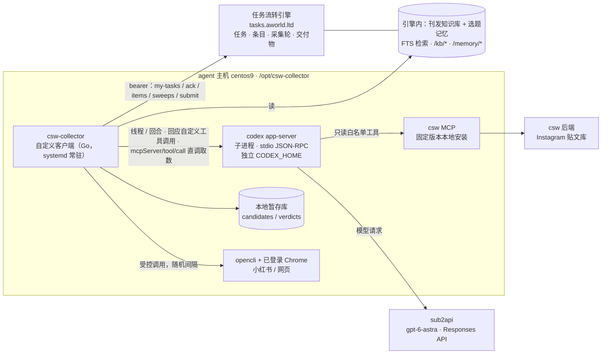

# 情报收集员改造方案：自定义客户端 + Codex App Server

> 2026-09-18 · 草案，待确认后动工。
> 范围：只替换**情报收集员**（role_code `collector`，01 / 05 / 11）。其余八个角色仍在 Hermes 上，引擎定义（`daily_news` v8）与交付协议不变。
> 三份参考资料：① 原有 **csw MCP**（贴文供给）；② 新增 **CSW 公众号历史文章知识库**（挑什么、写过什么）；③ 新增 **选题记忆**（从 Van 与主编的对话提炼出的挑选风格与逻辑）。

---

## 1. 为什么要换：现状证据

最近一期完整跑完的 run 是 **r48（2026-09-18 期）**，收集员自己上报的采集轮（`intake_sweeps`）：

| 通道 | 接口返回 | 去重后 | **实际看过** | **没看过** | 登记 |
|---|---|---|---|---|---|
| Instagram（csw MCP） | 401 | 401 | **49** | **352** | 49 |
| 网页（opencli，partial 轮） | 123 | 70 | **0** | **70** | 0 |
| 小红书（opencli） | 37 | 37 | **1** | **36** | 1 |

- csw MCP 给了 401 条，收集员只看了 49 条——**88% 的供给没人看过**。不是后台没内容，是看不过来。
- 01 任务从第一个事件到最后一个事件相隔 **188 分钟**，期间交了 3 版。
- 这些数字还是 agent **自报**的，没有任何机制保证它们属实。

**比「看不完」更靠前的问题：来源不全。** 9/18 这期 Van 退回了主编的两条选题，自己发来 8 条 Instagram 链接，本期 7 条成稿全部出自这 8 条。拿短码去 csw 后端贴文库逐条核对：**8 条里只有 1 条（gnuhr_studio）在库里。** MOSS、Carhartt WIP、Daniel Arsham、Brain Dead 的账号后台没有跟踪；`satisfyrunning` 在跟踪但那一条没抓到；HEIMPLANET 跟踪的是日本号。后台目前跟踪 460 个账号，近 7 天日均入库 158 条。也就是说，即使收集员把后台 100% 看完，这一期也只能撞上 Van 选择里的八分之一。

根因有五个，都是结构性的，换提示词解决不了：

1. **接口取不全。** csw 后端 `/v1/posts/search` 的 `limit` 上限写死 100、页码写死第 1 页（`csw-agent/backend/internal/api/handlers/v1_posts.go:30-37、97-99`），MCP 工具也没有翻页参数。我们在 v8 里写的「不够翻页取完」实际做不到，agent 只能手工切时间窗，切得对不对全凭运气。
2. **一个长会话读不完 400 条。** Hermes 是单会话串行循环（`max_turns: 90`，上下文过半即压缩）。400 条贴文逐条读，上下文先爆，压缩后又丢状态，于是它只能抽样。
3. **没有品味参照。** 「什么值得报」只靠定义里那几段文字。引擎里公众号发布记录只有 **51 篇、其中 15 篇有正文、拆条 6 条**；Van 的反馈记忆只有 **6 条**。模型实际上是在凭空判断。
4. **采集与判断搅在一个 agent 循环里。** 「取数据」本是确定性工作，却让大模型用工具调用去做，既慢又不可核；覆盖率无法由机器保证。
5. **来源台账与 Van 的真实视野不重合。** 跟踪哪些账号是早期一次定下的，没有随 Van 的选择更新的机制；Van 自己刷到的好内容进不了候选池，只能靠他亲手贴链接。

附带的安全问题：Hermes 上的收集员挂着 csw MCP **全部 25 个工具**（含 `csw_articles_push_wechat` 这类写操作）和终端，同时读的是 Instagram 文案、网页这类**不可信输入**。提示注入一旦得手，能碰到的东西太多。

## 2. 目标与验收口径

| 指标 | 现状（r48） | 目标 | 怎么量 |
|---|---|---|---|
| csw MCP 窗口内贴文的审阅覆盖 | 12%（49 / 401） | **100%**，`unreviewed = 0` | 由客户端代码计数，不由模型自报 |
| 01 用时 | 首末事件相隔 188 分钟，交 3 版 | 派工到首批提交 ≤ 20 分钟，到全量 ≤ 45 分钟（影子期实测后定稿） | 引擎事件时间差 |
| **来源覆盖**：Van 最终批准的条目，其来源账号在跟踪范围内的比例 | r48：1 / 8 | 影子期结束 ≥ 80%，之后逐期上升 | 每期对账，缺的账号进补录清单 |
| 对 Van 最终批准条目的**召回**（只算来源在册的部分） | 无法测 | 影子期 ≥ 90% | 新流水线的入围清单 ∩ 同期真实 run 里 Van 批准的条目 |
| 每条判断可追溯 | 淘汰理由在 zip 里 | 每条贴文都有结论 + 理由码 + 引用的知识库 / 记忆条目 | `intake-trace` + 归档的 Codex 回合记录 |
| 写权限面 | 25 个 MCP 工具 + 终端 | MCP 只读白名单；引擎写入只由客户端代码执行 | 配置审计 |

「成熟候选条数」不设硬指标——它取决于当天真实供给。切换的门槛是**来源覆盖**、**审阅覆盖**和**召回**，不是条数。来源覆盖上不去，后两项做到满分也撞不上 Van 的选择。

## 3. 总体架构

一句话：**代码管采集（确定、全量、可计数），Codex 管判断（带着知识库与选题记忆），引擎仍是唯一真相。**



| 谁 | 负责 | 不负责 |
|---|---|---|
| **客户端代码** | 轮询任务、接单心跳、按窗口**全量取数**、去重、窗口判定、近发硬查重、计数、登记条目与采集轮、打包提交、失败上报 | 任何「值不值得报」的判断 |
| **Codex（大模型）** | 分批初筛打分、入围条目的深核（读原帖与图、找佐证、对照知识库与选题记忆）、写条目说明 | 取全量、计数、写引擎、写 csw 后端 |
| **引擎** | 任务 / 条目 / 采集轮 / 交付物 / 闸的真相；知识库与选题记忆的存储与检索接口 | —— |

唤醒不再依赖飞书 @：客户端每 30 秒查一次 `my-tasks`，有 open 任务就开工。群播报仍由引擎单写，不受影响。

## 4. 三份参考资料怎么接进来

### 4.1 csw MCP：供给侧（保留，换用法）

- **批量取数由客户端代码直接调 `csw_posts_search`**（`start` / `end` / `order=latest` / `limit=100`），走 app-server 的 `mcpServer/tool/call`，**不经过大模型**。契约仍是 csw MCP，不新增对后端私有接口的依赖，也不用另起一个 MCP 客户端。
- **取全量的办法：时间窗二分。** 接口返回里有 `total`（真实总数）。`total > 100` 就把该时间片对半切开递归，直到每片 ≤ 100；全部切片的并集即全量。每个切片记一条采集轮，`found / fetched_unique / in_window` 全由代码计算。
- 同时读 `csw_user_selections_list`：Van 在前端勾过的贴文走**优先通道**，必定进入深核。
- 贴文本身已带 `translatedText`（译文）、媒体的 `shortCaption` / `detailedAlt`（图片描述）、点赞评论数、账号粉丝数——**初筛可以纯文本完成**，不必逐条看图，既快又省。
- Codex 侧只挂**只读白名单**：`csw_posts_search`、`csw_posts_get`、`csw_accounts_list`、`csw_user_selections_list`、`csw_user_selections_count`、`csw_references_list`、`csw_references_get`、`csw_articles_list`、`csw_articles_get`。其余 16 个（隐藏、选稿、收藏、建文章、改分段、组装预览、推送微信等，收集员用不到）一律不暴露。
- csw MCP 从「每次 `npx` 拉 GitHub」改为在 `/opt/csw-collector/csw-mcp` **固定提交本地安装**，启动不依赖外网。
- 可选的后端小改（不挡路）：给 `/v1/posts/search` 和 MCP 工具加 `page`，DB 层本来就支持偏移。加了以后二分仍保留作兜底。

**来源扩充闭环**（新增，与采集改造同步做）：

- **一次性对账**：刊发知识库里出现过的品牌，加上 Van 历史上亲手指定过的贴文，反查各自的 Instagram 账号，与后台在册账号比对，出一份「待补录账号清单」。每个账号都写明依据——出自哪篇推文，或 Van 哪天指定过。
- **持续补录**：Van 或主编贴来的外部链接，客户端识别出账号；不在册就自动记一条补录建议，每周汇总一次给你确认。
- **外部链接直通**：Van 发来的原始链接不管后台有没有收录，都直接成为优先候选。单帖内容怎么取（后台按需抓取，还是 opencli），M0 里查清。
- 账号补录本身要在 csw 后台完成。csw MCP 目前只有 `csw_accounts_list`，没有新增账号的工具；补录入口和抓取周期需要你确认。

### 4.2 刊发知识库：CSW 公众号历史文章（新增）

**作用有三**：① 品味参照——CSW 报过哪些品牌、品类、角度，新贴文「像不像我们会报的」有据可依；② 近发查重——30 天硬查重、90 天内同对象须有实质更新；③ 找缺口——常报但近期没报的品牌适当加权。

**底料来源**（按可信度排序，全部只读）：

| 来源 | 现状 | 做法 |
|---|---|---|
| 公众号官方接口（经 mp-helper 只读接口，引擎 `syncer` 已接通） | 库里 51 篇（8/17–9/15），仅 15 篇有正文；「群发」类没有正文接口 | 回填窗口拉到接口能给的最早日期；「群发」按统计接口返回的 `content_url` 抓公开页取正文与图 |
| csw 后端「参考文章」表 `reference_articles`（csw MCP `csw_references_*` 可读） | **35 篇**，平均 7200 字，全部已有 `style_summary`（风格摘要），是此前在 csw 后台上传的公众号范文 | 直接导入，标 `source=reference` |
| csw 后端「文章」表（`csw_articles_list`，经 csw 生成并推送过的稿） | 数量待查 | 导入，与上两路按标题 + 日期去重 |
| 人工导出（兜底） | —— | `syncer import-csv` 已有 |

**加工**：

1. **合集拆条**：一篇推文常含 6–8 则资讯。用 Codex 批处理（结构化输出）拆成「品牌 / 产品 / 品类 / 角度 / 价格 / 发售信息 / 来源账号 / 原文段落」，落到引擎已有的 `ledger_post_items`；抽检后在 `checked_by` 留名。
2. **检索**：引擎 SQLite 上建 **FTS5 全文索引（trigram 分词）**。已实测引擎所用的 sqlite 3.46 支持，中文「羽绒睡袋」、日文「ナンガ」、英文大小写「nanga」都能命中。另建品牌别名表（NANGA / ナンガ / 南迦）。语料只有几百篇、几千条，第一期**不上向量库**——查重要的是品牌与产品名的精确命中，全文检索比向量更可靠；向量检索留作后续增强（csw 后端已有 pgvector 与嵌入服务可借用）。
3. **编辑画像**：由代码统计 + Codex 归纳，生成一页不超过 1500 字的摘要——品牌频次、品类配比、常用角度、标题句式、单期条数。带版本号，每周重算一次，进初筛提示词。
4. **接口**放在引擎（扩展现有数据子系统，不另起服务）：`GET /kb/search`、`GET /kb/brands/:brand`、`GET /kb/profile`。**研究员查近发、文案对齐文风也能直接用**，不只服务收集员。

不选 llm_wiki 做主存储的原因：它会把源料改写成散文，csw-kb 项目实测约一成到三成的商品名在摄取后整条丢失，而查重恰恰依赖这些名字。需要人工浏览时，可以把知识库单向导出一份过去。

### 4.3 选题记忆：Van × 主编对话里的挑选风格与逻辑（新增）

**底料**（已只读核实存在）：

| 来源 | 规模 | 说明 |
|---|---|---|
| 主编 Hermes 会话库 `profiles/chief/state.db` | 飞书会话 437 个（5/19–9/18）：编辑部群 255 个、私聊 60 余个，另有 115 个早期会话未标类型；用户消息 1905 条约 147 万字，其中约 **430 条**含选题信号词 | 会话带 `chat_type` / `user_id` / `display_name`，可按 Van 的 open_id 过滤；主编的上一条提案与下一条回应就是语境。**只取 2026-06 起的部分**，与 Van 9/15 确认的历史反馈回收范围一致 |
| 引擎已沉淀的记录 | Van 闸原话 10 条；条目决定：否决 11、已写成 9、批准 1；反馈记忆 6 条 | 已是结构化数据，直接用 |
| 飞书群历史（Open API） | 待查机器人权限 | 可选补充：能拿到 Van 回复其他角色的话 |

**提炼流水线**（离线批处理，在 agent 主机上跑，对 `state.db` 只读）：

1. **切片**：取 Van 的每条发言，连同主编此前的提案（当时摆出了哪些候选）和此后的回应，组成一个「决定片段」。
2. **抽取**（Codex，结构化输出）：`{日期, 候选对象(品牌/产品), Van 的结论(采用/否决/暂缓/追问), Van 原话(逐字), 给出的理由, 能否推广成规则}`。
3. **归纳**：聚成规则 `{规则文本, 倾向(偏好/回避/必须), 适用面(品牌/品类/形式/时效/数量), 强度, 证据原话编号, 首末出现时间, 反例}`。
4. **人工确认**：产出一页「选题准则卡 v0」。**经你或 Van 过目确认的规则才标为 `explicit` + `long_term`；没确认的保持 `inferred`，运行时只作弱提示。** 模型归纳出来的话不能冒充 Van 的话。
5. **入库**：原话进引擎已有的 `ledger_feedback_records`（字段现成：`quote` / `said_at` / `source_ref` / `kind` / `stance` / `status` / `supersedes_id`）；新增 `selection_rules`（规则，带版本）与 `selection_cases`（案例：候选摘要 + 结论 + 原话 + 关联 run / 条目）。
6. **持续更新**：Van 在 03 闸上的每次决定本来就自动沉淀为反馈记录，自动追加为新案例；每周重新归纳一次，**只产出规则变更提议，不自动生效**。

**运行时怎么用**：准则卡（≤ 2000 字）固定进提示词；另给 Codex 一个 `memory_lookup` 工具，按品牌 / 品类 / 关键词取相似的历史案例与 Van 原话，模型在结论里引用 `memory_refs`。

**边界**：私聊全文不出 agent 主机，进引擎的只有提炼后的规则和必要的短引文；抽取前先过一遍密钥 / token 清洗；沿用既有原则——研究员级的淘汰不得写成 Van 的决定。

## 5. 01 采集流水线（新）

| 步 | 谁做 | 做什么 | 产出 |
|---|---|---|---|
| A 取全量 | 代码 | csw MCP 时间窗二分取全；Van 前端勾选；小红书 / 网页按来源台账逐源受控调用 opencli（随机间隔） | 暂存库 `candidates`；每次调用一条采集轮 |
| B 机械预筛 | 代码 | 按 `datePosted` 精确判窗口；按 post_id / URL 去重；对知识库做 30 天硬查重；对照最近被否决 / 暂缓条目 | 自动标 `out_of_window` / `dup_published` / `dup_recent_rejected`，逐条留理由 |
| C 分批初筛 | Codex | 每批约 25 条、**每批一个新线程**、2–3 批并行；固定前言 = 准则卡 + 编辑画像 + 本批涉及品牌的知识库命中；结构化输出每条 `{结论, 理由码, 一句理由, 品牌, 产品, 品类, 新闻性 1–5, 契合度 1–5, kb_refs, memory_refs}` | **每条贴文都有结论**，`reviewed = 100%` |
| D 入围深核 | Codex + 工具 | 取前 K 条（初值 40，影子期按召回调）。工具：`csw_posts_get`（含媒体）、`csw_accounts_list`、`kb_search`、`memory_lookup`、`fetch_page`（客户端代抓，域名白名单 + 体积上限）、`xhs_search`。核原始披露时间（与转载时间分开）、找官方佐证、看图确认外观 | 条目卡：`published_at` / `evidence_url` / `dedup_note` / `discovered_via` / 事实 / 图 / 缺口 |
| E 登记与交付 | 代码 | 逐条 `PUT items`（幂等）；`PUT sweeps`；生成 `index.md` + `images/` + `trace/`；提交前本地先跑一遍 `intake-check` 八条判据；全程心跳 | 引擎里的条目、采集轮、交付物 |

几条关键约定：

- **不让收集员饿死研究员，也不淹死研究员。** 收集员的淘汰只限硬理由（窗口外、已发、刚被否决、无资讯信息如纯穿搭 / 活动回顾、证据缺失）；「品味」类判断只给分与说明。排名靠后的标 `dropped` + `no_value` + 分数 + 一句理由，全部可在 `intake-trace` 里看到，主编随时可以捞回（状态机本来就允许 `dropped → shortlisted`）。
- **兼容首批校准闸。** 每完成一条深核就登记一条；满 N 条成熟或到 T+20 分钟即提交首批，主编校准后其余以补件追加。
- **每批一个线程**是关键设计：上下文永远不会爆，某批失败只重跑该批，断点续跑靠暂存库里已落的结论。
- **阶段作业标准仍以引擎为准。** 客户端从 `GET /tasks/:id` 取该阶段的作业内容 / 自检 / 验收，原样作为 Codex 的开发者指令注入；不在客户端里另抄一份标准。
- **05-配图与素材核**同机实现：取已批条目对应贴文的原图（`csw_posts_get` 含媒体）→ `images/` → 素材核说明由 Codex 写。大部分是确定性工作，比 01 简单。**切换时 01 与 05 必须同时接管**（同一个角色令牌，无法只切一半）。11 目前每期都被取消，留到小红书接入时再做。

## 6. Codex App Server 接入要点

依据是参考仓库 `/Users/azure/project/codex` 的源码与协议 schema（该仓库的文档已全部改成外链，源码才是准的），以及在本机的两次实测。

### 6.1 已实测通过的部分

在本机用 `codex-cli 0.149.0` 直接驱动 `codex app-server`（stdio，逐行 JSON-RPC）：

- 握手 `initialize`（带 `capabilities.experimentalApi: true`）→ `initialized` → `thread/start`，正常返回线程与回合记录文件路径（`CODEX_HOME/sessions/年/月/日/rollout-*.jsonl`）。
- **真实回合**：声明一个客户端自定义工具 `kb_search`，给两条模拟贴文，要求先查近发再按给定 JSON 结构输出。结果：模型两次回调 `kb_search`（服务端向客户端发 `item/tool/call`，客户端回 `{success, contentItems}`），最终消息严格符合 `outputSchema`；NANGA 那条因知识库命中 9/2 近发被判淘汰并引用了命中条目，HxO 那条保留。用时 52.9 秒（含本机个人配置里 15 个 MCP 服务的启动）。
- 两个顺带的发现：① **`gpt-6-astra` 在 0.149.0 上被拒**（「requires a newer version of Codex」），换 `gpt-5.6-sol` 才跑通——所以必须装较新的固定版本；② 在个人 `CODEX_HOME` 下每次模型调用的底座上下文约 2 万 token（内置指令 + 个人技能 + 15 个 MCP 的工具说明），**生产必须用独立、干净的 `CODEX_HOME`**，实际开销在 M0 里量。

### 6.2 进程与配置

- 客户端以子进程方式拉起 `codex app-server`（stdio），独立 `CODEX_HOME=/opt/csw-collector/codex-home`；不用它的 daemon 模式（daemon 默认会自动更新并重启，会打断正在跑的活）。
- 供应商（`config.toml`）：

```toml
model = "gpt-6-astra"
model_provider = "sub2api"
web_search = "disabled"          # 托管搜索依赖上游实现，不指望；抓取走客户端工具

[model_providers.sub2api]
name = "sub2api"
base_url = "https://csw-subapi.833233.xyz/v1"
env_key = "SUB2API_API_KEY"       # 只认环境变量，明文不落配置
wire_api = "responses"            # 唯一合法值；"chat" 已被移除
stream_idle_timeout_ms = 300000

[mcp_servers.csw]
command = "node"
args = ["/opt/csw-collector/csw-mcp/bin/csw-mcp.mjs"]
env_vars = ["CSW_API_KEY", "CSW_API_URL"]
enabled_tools = ["csw_posts_search","csw_posts_get","csw_accounts_list",
  "csw_user_selections_list","csw_user_selections_count",
  "csw_references_list","csw_references_get","csw_articles_list","csw_articles_get"]
default_tools_approval_mode = "approve"   # 见下方「最大的坑」
tool_timeout_sec = 60
```

- 不需要登录 ChatGPT：自定义供应商默认 `requires_openai_auth = false`，只用环境变量里的密钥。

### 6.3 最大的坑：`approvalPolicy: "never"` 不是「全部放行」

源码 `core/src/mcp_tool_call.rs:1619-1622`：审批策略为 `never` 时，**凡是「需要审批」的 MCP 工具调用会被直接拒绝**，而没声明只读标注的第三方 MCP 工具默认都算「需要审批」。照常理配成 `never`，结果是 csw MCP 的调用被静默拒掉。

正确组合：

- 线程级 `approvalPolicy: "never"` + `sandbox: "read-only"`：命令执行、改文件一律不批；
- csw MCP 上 `default_tools_approval_mode = "approve"`，再用 `enabled_tools` 白名单把它限制在 9 个只读工具；
- 客户端**仍须实现**三类服务端请求的处理器并一律回 `decline`：`item/commandExecution/requestApproval`、`item/fileChange/requestApproval`、`mcpServer/elicitation/request`。不回的话请求会一直挂着。

终端工具没有配置开关可关，但在只读沙箱 + 无网络 + 永不批准之下形同虚设；所有对外访问都走客户端工具，全程可控可记。

### 6.4 三类线程

| 线程 | 工具 | 说明 |
|---|---|---|
| 取数锚点线程 | —— | 不跑回合。客户端用 `mcpServer/tool/call`（`{threadId, server, tool, arguments}`）**经 app-server 直接调 csw MCP、不经过模型**。全机只有一个 csw MCP 进程、一套配置，取数与深核走的是同一条通道 |
| 初筛线程（每批一个） | 无 MCP、无自定义工具 | 知识库命中由客户端预先检索好放进输入，一批只需一次模型调用；`turn/start.outputSchema` 约束输出，理由码用枚举锁死 |
| 深核线程（每条一个） | csw MCP 只读 + 自定义工具 | 自定义工具经 `thread/start.dynamicTools` 声明：`kb_search`、`memory_lookup`、`fetch_page`、`xhs_search`、`post_images`（回图须为内联 data URL）；主图也可直接作为回合输入的 `localImage` 附上 |

线程级差异用 `thread/start.config`（点分路径 → JSON 值，等价命令行 `-c`）注入，不必改 `config.toml`。每个线程同一时刻只能跑一个回合，并行靠多开线程；app-server 对线程数没有硬上限，默认并行 3。

### 6.5 指令怎么进

- `developerInstructions`：引擎下发的阶段作业内容 / 自检 / 验收 + 选题准则卡 + 编辑画像。不依赖磁盘，也没有 32KB 上限。
- `AGENTS.md`（放线程 cwd）：只放稳定的岗位边界。`thread/start` 的返回里有 `instructionSources`，可以据此核实它确实被读到。
- `baseInstructions` 会整体替换内置指令，官方不建议。初筛线程不做编码工作，是否用它来压掉底座上下文，留到 M0 按实测决定。

### 6.6 过程可核

- `thread/start` 设 `historyMode: "paginated"`（实验字段）：回合记录里会写入完整的结构化条目，含 `mcpToolCall` 的入参、返回与耗时。默认的 `legacy` 模式只存一部分。
- 事件流里 MCP 返回有 1MiB 截断上限。**客户端另把收到的每条 `item/completed` 原样落盘**，随交付物归档到 `trace/`，回合记录作交叉验证。
- `thread/tokenUsage/updated` 给出每回合用量，按 run 汇总写进交付物，费用可见。

### 6.7 客户端实现上的硬要求

- **读循环不能阻塞。** 出站队列一满，app-server 会主动断开慢客户端。读 stdout 的协程只做解码和派发，工具执行、落盘、网络请求全部放到别的协程。
- **回合级超时由客户端自己管。** app-server 只有流空闲超时（默认 5 分钟），没有整回合时限。超时就 `turn/interrupt`，该批重试一次，再失败就向引擎报失败。
- 闲置 60 秒的线程会被卸载（`thread_unload_delay_secs`），锚点线程要么保持订阅，要么用时再 `thread/resume`。
- **类型从官方 schema 生成**：`codex app-server generate-json-schema --experimental`，或直接用仓库里现成的 `app-server-protocol/schema/json/codex_app_server_protocol.v2.schemas.json`。协议约 100 个方法、270 多个类型，不手写。
- 参照实现是 `sdk/python/src/openai_codex/client.py`（握手、审批路由、消息派发都在里面）。不直接用现成 SDK 的原因：**Python SDK 不支持自定义工具**，TypeScript SDK 包的是 `codex exec` 而不是 app-server，Go 客户端不存在。
- Linux 沙箱依赖 bubblewrap；以 root 运行且 bwrap 不可用时会直接崩溃而不是降级，M0 要在 centos9 上实测。

## 7. 代码落点与引擎侧改动

**新客户端**放在 `csw-task/csw-collector/`，独立 `go.mod`，与 `csw-task-svc`、`csw-task-web` 并列。它是引擎的**客户**而不是引擎的一部分：只经运行面 HTTP 接口与引擎往来，不 import 引擎内部包，部署到另一台主机。

```
csw-task/csw-collector/
  cmd/collector/          常驻服务入口；另有 shadow（影子运行）、replay（对历史窗口重放）两个子命令
  internal/appserver/     Codex App Server 的 JSON-RPC 客户端（类型由 schema 生成）
  internal/harvest/       取数：csw 时间窗二分、opencli 受控调用、采集轮计数
  internal/stage/         暂存库（SQLite）：candidates / verdicts / 断点续跑
  internal/judge/         初筛与深核的回合编排、提示词拼装、输出校验
  internal/tools/         自定义工具的客户端实现：kb_search / memory_lookup / fetch_page / xhs_search / post_images
  internal/engineapi/     引擎运行面接口：my-tasks / ack / items / sweeps / deliverables / fail
  internal/deliver/       index.md、images/、trace/ 的生成与打包
```

**引擎侧改动（小）**：

- 迁移 0036 起：`kb` 全文索引表与品牌别名表、`selection_rules`、`selection_cases`；`ledger_published_posts` / `ledger_post_items` 复用不重建。
- 运行面只读接口：`/kb/search`、`/kb/brands/:brand`、`/kb/profile`、`/memory/rules`、`/memory/cases`（所有角色可读）。
- `syncer` 加三条子命令：`kb-backfill`（回填公众号历史与参考文章）、`kb-split`（拆条）、`memory-import`（导入提炼结果）。
- **工作流定义不动**（v8 保持）。01 的契约——条目、采集轮、交付物——没有变，变的只是谁来履行。
- 可选：`intake-check` 加一条判据「csw MCP 通道 `unreviewed` 必须为 0」。

## 8. 部署与回退

- 位置：agent 主机 centos9（那里有 opencli 与已登录的 Chrome）。新目录 `/opt/csw-collector/`，systemd 单元 `csw-collector.service`，环境文件 600 权限。
- 内存：主机 30G 几乎用满（可用约 1G，swap 64G 基本空闲）。Hermes 收集员网关现占约 590MB；新栈（Go 客户端 + codex app-server + csw MCP 的 node 进程）预计 200–300MB，切换后净释放内存。
- 令牌：沿用收集员的引擎令牌；更干净的做法是切换时新签一枚、吊销旧的（须你同意）。
- **回退**：停 `csw-collector.service`，重启 Hermes 收集员网关即可，两分钟内完成。Hermes profile 目录原样保留两周。
- 切换后「情报收集员」这个飞书机器人不再对话。想问「那 92 条去哪了」这类问题，答案在 `intake-trace` 与后台页面里，比问 agent 更准。要不要补一个轻量的飞书问答入口，留到第三期再定。

## 9. 里程碑

| # | 内容 | 估时 | 验收 |
|---|---|---|---|
| M0 | **可行性验证**：agent 主机装固定版本 codex；sub2api × Codex 的 Responses 兼容性；Codex 内挂 csw MCP 只读白名单；动态工具往返；结构化输出；3 线程并行；拿 r48 的窗口（401 条）实测初筛速度与费用 | 0.5–1 天 | 给出继续 / 停止结论 |
| M1 | 取数器：时间窗二分、去重、窗口判定、暂存库、代码计数的采集轮 | 1 天 | 对 r48 窗口取数 = 401，`unreviewed` 口径由代码给出 |
| M2 | 刊发知识库：回填 + 拆条 + FTS + 接口 + 编辑画像；**来源对账，出待补录账号清单 v0**（可与 M1 并行） | 2 天 | 近 30 天已发条目检索命中率人工抽检 ≥ 95%；清单里每个账号都有依据 |
| M3 | 选题记忆：切片 → 抽取 → 归纳 → 准则卡 v0 → **你 / Van 确认** | 1 天 + 确认时间 | 每条规则都能点回 Van 原话 |
| M4 | Codex 初筛 + 深核 + 引擎登记 / 交付 / 心跳 / 失败上报；05 最小实现 | 2.5 天 | 本机对引擎副本端到端跑通 01 与 05；`intake-check` 全过 |
| M5 | **影子运行** 2–3 个早晨：同一窗口下新流水线只出本地报告、不写引擎，与 Hermes 的真实 run 及 Van 的实际决定对比 | 3 个自然日，投入很小 | 召回 ≥ 90%、覆盖 100%、用时达标 |
| M6 | 切换：01 + 05 由新服务接管，停 Hermes 收集员网关 | 0.5 天 | 一期真实 run 走通；回退演练过 |
| 后续 | 11 选图包；飞书问答入口；向量检索；csw 后端翻页；评估研究员是否同样迁移 | —— | —— |

M0 是闸门：不通过就不往下做。

## 10. 风险

| 风险 | 应对 |
|---|---|
| 来源不全不解决，审阅覆盖做到 100% 也撞不上 Van 的选择（r48：8 条里只有 1 条在库） | 来源扩充闭环与采集改造同步做；外部链接直通先上，保证 Van 贴来的链接当期可用 |
| sub2api 与 Codex 的 Responses 用法不完全兼容 | Hermes 现在就是以 `codex_responses` 模式走 sub2api，是个好兆头；M0 第一件事就验它 |
| `gpt-6-astra` 要求较新的 Codex（本机 0.149.0 实测被拒） | M0 在 agent 主机装较新的固定版本并实测；装不上就先用 `gpt-5.6-sol` 验证机制 |
| App Server 协议标注为实验性，升级可能破坏 | 固定 codex 版本；用 `codex app-server generate-json-schema` 生成类型；契约测试绑定该版本；升级单独排期 |
| 「群发」类推文没有正文接口 | 抓 `content_url` 公开页；抓不到的走人工导出；覆盖缺口如实记在同步批次里 |
| Instagram 文案 / 网页里的提示注入 | Codex 沙箱只读、不给终端、MCP 只读白名单、引擎写入只由客户端代码执行并校验 |
| sub2api 偶发 429 / 503（csw-kb 项目 9 月上旬遇到过三次全系 503） | 回合级退避重试 + 熔断；超时即向引擎 `fail` 并写清原因，不挂死；暂存库支持断点续跑 |
| 选题记忆把模型的归纳当成 Van 的意思 | `explicit` / `inferred` 分开存、分开用；规则须人工确认才升级；每条规则带原话证据 |
| 主机内存紧张 | 新栈比 Hermes 网关更省；并行线程数可配（默认 3） |

## 11. 需要你拍板的事

| # | 事项 | 我的建议 |
|---|---|---|
| 1 | 客户端语言 | **Go**：与仓库一致、单个静态二进制、systemd 部署；协议类型从官方 JSON Schema 生成。现成 SDK 都用不上：Python SDK 不支持自定义工具，TypeScript SDK 包的不是 app-server |
| 2 | 知识库放哪 | **引擎内**（扩展现有数据子系统）：研究员、文案也能用；不另起服务 |
| 3 | 选题记忆的底料范围 | 先用主编会话库 + 引擎已有记录；飞书群历史等权限查清再加 |
| 4 | 准则卡由谁确认 | 你先过一遍，再挑有争议的请 Van 定 |
| 5 | 切换后飞书里的「情报收集员」 | 先不对话，问题看数据；第三期再议 |
| 6 | 要不要顺手给 csw 后端加翻页 | 不挡路，可以后做；二分取数不依赖它 |
| 7 | 在 agent 主机安装 codex 与新服务、停 Hermes 收集员网关 | 属于改动 agent 主机环境，逐项须你同意后执行 |
| 8 | 缺的账号怎么补进 csw 后台 | 先由我出清单，你在后台补录；补录量大再考虑给后台开一个新增账号的接口 |
