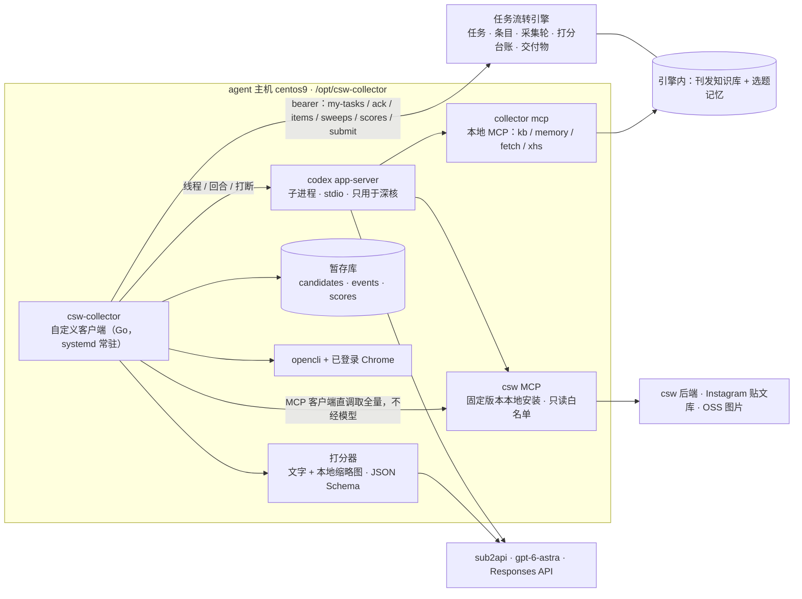

# 情报收集员改造方案（开发版）：自定义客户端 + Codex App Server

> 2026-09-20 第二版。已按 Van 9/19 确认版反馈（`docs/给开发_0919收集员改造方案反馈_Van确认版.md`）回改，并吸收 9/19–9/20 的三轮实测（`docs/实验记录_收集员初筛与维度打分_20260920.md`）。
> 状态：方向已获 Van 认可；先做可行性验证与来源、历史资料整理，取得结果后再定是否切换。安装、部署、停用旧收集员仍须逐项确认。
> 范围：只替换**情报收集员**（role_code `collector`，01 / 05 / 11）。其余八个角色仍在 Hermes 上，交付协议不变。

**改造目标（Van 原话）**：系统能够更早、独立地找到我愿意采用的选题，减少我亲自补链接、反复解释和催促。内容要让户外潮流爱好者觉得有用、有趣、有料。全量读取、处理速度和记录完整度，都应服务于这个目标。

**相对第一版的主要变化**：

1. 判断方式从「入选或淘汰」改为**按 Van 的判断框架分维度打分**，文字与代表性实图一起看；不因口味淘汰。
2. **Codex App Server 的使用范围收窄到深核**。批量打分走更简单的接口，由 M0 对照实验定。
3. 检索类工具改为**本地 MCP 服务**，不用实验性的客户端工具机制。
4. 知识库区分发布状态，查重针对「同一资讯事实或角度」，新增公众号定时同步。
5. 选题记忆的回收范围扩到九个会话库，分「选题偏好」与「写作表达」两条线，每条标明案例、推断或确认规则。
6. 验收先看 Van 的三项目标指标；新增「先行项」，不等新客户端就生效。

---

## 1. 现状证据

r48（2026-09-18 期）收集员自报的采集轮（`intake_sweeps`）：

| 通道 | 接口返回 | 去重后 | 实际看过 | 没看过 | 登记 |
|---|---|---|---|---|---|
| Instagram（csw MCP） | 401 | 401 | **49** | **352** | 49 |
| 网页（opencli，partial 轮） | 123 | 70 | **0** | **70** | 0 |
| 小红书（opencli） | 37 | 37 | **1** | **36** | 1 |

- 01 任务首末事件相隔 188 分钟，交 3 版。数字是 agent 自报的。
- **来源不全**：9/18 Van 退回主编两条选题后自己发来 8 条 Instagram 链接，当期 7 篇成稿全部出自这 8 条。按短码核对 csw 后端 `instagram_posts`，8 条里只有 1 条（gnuhr_studio）在库。按事件再查：Carhartt WIP × OMNIUM 库里有（`le.syndrome` 9/16、`__drlv__` 9/18），其余几件仍无。后台在册 460 个账号，近 7 天日均入库 158 条。
- **知识库停在 9/15**：生产上只有 `csw-daily-trigger.timer` 一个定时器，`ledger_sync_runs` 只有 9/15 的 probe、backfill、snapshot 各一两条，之后没有同步。公众号已出到 vol.260，库里 51 篇、15 篇有正文、拆条 6 条。反馈记忆 6 条 active。
- **图片与译文没有现成底料**：r48 窗口前后的 477 条贴文，`translated_text` 全空；`alt_text` 有 393 条只是「Photo by 某某 on 日期」；媒体 2361 个（图片 2239、视频 122），`instagram_media.detailed_alt` 与 `short_caption` 覆盖率为 0。图片在阿里云 OSS，直链可取，支持 `?x-oss-process=image/resize,w_768`。
- **接口取不全**：csw 后端 `/v1/posts/search` 的 `limit` 上限 100、页码写死 1（`csw-agent/backend/internal/api/handlers/v1_posts.go`），MCP 工具也没有翻页参数；返回里有真实 `total`。实测「前一天到当天」（`start=2026-09-17&end=2026-09-18`）`total=438`，只返回 100 条；`limit=500` 仍是 100 条；`page=2` 被忽略。**已在本地新增专用接口 `GET /api/v1/posts/window` 与 MCP 工具 `csw_posts_window`，采集不再用旧接口**（见 4.1）。
- **贴文库的抓取节奏**：库时区 UTC；抓取器每天 21:00 UTC（05:00 北京时间）跑一次，一次入库约 170–230 条（9/16–9/18 分别 166、224、228）；贴文发出到入库中位延迟 12.3 小时、P90 19 小时。05:30 的每日触发拿到的是刚抓完的一批。空闲后的第一个请求偶发超过 40 秒无响应，之后 0.6 秒。
- **权限面过大**：Hermes 上的收集员挂着 csw MCP 全部 25 个工具（含 `csw_articles_push_wechat`）和终端，读的是不可信输入。

根因：取不全；单会话装不下；判断标准没落进系统（无知识库、无偏好记忆、不看实图）；确定性工作交给了模型；来源名单与知识库都不随时间更新。

## 2. 目标与验收口径

**先看目标指标**（Van 三·3；数值目标结合实测再定）：

| 指标 | 记录口径 | 埋点方式 |
|---|---|---|
| 自主发现情况 | 最终采用的全部选题中，系统在 Van 提供链接之前独立发现了多少；含原先未在册来源的内容 | 条目加 `origin`（`system` / `van_link` / `editor_link`）与 `first_seen_at`；采用 = `approved_write` 或 `written`；同一事件先由系统登记、后由 Van 贴链接的，算系统发现 |
| 第一轮推荐质量 | 第一轮推荐多少条、采用多少条，随后补选几轮 | 03 闸的首版交付物条数、Van 首次决定采用数、03 的版本数与退回次数，引擎已有 |
| Van 的实际投入 | 审题、补充说明和补链接所花时间 | 03 与 08 从送达到决定的用时（引擎事件）；`van_link` 条目数；补充说明的消息条数由选题记忆回收时统计，标为估算 |

Van 提供链接后的处理结果单独记录，不计入系统自主发现的成绩。

**再看技术指标**：

| 指标 | 现状（r48） | 目标 | 怎么量 |
|---|---|---|---|
| 审阅覆盖：窗口内贴文被逐条打分 | 49 / 401 | 100% | 客户端代码计数 |
| 看图覆盖：打分时实际看到实图 | 0 | 如实统计，读不到的标待核 | 打分台账 `image_seen` |
| 来源覆盖：采用条目的来源账号在册 | 1 / 8 | 逐期上升 | 每期对账 |
| 召回（只算来源在册的部分） | 无法测 | 并行期 ≥ 90% | 入围清单 ∩ Van 批准条目。不单独作为成功依据 |
| 01 用时 | 首末事件相隔 188 分钟 | 首批 20 分钟、全量 45 分钟，作为测试目标 | 引擎事件时间差 |
| 写权限面 | 25 个 MCP 工具加终端 | 只读工具；写引擎仅客户端代码 | 配置审计 |

速度与覆盖达标之外，要证明推荐更符合要求、Van 少补题少解释少催促，才算成功。不设「凑满 6 主 2 备」的硬指标。

## 3. 总体架构

**代码管采集，模型按 Van 的框架打分并写依据，引擎仍是唯一真相。**



| 工作 | 性质 | 用什么 |
|---|---|---|
| 取数、事件合并、判窗口、下载缩略图、计数、登记、结转 | 确定性 | 客户端代码 |
| 逐事件打分、查重判断（文字 + 实图，结构化输出） | 批量的单步判断 | 同一个模型；接口三选一，M0 对照后定：直连 Responses 接口、Codex SDK、app-server 线程 |
| 入围条目深核 | 多步、带工具、看完整图片、要能打断 | **Codex App Server** |
| 离线批处理：范例拆解、合集拆条、历史反馈抽取 | 批量结构化抽取 | 同打分器 |
| 将来的对话入口、主编中途干预 | 多轮会话 | Codex App Server |

唤醒不依赖飞书 @：客户端每 30 秒查一次 `my-tasks`。群播报仍由引擎单写。

## 4. 三份参考资料

### 4.1 csw MCP 与来源

- **取数由客户端以 MCP 客户端身份直接调 `csw_posts_search`**（`start` / `end` / `order=latest` / `limit=100`），不经模型，也不绕道 app-server。
- **采集窗口：前一天到当天的全部贴文。** 库时区为 UTC。新接口不传 `start` / `end` 时默认取 UTC 的前一天 00:00 到当天 24:00；只给日期按整日计（`end` 含当天整日），给完整时间按原值计（`end` 不含），带时区的时间换算成 UTC。周一按约定往前多取到上周五。两天重叠靠暂存库按 `post_id` 去重。
- **新接口 `GET /api/v1/posts/window`**（csw-agent，本地已实现、未提交、未部署）：
  - 参数：`start`、`end`、`include_hidden`（默认不含已隐藏）、`include_media`（默认含媒体列表）、`limit`（最大 2000，默认 2000）、`offset`。
  - 返回：`items`（贴文含 `mediaList` 与入库时间 `ingestedAt`）、`total`、解析后的 `start` / `end`、`has_more`。按 `date_posted` 倒序。账号范围与其他接口一致（只含 `csw_account` 里 `hashtag_flag=0` 的账号）。
  - 实现：`backend/internal/db/posts_window.go`（`ListPostsInWindow`）、`backend/internal/api/handlers/v1_posts_window.go`（含 `resolveWindow` 单元测试 6 例）、`router.go` 加路由、`Post` 结构加 `IngestedAt`。`go build`、`go vet`、handlers 包测试通过。
  - MCP：`csw-claude-plugin/src/tools/posts.ts` 新增 `csw_posts_window` 并透传全部参数，README、INSTALL 的工具数改为 26；构建与 8 个测试通过。
  - 旧的 `csw_posts_search` 不再用于取数，只留给模型在深核时按需查单条或做语义查找。csw-agent 的部署方式是本地交叉编译后打包上传服务器、在服务器上构建镜像并重启容器（不再由推 `main` 触发），上线时机由你定；上线前客户端用时间窗二分调用旧接口兜底。
- 请求要带重试与较长超时：空闲后的首个请求实测可能 40 秒无响应。
- 模型侧只挂只读白名单：`csw_posts_search`、`csw_posts_get`、`csw_accounts_list`、`csw_user_selections_list`、`csw_user_selections_count`、`csw_references_list`、`csw_references_get`、`csw_articles_list`、`csw_articles_get`。其余 16 个不暴露。csw MCP 改为 `/opt/csw-collector/csw-mcp` 固定提交本地安装。
- **来源不加权**（Van 一·3）：她补充的 GO OUT、CAMP HACK、`__drlv__`、`le.syndrome` 登记为来源池里的普通来源，`required=0`，不设配额，不提排序。后两个已在贴文库在册。产品事实继续核验原始来源。
- **来源对账由开发完成**：读 `csw_accounts_list` 的现有清单，对照刊发知识库里出现过的品牌、历史选题、Van 以往提供的链接，出「待补录账号清单」，每个账号写明依据。此后选题里出现而不在册的账号，自动记补录建议。csw MCP 没有新增账号的工具，补录入口与抓取周期待你确认。
- **Van 分享的具体链接**照常处理：不论后台有无收录都进入候选，`origin=van_link`，单独统计，不计入自主发现。单帖内容的获取方式 M0 查清。
- 可选：给 `/v1/posts/search` 与 MCP 工具加 `page`，DB 层本就支持偏移；二分保留作兜底。

### 4.2 刊发知识库

**发布状态三分**（Van 二·4）。`ledger_published_posts` 已有 `state`（drill / draft / published）与 `source`，补两列：

| 列 | 取值 | 含义 |
|---|---|---|
| `publish_evidence` | `freepublish` / `masssend_stats` / `public_page` / 空 | 正式发布的依据。**`state='published'` 且此列非空，才是「正式已发布」** |
| `is_reference` | 0 / 1 | 参考范文。确已发布的范文同时有发布依据 |

- 查重只查「正式已发布」。
- csw 后端 `articles`（经系统生成并推送草稿箱的稿）导入时一律 `state='draft'`，只在任务详情里作「已有成果」提示，不参与查重。
- csw 后端 `reference_articles` 的 35 篇范文导入为 `is_reference=1`；标题与日期能对上官方记录的，再补发布依据。

**持续自动同步**（Van 三·2；现在缺）：

- 生产主机新增 `csw-ledger-sync.timer`，每天两次：每日触发之前一次、晚间一次。执行 `syncer sync --platform wechat --days 3`，幂等。
- 范围含人工制作、人工发布的内容：已发布列表取「发布」类，单篇统计接口按日补齐「群发」类。
- 正文：「发布」类官方接口自带；「群发」类按 `content_url` 抓公开页。解析器分两种页面结构：普通图文取 `js_content`，贴图文（`item_show_type=8`）取 `content_noencode` 与 `picture_page_info_list`。两种都已用 Van 的十篇范例验证：十篇全部 200，无验证拦截，正文 679–5277 字，图片 10–35 张。
- 状态核实：只有出现在官方已发布列表或群发统计里的才写 `publish_evidence`。
- 失败处理：每次写 `ledger_sync_runs`，含覆盖区间与缺口；连续两次失败由引擎通知主编；查重接口随结果返回「已同步至某日」。
- 早期文章：回填到接口能给的最早日期；取不到的由开发负责，先抓公开页，仍取不到再出缺口清单（期号、日期、已试方式、所需协助）。不默认让 Van 逐篇找链接。

**十篇范例**：已抓取登记（标题、类型、日期、正文、图片）。拆解用打分器做批处理：每篇、合集每条拆出选题对象、具体变化或报道切口、读者价值、比较参照、有事实支持的编辑判断；再归纳怎样讲清专业知识、呈现细节与自然表达。范例未明确体现的判断标 `inferred`。前六篇的「数据表现不错」是 Van 的评价，未独立核验。

**合集拆条**：打分器批处理，落 `ledger_post_items`，抽检后 `checked_by` 留名。

**检索**：SQLite FTS5 trigram 加品牌别名表。已实测引擎所用 sqlite 3.46 支持，中文、日文、英文大小写都能命中；trigram 要求查询不少于 3 个字符，两字词回退 `LIKE`。第一期不上向量库。

**接口**放在引擎：`GET /kb/search`、`GET /kb/brands/:brand`、`GET /kb/profile`，全角色可读。不选 llm_wiki 做主存储：它会把源料改写成散文，商品名丢失一到三成。

### 4.3 选题记忆

**回收范围**（Van 一·1）：2026-06 起，她本人在编辑部群、以及与所有智能体私聊中表达的要求、判断、修改意见和选题决定；保留提案、原稿与回应上下文。其他人的意见与智能体的归纳不得冒充她的要求。

**底料盘点**（agent 主机九个 profile 的 `state.db`，6 月以来的飞书会话，只读）：

| profile | 私聊 | 群聊 | 未标类型 |
|---|---|---|---|
| chief | 62 | 247 | 90 |
| deepwriter | 91 | 29 | 5 |
| collector | 2 | 49 | 46 |
| designer | 6 | 33 | 55 |
| researcher | 3 | 22 | 6 |
| publisher | 1 | 13 | 11 |
| xhswriter / reviewer / analyst | 0–1 | 2–4 | 0 |

**两处缺口，回收后须如实写进覆盖清单**（Van 三·1）：各库只存了路由给该智能体的群消息，完整群记录要经飞书 `im/v1/messages` 另取，机器人权限待查；飞书 `open_id` 按应用隔离，九个机器人应用下 Van 的标识不同，须先做身份映射。引擎另有 Van 闸原话 10 条、条目决定 21 条、反馈记录 6 条，可直接用。

**提炼流水线**（离线批处理，agent 主机上跑，对 `state.db` 只读）：

1. 切片：Van 本人的每条发言，加它所回应的提案或原稿、以及之后的回应。
2. 抽取（结构化输出）：日期、对象、结论、逐字原话、理由、适用条件。
3. **分两条线**：`track=topic`（选题偏好，供收集员、研究员、主编）；`track=writing`（写作表达，保留被批评的具体句段与修改意见，交主编与文案，不进收集员的判断）。局部表达不满意不等于整篇选题不满意。
4. **三种身份**：`identity=case`（具体案例）/ `inferred`（模型推断）/ `confirmed`（本人确认的长期规则）。每条带原话、对象、适用条件。
5. 准则卡交 Van 校准。先对照已采用与已否决案例自行消化差异，定不下来的才交她。
6. 她在 03 闸上的每次决定自动追加为案例；定期重新归纳，只出变更提议。

9/16 那段原话全部按 `case` 保存，不扩大成规则。「不是新品的不报」已从方案里删除（Van 二·2）。

**入库**：原话进 `ledger_feedback_records`（字段现成）；新增 `selection_rules` 与 `selection_cases`，含 `track`、`identity`、`object_ref`、`applicability`、证据原话编号、版本。运行时经本地 MCP 的 `memory_lookup` 取相似案例与原话。

**边界**：聊天全文不另存他处；抽取前清洗密钥；每条可点回原话与日期，可删可改。

## 5. 判断框架与打分

核心判断（Van）：**这件事有没有足够具体的变化，值得 CSW 帮读者解释一次。**

**维度直接取自她的框架**：`change`（具体变化或报道切口）、`use`（使用关联）、`gain`（信息增量）、`compare`（比较参照）、`explain`（可解释性）、`csw`（CSW 视角）。另记不进公式的观察：`look`（外观与设计，来自实图）、`gaps`（证据与图片缺口）、时效。**品牌知名度不作为维度。**

我先前自行归纳的五个维度（新品性、独特性、读者相关、信息量、品牌分量）已作废：实测里它们把 Van 亲选的一条排在她否决的两条之后，且「品牌分量」与她「品牌知名度不是首要标准」直接相悖。

**打分器输出**（JSON Schema 约束，每个事件一条）：

```json
{
  "event_key": "...",
  "dims": {"change": 0, "use": 0, "gain": 0, "compare": 0, "explain": 0, "csw": 0},
  "evidence": {"change": "依据，引文案或图", "use": "...", "gain": "...", "compare": "...", "explain": "...", "csw": "..."},
  "look": "实图里看到的外观与设计要点",
  "image_seen": true,
  "three_sentences": {"what_changed": "...", "why_it_matters": "...", "how_different": "..."},
  "unanswered": "none | missing_material | angle_not_formed | low_value",
  "gaps": ["缺发售日期", "只有一张图"],
  "priority_hits": ["老产品结构性改款"],
  "lower_hits": ["只有新配色"],
  "kb_refs": [], "memory_refs": []
}
```

- **不实现成机械乘法，不设一票否决。** 综合分由代码按版本化权重计算，只用于排序与解释；某项薄弱在 `evidence` 里写明薄弱在哪。
- 七类优先关注、七类通常降低优先级的清单写进打分说明，作为倾向，输出里只记「命中了哪几类」，不据此直接加减分或淘汰。
- 三句话答不清的，`unanswered` 写明是缺资料、角度未成立还是价值不足。
- **分辨率**：实测大模型给 0–4 整数会大面积落在 3 / 3 / 3。改用更细的刻度，每级用十篇范例与被否案例做锚点，M3 做重复打分的一致性检验。
- `image_seen=false` 的事件标 `pending_check` 并写明「未读到实图」，不算看过，不因此淘汰。
- Van 的每次决定连同当时的 `dims` 一起存档，积累后回测维度与权重。

**查重判断**（Van 二·3）：代码按品牌、产品、别名在「正式已发布」里取候选对；模型判三档：同一事实或角度且无新增信息 / 同品牌同产品但有新增信息 / 不相干。第二档继续参与并附对照旧文。实测里 Brompton × and wander 在未审贴文中排名靠前，而 vol.248 已于 9/2 报过，正是要靠这一步识别「有没有新增信息」。

**直接排除只用硬事实**：窗口外；与正式已发布内容同一事实且无新增信息；与近期被 Van 否决的同一事实同一角度。其余全部保留分数与排序。

**待核结转**（Van 二·5）：`pending_check` 带 `gaps`；当期截止前未补齐不阻塞已批准选题；此后若干期内由客户端重查缺口、时效、价值、查重，不自动入选；超过结转期限自动关闭并写明原因。

## 6. 01 采集流水线

| 步 | 谁做 | 做什么 | 产出 |
|---|---|---|---|
| A 取全量 | 代码 | csw MCP 时间窗二分；小红书、网页按来源台账逐源受控调用 opencli（随机间隔）；读 Van 前端勾选与分享的链接 | 暂存库 `candidates`；每次调用一条采集轮 |
| B 硬事实与事件合并 | 代码为主 | 按 `datePosted` 判窗口；同账号同文案开头先粗并，模型再判是否同一事件；下载每个事件的前 N 张缩略图，纯视频取封面 | `events`；窗口外自动标注 |
| C 查重判断 | 代码检索 + 模型 | 见第 5 节 | 每个事件的查重结论与对照旧文 |
| D 打分 | 打分器，文字 + 本地缩略图 | 每批若干事件、每批一个新会话、并行；固定前言 = 引擎下发的阶段作业标准 + 判断框架与锚点 + 本批品牌的知识库命中与相关案例 | 打分台账；`reviewed = 100%` |
| E 入围深核 | Codex App Server | 取排名前 K 与待核的。工具：`csw_posts_get`（含媒体）、`csw_accounts_list`、本地 MCP 的 `kb_search` / `memory_lookup` / `fetch_page`（域名白名单加体积上限）/ `xhs_search`。核原始披露时间、找原始来源核事实、核比较参照是否准确、看完整图片 | 条目卡 |
| F 登记与交付 | 代码 | `PUT items`（带 `origin`）、`PUT sweeps`、`PUT intake-scores`；生成 `index.md` + `images/` + `trace/`；提交前本地跑 `intake-check`；全程心跳 | 引擎里的条目、采集轮、打分台账、交付物 |

- 登记为引擎条目的是排名靠前的、待核的、`van_link` 的；其余只在打分台账里，主编与研究员随时可以往下翻、捞回。
- 兼容首批校准闸：先交首批，校准后其余以补件追加。
- 阶段作业标准仍以引擎为准：客户端从 `GET /tasks/:id` 取作业内容、自检、验收，原样注入。
- **05 配图与素材核**同机实现，切换时与 01 一起换。11 等小红书接入时再做。

## 7. Codex App Server 接入要点

依据是参考仓库 `/Users/azure/project/codex` 的源码与协议 schema、官方文档，以及本机实测。

### 7.1 定位

官方文档：app-server 面向「产品内深度集成」，即富客户端、多轮会话、审批交互、流式事件；**自动化任务建议改用 Codex SDK**。app-server 命令本身标注为实验性，WebSocket 传输明确不支持生产。因此本方案里它只承担深核，以及将来的对话入口。两个现成 SDK 的情况：Python SDK 包的是 app-server，TypeScript SDK 包的是 `codex exec`，都没有 Go 版。

### 7.2 已实测

本机 `codex-cli 0.149.0`，stdio：

- 握手、建线程、真实回合、客户端工具回调、`turn/start.outputSchema` 结构化输出，均通过。
- 「文案 + 三张缩略图」七维度结构化打分：8 条样本 41 秒（3 并发），单回合 11–22 秒。
- **不接受远程图片地址**（`remote image URLs are not supported`），须下载后以 `localImage` 传入。
- `gpt-6-astra` 在 0.149.0 上被拒（「requires a newer version of Codex」），须装较新的固定版本。
- 个人 `CODEX_HOME` 下每回合底座上下文约 2 万 token，生产必须用独立、干净的 `CODEX_HOME`。

### 7.3 进程与配置

客户端以子进程拉起 `codex app-server`（stdio），独立 `CODEX_HOME=/opt/csw-collector/codex-home`；不用 daemon 模式（默认自动更新并重启）。

```toml
model = "gpt-6-astra"
model_provider = "sub2api"
web_search = "disabled"

[model_providers.sub2api]
name = "sub2api"
base_url = "https://csw-subapi.833233.xyz/v1"
env_key = "SUB2API_API_KEY"
wire_api = "responses"            # 唯一合法值；"chat" 已被移除

[mcp_servers.csw]
command = "node"
args = ["/opt/csw-collector/csw-mcp/bin/csw-mcp.mjs"]
env_vars = ["CSW_API_KEY", "CSW_API_URL"]
enabled_tools = ["csw_posts_search","csw_posts_get","csw_accounts_list",
  "csw_user_selections_list","csw_user_selections_count",
  "csw_references_list","csw_references_get","csw_articles_list","csw_articles_get"]
default_tools_approval_mode = "approve"

[mcp_servers.csw_kb]              # 客户端自带的本地 MCP：kb_search / memory_lookup / fetch_page / xhs_search
command = "/opt/csw-collector/bin/collector"
args = ["mcp"]
default_tools_approval_mode = "approve"
```

检索类工具走本地 MCP 而不是 `thread/start.dynamicTools`：后者是实验接口；改成 MCP 后客户端不必开 `experimentalApi`，Hermes 上的研究员与主编也能挂同一个 MCP。

### 7.4 最大的坑：`approvalPolicy: "never"` 不是「全部放行」

源码 `core/src/mcp_tool_call.rs:1619-1622`：审批策略为 `never` 时，凡是「需要审批」的 MCP 工具调用会被**直接拒绝**，而没声明只读标注的第三方 MCP 工具默认都算需要审批。正确组合：线程级 `approvalPolicy: "never"` 加 `sandbox: "read-only"`；MCP 服务上 `default_tools_approval_mode = "approve"` 加 `enabled_tools` 白名单；客户端仍须实现 `item/commandExecution/requestApproval`、`item/fileChange/requestApproval`、`mcpServer/elicitation/request` 的处理器并一律回 `decline`，否则请求会挂着。

### 7.5 深核线程

- 每个入围事件一个线程，默认并行 3。`developerInstructions` 注入引擎下发的阶段标准、判断框架、该事件的打分结果与缺口。
- 图片先下载到线程 `cwd`，回合输入用 `localImage`。
- 回合级超时由客户端管：app-server 只有流空闲超时（默认 5 分钟），超时即 `turn/interrupt`，重试一次，再失败向引擎报失败。
- 线程卸载时间两处来源不一致（源码默认 60 秒，官方文档写无订阅无活动 30 分钟），以实装版本实测为准；深核线程用完即弃，不受影响。

### 7.6 过程可核

- **分页历史模式目前不能创建线程**（源码返回 `paginated_threads is not supported yet`），第一版里用它做审计的写法作废。
- 客户端把收到的每条 `item/completed` 原样落盘，随交付物归档到 `trace/`；默认的回合记录文件（`CODEX_HOME/sessions/...jsonl`）作交叉验证。事件流里 MCP 返回有 1MiB 截断上限。
- `thread/tokenUsage/updated` 给出每回合用量，按 run 汇总写进交付物。

### 7.7 实现上的硬要求

- 读循环不能阻塞：出站队列满时 app-server 会主动断开慢客户端。读 stdout 的协程只解码与派发。
- 只用 stdio；固定版本；类型从该版本的 `codex app-server generate-json-schema` 生成，或用仓库里现成的 `app-server-protocol/schema/json/codex_app_server_protocol.v2.schemas.json`。
- 参照实现：`sdk/python/src/openai_codex/client.py`。
- Linux 沙箱依赖 bubblewrap；root 下 bwrap 不可用时会直接崩溃，M0 在 centos9 上实测。

## 8. 可选：轻量判别模型（TypeSafe / Jev 1.13）

实测（477 条真实贴文）：148 秒、66 万输入 token、0.028 美元、0 失败；日、韩、英、中原文均可判，各语言置信度相近；纯 HTTP 接口，Go 直接调，agent 主机可连通。

- 能做：贴文类型与硬性特征、事件合并与查重的成对判断（三档）、知识库检索结果重排、深核产出的事实核对（条目卡里的日期与价格是否被证据页原文支持）、给不可信文本打疑似注入标记。
- 不能做：**只收文本，不看图**，所以不能承担 Van 要求的看图打分；按字面理解，判不了口味（Van 亲选的一条排第 258，她否决的两条排第 13 与第 19）；不生成文字；日期比较与计数要放代码里；官方说明对对抗性内容并不稳健。
- 数据会发往第三方服务；官方称不用客户数据训练。是否采用由你定，M0 里与打分器做对照。

## 9. 代码落点与引擎侧改动

**新客户端** `csw-task/csw-collector/`，独立 `go.mod`，只经运行面 HTTP 接口与引擎往来，不 import 引擎内部包。

```
csw-task/csw-collector/
  cmd/collector/          常驻服务；子命令 mcp（本地 MCP）、shadow（并行运行）、replay（历史窗口重放）、batch（离线批处理）
  internal/harvest/       取数：MCP 客户端、时间窗二分、opencli 受控调用、缩略图下载、采集轮计数
  internal/events/        事件合并
  internal/stage/         暂存库（SQLite）：candidates / events / scores / 断点续跑
  internal/scorer/        打分器与查重判断：提示词拼装、图片输入、输出校验、接口适配（直连 / SDK / app-server）
  internal/appserver/     Codex App Server 的 JSON-RPC 客户端（类型由 schema 生成），只服务深核
  internal/mcpsrv/        本地 MCP：kb_search / memory_lookup / fetch_page / xhs_search
  internal/engineapi/     my-tasks / ack / items / sweeps / intake-scores / deliverables / fail
  internal/deliver/       index.md、images/、trace/ 的生成与打包
```

**引擎侧**（迁移 0036 起；均为加列或新表，不需要整表重建）：

| 改动 | 内容 |
|---|---|
| 知识库 | FTS 表、品牌别名表；`ledger_published_posts` 加 `publish_evidence`、`is_reference` |
| 选题记忆 | `selection_rules`、`selection_cases`（`track` / `identity` / `object_ref` / `applicability` / 版本） |
| 打分台账 | `intake_scores`（run、事件键、贴文引用、`dims`、依据、`image_seen`、缺口、三句话、查重结论、准则版本、权重版本）；`PUT/GET /runs/:id/intake-scores` |
| 自主发现 | `run_items` 加 `origin`、`first_seen_at`；`adminctl selection-report` 出第 2 节三项目标指标 |
| 待核结转 | 01 的任务详情随附近几期未结的 `pending_check` 与缺口 |
| 只读接口 | `/kb/search`、`/kb/brands/:brand`、`/kb/profile`、`/memory/rules`、`/memory/cases` |
| `syncer` | `kb-backfill`、`kb-split`、`memory-import`；公开页解析器（两种结构） |
| 定时同步 | `deploy.sh` 增加 `csw-ledger-sync.service` 与 `.timer` |
| 工作流定义 | 先行项里升一版（见第 11 节）：01 / 02 / 03 的作业标准写入判断框架、三句话、查重口径、待核不永久淘汰、来源不加权 |
| `intake-check` | 加判据：csw MCP 通道 `unreviewed` 为 0；`image_seen=false` 的条目须为待核 |

## 10. 部署与回退

- 位置：agent 主机 centos9。新目录 `/opt/csw-collector/`，systemd 单元 `csw-collector.service`，环境文件 600 权限。
- 内存：主机 30G 几乎用满（可用约 1G，swap 基本空闲）。Hermes 收集员网关现占约 590MB；新栈预计更省。
- 令牌：沿用收集员的引擎令牌，或切换时新签一枚、吊销旧的（须你同意）。
- 回退：停 `csw-collector.service`，重启 Hermes 收集员网关。Hermes profile 目录原样保留。
- Van 已接受收集员后台化；轻量问答入口不作为本期前提。

## 11. 里程碑

**先行项**（不依赖新客户端，Van 三·4 要求尽早见效；凡动生产或 agent 主机的，逐项须你同意）：

| # | 内容 | 动到哪里 |
|---|---|---|
| P1 | 来源对账，出待补录账号清单；GO OUT、CAMP HACK 写入 `intake_sources`（普通来源） | 生产库一处写入；csw 后台补录由你操作 |
| P2 | 工作流定义升一版：01 / 02 / 03 写入判断框架、三句话、查重口径、待核处理、来源不加权；重出阶段文档 | 迁移加部署 |
| P3 | 发布状态两列、公开页解析器、`csw-ledger-sync.timer`；回填历史 | 迁移加部署 |
| P4 | 十篇范例逐条拆解；随 01 / 02 / 03 的任务详情下发 | 离线批处理加部署 |
| P5 | 历史反馈回收（九个会话库，只读）；出覆盖清单、选题准则卡、写作表达整理 | agent 主机只读；结果入生产库 |

必须等新客户端的：窗口内贴文全量过目、打分时看实图、数量由代码统计。

**新客户端**：

| # | 内容 | 验收 |
|---|---|---|
| M0 | 可行性验证：agent 主机装固定版本 codex；sub2api × Codex 的 Responses 兼容性；bwrap；只读 MCP；**批量打分三种接口的对照**；拿 r48 窗口实测「文字 + 实图」打分的速度、费用、重复打分一致性；TypeSafe 对照 | 给出继续或停止的结论 |
| M1 | 取数器：MCP 客户端调 `csw_posts_window`（新接口未上线时二分兜底）、事件合并、缩略图下载、暂存库、代码计数的采集轮 | 对「前一天到当天」取数与库内条数一致（如 9/17–9/18 应为 438） |
| M2 | 刊发知识库余下部分：拆条、FTS、接口、本地 MCP | 近 30 天已发条目检索命中率抽检 ≥ 95% |
| M3 | 判断框架落成打分说明与各级锚点；用十篇范例与历史决定回测 | 范例条目普遍排在被否案例之前；重复打分一致 |
| M4 | 打分、查重判断、深核、登记、打分台账、待核结转；05 最小实现 | 本机对引擎副本端到端跑通；`intake-check` 全过 |
| M5 | 并行运行：新流水线只出本地报告、不写引擎，与真实 run 及 Van 的实际决定对比；开始记录三项目标指标 | 覆盖 100%；召回 ≥ 90%；三项目标指标有基线 |
| M6 | 切换：01 与 05 由新服务接管，停 Hermes 收集员网关 | 一期真实 run 走通；回退演练过 |
| 后续 | 11 选图包；飞书问答入口；向量检索；csw 后端翻页；评估研究员是否同样迁移 | —— |

M0 是闸门。M5 取得结果后由 Van 与你共同决定是否切换。

## 12. 风险

| 风险 | 应对 |
|---|---|
| 来源不全不解决，覆盖做到 100% 也命中不了她的选择 | P1 先行；用「自主发现情况」盯住 |
| 模型打分大面积并列，或两次打分不一致 | 更细的刻度加范例锚点；M3 做一致性检验 |
| 把模型的归纳当成 Van 的意思 | `case` / `inferred` / `confirmed` 分开存、分开用；每条带原话、对象、适用条件 |
| 群聊完整记录与身份映射尚未打通 | 先用九个会话库并交覆盖清单；飞书权限查清后补齐 |
| 「群发」类推文没有正文接口 | 公开页解析（两种结构均已验证）；取不到的由开发出缺口清单 |
| 图片量大（窗口内 2239 张） | 每个事件只取前 N 张、`w_768` 缩略；纯视频取封面；看图覆盖如实统计 |
| sub2api 与 Codex 的兼容性未验证；`gpt-6-astra` 要求较新的 Codex；app-server 为实验性 | M0 先验；固定版本；升级单独排期 |
| Instagram 文案或网页里的提示注入 | 只读沙箱、不批准命令与改文件、MCP 只读白名单、写引擎仅客户端代码 |
| sub2api 偶发 429、503 | 重试加熔断；超时即向引擎 `fail` 并写明原因；暂存库支持断点续跑 |
| 主机内存紧张 | 并行数可配；新栈比 Hermes 网关省 |

## 13. 需要你拍板的事

| # | 事项 | 我的建议 |
|---|---|---|
| 1 | 客户端语言 | Go |
| 2 | 知识库放哪 | 引擎内 |
| 3 | **Codex App Server 只用于深核**，批量打分的接口由 M0 对照实验定 | 同意。官方定位如此，实测每回合还多背约 2 万 token 底座上下文 |
| 4 | 检索类工具做成本地 MCP，不用 `dynamicTools` | 同意。稳定接口，其他角色也能用 |
| 5 | 是否引入 TypeSafe 作文字侧辅助 | M0 对照后定；数据会发往第三方 |
| 6 | 先行项 P1–P5 逐项授权 | 建议先做 P1、P2、P3，Van 最快能感受到 |
| 7 | 是否给机器人开通读取群历史消息的权限，用于补齐群聊记录 | 建议开；否则群聊覆盖只能如实写缺口 |
| 8 | 缺的账号怎么补进 csw 后台；**新接口 `posts/window` 与 MCP 工具何时合入并部署** | 先由我出清单你来补；新接口已在本地做好并通过测试，建议尽快合入，现有收集员当天就能取全 |
| 9 | 在 agent 主机安装 codex 与新服务、停 Hermes 收集员网关 | 逐项须你同意后执行 |
