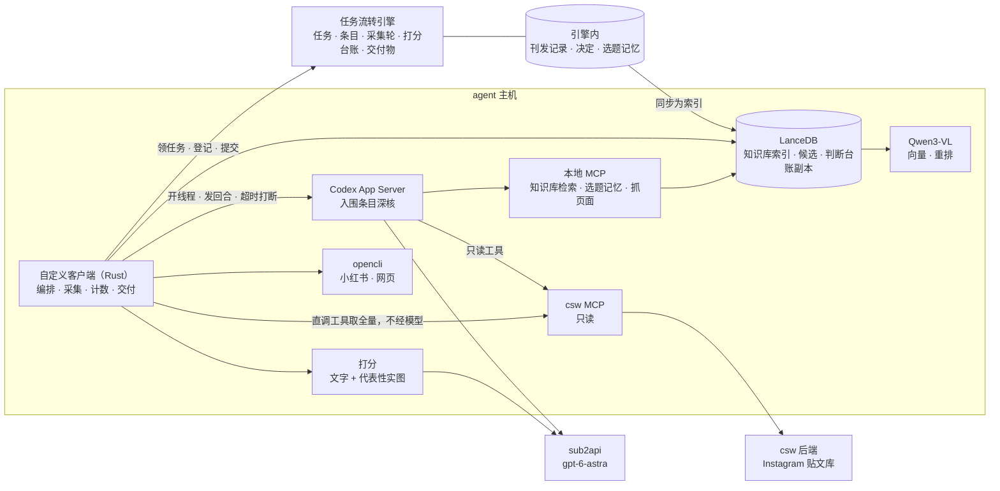

# 情报收集员改造方案（概要版）：自定义客户端 + Codex App Server

日期：2026-09-20（第二版，已按 Van 9/19 确认版反馈回改）｜发出：开发｜状态：方向已获认可，先做可行性验证与来源、历史资料整理，取得结果后再定是否切换｜协议、配置、代码结构等实现细节见《情报收集员_Codex采集引擎方案_20260918》

**改造目标（Van 原话）**：系统能够更早、独立地找到我愿意采用的选题，减少我亲自补链接、反复解释和催促。内容要让户外潮流爱好者觉得有用、有趣、有料。全量读取、处理速度和记录完整度，都应服务于这个目标。

**一句话**：把情报收集员从 Hermes 上的单会话 agent，换成「自定义客户端 + Codex App Server」。取数、去重、计数交给代码；判断不再是「入选或淘汰」，而是**按 Van 给出的判断框架逐条打分、排序并写明依据，文字和代表性实图一起看**。引擎的流程定义、交付协议、两道人审都不变。

---

## 1. 现状证据

**选题闸上的三次退回**（Van 原话，引擎记录）：

| 日期 | 原话 |
|---|---|
| 9/15 | 「打回，三个产品的报道价值都不高；选题数目太少，要继续收集。」 |
| 9/16 | 「1非新品退回；23产品价值不足，退回；4国外新开店铺除非非常特别否则对于国内读者来说价值不足，退回；5可保留但需要验证图片是否足够；6和7产品价值不足，退回。」 |
| 9/18 | 「退回你刚才提交的两条选题，本期直接用我挑选的以下几条资讯作为选题推进下去。」随后她发来 8 条 Instagram 链接。 |

9/18 这期（r48）最终写成的 7 篇，**全部出自 Van 自己挑的这 8 条**。采集这件事实际上由客户代劳了。

**审阅覆盖**——r48 收集员自报的采集轮：

<!-- FIG:coverage -->

| 通道 | 接口返回 | 实际审阅 | 未审阅 |
|---|---|---|---|
| Instagram（csw MCP） | 401 | 49 | 352 |
| 小红书（opencli） | 37 | 1 | 36 |

01 任务首末事件相隔 188 分钟，交了 3 版。这些数字还是 agent 自报的。

**来源覆盖**——把 Van 9/18 指定的 8 条按短码去 csw 后端贴文库核对：

<!-- FIG:picks -->

8 条里只有 1 条在库。按「事件」再查一遍：Carhartt WIP × OMNIUM 这件事库里其实有，来自 `le.syndrome` 和 `__drlv__` 两个媒体号的贴文，只是没人翻到；其余几件仍然没有。后台在册 460 个账号，近 7 天日均入库 158 条。

**参考资料的存量**：

- 公众号已经出到 vol.260，引擎里的发布记录只有 51 篇、15 篇有正文、合集拆条 6 条。
- **公众号同步只在 9/15 手工跑过一次，之后没有任何定时任务**，新发的文章不会进库。
- Van 的反馈记忆只有 6 条。
- 贴文库里这批新贴文的译文字段全空，逐图描述字段覆盖率为 0。图片要自己看。

## 2. 根因

都是结构性的，调提示词解决不了：

1. **取不全。** `csw_posts_search` 单次上限 100 条，没有翻页参数。
2. **单会话装不下。** 一个长会话逐条读 400 条贴文，窗口先满，压缩后丢状态，只能抽样。
3. **判断标准没有落进系统。** Van 的标准散落在几个月的对话里；收集员手里只有岗位说明里的几段话，没有知识库，没有偏好记忆，也不看实图。
4. **确定性工作交给了模型。** 取数、去重、判时间窗、计数由模型发工具调用完成，慢、不可核、数字靠自报。
5. **来源名单不随客户的眼光更新**，知识库也不随新发文章更新。

附带的安全问题：现在的收集员挂着 csw MCP 全部 25 个工具（含推送微信）和终端，读的却是不可信输入。

## 3. 为什么是「自定义客户端 + Codex App Server」

**Codex App Server** 是 Codex 的无界面服务形态：外部程序通过它开线程、发回合、订阅事件流、挂 MCP 服务器，并用 JSON Schema 约束输出。官方对它的定位是「产品内深度集成」，并明说批量自动化任务更适合用 Codex SDK。据此分工：

| 工作 | 性质 | 用什么 |
|---|---|---|
| 取数、去重、判窗口、计数、登记 | 确定性 | 客户端代码 |
| 逐条打分（文字 + 实图，结构化输出） | 批量的单步判断 | 同一个模型，走更简单的接口（Codex SDK 或直连模型接口），M0 实测后定 |
| 入围条目深核 | 多步、带工具、要看完整图片、要能打断 | **Codex App Server** |
| 将来的对话入口、主编中途干预 | 多轮会话 | Codex App Server |

模型不变，仍是 sub2api 的 `gpt-6-astra`，与主编同款。客户端需要的检索类工具（知识库、选题记忆、网页抓取、小红书搜索）做成一个本地 MCP 服务，不用实验性接口；这样 Hermes 上的研究员、主编也能挂同一个 MCP 用知识库。

| | Hermes 上的收集员（现在） | 改造后 |
|---|---|---|
| 工作形态 | 一个长会话 agent，自己决定先查什么 | 客户端按固定流水线编排，模型只在需要判断的环节被调用 |
| 上下文 | 一个窗口硬装全部贴文 | 每批一个新线程，上下文始终干净；可并行 |
| 取数 | 模型发起工具调用，取到多少看运气 | 代码直接调同一个 csw MCP 工具，按时间窗切片取全 |
| 判断 | 凭岗位说明判「要或不要」 | 按 Van 的判断框架分维度打分，看实图，写明依据；不因口味淘汰任何一条 |
| 输出 | 自由文本加自报数字 | JSON Schema 约束的结构化输出；数量由代码统计 |
| 工具权限 | 25 个 MCP 工具加终端 | 只读工具；写引擎只由客户端代码执行 |
| 唤醒 | 靠飞书 @ | 客户端轮询引擎的任务列表 |
| 留痕 | 会话日志 | 每个线程的完整事件流随交付物归档 |

**已在本机实测通过的机制**：客户端提供的工具被模型回调并据此判断「近期已发」；最终消息严格符合给定 JSON Schema；「文案 + 三张实图」的七维度结构化打分，8 条样本 41 秒，模型对图片内容的描述准确。

**为什么不继续在 Hermes 上调提示词**：根因 1、2、4 都不是提示词问题。Hermes 适合主编、文案这类对话型角色，其余八个角色这次不动。

## 4. 架构与分工

| 谁 | 负责 | 不负责 |
|---|---|---|
| **客户端代码** | 领任务与心跳、全量取数、事件合并、判时间窗、计数、登记、打包提交、失败上报、待核结转 | 任何价值判断 |
| **模型** | 按判断框架打分并写依据；判断「是不是同一条资讯事实或角度」；入围条目深核；写条目说明 | 取全量、计数、写引擎、写 csw 后端 |
| **引擎** | 任务、条目、采集轮、判断台账、交付物、审核闸的真相；刊发记录、决定与选题记忆的存储 | 检索索引（在采集服务的 LanceDB 里） |

## 5. 01 采集流水线

| 步 | 执行者 | 内容 | 产出 |
|---|---|---|---|
| A 取全量 | 代码 | 调新工具 `csw_posts_window` 取**前一天到当天**的全部贴文数据（含媒体），不传参数即为默认窗口；不用 `csw_posts_search` 取数。小红书、网页按来源台账逐源取 | 候选暂存；每次调用记一条采集轮，数量由代码算 |
| B 硬事实与事件合并 | 代码为主 | 按发布时间精确判窗口；把同一件事的多条贴文合并成一个事件（实测 477 条里约 55 条是重复）；下载代表性缩略图 | 事件清单；窗口外的自动标注 |
| C 查重 | 代码检索 + 模型判断 | 代码按品牌、产品、别名去知识库找候选；模型判断是不是**同一条资讯事实或同一个角度**。只对照**正式已发布**的内容 | 「重复，无新增信息」或「同品牌同产品，但有新增信息，继续参与」，附对照的旧文 |
| D 按判断框架打分 | 模型，**文字 + 代表性实图** | 每个事件逐维度打分并写依据，试答三句话（见第 7 节）。读不到实图的标「待核」，不算看过，也不因此淘汰 | 打分台账：每条都有各维度分、依据、缺口 |
| E 入围深核 | Codex App Server | 排名靠前的与待核的：看完整图片、找原始来源核事实、核比较参照是否准确、补证据 | 条目卡：披露时间、证据链接、查重说明、事实、配图、缺口 |
| F 登记与交付 | 代码 | 登记条目、上报采集轮与打分台账、生成交付物；提交前先跑引擎的校验判据 | 引擎里的条目、采集轮、打分台账、交付物 |

几条关键约定：

- **不因口味淘汰。** 直接排除只用硬事实：不在当期窗口内；与正式已发布内容是同一事实且无新增信息；与近期被 Van 否决的是同一事实同一角度。其余一律保留分数与排序，主编、研究员随时可以往下翻。
- **同品牌、同产品不等于重复。** 出现新的设计、版本、联名、使用信息或其他有依据的新角度，继续参与判断；只换标题、换说法的仍按重复处理。
- **证据或图片不足的先标待核、写明缺口。** 补齐后重新评估，不永久淘汰。当期截止前没补齐，不阻塞已批准的选题；结转到后续几期时仍要重查时效、价值与查重，不自动入选，也不无限补证拖住整期。
- **来源不加权。** Van 提供的来源与其他来源一视同仁，不设配额、不提排序；产品事实继续核验原始来源。Van 分享的具体链接照常处理，但单独记录，不计入系统自主发现的成绩。
- **兼容现有的首批校准闸**：先交首批，主编校准后其余以补件追加。
- **05 配图与素材核同机接管**，切换时 01 与 05 一起换。11 选图包等小红书接入时再做。

## 6. 三份参考资料

### 6.1 csw MCP 与来源

- 取数与深核走同一个 csw MCP；取数由客户端代码直接调工具，不经过模型。模型侧只暴露只读工具。
- **采集窗口是「前一天到当天」的全部贴文**（Van 与开发确认的口径）。贴文库每天只抓一次，9/21 起改为 01:00 北京时间触发、约半小时内入库，一次约 170–230 条；05:30 的每日触发拿到的是凌晨抓完的一批。01:00 之后发的贴文次日才入库，所以窗口按「首次入库时间」判定，不按发布时间硬切，否则会漏掉凌晨到早上这段的贴文。两天的窗口有一天重叠，靠去重吃掉，避免抓取晚点时漏条。周一按约定覆盖到上周五。
- **取数用新接口，不用旧的搜索接口**：`csw_posts_search` 单次最多 100 条且没有翻页，实测「前一天到当天」总数 438 条只能拿到 100。已在 csw 后端新增 `GET /api/v1/posts/window` 与对应的 MCP 工具 `csw_posts_window`：直接返回窗口内全部贴文数据（含媒体列表、入库时间），不走语义搜索，单次最多 2000 条，缺省窗口就是前一天到当天。旧接口只留给模型在深核时查单条。后端接口已于 9/20 上线并实测通过；MCP 工具待发布。
- **Van 补充的四个来源**已登记为来源池里的普通来源：GO OUT、CAMP HACK 两个网站，`__drlv__`、`le.syndrome` 两个 Instagram 账号。后两个已在贴文库跟踪范围内。
- **来源对账由开发完成，不需要 Van 重新列清单。** 直接读取贴文库现有账号清单，对照历史选题、知识库里出现过的品牌、Van 以往提供的链接，列出待补录账号与各自依据。此后凡是出现在选题里却不在册的账号，自动记一条补录建议，定期汇总确认。
- 系统自主找题不依赖 Van 持续提供链接。

### 6.2 刊发知识库：CSW 公众号历史文章

**用途**：理解 CSW 报过什么、从什么角度报；近发查重；找缺口。

**发布状态必须分清**，参考用途与发布状态分别标记：

| 状态 | 判定依据 | 能用来做什么 |
|---|---|---|
| 正式已发布 | 出现在公众号官方的已发布列表或群发统计里，有发布日期 | **唯一可作为「近期已发」查重依据的内容**；也用于理解选题偏好 |
| 参考范文 | 上传或指定的范例。确已发布的，另外关联到对应的发布记录 | 学习选题偏好与文风 |
| 未发布稿件 | 已生成、已推送草稿箱、但没有正式发布依据 | 只作「已有成果」提示，避免重复劳动；**不能据此认定已报道过并淘汰选题** |

推送到草稿箱不等于正式发布。

**持续自动同步**（补上现在缺的这一块）：

- **频率**：每天两次定时同步，一次在每日触发之前，一次在晚间；每次向前重叠几天，重复同步不重复入库。
- **范围**：公众号上所有正式发布的文章，包括人工制作、人工发布、没经过智能体生产的内容。
- **正文**：「发布」类从官方接口直接取；「群发」类接口不给正文，按统计接口返回的文章地址抓公开页。公开页分普通图文与贴图文两种结构，两种解析都已用 Van 给的十篇范例验证过。
- **发布状态核实**：只有出现在官方已发布列表或群发统计里的才标为正式已发布。
- **失败处理**：每次同步记一条批次记录，写明覆盖到哪一天、缺了什么；连续失败通知主编。查重时如实回答「在已同步到某日的记录中未发现」，不说「从未发布」。
- **早期文章**：回填到接口能给的最早日期。取不到的由**开发负责**，先抓公开页；仍取不到时，由开发列出具体缺口清单，写明期号、日期、已试过的方式和需要的协助，再请 Van 协助。不默认让她逐篇找链接。

**十篇正面范例**已登记并抓到正文与图片：

| # | 发布日期 | 类型 | 标题 |
|---|---|---|---|
| 1 | 09-03 | 贴图文 | 1983年，数字游民OG把办公室装上单车 |
| 2 | 09-03 | 资讯合集 | 20年前的户外混血鞋，被 A$AP Rocky 复活？vol.249 |
| 3 | 09-02 | 资讯合集 | and wander × Brompton：骑小布，有了一套官方穿法 vol.248 |
| 4 | 09-01 | 贴图文 | Goldwin：重新押注空气保暖 |
| 5 | 09-16 | 专题 | BRUNT：用装备，唱情歌 营事专题室 Vol.12 |
| 6 | 09-11 | 资讯合集 | Apple Ultra 4：够不够让户外人换表？vol.255 |
| 7 | 08-31 | 资讯合集 | KEEN：凉鞋有了大人感 vol.246 |
| 8 | 08-28 | 资讯合集 | norda x BD：一双鞋不够跑山了 vol.245 |
| 9 | 08-13 | 资讯合集 | 自由之魂：复古的风，吹到了床帐 vol.236 |
| 10 | 09-18 | 资讯合集 | Carhartt WIP × OMNIUM：把工装骑上街 vol.260 |

前六篇「数据表现不错」是 Van 提供的评价，未独立核验后台数据；后四篇不据此推定数据表现。

**范例怎么用**：首要用途是让收集员、研究员和主编理解选题偏好，其次才是文案与主编校准表达。每篇、合集里的每一条，先拆出选题对象、具体变化或报道切口、读者价值、比较参照、有事实支持的编辑判断，再归纳怎样讲清专业知识、呈现细节和自然表达。范例里没有明确体现的判断标为「待核推断」，不写成 Van 说过的理由。不要求不同类型的内容套用同一种篇幅、结构或句式。

**检索**（9/21 定）：采集服务用 Rust 写，知识库索引放 LanceDB。刊发记录、决定与记忆的真相仍在引擎，采集服务把它们连同 csw 后台「生成过文章的贴文」和十篇范例同步成索引（她在 csw 后台的「勾选」记录不进评选，勾选只说明看过一眼）：每条一条文本向量、每张图一条图片向量、每条一条图文融合向量，向量与重排用自部署的 Qwen3-VL 服务；品牌名、产品名的精确命中用内置的中文分词全文检索。查候选时先向量与全文合并召回几十条，再重排到几条以内，交给逐条判断作对照材料。数量级约 4,000 条文本、18,000 张图，一次性向量化约两小时，每天增量约六分钟。

### 6.3 选题记忆：Van 本人表达过的要求、判断与决定

**回收范围**（Van 确认）：2026 年 6 月起，**她本人**在编辑部群、以及与**所有智能体**私聊中表达的要求、判断、修改意见和选题决定；保留理解这些意见所需的提案、原稿与回应上下文。不只取她与主编的对话；其他人的意见、智能体自行归纳的判断，不能当作她的明确要求。

**实际覆盖情况**（已只读盘点，6 月以来的飞书会话）：

| 会话库 | 私聊会话 | 群聊会话 | 说明 |
|---|---|---|---|
| 主编 | 62 | 247 | 选题决定主要在这里 |
| 文案 | 91 | 29 | 私聊最多，语言表达类反馈主要在这里 |
| 情报收集员 | 2 | 49 | 另有 46 个早期会话未标类型 |
| 设计师 | 6 | 33 | 另有 55 个早期会话未标类型 |
| 选题研究员 | 3 | 22 | |
| 发布员 | 1 | 13 | |
| 小红书作者、合规审查、数据复盘 | 各 0–1 | 各 2–4 | 量很小 |

两处**尚待补齐**，方案不声称已全覆盖：一，各智能体的库只存了「发给它的」群消息，完整的群记录要经飞书接口另取，机器人权限待查；二，每个机器人应用下 Van 的身份标识不同，要先做身份映射，才能准确筛出「她本人的发言」，上表是会话总量，不是她的发言量。回收完成后交一份覆盖清单：已覆盖哪些记录、哪些时段或会话读不到。

**提炼流水线**（离线批处理）：

1. **切片**：取 Van 本人的每条发言，连同它所回应的提案或原稿、以及之后的回应，组成一个片段。
2. **抽取**：模型结构化输出——日期、对象、结论、逐字原话、给出的理由、适用条件。
3. **分两条线归纳，互不混淆**：
   - **选题偏好**：什么值得选、从什么角度切入。供收集员、研究员、主编使用。
   - **写作表达**：语言机械化、不像真人说话、AI 式表达等。保留被批评的具体句段和修改意见，不笼统记成一句「去 AI 味」；**局部表达不满意不等于整篇选题不满意**。这条线交给主编与文案，不进收集员的判断。
4. **每条都标明三种身份之一**：具体案例、模型推断、本人确认的长期规则。每条保留原话、对象和适用条件。
5. **人工校准**：形成「选题准则卡」后，Van 逐条标「对」「不对」或修正。先对照已采用与已否决的案例自行消化差异，只有确实定不下来的才交她校准。
6. **持续更新**：她在选题闸上的每次决定自动追加为案例；定期重新归纳，只产出变更提议，不自动生效。

**9/16 那段原话的正确用法**——先作为**具体案例**保存，不扩大成规则：

| 原话（9/16） | 保存为 |
|---|---|
| 「1非新品退回」 | 针对当时那一条的案例。**不是长期规则**：新品不自动入选，非新品也不自动淘汰 |
| 「23产品价值不足，退回」「6和7产品价值不足，退回」 | 针对那几条的案例，不扩大为整个品牌、品类的禁选 |
| 「4国外新开店铺除非非常特别否则对于国内读者来说价值不足」 | 案例。国外新店要结合具体空间、设计、文化内容及其对国内读者的意义判断；9/18 她自己选了 SATISFY 巴黎旗舰店，可与此对照 |
| 「5可保留但需要验证图片是否足够」 | 案例，同时印证「图片不足先待核」的处理方式 |
| 「其他全部打回并不要在之后的选题里重复出现」 | 对那一批被否条目的明确要求：同一事实同一角度不再重复提报 |

**边界**：聊天全文不另存他处，进引擎的只有提炼后的条目和必要的短引文；抽取前先清洗密钥；每条都能点回原话和日期，可删可改。

## 7. 判断框架与打分

Van 给出的核心判断：**这件事有没有足够具体的变化，值得 CSW 帮读者解释一次。**不满足于汇总「户外圈发生了什么」；非新品也可以因为有依据的设计、文化、历史或当下关联而形成报道价值。

**打分维度直接取自她的框架**，不由开发另行归纳：

| 维度 | 要识别的内容 |
|---|---|
| 具体变化或报道切口 | 结构或使用方式改了什么、品牌首次做了什么、原产品为什么改、某种户外行为有什么新做法。非新品则看有没有具体的设计、文化、历史切口。只能概括为「某品牌发布新品」通常不够；首次、改款原因须有依据 |
| 使用关联 | 人怎么穿、搭、住、跑、移动，怎样在城市与户外之间切换；产品为什么这样设计。纯配色、普通 logo 联名、没有新信息的复刻通常靠后 |
| 信息增量 | 读者能得到什么：新的使用思路、值得了解的设计逻辑、文化背景、对户外生活变化的解释，或帮助理解某类产品 |
| 比较参照 | 与上一代、品牌以往做法或同类产品有什么不同，为什么现在出现。参照必须准确，不虚构旧款问题或同类缺陷 |
| 可解释性 | 能不能形成有事实支持的编辑判断。只有「好看」「有趣」「值得关注」通常还不成熟；涉及用户变化、品牌意图的判断必须有证据 |
| CSW 视角 | 户外专业知识加潮流文化判断力；对户外潮流爱好者有用、有趣、有料 |

另外如实记录、但不进公式的几项：**外观与设计**（看实图得到的观察，她的判断包含外观、设计和潮流文化价值）、**证据与图片是否充分**（缺口清单）、时效。**品牌知名度不作为打分维度**：大牌可以不选，小品牌解决了具体问题可能更值得报。

**怎么用这些分**：

- 「具体变化 × 使用关联 × 信息增量 × 可解释性 × CSW 视角」是用来比较、排序和解释判断的框架，**不实现成机械乘法，也没有「任意一项为零即淘汰」的规则**。某项薄弱会让排序靠后，并在依据里写明薄弱在哪。
- 她列的七类优先关注的选题、七类通常降低优先级或需先补证的情况，写进打分说明，作为**判断倾向**，不是品牌或品类黑名单。有具体设计、文化或使用价值的例外照常评估，不以规则替代实图与资料核查。
- 每个排名靠前的候选都要试答三句话：**发生了什么变化？为什么这个变化值得户外用户知道？它和以前有什么不一样？**答不清的，写明是缺资料、报道角度尚未成立，还是确实价值不足。不在写稿后倒推理由，不为满足框架硬造趋势。
- 每一级分数用十篇范例和已被否决的案例做锚点，避免模型给出一片并列的中间分。
- 权重带版本号，改权重不用重跑模型。Van 的每次决定都连同当时的各维度分一起存档，积累后用来回测维度和权重。
- 这套框架同时用于收集员的打分与深核、研究员的评估、主编的选题审核，并用十篇范例来学习和验证，不只交给文案学措辞。

**提示词与上下文的组织**：打分时的固定前言是引擎下发的阶段作业标准、判断框架与各级锚点、本批涉及品牌的知识库命中与相关案例；每批一个新线程，某批失败只重跑该批。作业标准不在客户端另抄一份，改标准仍然只改引擎定义。

文字一侧的部分结构化判断（贴文类型、是否同一事件、事实是否被证据页支持），可用轻量判别模型辅助。实测 477 条贴文 148 秒、不到三美分，但它不收图、也判不了口味，所以只作辅助，是否采用由 M0 定。

**点赞、评论、标签也是判断的输入。**每条贴文自带点赞数与评论数，后台还给贴文打了标签（新品、事件、装备、营业时间、选品等九十多个）和话题。点赞按该账号自己的常态归一，不同账号之间点赞差几十倍，直接比数字没有意义；标签里的营业时间、选品这类提示降低，新品、事件提示优先。它们进依据和排序，不做成维度，也不用来否决。

## 8. 可核与安全

- 每个事件都有各维度分、依据、引用的知识库条目与案例，主编和研究员经引擎接口直接查。
- **读不到实图的条目如实标记**，不把图片描述当作看过实图。
- 采集轮的全部数量由代码统计。每个线程的完整事件流随交付物归档；token 用量按期汇总。
- 模型运行在只读沙箱里，不批准任何命令执行与文件改动；MCP 只暴露只读工具；写引擎只由客户端代码执行并校验。

## 9. 对各角色的影响

| 谁 | 不变的 | 会变的 |
|---|---|---|
| **Van** | 选题、完整推文两次审核照旧，决定权不变 | 候选更全；每条推荐写明依据和三句话；说过一次的话下一期即生效；缺量时能分清「当天真没有」还是「没找到」 |
| **主编** | 照常汇总选题、把关，可以推新方向 | 收到的是带维度分和依据的排序表，能往下翻全部候选；按同一套判断框架审选题 |
| **研究员** | 价值判断仍归研究员 | 拿到的候选已合并重复、核过披露时间，附查重对照与各维度初评 |
| **文案、设计、发布** | 不受影响 | 文案与主编另外收到「写作表达」那条线的整理结果 |
| **情报收集员** | 岗位职责与交付契约不变 | 运行方式整个更换；不再是对话型 agent，采集轨迹通过引擎记录查询 |

Van 已确认接受收集员后台化；轻量问答入口留到后续阶段评估，不作为本期切换或验收的前提。改造与并行期间日更照常。

## 10. 验收口径

**首先看改造目标有没有达到**（数值目标结合实测再定）：

| 指标 | 记录口径 | 要回答的问题 |
|---|---|---|
| 自主发现情况 | 最终采用的全部选题中，系统在 Van 提供链接之前独立发现了多少；包含原先未在册来源的内容 | 是否减少她亲自找题 |
| 第一轮推荐质量 | 第一轮推荐多少条、采用多少条，随后补选几轮 | 是否更理解她的选题标准 |
| Van 的实际投入 | 审题、补充说明和补链接所花的时间 | 是否真正减轻她的工作量 |

她提供链接后的处理结果单独记录，不计入系统自主发现的成绩。

**其次看技术指标**：

| 指标 | 现状（r48） | 目标 |
|---|---|---|
| 审阅覆盖：窗口内贴文被逐条打分的比例 | 49 / 401 | 100%，由代码计数 |
| 看图覆盖：打分时实际看到实图的比例 | 0 | 如实统计；读不到的标待核 |
| 来源覆盖：采用条目的来源在跟踪范围内 | 1 / 8 | 逐期上升 |
| 召回（只算来源在册的部分） | 无法测 | 并行期 ≥ 90%。**这一项不能代表全部找题能力**，必须与上面的「自主发现情况」一起看 |
| 01 用时 | 首末事件相隔 188 分钟 | 首批 20 分钟、全量 45 分钟，作为测试目标 |

速度和覆盖达标还不够。要证明推荐内容更符合要求，Van 少补题、少解释、少催促，才算改造成功。不设「每天凑满 6 主 2 备」的硬指标，不拿弱题凑数。

## 11. 需要各方配合的事

**Van（第一版第 11 节的四项，均已答复）：**

1. 改造方向：已认可。历史交流的使用范围已明确（见 6.3）。
2. 选题准则卡：形成后花 15–20 分钟逐条审核。这是目前唯一还需要她投入的事。
3. 来源：已补充四个；其余由开发读取贴文库现有清单完成对账，不需要她重新列。
4. 范例：十篇正面范例已提供；不满意案例由开发从历史反馈里回收，不需要她另外整理。

**主编、研究员**：并行期照常工作；切换后头几期留意排序表里有没有排得不对的，指出来，这是调准维度和权重的主要依据。

**开发**：其余全部，包括早期文章的缺口清单。在 agent 主机安装 Codex、部署新服务、停用 Hermes 上的收集员，仍按逐项确认后执行；本次反馈不替代具体的实施与切换授权。

## 12. 里程碑

**不必等新客户端就能生效的改进**（Van 要求尽早见效）：

| 先行项 | 谁马上受益 | 是否依赖新客户端 |
|---|---|---|
| 来源对账与补录；GO OUT、CAMP HACK 进来源台账 | 现有收集员当天就能查到更多内容 | 不依赖 |
| 把判断框架、三句话、查重口径、待核不永久淘汰写进 01、02、03 的作业标准 | 现有收集员、研究员、主编 | 不依赖 |
| 公众号定时同步、发布状态三分 | 近发查重立刻更准 | 不依赖 |
| 十篇范例逐条拆解，随任务详情下发 | 三个判断角色 | 不依赖 |
| 历史反馈回收，出选题准则卡交 Van 校准；写作表达一线交主编与文案 | 全部判断角色与文案 | 不依赖 |

必须等新客户端的只有三件：窗口内贴文全量过目、打分时看实图、数量由代码统计。

**新客户端**：

| # | 内容 |
|---|---|
| M0 | **可行性验证**：agent 主机装固定版本 Codex；sub2api 与 Codex 的兼容性；只读 MCP；批量打分走哪种接口的对照实验；拿 r48 窗口的贴文实测「文字 + 实图」打分的速度与费用。**不通过即停** |
| M1 | 取数器：时间窗切片、事件合并、判窗口、缩略图下载、代码计数的采集轮 |
| M2 | 刊发知识库：回填、拆条、发布状态；LanceDB 索引（向量 + 全文 + 重排）；本地 MCP |
| M3 | 判断框架落成打分说明与各级锚点；用十篇范例和历史决定回测 |
| M4 | 打分、查重判断、深核、引擎登记与打分台账、待核结转；05 最小实现 |
| M5 | **并行运行**：新流水线只出本地报告、不写引擎，与真实 run 及 Van 的实际决定对比，同时开始记录第 10 节的三项目标指标 |
| M6 | 切换：01 与 05 由新服务接管 |

M0 是闸门。M5 取得结果后，由 Van 与开发共同决定是否切换。切换后回退只需停新服务、重启 Hermes 上的收集员。

## 13. 风险与未定项

| 风险 | 应对 |
|---|---|
| 来源不全不解决，覆盖做到 100% 也命中不了她的选择 | 来源对账列为先行项；用「自主发现情况」盯住，不用「只算在册」的召回自我安慰 |
| 模型打分出现大面积并列，或同一条两次打分不一致 | 每级用范例与被否案例做锚点；M3 做重复打分的一致性检验 |
| 把模型的归纳当成 Van 的意思 | 案例、推断、确认规则三种身份分开存、分开用；每条带原话、对象、适用条件 |
| 群聊完整记录与身份映射尚未打通 | 先用九个会话库，交覆盖清单；飞书接口权限查清后补齐 |
| 早期「群发」的推文没有正文接口 | 抓公开页（两种页面结构均已验证）；抓不到的由开发列缺口清单后再求助 |
| sub2api 与 Codex 的兼容性未验证；`gpt-6-astra` 要求较新的 Codex；App Server 标注为实验性 | M0 第一件事验；固定版本，升级单独排期 |
| sub2api 偶发 429、503 | 重试加熔断；超时即向引擎报失败并写明原因 |
| 采集服务用 Rust、引擎仍是 Go，仓库两种语言 | 边界写死：引擎是流程与记录的真相，LanceDB 只放索引与副本；两边只经 HTTP 往来 |
| 向量服务单 GPU 串行，入库与判断抢同一块卡 | 入库单线程分批放在夜间；白天只做增量与重排；服务不可用时判断标「对照材料缺」并告警 |
| 新补录的账号多久开始有内容 | 取决于 csw 后端的抓取周期，待查清 |

## 14. 常见疑问

**会不会越挑越窄？** 不因口味淘汰任何一条，判断框架只用来排序和写明依据；优先与降低优先级的清单是倾向，不是黑名单。主编照常可以推新方向。

**打分会不会变成机械公式？** 不会。公式只用于比较和解释，没有一票否决；设计、审美和文化价值要结合实图与具体材料判断，分数后面必须跟着依据。

**为什么用向量检索，又为什么还要全文检索？** 判断要的对照材料有两类：一类是品牌名、产品名的精确命中，全文检索最准；另一类是「像她以前选过的哪条」「和哪篇旧文同一角度」，要靠图文向量与重排。两类合并召回、再精排，缺一类都会漏。语料规模不大，所以不需要专门的检索服务器，嵌入式的 LanceDB 就够，以后要放几十万张图也装得下。

**其他角色要不要也迁过来？** 这次只换收集员。研究员的评估与新流水线的打分高度同构，并行期之后再评估。

## 15. 对 9/19 反馈的逐项回应

| 反馈 | 处理 | 落点 |
|---|---|---|
| 改造目标 | 写在页首；验收先看目标指标，再看技术指标 | 页首、第 10 节 |
| 一·1 方向与历史交流范围 | 范围按她的表述改写：她本人、编辑部群加所有智能体私聊、保留上下文；不冒充 | 6.3 |
| 一·2 选题准则卡 | 先提炼再请她校准；每条带原话、对象、适用条件，标明案例、推断或确认规则 | 6.3 |
| 一·3 来源 | 四个来源登记为普通来源，不加权；对账由开发读现有清单完成 | 5、6.1 |
| 一·4 范例与不满意案例 | 十篇已登记并抓到正文；选题偏好与写作表达分两条线；数据表现未独立核验已注明 | 6.2、6.3 |
| 一·5 判断框架 | 成为打分维度的唯一来源；非机械乘法、无一票否决；三句话；用于三个角色 | 第 7 节 |
| 二·1 初筛要看实图 | 打分阶段即看代表性实图；读不到标待核，不算看过，不因此淘汰 | 5、8 |
| 二·2 「不是新品的不报」 | 已删除这条示例规则；9/16 原话全部改为具体案例保存 | 6.3 |
| 二·3 查重针对同一事实或角度 | 已改；同品牌同产品有新增信息的继续参与 | 5、6.2 |
| 二·4 知识库区分发布状态 | 三种状态分开标记；只有正式已发布才作查重依据 | 6.2 |
| 二·5 证据或图片不足可补齐重评 | 待核并写明缺口；不阻塞当期；结转时重查时效、价值、查重 | 5 |
| 三·1 历史反馈的实际覆盖 | 给出九个会话库的盘点与两处待补齐；回收后交覆盖清单 | 6.3 |
| 三·2 持续自动同步 | 写明频率、正文获取、状态核实、失败处理；早期文章由开发负责并先列缺口 | 6.2 |
| 三·3 验收指标 | 新增三项；她提供的链接单独记录；「只算在册」的召回不单独作为成功依据 | 第 10 节 |
| 三·4 尽早生效 | 列出五个不依赖新客户端的先行项，以及必须等待的三件事 | 第 12 节 |
| 四 收集员后台化 | 按她的确认处理；问答入口不作为本期前提 | 第 9 节 |
