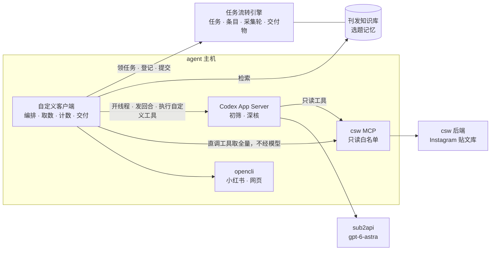

# 情报收集员改造方案（概要版）：自定义客户端 + Codex App Server

日期：2026-09-19｜发出：开发｜状态：征求意见，同意后动工｜协议、配置、代码结构等实现细节见《情报收集员_Codex采集引擎方案_20260918》

**一句话**：把情报收集员从 Hermes 上的单会话 agent，换成「自定义客户端 + Codex App Server」。取数、去重、计数这类确定性工作交给代码；「值不值得报」交给 Codex，并给它接上三份参考——csw MCP 的贴文供给、CSW 公众号历史文章知识库、从 Van 与主编对话里提炼的选题记忆。引擎的流程定义、交付协议、两道人审都不变。

---

## 1. 现状证据

**选题闸上的三次退回**（Van 原话，引擎记录）：

| 日期 | 原话 |
|---|---|
| 9/15 | 「打回，三个产品的报道价值都不高；选题数目太少，要继续收集。」 |
| 9/16 | 「1非新品退回；23产品价值不足，退回；4国外新开店铺除非非常特别否则对于国内读者来说价值不足，退回；5可保留但需要验证图片是否足够；6和7产品价值不足，退回。」 |
| 9/18 | 「退回你刚才提交的两条选题，本期直接用我挑选的以下几条资讯作为选题推进下去。」随后她发来 8 条 Instagram 链接。 |

9/18 这期（r48）最终写成的 7 篇，**全部出自 Van 自己挑的这 8 条**。采集这件事实际上由客户代劳了。

**审阅覆盖**——r48 收集员自报的采集轮：

<!-- FIG:coverage -->

| 通道 | 接口返回 | 实际审阅 | 未审阅 |
|---|---|---|---|
| Instagram（csw MCP） | 401 | 49 | 352 |
| 小红书（opencli） | 37 | 1 | 36 |

01 任务首末事件相隔 188 分钟，交了 3 版。这些数字还是 agent 自报的，没有机制保证属实。

**来源覆盖**——把 Van 9/18 指定的 8 条按短码去 csw 后端贴文库核对：

<!-- FIG:picks -->

8 条里只有 1 条（gnuhr_studio）在库。MOSS、Carhartt WIP、Daniel Arsham、Brain Dead 的账号未被跟踪；`satisfyrunning` 在跟踪但那条没抓到；HEIMPLANET 跟踪的是日本号。后台在册 460 个账号，近 7 天日均入库 158 条。即使把库里 401 条全部审完，这一期也只能命中 Van 选择的八分之一。

**参考资料的存量**：引擎里公众号发布记录 51 篇（15 篇有正文），合集拆条 6 条；Van 的反馈记忆 6 条。

## 2. 根因

五个，都是结构性的，调提示词解决不了：

1. **取不全。** `csw_posts_search` 单次上限 100 条，没有翻页参数。此前写进岗位说明的「不够就翻页取完」实际做不到，agent 只能手工切时间窗。
2. **单会话装不下。** Hermes 上的收集员是一个长会话，上下文过半即压缩。400 条贴文逐条读，窗口先满，压缩后又丢状态，只能抽样。
3. **没有检索增强。** 「什么值得报」只靠系统提示词里的几段岗位说明，既没有知识库，也没有偏好记忆。
4. **确定性工作交给了模型。** 取数、去重、判时间窗、计数，本该由代码做，却由模型发工具调用完成——慢、不可核、数字靠自报。
5. **来源名单与 Van 的视野不重合。** 跟踪哪些账号是早期一次定下的，没有随客户选择更新的机制。

附带的安全问题：现在的收集员挂着 csw MCP 全部 25 个工具（含推送微信这类写操作）和终端，读的却是 Instagram 文案、网页这类不可信输入，提示注入的波及面太大。

## 3. 为什么是「自定义客户端 + Codex App Server」

**Codex App Server** 是 Codex 的无界面服务形态。外部程序可以通过它开线程、发回合、订阅事件流，给它挂 MCP 服务器，注册**由客户端执行的自定义工具**，并用 JSON Schema 约束每个回合的最终输出。这样就能让我们自己的客户端当「编排者」，Codex 只当「判断者」。模型不变，仍走 sub2api 的 `gpt-6-astra`，与主编同款。

| | Hermes 上的收集员（现在） | 自定义客户端 + Codex App Server |
|---|---|---|
| 工作形态 | 一个长会话 agent，自己决定先查什么后查什么 | 客户端按固定流水线编排，Codex 只在需要判断的环节被调用 |
| 上下文 | 一个窗口硬装全部贴文，过半即压缩 | 每批约 25 条开一个新线程，上下文始终干净；多线程并行 |
| 取数 | 模型发起 MCP 工具调用，取到多少看运气 | 客户端代码直接调同一个 csw MCP 工具，按时间窗切片取全 |
| 输出 | 自由文本加自报数字 | JSON Schema 约束的结构化输出；数量由代码统计 |
| 参考资料 | 系统提示词里的岗位说明 | 知识库命中与选题准则卡随每批输入注入，另有可调用的检索工具 |
| 工具权限 | 25 个 MCP 工具加终端 | 9 个只读 MCP 工具；写引擎只由客户端代码执行 |
| 唤醒 | 靠飞书 @ | 客户端轮询引擎的任务列表 |
| 留痕 | 会话日志 | 每个线程的完整回合记录（含工具入参与返回）随交付物归档 |

**已在本机实测的两项核心机制**：

- **自定义工具回调**：给模型一个 `kb_search` 工具。模型判断贴文前主动调用它，客户端返回知识库命中，模型据此把一条 NANGA 新色判为「近期已发」并引用了命中条目。
- **结构化输出**：最终消息严格符合给定的 JSON Schema，可以直接入库。

实测还发现 `gpt-6-astra` 要求较新版本的 Codex，部署时须装固定的新版本。

**为什么不继续在 Hermes 上调提示词**：根因 1、2、4、5 都不是提示词问题。Hermes 是面向对话的通用 agent 网关，适合主编、文案这类对话型角色，不适合「每天把几百条全量过一遍」的批处理。其余八个角色这次不动。

## 4. 架构与分工

| 谁 | 负责 | 不负责 |
|---|---|---|
| **客户端代码** | 领任务与心跳、按窗口全量取数、去重、判时间窗、近发硬查重、计数、登记条目与采集轮、打包提交、失败上报 | 任何「值不值得报」的判断 |
| **Codex** | 分批初筛打分；入围条目深核（读原帖与图、找官方佐证、对照知识库与选题记忆）；写条目说明 | 取全量、计数、写引擎、写 csw 后端 |
| **引擎** | 任务、条目、采集轮、交付物、审核闸的真相；知识库与选题记忆的存储与检索 | —— |

## 5. 01 采集流水线

| 步 | 执行者 | 内容 | 产出 |
|---|---|---|---|
| A 取全量 | 代码 | 调 `csw_posts_search` 按时间窗取数；返回里带真实总数，超过 100 就把时间片对半切开递归，直到每片取全。同时读 Van 在前端勾选的贴文。小红书、网页按来源台账逐源调 opencli | 候选暂存；每次调用记一条采集轮，数量由代码算 |
| B 机械预筛 | 代码 | 按发布时间精确判窗口；去重；对知识库做 30 天硬查重；对照最近被否决、暂缓的条目 | 自动标「窗口外」「已发」「刚被否」，逐条留理由 |
| C 分批初筛 | Codex | 每批约 25 条、每批一个新线程、2–3 批并行。结构化输出每条：结论、理由码、一句理由、品牌、产品、品类、新闻性、契合度、引用的知识库条目与记忆条目 | 每条贴文都有结论，审阅覆盖 100% |
| D 入围深核 | Codex 加工具 | 取前 K 条（初值 40）。核原始披露时间、找官方佐证、看图确认外观 | 条目卡：披露时间、证据链接、查重说明、事实、配图、缺口 |
| E 登记与交付 | 代码 | 逐条登记条目、上报采集轮、生成交付物并提交；提交前先跑一遍引擎的八条校验判据 | 引擎里的条目、采集轮、交付物 |

几条关键约定：

- **收集员的淘汰只限硬理由**：窗口外、近期已发、刚被否决、无实质资讯（纯穿搭、活动回顾）、证据不足。「品味」类判断只给分和说明，不直接淘汰。排名靠后的全部可查，主编随时可以捞回。
- **贴文自带译文和图片描述**，初筛可以纯文本完成，不必逐条看图；只有入围的才看图。
- **兼容现有的首批校准闸**：每完成一条深核就登记一条，满若干条成熟或到 20 分钟即交首批，其余以补件追加。
- **05 配图与素材核同机接管**。同一个角色令牌无法只切一半，切换时 01 与 05 一起换。11 选图包目前每期都被取消，等小红书接入时再做。

## 6. 三份参考资料

### 6.1 csw MCP：保留，换用法

- 取数与深核走同一个 csw MCP。区别在于：取数由客户端代码直接调工具，不经过模型。
- 模型侧只暴露 9 个只读工具：贴文搜索与详情、账号列表、Van 的前端勾选、参考文章、文章列表与详情。隐藏、选稿、建文章、推送微信等其余 16 个不暴露。
- **来源扩充闭环**（针对根因 5）：
  - 一次性对账：知识库里出现过的品牌，加上 Van 历史上亲手指定过的贴文，反查 Instagram 账号，与在册账号比对，出「待补录账号清单」，每个账号写明依据。
  - 持续补录：Van 或主编贴来的外部链接，识别出账号，不在册就记一条补录建议，每周汇总确认。
  - 外部链接直通：贴来的链接不管后台有没有收录，当期直接成为优先候选。

### 6.2 刊发知识库：CSW 公众号历史文章

**用途**：品味参照（新内容像不像 CSW 会报的）；近发查重（30 天硬查重，90 天内同对象须有实质更新）；找缺口（常报但近期没报的品牌适当加权）。

**底料**：公众号官方接口读到的历史文章，现有 51 篇，回填到接口能给的最早日期；csw 后端「参考文章」里已有的 35 篇公众号范文，全部带风格摘要；csw 后端里经系统生成并推送过的稿件。三路按标题加日期去重。

**加工**：

1. **合集拆条**。一篇推文常含 6–8 则资讯，用 Codex 批处理拆成「品牌、产品、品类、角度、价格、发售信息、来源账号、原文段落」，人工抽检。
2. **检索**。第一期用全文检索加品牌别名表（NANGA、ナンガ），不上向量库。语料只有几百篇、几千条，查重依赖的是品牌名和产品名的精确命中，全文检索比向量相似度更可靠；向量检索留作后续增强。中文、日文、英文大小写的命中已实测通过。
3. **编辑画像**。代码统计加 Codex 归纳，生成一页摘要：品牌频次、品类配比、常用角度、标题句式、单期条数。带版本号，每周重算，进初筛提示词。

知识库放在引擎里，研究员查近发、文案对齐文风也能用。

### 6.3 选题记忆：Van 与主编对话里的挑选风格与逻辑

**底料**：主编的会话库里有飞书会话 437 个、用户消息约 1900 条，其中约 430 条含选题信号词；引擎里已有 Van 闸原话 10 条、条目决定 21 条。只取 2026 年 6 月起的部分，与 Van 9/15 确认的历史反馈回收范围一致。

**提炼流水线**（离线批处理）：

1. **切片**：取 Van 的每条发言，连同主编此前的提案和此后的回应，组成一个「决定片段」。
2. **抽取**：Codex 结构化输出——日期、候选对象、结论、逐字原话、给出的理由、能否推广成规则。
3. **归纳**：聚成规则——规则文本、倾向（偏好、回避、必须）、适用面、强度、证据原话、首末出现时间、反例。
4. **人工确认**：产出一页「选题准则卡」。经本人确认的规则才标为「明确」并长期生效；未确认的标「推断」，运行时只作弱提示。**模型归纳出来的话不冒充 Van 的话。**
5. **持续更新**：Van 在选题闸上的每次决定本来就自动沉淀为反馈记录，自动追加为案例；每周重新归纳一次，只产出变更提议，不自动生效。

**拿 9/16 那段原话示范**（示意，须本人确认）：

| 提炼出的准则 | 证据原话 |
|---|---|
| 不是新品的不报 | 「1非新品退回」 |
| 国外新开店铺，除非非常特别，否则对国内读者价值不足 | 「4国外新开店铺除非非常特别否则对于国内读者来说价值不足」 |
| 图片不够的先不上，核实够用再说 | 「5可保留但需要验证图片是否足够」 |
| 被打回的，之后的选题里不再出现 | 「其他全部打回并不要在之后的选题里重复出现」 |

也正因为需要本人确认，有两处现在读不准：9/16 说国外新店价值不足，9/18 Van 自己挑了 SATISFY 巴黎旗舰店——这应是「非常特别」的例外，什么算特别得她来定；「产品价值不足」出现三次，但什么样的产品算有价值，需要她举例。

**边界**：私聊全文不离开 agent 主机，进引擎的只有提炼后的规则和必要的短引文；抽取前先清洗密钥；每条规则都能点回原话和日期，可删可改。

## 7. 提示词与上下文怎么组织

- **初筛线程**：固定前言（引擎下发的阶段作业标准、选题准则卡、编辑画像、本批涉及品牌的知识库命中）加 25 条贴文。不挂工具，一批只需一次模型调用。理由码用枚举锁死，模型不能自创。
- **深核线程**：每条入围条目一个线程。挂 csw MCP 只读工具，加客户端提供的自定义工具：知识库检索、选题记忆检索、网页抓取（域名白名单加体积上限）、小红书搜索。
- **每批一个新线程**是关键设计：上下文不会满；某批失败只重跑该批；已落库的结论支持断点续跑。
- **作业标准不另抄一份**。客户端从引擎取该阶段的作业内容、自检、验收，原样注入。改标准仍然只改引擎定义。

## 8. 可核与安全

- 每条贴文都有结论、理由码、引用的知识库条目和记忆条目，主编和研究员经引擎接口直接查，不必解压交付物。
- 采集轮的全部数量由代码统计，不再由模型自报。
- 每个线程的完整回合记录随交付物归档，含每次工具调用的入参、返回与耗时；每回合的 token 用量按期汇总，费用可见。
- Codex 运行在只读沙箱里，不批准任何命令执行与文件改动；MCP 只读白名单；写引擎只由客户端代码执行并校验。Instagram 文案里即使藏了注入指令，也碰不到任何写操作。

## 9. 对各角色的影响

| 谁 | 不变的 | 会变的 |
|---|---|---|
| **Van** | 选题、完整推文两次审核照旧，决定权不变 | 候选更全；每条推荐写明依据；说过一次的话下一期即生效；缺量时能分清「当天真没有」还是「没找到」 |
| **主编** | 照常汇总选题、把关，可以推新方向 | 收集员交件时直接看到覆盖结论和每条的留弃理由；被淘汰的随时可捞回 |
| **研究员** | 价值判断仍归研究员 | 拿到的候选已去重、核过披露时间，附近发对照与初筛打分；知识库可直接查 |
| **文案、设计、发布** | 不受影响 | 知识库后续可用于对齐文风 |
| **情报收集员** | 岗位职责与交付契约不变 | 运行方式整个更换；飞书里不再对话，过程问题直接查记录 |

改造与并行期间日更照常。

## 10. 验收口径

| 指标 | 现状（r48） | 目标 |
|---|---|---|
| 审阅覆盖：csw MCP 窗口内贴文 | 49 / 401 | 100%，由代码计数 |
| 来源覆盖：Van 批准条目的来源账号在跟踪范围内 | 1 / 8 | 并行期结束 ≥ 80%，之后逐期上升 |
| 召回：Van 批准的条目事先出现在入围名单里（只算来源在册的部分） | 无法测 | 并行期 ≥ 90% |
| 01 用时 | 首末事件相隔 188 分钟 | 首批 ≤ 20 分钟，全量 ≤ 45 分钟（并行期实测后定稿） |
| 每条判断可追溯 | 理由埋在压缩包里 | 每条都有结论、理由码与引用 |
| 写权限面 | 25 个 MCP 工具加终端 | 9 个只读工具；写引擎仅代码 |

不设「每天凑满 6 主 2 备」的硬指标。它取决于当天真实供给，不拿弱题凑数——这是 9/15 与客户对过的口径。

## 11. 需要各方配合的事

**Van：**

1. 同意这个方向，包括按 9/15 确认的范围使用对话记录。
2. 「选题准则卡」出来后，花 15–20 分钟过一遍，逐条标「对」「不对」或「改成……」。
3. 给一份平时看内容的账号和媒体清单，不必求全。此后照常把链接贴进群即可，账号会被自动记录。
4. 可选：挑 10 篇最满意和几篇最不满意的 CSW 推文，用来校准「像不像 CSW」。

**主编、研究员**：并行期照常工作；切换后头几期留意入围名单有没有漏掉好内容，漏了就指出，这是调准排序和阈值的主要依据。

**开发**：其余全部。在 agent 主机安装 Codex、部署新服务、停用 Hermes 上的收集员，逐项征得同意后执行。

## 12. 里程碑

| # | 内容 |
|---|---|
| M0 | **可行性验证**：agent 主机装固定版本 Codex；sub2api 与 Codex 的兼容性；挂 csw MCP 只读白名单；自定义工具与结构化输出；3 线程并行；拿 r48 的 401 条实测初筛速度与费用。**不通过即停** |
| M1 | 取数器：时间窗切片、去重、判窗口、代码计数的采集轮 |
| M2 | 刊发知识库：回填、拆条、检索、编辑画像；来源对账，出待补录账号清单（可与 M1 并行） |
| M3 | 选题记忆：切片、抽取、归纳、准则卡，交 Van 确认 |
| M4 | Codex 初筛与深核、引擎登记与交付、失败上报；05 最小实现 |
| M5 | **并行运行** 3 个早晨：新流水线只出本地报告、不写引擎，与真实 run 及 Van 的实际决定对比 |
| M6 | 切换：01 与 05 由新服务接管 |

M0 是闸门，不通过即停。M5 达标才切换。切换后回退只需停新服务、重启 Hermes 上的收集员，两分钟内完成。

## 13. 风险与未定项

| 风险 | 应对 |
|---|---|
| 来源不全不解决，审阅覆盖做到 100% 也命中不了 Van 的选择 | 来源扩充闭环与采集改造同步做；外部链接直通先上 |
| sub2api 与 Codex 的兼容性未验证 | Hermes 现在就是以 Codex 的接口模式走 sub2api，是好兆头；M0 第一件事验它 |
| `gpt-6-astra` 要求较新的 Codex；App Server 协议标注为实验性 | 固定版本，升级单独排期 |
| 早期「群发」的推文没有正文接口 | 抓公开页；抓不到的列清单，走人工导出 |
| 选题记忆把模型的归纳当成 Van 的意思 | 「明确」与「推断」分开存、分开用；规则须本人确认；每条带原话证据 |
| sub2api 偶发 429、503 | 回合级重试加熔断；超时即向引擎报失败并写明原因，不挂死 |
| 新补录的账号多久开始有内容 | 取决于 csw 后端的抓取周期，待查清 |

## 14. 常见疑问

**会不会越挑越窄？** 选题准则只用来排序和写明理由，不作硬门槛。直接淘汰只用第 5 节列的硬理由。主编照常可以推新方向。

**为什么第一期不上向量检索？** 查重要的是品牌名、产品名的精确命中，语料规模也小，全文检索加别名表更可靠、更可解释。向量检索留给「找相似角度」这类后续需求。

**其他角色要不要也迁过来？** 这次只换收集员。研究员的价值初筛与新流水线的初筛高度同构，并行期之后再评估；对话型角色留在 Hermes 上更合适。

**切换后还能在群里问收集员问题吗？** 不能，它不再是对话型 agent。「那些没入选的去哪了」这类问题，直接查引擎里的采集轨迹，比问 agent 更准。要不要补一个轻量问答入口，第三期再定。
