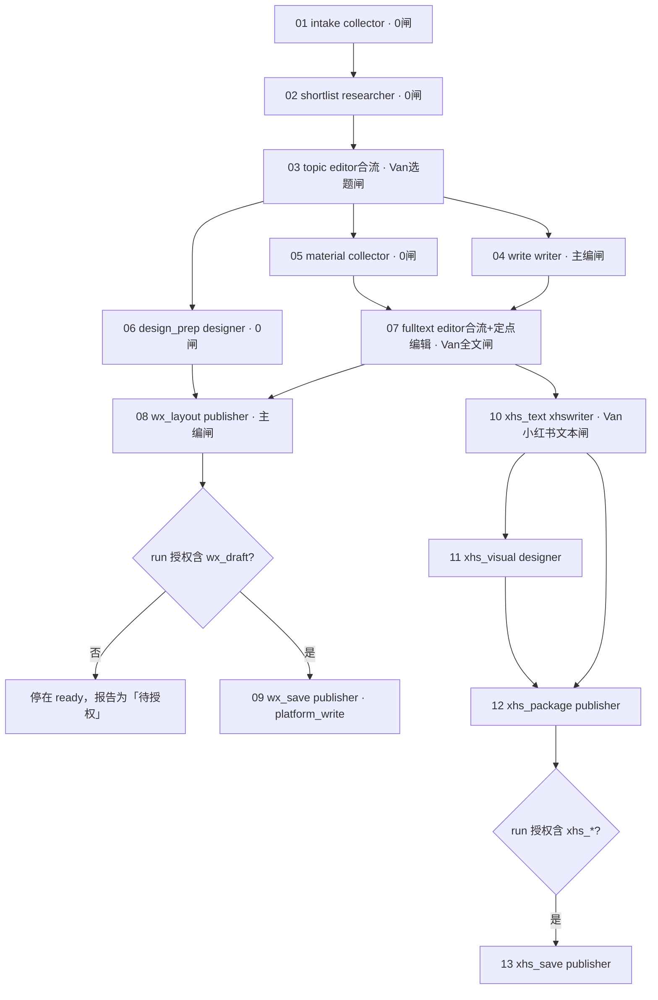

# 新流程改造 · 整体优化方案（对两份 0914 反馈的落地映射）

日期：2026-09-15｜对象：开发 / chief / Van｜状态：已实施（M0–M8 已提交，未部署；见 §10 实施记录）

依据：`docs/给开发_新流程改造执行摘要_20260914.md`（下称「摘要」）、`docs/CSW编辑部_角色与新流程优化方案_v1_20260914.md`（下称「方案」），以及本仓库当前代码与定义的实读（引擎 `internal/engine`、DDL `0001`、seed `0003/0007`、`skill/SKILL.md`、六份 bootstrap、`docs/` 流程三件套）。

---

## 0. 结论先行

1. **两份反馈约八成落在本仓库的三层**：工作流定义（闸 / DAG / 派工模式）、引擎护栏与事件接续、共享数据（发布记录 / 反馈记忆 / 指标快照）。其余两成（压缩 402、Hermes 会话恢复、模型路由、飞书送达）在各 agent 的运行时环境，本仓库只能提供**取证手段**和**降低对它们的依赖**。
2. **最大的杠杆在定义层，不在引擎代码**。引擎已支持任意 DAG、按阶段覆盖闸、0 闸直通、合流自动派给中枢。「Van 决定从 10 次减到 2 次」「小红书改编不再依赖公众号后台」「配图 / 版式与写作并行」都能靠 **seed 一版新定义** 实现，一行 Go 都不用改。这是 9/15 能切的第一刀。
3. **必须改引擎的只有四件**：授权分级护栏（#63 一类问题的根治）、事件驱动接续（引擎侧播报 / 接单 / 逾期投影）、补件与主编定点编辑、条目级推进。前三件小，一周内；第四件是数据模型变更，两周。
4. **共享数据是一个新子系统**，不是给现有表加列：发布记录自动同步、合集拆条、指标快照、编辑反馈记忆。它的采集适配器（公众号后台 / 小红书创作者后台）可行性未验证，必须先做探针再承诺。
5. **9/15 不可能整套上线**。可以做到的是：定义 v2 + 授权护栏 + 状态词汇统一 + 一份生效的《生产约定》，以此启动**第一期真实验证**，并附未验证项清单。这与摘要「不能把单条演练通过当作整套上线证明」一致。
6. **定义层本身可以做成 agent 可操作的通道**。定义是不可变版本、触发即快照、管理面 API 与校验器齐全，所以「让 agent 按用户意愿改流程」不需要新引擎能力，需要的是一个独立的 `csw-workflow` skill + `wfctl` 客户端 + 护栏（§4）。引擎越把规则做成数据，这条通道能改的就越多。

---

## 1. 现状对照：反馈点 → 本仓库现状 → 缺口 → 落点

| # | 反馈点（摘要/方案） | 本仓库现状 | 缺口 | 落点 |
|---|---|---|---|---|
| 1 | 10 阶段 × 双闸 = 20 道审核、10 次 Van 决定（方案 §2、§4.1） | `0003` 默认闸 `stage_id=NULL` 套所有阶段：editor → van(relayed) | 定义问题，非引擎问题 | **定义 v2** |
| 2 | 07 依赖 06 但内容来自 05；公众号后台故障阻塞小红书（方案 §4.1） | deps `xhs_text → wx_publish`；skill §4.3 靠主编手加上游兜底 | 依赖边选错 | **定义 v2**（`xhs_text → wx_fulltext`） |
| 3 | 04 视觉必须等全文全部通过；素材 / 模板准备不能并行（方案 §4.1） | 线性链 `wx_visual → wx_content` | DAG 形态 | **定义 v2**（并行分支） |
| 4 | 批准一条即可写一条；整期缺口另记（摘要 2、方案 §6.1） | 一 run 一 stage 一 task（`UNIQUE(run_id, stage_code)`）；审核对象是整个 zip | **无条目粒度** | **引擎 P1**：`per_item` 阶段 + `run_items` |
| 5 | 审核绑定对象与版本；研究许可 / 选题 / 全文 / 模板 / 本地验版 / 草稿 / 发布分开（方案 §6.2） | `reviews` 已绑 `(deliverable_id, task_gate_id)`，越版本审核 409 `stale_version`；但无 `decision_type`、无原话来源、无条目范围 | 决定类型与来源 | **引擎 P0**：`reviews` 加 `decision_type / source_quote / items_json / expected_version` |
| 6 | 本地演练 / 后台草稿 / 公开发布是不同授权；上游过了不得自动进后台（摘要 6、方案 §5.1、§6.6） | 无任何授权概念；06/10 就绪后主编可派，发布员可执行 | **护栏缺失** | **引擎 P0**：`run_authorizations` + 阶段 `action_class` + dispatch/submit 双校验 |
| 7 | 「具备派工条件」「已派工」「执行中」不得同一句话；#63 报「执行任务已派出」（方案 §6.4、§6.6） | 引擎已分 `ready / dispatched / in_progress`，但无接单动作，agent 口头映射混乱 | 词汇未统一、无 ack | **引擎 P0** `POST /tasks/:id/ack` + **skill** 状态词汇表 |
| 8 | 交件 / 批准 / 补件形成持久事件，自动触发下游，去重，重启可恢复（方案 §6.3） | `events` 表已是持久时间线；但**通知靠 agent 双写**（skill §5「引擎先、群播报后」），无 outbox、无重试、无兜底唤醒 | 通知不可靠、无接续保证 | **引擎 P0**：`outbox` + notifier；`due_at` 启用 + 逾期投影 |
| 9 | 五分钟播报 ≠ 推进；进度要有对象 / 版本 / 最近产物 / 负责人 / 阻塞 / 下一节点 / 逾期（方案 §6.4） | `GET /runs/:id` 有任务图，无「进度卡」投影 | 投影缺失 | **引擎 P0**：`GET /runs/:id/progress` |
| 10 | 补件（换头尾图）不重跑正文链；主编有限定点编辑权（摘要 4、方案 §5.2、§6.5） | 任何新版本都从第一道闸重走；主编「绝不改稿」写死在 bootstrap / 文档 | 无补件类型、无协作版本 | **引擎 P0**：deliverable `kind=supplement/edit` |
| 11 | publisher 承担组版 / 打包 / 后台操作，chief 只审（摘要 4） | 05/09 合流阶段 `role=editor, is_merge=1`，主编自己合成 | 分工在定义 | **定义 v2**（合流改 publisher）+ **docs** |
| 12 | xhswriter / reviewer / analyst 接入真实任务（摘要 §九角色） | `roles` 只有 7 个 + scheduler；三者在 roster `reserved_bots` | 角色未 seed、无 bootstrap | **seed 0009** + **bootstraps** |
| 13 | 真实发布记录自动同步、合集拆条、覆盖缺口（摘要 5、方案 §7.1–7.3） | 无 | **新子系统** | **数据子系统 D1** |
| 14 | 历史编辑反馈持久积累、按任务检索、图片可回看、临时要求过期（摘要「历史编辑反馈」、方案 §8.1） | 无；只有 `common_instructions` 静态文本 | **新子系统** | **数据子系统 D2** |
| 15 | 双平台指标 1/3/7/30 天快照、原值保留、不擅改（方案 §7.5–7.6、§13） | 无 | **新子系统** | **数据子系统 D3** |
| 16 | 压缩 402、Hermes 会话、模型路由核实（摘要 1、方案 §8.2–8.3） | 不在本仓库 | 运行时 | **仓库外**（§7 给取证与去依赖办法） |
| 17 | 固定数量 / 截止 / 人审窗口 / 时限（摘要 P0-7、方案 §9） | 文档写的是旧默认 5 则 15 图 | 业务约定未定 | **docs《生产约定》** + run `inputs` 固定字段 |
| 18 | 流程的修改与新建希望由 agent 按用户意愿完成（本轮追加） | 定义只能在管理后台由人改；运行面刻意无定义 API（设计 §6）；admin API 与校验器齐全 | agent 用的定义面通道、凭证、变更理由审计 | **skill `csw-workflow`**（§4）+ 服务端小改（`reason` 审计、服务账号、预演） |

---

## 2. 目标流程 v2（`daily_news` 定义新版本）

### 2.1 设计原则

- Van 面对公众号只有**两类日常决定**：选题、完整文案；小红书文本单独一次（方案 §4.1 末段明确「公众号通过不能自动视为小红书全文通过」）。其余闸要么主编单闸，要么 0 闸。
- 默认闸取消（`workflow_gates.stage_id=NULL` 一行也不留），**每个阶段显式声明自己的闸**。这是当前引擎表达「某阶段 0 闸」的唯一方式（`resolveGates` 只在有覆盖闸时才替换默认闸，无法表达「覆盖为空」）。
- 内容依赖与门禁依赖合一：小红书改编依赖**全文批准**那个任务，不依赖发布任务。
- 平台写操作（存草稿 / 发布）单独成阶段并标 `action_class=platform_write`，受 run 授权护栏（§3.2）约束。

### 2.2 阶段表

| seq | code | 阶段 | 角色 | 依赖 | 闸 | per_item | action_class | 产出 |
|---|---|---|---|---|---|---|---|---|
| 1 | `intake` | 01-情报逐条 | collector | 入口 | 0 | P1 | read | 轻量情报记录：原文链接 + 发布时间 + 一张预览 + 缺口 |
| 2 | `shortlist` | 02-价值初筛 | researcher | intake | 0 | P1 | read | 短名单：采用 / 备选 / 淘汰 + 理由（看图、查近发） |
| 3 | `topic` | 03-选题方案 | editor（merge） | shortlist | editor 自审 → **Van 选题** | — | read | 选题卡（方案 §3.3 五要素）+ 整期组合 + 缺口 |
| 4 | `write` | 04-公众号写作 | writer | topic | editor | P1 | read | 逐条三段正文；总标题 / 摘要 / 导读在 fulltext 收口 |
| 5 | `material` | 05-配图与素材核 | collector | topic | 0 | P1 | read | 已选条目最终配图 + 使用依据 |
| 6 | `design_prep` | 06-版式与模板准备 | designer | topic | 0 | — | read | 已批头尾图 / 模板版本引用；仅指定生成任务才出新图 |
| 7 | `fulltext` | 07-完整审核稿 | editor（merge） | write, material | editor 定点编辑 → **Van 全文** | — | read | 09:00 稿：总标题 + 摘要 + 导读 + 全部正文 + 同版图片 |
| 8 | `wx_layout` | 08-公众号组版打包 | publisher | fulltext, design_prep | editor | — | read | HTML + 附件 + 可读预览（本地成品） |
| 9 | `wx_save` | 09-公众号草稿保存 | publisher | wx_layout | 0（异常升级） | — | **platform_write:wx_draft** | 草稿 ID + 回读截图 / 摘要 |
| 10 | `xhs_text` | 10-小红书改编 | xhswriter | **fulltext** | editor → **Van 小红书文本** | — | read | 导语 + 条目文案 + 分页文案 |
| 11 | `xhs_visual` | 11-小红书视觉 | designer | xhs_text | editor | — | read | 封面卡 + 内容卡 |
| 12 | `xhs_package` | 12-小红书组包 | publisher | xhs_text, xhs_visual | editor | — | read | 卡片 + 文本成品 |
| 13 | `xhs_save` | 13-小红书草稿/发布 | publisher | xhs_package | 0 | **platform_write:xhs_draft / xhs_publish** | 笔记 ID + 回读 |

不进 DAG 主链、按触发接入的两类任务：

- **`review_check`（reviewer）**：由主编在 `topic` 或 `material` 阶段对具体句 / 图发起「专项检查」子任务，结果作为 supplement 挂到受影响交付物；不设整期串行闸（方案 §5.9）。
- **`analyst_*`（analyst）**：不在日更 run 内；由数据子系统按发布事件创建独立 `analytics` 工作流实例（方案 §5.10、§7.9）。

### 2.3 流程图



### 2.4 与旧十段的映射

| 旧 | 新 | 变化性质 |
|---|---|---|
| 01 采集 → 双闸 → 02 选题 → 双闸 | 01 intake（0 闸）→ 02 shortlist（0 闸）→ 03 topic（Van） | 两次 Van 变一次；研究员前移 |
| 03 全文 → 双闸 | 04 write（主编闸）→ 07 fulltext（Van） | Van 只看整期完整稿 |
| 04 视觉 → 双闸 | 06 design_prep（0 闸）并行 + 版式在 08 组版 | 不再单独走 Van |
| 05 主编合成 → 双闸 | 08 wx_layout（publisher，主编闸） | 主编不再搬运 |
| 06 发布 → 双闸 | 09 wx_save（0 闸 + 授权护栏） | 减纯操作确认 |
| 07 依赖 06 | 10 xhs_text 依赖 07 fulltext | 后台故障不阻塞 |
| 08/09/10 | 11/12/13 | 合成归 publisher；发布受独立授权 |

### 2.5 派工模式

引擎目前是工作流级 `dispatch_mode`。建议 v2 用 `auto`（就绪即派，上游自动预填）以消除「主编不接单流程就停」；但 `write` 与 `topic→write` 这一跳需要主编把 Van 批准的条目写进派工意见。两种办法，推荐第一种：

1. **引擎小改**：`workflow_stages.dispatch_mode` 可空覆盖列（默认继承工作流），`write`、`xhs_text` 设 `manual`，其余 `auto`。改动只在 `onTaskReady` 一处判断。
2. 不改引擎：整体 `manual`，靠 outbox 通知主编 + 逾期投影催办。接续仍取决于主编在线。

### 2.6 过渡期（条目级引擎能力未到位前）怎么「批一条写一条」

引擎 P1 之前，用协议层过渡：`topic` 阶段的 Van 闸一旦批准 ≥1 条即 `pass`，`comment` 写结构化 JSON `{"approved":["hxo"],"pending":["nanga"],"target":6}`；`write` 派工单 `editor_note` 只列已批条目；整期缺口写进 run `inputs.gap` 并由进度投影展示。缺口补齐后，**不重开 run**，主编对 `topic` 任务发起 `supplement`（§3.3）追加批准条目，再对 `write` 二次派工（引擎需允许 `passed` 任务接收 supplement 并对下游追加派工单，见 P0-5）。这比什么都不做好，但它是过渡，不是终态。

---

## 3. 引擎改造清单

### 3.1 零代码：定义层（今天可做）

| 项 | 做法 | 验证 |
|---|---|---|
| seed `0009_daily_news_v2.sql` | 新增 `workflows(wf_key='daily_news', version=2)`，13 阶段 + 依赖边 + 逐阶段闸；旧 v1 `archived` | `adminctl workflow validate daily_news`；`go test ./internal/workflow/` |
| 或后台操作 | 管理后台 clone v1 → 编辑器改 → activate（前端 `runChecks` + 后端校验） | 同上；但 seed 可回放，优先 seed |
| 阶段文本 | `instructions / self_check_criteria / acceptance` 按 §6 文档联动改写；**不要**把方案全文粘进去（方案 §8.1 末段） | 触发一个 run，`task <id>` 读到新文本 |

在跑的 r12 不受影响（触发即快照）。**注意**：`resolveGates` 语义要求 v2 不设默认闸，否则 0 闸阶段表达不出来。

### 3.2 P0（本周）：护栏、状态、事件、补件、角色

**P0-1 授权分级护栏（对应摘要 6、方案 §6.6、P0-2）**

- 表 `run_authorizations(run_id, scope, granted_by, source_quote, granted_at, expires_at, revoked_at)`；`scope ∈ {local_drill, wx_draft, wx_publish, xhs_draft, xhs_publish}`。
- 列 `workflow_stages.action_class`（快照到 `tasks.action_class`），值 `read | platform_write:<scope>`。
- 规则：`dispatchInternal` 与 `Submit` 对 `platform_write:*` 任务检查 run 当前有效授权；无则 dispatch 返回 409 `authorization_required`，任务停在 `ready`，进度投影显示「待授权：wx_draft」。**自动派工也受此约束**。
- 端点：`POST /runs/:id/authorizations`（仅中枢，须带 `source_quote`，即 Van 原话）、`DELETE …/:scope`。
- 验收（方案 §11）：「仅本地演练，上游审核通过 → 后台保存与发布不执行；报告不把解锁写成已派工」。

**P0-2 接单与状态词汇（方案 §6.4）**

- `POST /tasks/:id/ack` → `dispatched → in_progress`，记 `started_at`；`in_progress` 要求 30 分钟内有心跳或产物，否则投影标「无活动」。
- 新增状态 `failed`（agent 报告不可完成，附原因）与 `cancelled`（中枢取消）；`POST /tasks/:id/fail`、`POST /tasks/:id/cancel`。
- 统一词汇（写进 skill、作业手册、后台 UI）：`ready`=具备派工条件 · `dispatched`=已正式派工 · `in_progress`=执行者已接单 · `review`=等待某闸 · `returned`=需返工 · `passed`=已交付。

**P0-3 事件驱动接续：outbox + notifier（方案 §6.3，P0-4）**

- 表 `outbox(id, event_id UNIQUE, channel, target_role, payload_json, attempts, next_at, sent_at, last_error)`。
- 引擎在同一事务内为 `task_ready / dispatched / submitted / gate_passed / gate_returned / supplement_arrived / authorization_required / overdue` 写 outbox 行。
- `cmd/notifier`（或 server 内 goroutine）轮询 outbox，用 `chats/chat_members` 花名册组装真 at-tag，经 lark 发送；指数退避重试；`event_id` 唯一保证**同一事件只发一次**。
- **群播报从「agent 双写」改为「引擎单写」**：skill §5 的五类模板搬到 notifier；agent 只保留「引擎调用」，不再自己发群消息。这直接消除「口头说已 @、实际没 @」和「群提醒失败就重做」两类故障。
- `tasks.due_at` 启用：派工时按阶段 `sla_minutes` 写入；notifier 定时扫描逾期 → `overdue` 事件 → 提醒一次，不刷屏。
- 兜底唤醒：agent 侧现有「30 分钟 cron 扫 my-tasks」保留。
- 验收：「提交成功但群提醒失败 → 产物仍在审核队列，提醒重试，不重复写稿」「同一交付通知重复到达 → 只产生一次有效审核和一次派工」。

**P0-4 进度投影（方案 §6.4）**

- `GET /runs/:id/progress` 返回每个任务：当前对象与版本、最近产物及时间、负责人、真正阻塞项（缺依赖 / 待授权 / 待闸 / 逾期）、下一节点、整期目标与缺口。
- notifier 只在状态变化时发进度卡；`content-calendar.md` 若保留，由此投影导出。

**P0-5 补件与主编定点编辑（摘要 4、方案 §5.2、§6.5）**

- `deliverables.kind ∈ {dispatch, output, supplement, edit}`（替代 `is_dispatch` 布尔，兼容读）。
- **supplement**：可挂到 `passed` 任务，必带 `affects_deliverable_id`；引擎写 `supplement_arrived` 事件，把**直接下游中尚未 passed 的组版类任务**（`wx_layout / xhs_package`）标 `rework_pending`，不触碰上游批准。已 passed 的下游需主编显式「重开」。
- **edit**：中枢角色可对处于 `review` 且当前闸为自己的任务提交 `kind=edit` 版本，必带 `edit_of=<version>` 与 diff 摘要；`producer_id=editor`、`collab=1`。首稿版本保留不动；后续闸审的是 edit 版本。验收留存「首稿 / 协作稿 / 终审稿」三份。
- 验收：「正文批准后替换头尾图 → 不要求重写已批正文；成品引用正确新资产且保留版本」。

**P0-6 审核记录扩展（方案 §6.2）**

- `reviews` 加 `decision_type`（`research_ok / topic_approve / fulltext_approve / template_approve / local_verify / draft_save_ok / publish_ok`）、`source_quote`（Van 原话）、`items_json`（条目范围）、`expected_version`（与当前版本不符则 409，把现有 `stale_version` 语义显式化）。

**P0-7 角色 seed 与 bootstrap**

- `0009` 补 `roles/agents`：`xhswriter 小红书图文作者`、`reviewer 合规版权审查员`、`analyst 数据复盘师`；`chat_members` 把三条 `reserved` 转 `mapped`（open_id 已在 `roster.json`）。
- `skill/bootstraps/{xhswriter,reviewer,analyst}.md` 新增；`editor.md` 去掉「绝不亲自编辑内容」，改为「定点编辑权 + 预算 + 留痕」；`publisher.md` 扩为交付执行负责人。

**P0-8 阶段级派工模式覆盖**（§2.5 方案一，改动极小）。

### 3.3 P1（两周内）：条目级推进（摘要 2、方案 §6.1）

- 表 `run_items(id, run_id, item_key, title, brand, product, source_url, published_at, status, decided_by, decided_at, decision_source)`；`status ∈ {candidate, shortlisted, approved_write, approved_research, deferred, rejected, written, reviewed, published}`。
- `runs.target_count`（从 `inputs` 固定字段取）；整期完成 = `approved_write` 且 `passed` 的条目数 ≥ 目标；不足只影响 run 是否 `done`，不回滚任何条目。
- `workflow_stages.per_item=1` 的阶段：上游（`topic`）某条目变 `approved_write` 时，引擎为该条目**动态生成**一个 task（`tasks` 唯一约束改 `(run_id, stage_code, item_key)`，`item_key` 对非 per_item 阶段为空串）。`fulltext` 合流依赖「所有已批条目的 write 任务 passed」而非「write 阶段 passed」，`recomputeReady` 需按条目集合判定。
- 条目决定端点：`POST /runs/:id/items/:key/decision {type, source_quote}`；「继续研究」只开 `approved_research`，不派写作；「保留」类模糊措辞由主编问一次范围后录入。
- 验收：「已批准 HxO 但整期数量不足 → 该条可写，整期仍显示数量缺口；不重复询问是否保留」「只批准继续研究 → 不误派正式文案」。

### 3.4 数据子系统（与 P0 并行起步，三周内首版）

三块共用一个新包 `internal/ledger`，独立表、独立 CLI `cmd/syncer`，运行面只读端点供 agent 检索，后台页面只读。

**D1 真实发布记录（摘要 5、方案 §7.1–7.3、§13）**

- `published_posts(platform, account, post_id UNIQUE, url, published_at, title, body_ref, template_ver, source ∈ {agent, manual, sync}, state ∈ {drill, draft, published}, run_id?, first_seen_at)`。
- `published_post_items(post_id, item_key?, brand, product, angle, source_url)`：合集拆条，首版由 syncer 按公众号正文小节切分 + 人工校对一次。
- `sync_runs(platform, started_at, finished_at, window_from, window_to, ok, gap_note)`；查询接口必须回「在已同步记录中未发现」而不是「从未发布」。
- **适配器可行性是第一步，不是假设**：公众号先探 mp-helper 现有能力能否读到人工发布列表与单篇明细；小红书先探创作者后台已登录读取。探针结论写进变更记录，读不到的字段标「不可得」。
- 运行面：`GET /ledger/posts?since=30d&brand=`，供 researcher / chief 在 `shortlist / topic` 查重。

**D2 编辑反馈记忆（摘要「历史编辑反馈」、方案 §3.4–3.5、§8.1）**

- `feedback_records(id, quote, said_at, source_ref, object_ref, object_version, image_refs_json, kind ∈ {long_term, case, temporary, recent}, stance ∈ {explicit, inferred}, status ∈ {active, superseded, expired}, supersedes_id?, tags_json, curated_by)`。
- 录入三路：历史回收（analyst 整理、主编维护有效版本，开发只做导入器）；今后从 `reviews.source_quote` 自动生成 `explicit` 记录；模型推测单独 `inferred`，不得覆盖 `explicit`。
- 运行面：`GET /memory/feedback?tags=brand:nanga,kind:case`，返回原话 + 图片可回看链接；派工单 `upstreams` 自动附本任务相关记录（按品牌 / 品类 / 阶段 tag），不灌全量。
- 过期：`temporary` 带 `expires_at`；`expired` 不再下发。验收要测一次压缩 / 重启后仍能读到，以及过期条目不再出现。

**D3 指标快照与运营闭环（方案 §7.4–7.10、§13）**

- `metrics_snapshots(post_id, platform, age_bucket ∈ {2h, 24h, 72h, 7d, 30d}, collected_at, window_from, window_to, raw_json)`：**只存原值与平台定义**，派生指标查询时算；异常原值（曝光 0 而观看 >0、净涨粉与新增减取消差 4）原样保留并标 `pending_refresh`。
- `improvement_items(id, finding, evidence_ref, hypothesis, owner_role, content_version, due_at, recheck_at, metric, status ∈ {proposed, adopted, executed, supported, unsupported, insufficient, withdrawn})`；同时进行中 ≤ 2。
- analyst 的动作走现有引擎：`improvement_items.adopted` 后由主编触发一个 `improvement` 工作流实例派给对应岗位，复查时回写状态。**只交报表不算闭环**。

---

## 4. 定义面通道：让 agent 按用户意愿改流程（`csw-workflow` skill）

> 提问：流程引擎的修改和新建能否也做成 skill，让 agent 按用户意愿改，以获得更大灵活度。结论：可以，而且现有架构已具备大部分前提；要补的是一条面向 agent 的**定义面通道**加护栏，不是新的引擎能力。

### 4.1 为什么可行

引擎把定义与实例分开：定义是不可变版本（`UNIQUE(wf_key, version)`），激活归档旧版，触发即快照，在跑实例不受后改影响。管理后台 API 已有 create / put / validate / activate / archive / clone 全套，校验器 `internal/workflow` 已在。运行面刻意没有定义 API（设计文档 §6），这个约束保留：agent 改定义走管理面，用管理面凭证。

### 4.2 一个原则

skill 能改的是定义层能表达的东西：阶段、依赖、闸、角色、派工模式、三段文本，以及本方案新增的 `action_class / per_item / sla_minutes / dispatch_mode` 覆盖。引擎语义的变更仍是开发工作。因此 §3 每把一条规则做成数据，skill 的灵活度就多一分，两条线是同一个方向。

### 4.3 形态：独立 skill + `wfctl` 客户端 + YAML 定义文件

与 `csw-task` 分开：`csw-task` 是 agent 在运行面干活，`csw-workflow` 是操作员或主编在管理面改定义，凭证与受众不同。

- **定义即文件**：一个工作流 = 一份 YAML（meta / stages / deps / gates / texts），与 `PUT /admin/workflows/:id` body 一一对应。agent 改 YAML，不拼 HTTP。导出的 YAML 进仓库 `docs/workflows/<key>_v<n>.yaml` 并提交：DB 是运行权威，git 是审阅面与历史。seed 迁移只用于首次引导，不再为改文本写 0006 / 0007 这类迁移。
- **`cmd/wfctl`**（Go，复用 `internal/workflow` 校验器，走 adminsrv HTTP）：

| 命令 | 作用 |
|---|---|
| `export <key>` | 导出当前 active 版为 YAML |
| `diff <file>` | 本地 YAML 与 active 版对比，输出阶段 / 依赖 / 闸 / 文本四类变更表 |
| `lint <file>` | 本地校验 = 服务端 Validate + §4.4 附加规则 |
| `push <file> --draft --reason "…"` | clone active → put → 得到新草案版本 |
| `validate <key>@<ver>` | 服务端校验 |
| `activate <key>@<ver> --reason "…"` | 激活并归档旧版；必须人确认 |
| `history <key>` / `rollback <key>@<ver>` | 版本表 / 回到旧版（clone 后激活） |
| `roles` / `agents` / `roster` 子命令 | 角色、agent、通讯录成员的增改；**不含** token 签发（明文只显示一次，留给后台） |

- **SKILL.md 定义「意图 → 改动」的固定流程**：把用户的话复述成操作清单（加 / 删阶段、改依赖、改闸、改角色、改文本、改模式）→ 改 YAML → 输出变更对照表 + DAG 文字图 + 影响范围（在跑 run 不受影响、下次触发生效）→ 用户确认 → `push --draft` → `validate` → 只有人明确说「激活」才 `activate`，用户原话写进 `--reason` 落审计。

一次典型交互：用户说「小红书文本改成依赖完整审核稿，视觉不再走 Van」。agent 回一张表：两条依赖边变更、两个阶段的闸从两道变一道、影响范围。确认后建 v3 草案、校验通过、等待激活指令。

### 4.4 护栏

- **两步走**：草案与校验可自主，激活必须人确认。将来若让群里的主编 bot 承接，它只能建草案，激活在后台由人做。
- **只认 Van 与操作员**：来自群的改流程请求必须匹配花名册中 `is_human` 成员，其他人的话不构成定义变更。这是防群消息注入。
- **lint 附加规则**：无默认闸时每个阶段必须显式声明闸（`resolveGates` 表达不了「覆盖为空」）；`platform_write` 阶段必须带 `action_class`；角色无活跃 agent 时警告；被删阶段在活跃 run 中有开放任务时警告；中枢角色必须是管理类。
- **文本段不灌全文**：instructions / acceptance 只引用规范条款，禁止整篇贴方案文档（方案 §8.1）。
- **可回滚**：任何激活都能 `rollback` 到上一版。

### 4.5 服务端需要补的能力

| 项 | 内容 | 批次 |
|---|---|---|
| 管理面凭证 | 第一阶段 wfctl 走账号密码登录换 JWT（凭证在操作员环境变量）；第二阶段加服务账号 token（argon2id 存储，`operator` 角色）供自动化 bot | W1 / W2 |
| `reason` 审计 | put / activate / archive 接受变更理由，写入 `admin_audit`；这是反馈要求的「修改前后条款对照」落点 | W1 |
| 预演端点 | `POST /admin/workflows/:id/preview-run` 返回触发后会快照出的任务图与闸，不落库 | W2 |
| 文本同步 | `wfctl sync-text --from docs/` 从作业手册与验收标准对应小节转录三段文本；diff 时提示文档与定义分歧 | W2–W3 |

### 4.6 分阶段

| 阶段 | 内容 | 谁能用 |
|---|---|---|
| 一（1–2 天） | SKILL.md、YAML 格式、wfctl 八个命令、`reason` 审计；无其他服务端改动 | 开发或 Van 在 Claude Code 里 |
| 二（一周） | 服务账号 token、lint 扩到 v2 新字段、预演端点、文本同步 | 同上，可脚本化 |
| 三（视需要） | 主编 bot 接 Van 群里的改流程请求，只建草案；notifier 播报「v3 草案待激活」 | 编辑部群内 |

第一阶段一旦可用，§3.1 的「seed 0009」可以改为「`wfctl push` + `activate` + 导出 YAML 进仓库」，两条路都保留，seed 用于全新环境引导。

### 4.7 需要决定

- 第一阶段凭证用操作员账号登录，还是先做服务账号。
- skill 范围是否包含签发 agent token（建议排除）。
- YAML 是否作为定义的正式审阅面进仓库（建议是）。

---

## 5. skill 与 bootstrap 联动

| 改动 | 内容 |
|---|---|
| §3 worker 循环 | 步骤 2 前加 `ack`；处理 `supplement` 与 `rework_pending`；`failed` 上报方式；状态词汇表 |
| §4 主编编排 | 去掉「绝不编辑」；加 `edit` 提交 recipe（预算 10 分钟、留 diff）；`authorizations` 录入 recipe（必带 Van 原话）；条目决定 recipe；「Van 转审」改为 Van 只在 `topic / fulltext / xhs_text` 三处出现 |
| §4.3 特殊点 | 删除「派 07 手加 05 上游」（v2 依赖已修）；删除「05/09 合成是你的自产任务」（归 publisher）；保留合流阶段 `topic / fulltext` 的合成 recipe |
| §5 群协议 | 五类模板迁到 notifier；agent 侧只保留「引擎失败不发、引擎成功不必发」；护栏「只有主编可 @Van」由 notifier 实现（`target_role=van` 仅在三处 Van 闸事件）|
| §6 幂等键 | 加 `ack-{task_id}-{dispatch_version}`、`auth-{run_id}-{scope}-{quote sha16}`、`decision-{run_id}-{item}-{type}-{quote sha16}`、`supplement-{deliverable_id}-{zip sha16}` |
| §7 错误码 | 加 `authorization_required`、`not_per_item`、`rework_pending` |
| bootstraps | 新增 xhswriter / reviewer / analyst；改 editor / publisher / designer（模板复用与生成任务分开）/ researcher（前移到 shortlist）/ collector（逐条 intake、只为短名单补图）|

---

## 6. 文档联动（`docs/`）

| 文档 | 处理 |
|---|---|
| `资讯日更_全流程.md` | 重写为 v3：13 阶段、两处 Van 决定 + 小红书文本审、并行分支、授权分级；旧图 `pipeline_wechat_xhs_v2.png` 替换 |
| `资讯日更_交付与流转规范.md` | §7 双闸改为「按阶段声明的闸」；§8 按新阶段重排；新增 supplement / edit 两种交付物形态；九字段头加 `条目` 字段 |
| `资讯日更_验收标准.md` | 按新阶段重排；`topic` 加方案 §3.3 选题卡五要素；`fulltext` 保留原 03 全部标准；删除 04/06 的 Van 项 |
| `作业手册_*.md` ×6 | 逐份改：主编（定点编辑权、授权录入、条目决定）、收集员（逐条 intake、只为短名单补图、披露时间与转载时间分开）、研究员（前移、看图、查近发、总分不压明确否决）、文案（专注公众号、逐条交、字数口径统一）、设计师（模板资产版本、原图排版不重生成）、发布员（交付执行负责人、保存前查询既有草稿）|
| 新增 `作业手册_小红书图文作者.md` / `作业手册_合规审查员.md` / `作业手册_数据复盘师.md` | 按方案 §5.8–5.10 |
| **新增 `资讯日更_生产约定.md`**（P0-7） | 一页：更新日与窗口（周一 72h / 其余 24h）、07:00 资讯截止、当期数量（Van 定，当前演练口径 6 主 2 备）、07:15 送选题 / 07:30 确认 / 08:50 收口 / 09:00 完整稿 / 批准后 25 分钟草稿、人审窗口、授权范围默认值。run `inputs` 固定字段与之一一对应 |
| `任务流转服务_设计.md` | §3 DDL 追加 `run_authorizations / run_items / outbox / reviews 新列 / deliverables.kind`；§5 状态机加 `in_progress / failed / cancelled / rework_pending`；§10 开放问题 4（内容上游 vs 门禁）改「已定：依赖边直接指内容源」 |
| `CLAUDE.md` | 第一部分「核心架构」与「交付物协议」同步 v3；第二部分「引擎要点」加授权护栏与 outbox |

---

## 7. 仓库外事项：取证办法与去依赖

**#63 专项核查（摘要 6、方案 §6.6）** 不需要看群聊，引擎 `events` 已经是权威时间线。开发今天就能回放：

```sql
SELECT e.id, e.created_at, e.type, e.actor_id, a.role_code, e.task_id, e.deliverable_id, e.detail_json
FROM events e LEFT JOIN agents a ON a.id = e.actor_id
WHERE e.run_id = (SELECT run_id FROM tasks WHERE id = 63)
  AND e.created_at BETWEEN '2026-09-14T07:00:00Z' AND '2026-09-14T07:40:00Z'
ORDER BY e.id;
```

判读规则：#63 只有 `task_ready` 无 `dispatched` → 是「解锁被报成派出」，改 skill 词汇即可；有 `dispatched` 且 actor 为 editor → 是主编真派了，P0-1 护栏解决；再有 `submitted` → 发布员真执行了，要查 mp-helper 侧是否落了草稿。建议顺手加 `adminctl run replay <run_id> [--task <id>]` 把这条查询固化。

> **回放结果（2026-09-15 对生产库 `/opt/csw-task/data/csw-task.db` 只读查询）**
>
> - 本引擎的任务 #63 属于 6 月的 run 7（03-公众号内容，`blocked`），交付物 #63 是 6 月 run 3 的一张派工单。两者在 9/14 都没有任何事件。
> - 本引擎**最后一条事件是 2026-09-12T02:07Z**（run 40 · 01-采集第三次退回）。9/13、9/14 没有触发过 run，也没有任何派工 / 提交 / 审核写操作。9/14 的 HxO 单条演练、#62 审核、15:24 的「#63 执行任务已派出」、设计师补件、主编 15:33 收尾，**没有一步写进这个引擎**。
> - agent 当天确实碰过生产引擎：token 最近使用时间为 writer 13:42、editor 13:53、designer 14:18（北京时间）。经 §7.1 主机取证，这是各角色**误用生产凭证访问**后被纠正的只读调用（content-calendar 原话：「初次误读环境生产 BASE 只读无写，已纠正至 18082 既有隔离凭据」）。
> - 结论：反馈里的「r12 / #63」是 agent 主机上一套**隔离引擎实例**的编号（见 §7.1），不是生产引擎的 run / task id。原先「D0 前置问题：agent 为什么没有走引擎」已有答案：他们走了引擎，只是不是生产那台。
> - 顺带发现：自 6 月以来的 40 个 run **全部仍是 `active`**，没有一个跑到 `done`；9 月最远只到 06-公众号发布（run 38、39），run 39 一天里退回 12 次；run 40（9/12）在 01-采集被退回三次后停住；run 36 与 37 同一天（09-09）触发了两次。这些是「反复退回没有形成改进」「同日重复开 run」「run 永不收口」的引擎侧证据，也说明 P0-2 的 `failed / cancelled` 状态和 run 收口规则不是锦上添花。

### 7.1 agent 主机取证结果（2026-09-15，ssh 8.138.23.218 只读）

**一、9/13–9/14 的演练跑在主编自建的隔离引擎上，生产引擎被冻结。**

- Van 在 9/12 统一口径「当前仅核查 + 方案，不恢复生产、不覆盖流程、不正式发布」。chief 据此在 `/root/csw-fastline-rehearsal/remediation-20260913/technical/` 拷贝了本仓库 `csw-task-svc` 源码（版本早于通讯录提交，无 `handlers_roster.go`），打上一个幂等补丁后编译成 `fix/server`，起了两个运行面进程（127.0.0.1:18082 与 :18083，共用 `fix/test.db`）加两个后台进程（:18081、:18085），另有原版二进制在 :18080（`data/csw-task.db`）。
- 隔离库里有自己的 8 个 agent（含 reviewer）、独立 token（`credentials/*.token`，publisher / reviewer 的 token 最后使用停在 9/13），以及 5 个工作流定义：`daily_news` v1、`remediation_fastline`、`unified_readiness_20260913`（r12 用的这个：6 阶段，闸按阶段覆盖——01 主编单闸、02/03/06 主编 + Van、04/05 主编单闸）、`unified_rights_20260913`、`unified_parallel_prep_20260913`。**这证明「按阶段声明闸、Van 只审两处」在现有引擎上已经被 agent 自己配出来跑通了一次**，§3.1「零代码：定义层」的判断成立。
- 九个 profile 的 `.env` 仍指向生产 `https://tasks.aworld.ltd`，各自 token 互不相同；主编的编排脚本 `unified-readiness/runtime_dispatch.py` 硬编码 `http://127.0.0.1:18082` + 隔离 editor token，worker 靠群消息被告知去读隔离 token 文件。**xhswriter / reviewer / analyst 三个 profile 的 `.env` 没有任何引擎地址与 token**；researcher 的 `csw-task` skill 自 6/17 起被归档，没有装回。

**二、#63「执行任务已派出」的机制已坐实，属于「解锁被报成派出」。**

- 隔离库 r12：#62（05-公众号成品）v2 于 15:22:20 过主编单闸 → 事件 175 `stage_passed` → 事件 176 `task_ready`（#63）。此后 #63 **没有 `dispatched` 事件、没有交付物，状态至今是 `ready`**。
- 五分钟播报由 `profiles/chief/scripts/r12_progress5.py` 生成（cron 任务 `bbf10d6d95d4`，无 LLM，直接 GET run 12 与 timeline）。它取第一个状态不是 passed / blocked 的任务当「当前任务」，状态文案只分三档：`review` → 等待审核，`returned` → 阻塞/退回，**其余一律「执行任务已派出；实际作业以新增记录为准」**。15:24 那一轮 #63 恰好是 `ready`，于是落入第三档。台账 `progress5/r12p5-202609141524.json` 保存了原文。
- 15:29 Van 验版通过后主编写 STOP、job 置 paused；#63 始终未派，无任何后台保存或发布动作。摘要第 6 条「先核事实」可以结案：**是报告映射错误，不是越权执行**。修法就是方案 P0-2 的状态词汇表；隔离环境这类自制播报脚本一并废止，改用 P0-4 的引擎进度投影。

**三、压缩 402 的调用链。**

- chief 的日志 9/13–9/14 有 173 次 402，全部来自 `agent.context_compressor: Failed to generate context summary: Error code 402 Insufficient Balance`，即 Hermes 的**上下文压缩摘要（辅助调用）**。其他五个 profile 各 1–5 次，同源。
- 路由：主模型 `gpt-6-astra`、provider `custom:sub2api`、`base_url https://csw-subapi.833233.xyz/v1`；`compression.provider: auto` 没有单独指定，落到同一个 sub2api 账户，该账户余额不足。主调用本身在同一时段成功（日志有正常 `API call #N` 记录）。
- 处置：给 sub2api 账户充值或把 `compression` / `auxiliary` 的 provider 指到有余额的通道，并按方案 §8.3 验证一次压缩前后审批与任务不丢。这是账户与配置问题，不是引擎问题。

**四、skill 已在九个 profile 里分叉。**

- 仓库 `skill/SKILL.md` 219 行；chief 的副本 80 KB / 273 行，带三个子技能（`csw-daily-news-fastline`、`csw-editor-review-operations`、`csw-knowledge-base-workflows`）和 24 份 references，9/13–9/14 被 agent 与 Hermes curator 反复 patch（`.curator_ledger.jsonl` 有记录）。deepwriter / designer / publisher 是 6/19 的 201–213 行版本，collector 是 7/22 的 295 行版本。
- 这意味着「新任务读到新版本」目前无法保证，也解释了为什么各角色对同一流程的理解不一致。§4 的 `csw-workflow` 之外，还需要一条 **skill 只读分发 + 版本校验**通道：bootstrap 与 SKILL.md 从仓库分发、profile 内禁止 curator 改写 `csw-task`，`task <id>` 返回里带 skill 期望版本供 agent 自检。

**五、agent 自己给引擎打的补丁值得上游化（经审查）。**

- `fix/code.diff` 重写了 `middleware/idempotency.go`：原实现是「查缓存 → 执行 → 写缓存」的 check-then-act，12 个并发客户端带同一 `Idempotency-Key` 触发时真的产生了 2 个 run。补丁改为**先持久占位**（`INSERT … ON CONFLICT DO NOTHING` 判 RowsAffected）、指纹绑定 agent + 方法 + 路由 + RequestURI + Content-Type + body SHA、完成后 CAS 写回、失败一律 409/503 不放行，并把 SQLite `synchronous` 从 NORMAL 改为 FULL。附带回归测试与三轮 12 客户端并发验证。
- 代价（result.md 自述）：旧缓存条目一律 409 `idempotency_legacy_uncertain`，需迁移；multipart 重试必须复用同一 boundary；pending 永不过期，需要人工核销工具。
- **已审阅并合并进仓库（2026-09-15）**，三处与补丁不同：① 业务非 2xx 时释放占位（引擎在事务内回滚、无副作用），否则一次 `cannot_submit` 就把该键永久锁死；② multipart 按各 part 内容归一后做指纹，curl 重试换 boundary 仍能回放；③ 旧记录按原语义回放（只缓存过 2xx），不需要迁移。`synchronous` 保持 NORMAL（WAL 下进程崩溃不丢已提交事务，且占位与业务事务顺序不可能倒置），故障注入文件未并入。新增 7 个用例覆盖并发、指纹、释放、旧记录、pending、存储不可用、multipart。
- 源码来源已核实：主机 `/root/csw-fastline-rehearsal/isolated-source/`（9/12 14:45）与 `deployed-version-test/` 都是本仓库的 git 检出，`origin = https://github.com/azure1489/csw-agent-team.git`，分别停在 `d0ec19f` 与 `b1ae9e7`，各自还带一份未提交的 `adminsrv/fastline_test.go`。chief 的 `bootstrap.py` 把 `deployed-version-test/csw-task/csw-task-svc` 拷到 `technical/svc` 后本机 Go 编译。也就是说 agent 主机能直接 clone 本仓库（chief profile 9/11 起开了 `allow-git`），并具备构建、改动、运行引擎副本的能力，这一点要纳入 §4 的护栏：agent 不得自行构建并运行引擎副本。

**六、其余观察。**

- 隔离环境 4 个引擎进程仍在运行，未停；建议归档 `technical/` 后由开发决定何时停掉，不要只凭端口 kill（result.md 自己也这么写）。
- 主机上 `/root/content-calendar.md` 是 agent 侧的排期与状态权威，与引擎、profile 记忆形成三套状态，正是方案 §6.4 要消除的东西。
- Hermes 自带的 `kanban.db` 与本次无关，为空。

**压缩 402 / Hermes 会话 / 模型路由（摘要 1、方案 §8.2–8.3）**：在各 agent 运行环境，本仓库无法修。根因已在 §7.1 第三条查明。本方案的去依赖动作是：关键决定与产物都在引擎（已是）；outbox 让通知不依赖 agent 会话存活；`ack` + 逾期投影让「agent 挂了」在 30 分钟内可见。开发另行回报 402 的调用链与修复证据。

**飞书送达**：notifier 集中发送后，送达失败集中在一处重试与告警，不再分散在九个 agent 里。

---

## 8. 排期与启动条件

| 批次 | 内容 | 负责人 | 完成证据 |
|---|---|---|---|
| **D0（9/15）** | seed `0009` 定义 v2 + 三角色；skill 状态词汇表与 §4.3 修正；《生产约定》草案（已起草 `docs/资讯日更_生产约定.md`）；#63 回放结论（已做，见 §7 与 §7.1）；先提交当前未提交的通讯录改动（已提交）；agent 侧引擎地址与绕过原因（已查明：隔离引擎 18082，见 §7.1）；**新增：sub2api 充值或改辅助模型路由；补齐 xhswriter 的引擎凭证与 researcher 的 skill；决定隔离环境的归档与停机** | 开发 + chief | `validate` 通过；触发一个 run 看到 13 任务与正确闸；一次成功的压缩摘要记录；九个 profile 的 skill 版本与仓库一致 |
| **D1–D2** | P0-1 授权护栏、P0-2 ack/状态、P0-6 审核扩展、P0-8 派工覆盖 | 开发 | 单测：无授权时 `wx_save` dispatch 409；`ack` 转 `in_progress` |
| **W1** | P0-3 outbox+notifier、P0-4 进度投影、P0-5 supplement/edit、bootstraps ×9、docs 联动；**`csw-workflow` skill 阶段一**（wfctl 八命令 + YAML + `reason` 审计） | 开发 + chief | 「提醒失败不重做」「重复事件只发一次」「换头尾图不重跑正文」三场景；用 wfctl 完成一次真实定义变更并回滚 |
| **W2–W3** | P1 条目级推进；D1 发布同步探针 + 回填 30 天 + 拆条；D2 反馈记忆导入器 + 检索端点；**skill 阶段二**（服务账号、预演端点、文本同步） | 开发 + publisher + analyst | 「批一条写一条」「人工合集入库并拆条」「新任务实际读到反馈记录」 |
| **W3–W4** | D3 指标快照 + 改进项闭环；后台只读页（授权 / 条目 / 发布记录 / 反馈）| 开发 + analyst | 一个完整「发现→决定→执行→复查」周期 |

**9/15 可报「具备首期真实验证条件」的最低要求**：D0 全部 + P0-1 护栏。**不可报「已具备启动条件」的项**：条目级推进（过渡协议代替）、发布同步、反馈记忆、outbox（首期仍靠 agent 双写 + 30 分钟兜底）。这些必须写进首期回报的「未验证项」。

---

## 9. 需要一次拍板的事项

### 9.1 阻塞启动的十项

| 事项 | 建议 | 谁定 |
|---|---|---|
| 定义键：沿用 `daily_news` 出 v2，还是新键 | 沿用，v1 归档；后台与 skill 引用不变 | 开发 |
| 小红书文本是否单独 Van 闸 | 是（方案 §4.1 明确要求）；可与全文同一时段 | Van |
| 条目粒度：P1 引擎实现 vs 长期用过渡协议 | P1 实现；过渡协议只用两周 | 开发 + chief |
| 当期数量、07:00 截止、人审窗口、授权默认范围 | 写进《生产约定》一次固定 | Van |
| 群播报改为引擎 notifier 单写 | 是；agent 不再自己发群消息 | 开发 + chief |
| 主编定点编辑预算与留痕 | 10 分钟调度目标；`edit` 版本必带 diff | chief |
| 合流阶段 `topic / fulltext` 仍归主编，组版归 publisher | 是 | chief |
| `csw-workflow` 第一阶段凭证：操作员账号登录 vs 服务账号 | 先账号登录，服务账号放阶段二 | 开发 |
| `csw-workflow` 是否包含签发 agent token | 排除，留给后台 | 开发 |
| 定义 YAML 是否作为正式审阅面进仓库 | 是，`docs/workflows/` | 开发 + chief |

### 9.2 其他待定事项与建议

方案各节与两份反馈里尚未定下的事项，按谁来定分四组。「阻塞」表示不定就动不了对应批次；每项附建议与理由，供一次性过。

**Van 定（业务约定，多数阻塞 D0）**

| 事项 | 现状 | 建议 | 理由 |
|---|---|---|---|
| 当期数量 | 演练口径 6 主 2 备，旧文档 5 则 15 图，反馈明确两者都不算长期标准 | 首期定 6 主 2 备，第一周按实测容量调整一次 | 最近演练就是这个口径；条目级机制能记录缺口，不必凑数 |
| Van 实际可审核时段 | 建议 07:15–07:30 选题、09:00–09:15 全文，反馈要求结合真实时间一次固定 | 先按此排程跑一周实测；若 Van 做不到早间选题，把选题批准前移到前一晚 21:00–22:00，早间只批全文 | 反馈明确不能沉默通过，只能调时间表，不能预授权写作 |
| 首期授权范围 | 9/15 首期是本地演练，还是允许公众号草稿保存 | 只给 `local_drill`；全文过审后 publisher 交本地成品，Van 当天一句话追加授权才开 `wx_draft` | #63 证据未核、护栏未上线前，后台写操作不能开 |
| 小红书是否纳入首期 | 方案说不占 09:00 主线，待公众号稳定后定 | 不纳入；v2 定义保留支线，`xhs_text` 设 manual 且首期不派工，公众号连续 3 个工作日达标后再开 | 反馈要求小红书不占 09:00 主线 |
| 09:00 稿送达形态 | 反馈禁止只发 localhost 链接；OSS 链接、飞书文档、zip 附件未定 | OSS 上的单页 HTML 预览链接为主（图文内联），同版 zip 留底，群消息同时附 zip | 飞书文档搬图成本高且版式失真 |
| 历史反馈回收范围 | 哪些群、哪些私聊、追溯多久；私聊是否授权读取 | 编辑部群加主编私聊，追溯到 2026-06 项目启动；私聊需 Van 一句授权；只回收 Van 本人消息，他人转述标 inferred | 明确意见与推测分开是反馈的硬要求 |

**chief 定（编辑规则）**

| 事项 | 现状 | 建议 | 理由 |
|---|---|---|---|
| reviewer 首期是否启用 | 改为触发式后，触发条件与谁发起未定 | 不常设；主编在 `topic` 或 `material` 阶段遇到具体版权或绝对表述疑问时手动派一次 `review_check` | 首期目标是跑通主线，不加新关卡 |
| 「保留」的默认解释 | P1 决定类型映射依赖它 | 默认等于 `approved_write`（允许写作与素材整理）；「再看看」「继续研究」等于 `approved_research`；有疑问只问一次范围 | 反馈说批准进入成稿的标准含义包含写作 |
| `decision_type` 清单 | 七类；模板批准、本地验版首期是否需要 | 枚举保留七类，首期日常只用 `topic_approve / fulltext_approve / draft_save_ok`；`template_approve` 用一次锁模板；`publish_ok` 本轮不用 | 枚举便宜，少用不等于删掉 |
| 合集拆条校对 | D1 要求校对一次，由谁做 | publisher 校对，analyst 复核，主编不参与 | publisher 接触发布记录，主编负担要减 |
| 反馈记忆 tag 与维护节奏 | D2 未定 | tag 固定四维：brand / category / stage / kind；有效版本由主编在每周复盘同一时段维护一次，不日更 | 避免随单篇波动摇摆 |
| 改进项同时进行上限 | 建议 2，未确认 | 2 项，且不能同时作用于同一平台的同一因素 | 一次只改一个主因素才能归因 |

**开发定（实现取舍）**

| 事项 | 现状 | 建议 | 理由 |
|---|---|---|---|
| 派工模式 | 阶段级覆盖还是整体 manual | 阶段级覆盖：`write`、`xhs_text` 为 manual，其余 auto | 只有这两跳需要主编写批准条目 |
| notifier 形态与发送身份 | 独立进程或 goroutine；用哪个 bot 发；bot @ bot 能否唤醒未验证 | server 内 goroutine，env 开关；用新建「任务流转」bot 发群，不用主编 bot；上线前在群里验一次 bot @ bot 唤醒，不行则只发文本、靠 30 分钟兜底扫描 | 少一个进程；Van 要能分清主编判断与系统通知 |
| 心跳阈值与各阶段 `sla_minutes` | 30 分钟是建议值 | `in_progress` 无活动阈值 30 分钟；sla 从时间表倒推：intake 与 shortlist 各 40、topic 15、write 45、material 与 design_prep 45、fulltext 35、wx_layout 15、wx_save 10（分钟）；首周只告警 | 先拿到真实耗时再收紧 |
| supplement 重开语义；edit 是否重走主编闸 | P0-5 未定 | supplement 只自动作用于未 passed 的直接下游；已 passed 的由主编显式 `reopen`（新端点，仅中枢）；edit 版本不重走主编闸，直接进 Van 闸，但必须带 diff 并播报「主编定点编辑 vN+1」 | 主编改的稿不该自己再审一遍，但要留痕 |
| `item_key` 生成；fulltext 按条目集合判就绪 | P1 未定 | `item_key` = 品牌 slug + 短 hash（如 `hxo-3f2a`），shortlist 提交时生成后不变；fulltext 就绪 = 所有 `approved_write` 条目的 write 任务 passed，缺口不阻塞 | 稳定键才能跨阶段追溯 |
| 管理后台前端是否同步 v2 新字段 | 不同步则后台保存会丢 `action_class / per_item / dispatch_mode 覆盖 / sla` | 底线是后端 PUT 保留未知字段（合并而非整体替换）；前端 W2 补四个字段的表单 | 否则后台一次保存就会抹掉 wfctl 写入的新字段 |
| 数据子系统存储 | 同一 sqlite 或独立库；正文与图片去向 | 同一 sqlite，表名前缀 `ledger_`；正文与图片走现有内容寻址 BlobStore 放 OSS | 同一备份、同一事务、复用已有文件层 |
| 运行面新只读端点权限 | progress / ledger / memory 谁可读 | 对全部内部角色可读；写入只允许 syncer 服务账号与主编 | 都是内部 agent，读不设限，写要收口 |
| deploy.sh | 未纳入 notifier、syncer、wfctl | syncer 作为 systemd timer 加入；wfctl 只在操作员本机构建，不上传服务器 | wfctl 是管理面工具 |
| 在跑 r12 与 v1 定义收尾 | 跑完还是中止；v1 归档时机 | r12 按 v1 跑完或置 paused，不迁移；v1 在 v2 激活时自动归档 | 引擎已有快照隔离，不值得加迁移能力 |
| 工作区未提交的通讯录改动 | 未提交 | D0 第一件事就提交 | 避免和 seed 0009 混在一个提交里 |

**验证后才能定（探针，不是拍板）**

| 事项 | 影响 | 建议 | 理由 |
|---|---|---|---|
| 公众号后台能否读人工发布列表与单篇明细 | D1 前提 | 24 小时内用 mp-helper 试读；读不到退到已登录后台自动导出；再不行标不可得，智能体发布由 publisher 写入记录，人工发布靠周期导出 | 先探再承诺 |
| 小红书创作者后台已登录读取 | D1、D3 前提 | 同样 24 小时探针，首选 opencli 已登录会话读创作者中心；不可得时以周期导出 xlsx 作临时兜底，并标注违反「不退回人工」的目标 | 有兜底比没有强，但要标明是临时 |
| 两个账号的指标字段与权限 | D3 | 以 9/14 导出样本字段作首版 schema，缺失一律标不可得 | 反馈给的样本就是验收尺子 |
| 压缩 402 根因、Hermes 部署版本、主与辅助调用路由 | 仓库外 | **已查明**（§7.1 三）：压缩摘要辅助调用走 sub2api 账户余额不足；充值或把 `compression` provider 指到有余额通道，然后验证一次压缩前后不丢状态 | 账户与配置问题，不是引擎问题 |
| 三个新角色是否已有独立运行环境与 token | 群里有 bot 不等于能接任务 | **已查明**（§7.1 一）：三个 profile 都在跑，但 `.env` 无引擎地址与 token；首期只给 xhswriter 发 token 并补 bootstrap，reviewer 与 analyst 暂不发 | 只有 xhswriter 有真实任务 |
| #63 回放结论 | 决定改词汇还是靠护栏 | **已查明**（§7.1 二）：隔离引擎里 #63 只有 `task_ready`，五分钟脚本把 `ready` 写成「执行任务已派出」；改状态词汇（P0-2）并废止自制播报脚本 | 报告映射错误，不是越权执行 |
| agent 侧 9/13–9/14 为何未走引擎 | 决定 P0 全部护栏是否有效 | **已查明**（§7.1 一）：走了主编自建的隔离引擎 18082，生产按 Van 指令冻结。护栏前提成立；但要把「哪台引擎是当前权威」写进《生产约定》并禁止 profile 外的硬编码地址 | 引擎是权威必须是事实，不能是约定 |
| 隔离环境 4 个引擎进程与 `technical/` 目录的处置 | 避免两套引擎并存 | 归档 `technical/`（含 `fix/code.diff`、`result.md`、`test.db`）到仓库 `docs/取证/` 或对象存储后停机；停机前核对 `/proc/<pid>/exe` | 证据要留，进程不能长期双跑 |
| 幂等补丁是否上游化 | P0 范围 | **已合并**（§7.1 五）：三处改动后并入 `internal/middleware`，旧记录按原语义回放，无需迁移 | 原实现有真实并发缺陷，已被隔离验证复现 |
| agent 主机能克隆并改动本仓库、自建引擎副本 | 决定「引擎是权威」能否成立 | 写进 §4 护栏与《生产约定》：agent 不得自行构建 / 运行引擎副本；隔离验证由开发在受控环境做；主机上的 `git.aworld.ltd` 凭证改为只读或撤回 | 两套引擎并存就没有权威 |
| skill 分叉如何收口 | 决定「新任务读到新版本」能否验收 | bootstrap 与 SKILL.md 从仓库只读分发；profile 内禁止 curator 改写 `csw-task`；`task <id>` 返回带 skill 期望版本供自检；researcher 装回 skill | 九份不同的 SKILL.md 就是九套流程 |

---

## 10. 实施记录（2026-09-15）

本节记录方案落成代码后的实际状态。实施计划分 M0–M8 九个里程碑，已全部提交到 `main`；**尚未部署到生产**。部署含两次表重建（0011、0012），须经用户明确同意后执行 `./csw-task/deploy.sh`。

### 10.1 提交清单

| 里程碑 | 提交 | 内容 | 迁移 |
|---|---|---|---|
| M0 | `56c9736` | 旧引擎用例固定在 `daily_news` v1；引擎单测用的 fixture 小流程 | — |
| M1 | `a4951bb` | `daily_news` v2 十三阶段 + 三个新角色；平台写授权护栏（派工 / 自动派工 / 提交三处）；校验器与前后端透传四个阶段属性 | 0009、0010 |
| M2 | `2632875` | 任务生命周期：接单、报告失败、取消（级联未开始的下游）、重开；时限写 `due_at`；tasks 表重建 | 0011 |
| M3 | `91b4fb9` | 交付物 kind：补件、定点编辑，旧版标 superseded；审核决定留痕：决定类别、Van 原话、条目、期望版本 | 0012、0013 |
| M4 | `9d7f2e0` | outbox 与事件同事务写入；飞书 notifier（指数退避、12 次转 dead、Van 收件白名单）；逾期扫描；进度投影 `GET /runs/:id/progress`；优雅退出；deploy.sh 加 `server.env` 与迁移前备份 | 0014 |
| M5 | `5ab37d6`、`f40a493` | csw-task skill v3.0.0、九份 bootstrap、花名册转正；流程规范联动到 v3，阶段小节改由 `docs/tools/gen_stage_docs.py` 从定义生成 | — |
| M6 | `5bf1c74` | `ValidatePure` 抽取；后台定义变更带 `reason` 审计；`cmd/wfctl`；`skill/csw-workflow`；`docs/workflows/daily_news_v2.yaml` | — |
| M7 | `b9d0d24` | 条目级推进：`run_items`、条目决定、逐条任务动态生成、完整审核稿按已批条目就绪、缺口由中枢 close | 0015 |
| M8 | `f6e5141` | 数据子系统首版：发布记录、编辑反馈记忆、指标快照三组表；`cmd/syncer`；`/ledger/posts`、`/memory/feedback` 端点；带原话的审核自动沉淀为反馈记录 | 0020–0022 |

每个里程碑提交前都跑过 `gofmt`、`go build ./...`、`go test ./...` 与前端 `pnpm lint`。

### 10.2 与计划的出入

| 项 | 计划 | 实际 | 说明 |
|---|---|---|---|
| 迁移编号 | 0012 outbox、0013 deliverables、0014 reviews | 0012 deliverables_kind、0013 reviews_ext、0014 outbox | 按实现顺序编号，M3 早于 M4 |
| 逐条阶段 | intake、shortlist、write、material 四段 `per_item` | 只有 write、material 两段；intake、shortlist 是整期单任务，条目经 `PUT /runs/:id/items` 登记 | 逐条任务由 `approve_write` 决定生成，intake、shortlist 发生在选题批准之前 |
| 整期目标 | 未规定来源 | `runs.target_count` 在触发时取自 run inputs 的 `目标.主选`；为 0 时不检查缺口 | 旧 run 为 0，行为不变 |
| skill 版本 | v3.0.0 | M7 升到 3.1.0（条目决定端点），M8 升到 3.2.0（发布记录与反馈查询）；服务端 `skill_min_version` 默认 3.1.0 | M8 只新增查询，不影响推进，最低版本停在 3.1.0 |
| 编辑反馈进任务 | 由 autoPrefill 作为「编辑反馈」上游附上 | 任务详情的 `feedback` 字段随附，按阶段与条目品牌匹配，至多 5 条 | 反馈不是交付物，不进上游列表 |
| 进度卡 | 每批发送后按 digest 变化发卡 | 只在阶段通过、任务失败、待授权三类事件后按 digest 变化发卡 | 其余事件本身已有播报，避免刷屏 |
| 积压通知 | 未规定 | 积压超过 30 分钟的通知标 dead，不再补发 | notifier 停机恢复后不补发过期提醒 |
| 发送身份 | §9.2 建议新建「任务流转」bot | 按拍板先用主编 bot 凭证，`CSW_LARK_*` 可换 | 用户决定 |
| syncer 部署 | §9.2 建议加 systemd timer | deploy.sh 只上传二进制，不装 timer | 适配命令与探针结论未定，定时同步还没有可用来源 |
| 表格导入 | CSV 优先，xlsx 可选 | 只支持 CSV（xlsx 先另存为 CSV） | 保持零依赖 |
| wfctl lint | L1–L7 | L5（中枢管理类）未做；L1 同时覆盖「有默认闸时无法把单阶段设为 0 闸」 | 中枢角色已由服务端校验 |
| 后台前端 | §9.2 建议 W2 补 | M1 同批补齐四个阶段属性；运行详情加授权、条目、待返工、失败原因、补件与协作稿 | 避免后台一次保存抹掉新列 |
| 探针记录 | `docs/数据子系统_探针记录_<日期>.md` | `docs/数据子系统_探针记录.md`，已写跑法、适配命令约定与验收要点；实测结论待服务器上跑完补入 | — |

### 10.3 验证

**整体构建**

- `make build` 产出 `server`、`adminsrv`、`adminctl`、`wfctl`、`syncer` 五个二进制；`go vet ./...` 无告警；`go test ./...` 有测试的 13 个包全部通过，共 88 个测试函数。
- 前端 `pnpm lint` 通过；`pnpm build` 完成生产打包。
- 本机冒烟：notifier 演练模式与优雅退出；wfctl 真实二进制对接临时后台；生成器重新生成文档、wfctl 重新导出定义。

**生产库副本演练**

两次都用 `ssh … sqlite3 -readonly .dump` 把生产库导出到本机再迁移，生产主机上不写任何文件。

| 核对项 | 第一次（09:42） | 第二次（10:54） |
|---|---|---|
| 迁移范围 | 0009–0013（含两次表重建） | 0009–0015、0020–0022 |
| goose 版本 | 8 → 13 | 8 → 22 |
| 业务表行数：runs 40、tasks 400、task_deps 440、task_gates 800、deliverables 342、deliverable_upstreams 102、reviews 413、events 1187、files 255 | 迁移前后一致 | 迁移前后一致 |
| 定义与成员表 | — | agents 7→10、roles 8→11、workflows 1→2，均为 seed 新增 |
| `PRAGMA integrity_check` / `foreign_key_check` | ok / 0 条违规 | ok / 0 条违规 |
| 存量数据 | deliverables 按 `is_dispatch` 拆为 dispatch 90、output 252 | 400 个旧任务 `dispatch_mode` 为空，回退 v1 工作流级 manual，行为与迁移前相同；40 个 active 旧 run 的 `target_count` 为 0 |
| 定义状态 | v1 archived、v2 active；十项校验全部通过 | 同左；共 33 张表 |

### 10.4 未完成事项（需决定或在仓库外处理）

1. **生产部署**：须用户明确同意。deploy.sh 在迁移前自动备份到 `data/backup/`。部署后在生产触发一个 `local_drill` run 走到 wx_layout，确认 wx_save 停在「待授权」。
2. **notifier 上线**：在 `/opt/csw-task/server.env` 填主编 bot 凭证，先用 `CSW_NOTIFIER_DRY_RUN=true` 跑一轮看日志，再开启；在群里验一次 bot @ bot 能否唤醒被 @ 的 agent，不行则只发文本、靠逾期扫描兜底。
3. **探针**：在服务器上配置 `CSW_SYNC_WX_CMD` / `CSW_SYNC_XHS_CMD`，跑 `syncer probe-wx --known <post_id>`、`syncer probe-xhs`，把结论写进探针记录与《生产约定》变更记录。
4. **真实样本**：9/14 的平台导出样本（小红书 42 条笔记、账号 30 天趋势）尚未进仓库，CSV 导入目前只在测试夹具上验证过。
5. **skill 重分发**：九个 profile 换成仓库版 csw-task skill（3.2.0）只读分发，profile 内禁止 curator 改写；researcher 装回 skill。
6. **token**：为 xhswriter 签发运行面 token；reviewer、analyst 在启用时再发。
7. **agent 主机收口**：隔离引擎（18082）停机，`technical/` 归档；`allow-git` 与 `git.aworld.ltd` 凭证改为只读或撤回。
8. **压缩 402**：sub2api 充值，或把 `compression` provider 指到有余额的通道，并验证一次压缩前后不丢状态。
9. **后续开发**：管理后台的发布记录、反馈记忆只读页（§8 W3–W4）未做；指标快照的改进项闭环目前只有表，没有流程。
10. **旧 run 收尾**：40 个 active 旧 run 按 v1 快照继续，主编可用 `cancel` 收尾。
11. **《生产约定》**：仍是草案，待 Van 确认。

---

## 附：验收场景 → 机制 → 批次

| 方案 §11 场景 | 机制 | 批次 |
|---|---|---|
| 已批 HxO 但整期不足 | `run_items` + per_item 任务；过渡期 JSON comment | P1（过渡 D0） |
| 只批准继续研究 | `decision_type=research_ok` 不开 write | P1 |
| 提交成功但群提醒失败 | outbox 重试；引擎状态不变 | W1 |
| 同一交付通知重复到达 | `outbox.event_id UNIQUE` + 幂等键 | W1 |
| 设计补件在主编长任务中到达 | `supplement` → `rework_pending` + 通知 | W1 |
| 仅本地演练、上游过 | `run_authorizations` 护栏 | D1 |
| 正文批准后替换头尾图 | `supplement` 不触碰上游批准 | W1 |
| 保存请求返回不确定 | 发布员手册：先查既有草稿；`wx_save` 幂等键=内容 sha | W1（docs） |
| 重启 / 压缩后恢复 | 引擎是权威（已是）+ `ack` 与逾期可见 | D1 |
| 人工发布一篇合集 | D1 syncer + 拆条 | W2–W3 |
| 截止时间已过 | `due_at` + 逾期投影 | W1 |
| 用户口头要求改流程（本轮追加） | `wfctl diff → push --draft → validate → 人确认 activate`，`reason` 落审计，可 `rollback` | W1 |
