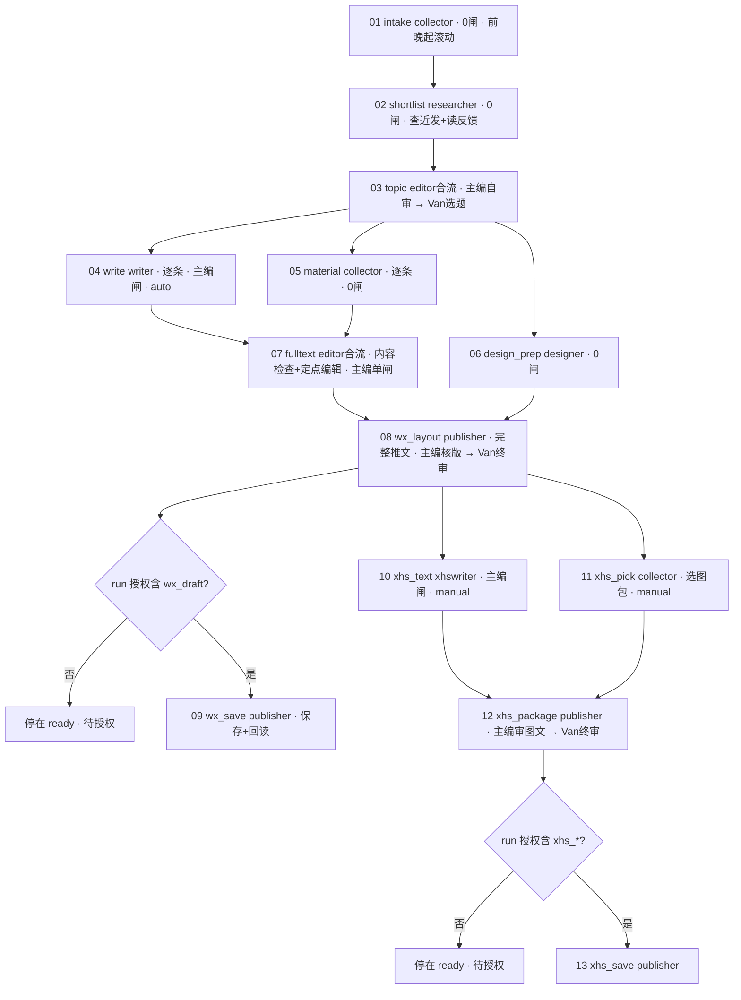

# 新流程改造 · 整体优化方案（对两份 0914 反馈的落地映射）

日期：2026-09-15（第二版，按核对反馈回改）｜对象：开发 / chief / Van｜状态：代码 M0–M8 与 0915 回改（N1–N5）已提交；9/15 晚 review 后已部署生产（`bcbd247`），agent 主机九个 profile 的 skill 已换 3.3.0（§10、§10.6、§10.7）；定义 v3 与时间表见 §2、§8；Van 9/15 已确认审核时段 A 与截止后规则（§9.1）

依据：`docs/给开发_新流程改造执行摘要_20260914.md`（下称「摘要」）、`docs/CSW编辑部_角色与新流程优化方案_v1_20260914.md`（下称「方案」），以及本仓库当前代码与定义的实读（引擎 `internal/engine`、DDL `0001`、seed `0003/0007`、`skill/SKILL.md`、六份 bootstrap、`docs/` 流程三件套）。

回改依据：`docs/给开发_0915改造方案核对反馈.md`（下称「核对反馈」）。三类事项的落点：第一类「待 Van 确认」的两个具体时刻已于 9/15 确认（§9.1）；第二类「纠正」已直接改在 §2、§3.4、§5、§7、§8、§9.2；第三类「口径」补成可执行约定，见 §2.7–§2.11 与 §8.1。核对反馈的四条覆盖性决定（早间审题保留、09:00 稿是已排版的完整推文、小红书首期不派工、首期就要改善选题）已回填全文。

---

## 0. 结论先行

1. **两份反馈约八成落在本仓库的三层**：工作流定义（闸 / DAG / 派工模式）、引擎护栏与事件接续、共享数据（发布记录 / 反馈记忆 / 指标快照）。其余两成（压缩 402、Hermes 会话恢复、模型路由、飞书送达）在各 agent 的运行时环境，本仓库只能提供**取证手段**和**降低对它们的依赖**。
2. **最大的杠杆在定义层，不在引擎代码**。引擎已支持任意 DAG、按阶段覆盖闸、0 闸直通、合流自动派给中枢。「Van 决定从 10 次减到 2 次」「小红书改编不再依赖公众号后台」「配图 / 版式与写作并行」都能靠 **seed 一版新定义** 实现，一行 Go 都不用改。这是 9/15 能切的第一刀。
3. **必须改引擎的只有四件**：授权分级护栏（#63 一类问题的根治）、事件驱动接续（引擎侧播报 / 接单 / 逾期投影）、补件与主编定点编辑、条目级推进。前三件小，一周内；第四件是数据模型变更，两周。
4. **共享数据是一个新子系统**，不是给现有表加列：发布记录自动同步、合集拆条、指标快照、编辑反馈记忆。它的采集适配器（公众号后台 / 小红书创作者后台）可行性未验证，必须先做探针再承诺。
5. **9/15 代码已全部提交，当晚 review 后已部署生产、九个 profile 的 skill 已换 3.3.0**（§10、§10.7）。首期启用目标 9/17（周四），前提是 9/16 完成 notifier 上线、xhswriter 接入、探针、首期发布记录与首批反馈导入（§8.2）。首期不只是跑通流转：**首期就要改善选题**，用过渡方式先把近期发布记录与已有编辑偏好用起来，并从首期记录效果（§2.9）；首期回报附未验证项清单（§8.3），不把单条演练通过当作整套上线证明。
6. **核对反馈改了三处形态**：公众号组版前移到 Van 终审之前（Van 审的是已套模板的完整推文）；小红书只交文案 + 选图包，不做封面卡与内容卡；`write` 改自动派工。这三处都是定义层变更，出 v3 即可，走 §4 的 wfctl 通道（§2.2 差异清单）。
7. **定义层本身可以做成 agent 可操作的通道**。定义是不可变版本、触发即快照、管理面 API 与校验器齐全，所以「让 agent 按用户意愿改流程」不需要新引擎能力，需要的是一个独立的 `csw-workflow` skill + `wfctl` 客户端 + 护栏（§4）。引擎越把规则做成数据，这条通道能改的就越多。

---

## 1. 现状对照：反馈点 → 本仓库现状 → 缺口 → 落点

> #1–#18 是 9/15 上午实施前的对照，保留作为改造依据，各缺口的实施状态见 §10；#19–#21 来自核对反馈，其中现状指已实施的 v2。

| # | 反馈点（摘要/方案） | 本仓库现状 | 缺口 | 落点 |
|---|---|---|---|---|
| 1 | 10 阶段 × 双闸 = 20 道审核、10 次 Van 决定（方案 §2、§4.1） | `0003` 默认闸 `stage_id=NULL` 套所有阶段：editor → van(relayed) | 定义问题，非引擎问题 | **定义 v2** |
| 2 | 07 依赖 06 但内容来自 05；公众号后台故障阻塞小红书（方案 §4.1） | deps `xhs_text → wx_publish`；skill §4.3 靠主编手加上游兜底 | 依赖边选错 | **定义 v2**（`xhs_text → wx_fulltext`） |
| 3 | 04 视觉必须等全文全部通过；素材 / 模板准备不能并行（方案 §4.1） | 线性链 `wx_visual → wx_content` | DAG 形态 | **定义 v2**（并行分支） |
| 4 | 批准一条即可写一条；整期缺口另记（摘要 2、方案 §6.1） | 一 run 一 stage 一 task（`UNIQUE(run_id, stage_code)`）；审核对象是整个 zip | **无条目粒度** | **引擎 P1**：`per_item` 阶段 + `run_items` |
| 5 | 审核绑定对象与版本；研究许可 / 选题 / 全文 / 模板 / 本地验版 / 草稿 / 发布分开（方案 §6.2） | `reviews` 已绑 `(deliverable_id, task_gate_id)`，越版本审核 409 `stale_version`；但无 `decision_type`、无原话来源、无条目范围 | 决定类型与来源 | **引擎 P0**：`reviews` 加 `decision_type / source_quote / items_json / expected_version` |
| 6 | 本地演练 / 后台草稿 / 公开发布是不同授权；上游过了不得自动进后台（摘要 6、方案 §5.1、§6.6） | 无任何授权概念；06/10 就绪后主编可派，发布员可执行 | **护栏缺失** | **引擎 P0**：`run_authorizations` + 阶段 `action_class` + dispatch/submit 双校验 |
| 7 | 「具备派工条件」「已派工」「执行中」不得同一句话；#63 报「执行任务已派出」（方案 §6.4、§6.6） | 引擎已分 `ready / dispatched / in_progress`，但无接单动作，agent 口头映射混乱 | 词汇未统一、无 ack | **引擎 P0** `POST /tasks/:id/ack` + **skill** 状态词汇表 |
| 8 | 交件 / 批准 / 补件形成持久事件，自动触发下游，去重，重启可恢复（方案 §6.3） | `events` 表已是持久时间线；但**通知靠 agent 双写**（skill §5「引擎先、群播报后」），无 outbox、无重试、无兜底唤醒 | 通知不可靠、无接续保证 | **引擎 P0**：`outbox` + notifier；`due_at` 启用 + 逾期投影 |
| 9 | 五分钟播报 ≠ 推进；进度要有对象 / 版本 / 最近产物 / 负责人 / 阻塞 / 下一节点 / 逾期（方案 §6.4） | `GET /runs/:id` 有任务图，无「进度卡」投影 | 投影缺失 | **引擎 P0**：`GET /runs/:id/progress` |
| 10 | 补件（换头尾图）不重跑正文链；主编有限定点编辑权（摘要 4、方案 §5.2、§6.5） | 任何新版本都从第一道闸重走；主编「绝不改稿」写死在 bootstrap / 文档 | 无补件类型、无协作版本 | **引擎 P0**：deliverable `kind=supplement/edit` |
| 11 | publisher 承担组版 / 打包 / 后台操作，chief 只审（摘要 4） | 05/09 合流阶段 `role=editor, is_merge=1`，主编自己合成 | 分工在定义 | **定义 v2**（合流改 publisher）+ **docs** |
| 12 | xhswriter / reviewer / analyst 接入真实任务（摘要 §九角色） | `roles` 只有 7 个 + scheduler；三者在 roster `reserved_bots` | 角色未 seed、无 bootstrap | **seed 0009** + **bootstraps** |
| 13 | 真实发布记录自动同步、合集拆条、覆盖缺口（摘要 5、方案 §7.1–7.3） | 无 | **新子系统** | **数据子系统 D1** |
| 14 | 历史编辑反馈持久积累、按任务检索、图片可回看、临时要求过期（摘要「历史编辑反馈」、方案 §8.1） | 无；只有 `common_instructions` 静态文本 | **新子系统** | **数据子系统 D2** |
| 15 | 双平台指标 1/3/7/30 天快照、原值保留、不擅改（方案 §7.5–7.6、§13） | 无 | **新子系统** | **数据子系统 D3** |
| 16 | 压缩 402、Hermes 会话、模型路由核实（摘要 1、方案 §8.2–8.3） | 不在本仓库 | 运行时 | **仓库外**（§7 给取证与去依赖办法） |
| 17 | 固定数量 / 截止 / 人审窗口 / 时限（摘要 P0-7、方案 §9） | 文档写的是旧默认 5 则 15 图 | 业务约定未定 | **docs《生产约定》** + run `inputs` 固定字段 |
| 18 | 流程的修改与新建希望由 agent 按用户意愿完成（本轮追加） | 定义只能在管理后台由人改；运行面刻意无定义 API（设计 §6）；admin API 与校验器齐全 | agent 用的定义面通道、凭证、变更理由审计 | **skill `csw-workflow`**（§4）+ 服务端小改（`reason` 审计、服务账号、预演） |
| 19 | 09:00 审核稿必须是套用模板、完成实际排版的完整推文；Van 终审要看到实际版式（核对反馈 2.1、3.5） | v2 把组版（08）放在 Van 全文闸（07）之后，Van 审的是正文 + 图片 | 审核对象错 | **定义 v3**：组版前移，Van 闸落在 08（§2.2） |
| 20 | 小红书只交文案 + 对应资讯的选图包，不做封面与内容卡（核对反馈 2.4、3.3） | v2 的 11 `xhs_visual` 是设计师做封面卡 + 内容卡，12 依赖它 | 不做封面会卡住打包 | **定义 v3**：11 改为收集员选图包，依赖 08 |
| 21 | 首期就要改善选题：用上近期发布记录与已有编辑偏好，并记录效果（核对反馈 3.9） | 端点与表已在（M8），任务详情已随附相关反馈；但没有首期数据、没有效果记录字段 | 数据未准备、流程未约定 | **§2.9** 首期选题改善 + §8.2 前置项 |

---

## 2. 目标流程（`daily_news` v3，迁移 0024）

> v2（seed 0009，M1）把 Van 的全文闸放在 07、组版放在 08、小红书视觉做封面卡与内容卡。核对反馈 2.1 / 2.4 / 3.5 要求：Van 终审的对象必须是已套用模板、完成实际图文排版的完整推文；小红书只交文案 + 选图包。因此定义要出 v3，差异见 §2.2 末尾；v3 已经迁移 0024 落地（9/15），部署时随迁移激活——当时生产库尚未部署 v2，9/15 部署时一次迁到 v3，不必在生产上走终端激活；wfctl 用于产出差异表与部署后回读核对，导出的审阅面在 `docs/workflows/daily_news_v3.yaml`。在跑的 run 按各自快照继续。

### 2.1 设计原则

- Van 面对公众号只有**两类日常决定**：选题（03）、已排版的完整推文（08）。小红书接入后加一次：小红书图文包（12），主编先审同版图文，Van 终审；不因选图另加一轮人审。其余闸要么主编单闸，要么 0 闸。
- **09:00 交 Van 的是完整推文**：整篇标题、摘要、封面选图及效果、导语、全部正文与正式配图，已套用 CSW 模板的字体字号、层级、间距、分隔、图注、头尾图。正文 + 图片附件、Markdown 拼成的网页、模板引用或图片 zip 都不算。组版因此前移到 Van 终审之前，08 的产出就是审核对象；保存公众号后台发生在 Van 通过之后。
- 默认闸取消（`workflow_gates.stage_id=NULL` 一行也不留），**每个阶段显式声明自己的闸**。这是当前引擎表达「某阶段 0 闸」的唯一方式。
- 内容依赖与门禁依赖合一：小红书改编与选图都依赖 **Van 批准的完整推文（08）**，不依赖草稿保存（09）；两者按共同交付节点倒排（§8.1）。
- 平台写操作（存草稿 / 发布）单独成阶段并标 `action_class=platform_write`，受 run 授权护栏（§3.2 P0-1）约束。首期授权 `wx_draft`（§9.2），全文通过后引擎自动派 09，发布员保存并回读，不再向 Van 追加同范围授权。
- **已批准工作自行接续**：`write` 改为 `auto`——主编录入 Van 的条目决定时引擎即生成该条目的写作与配图任务并派工，派工单自动预填已批条目与 Van 原话；不再靠主编二次派工。只有小红书两段保持 `manual`，用于首期不派工。

### 2.2 阶段表（v3）

| seq | code | 阶段 | 角色 | 依赖 | 闸 | per_item | 派工 | action_class | 产出 |
|---|---|---|---|---|---|---|---|---|---|
| 1 | `intake` | 01-情报逐条 | collector | 入口 | 0 | —（条目经 `PUT /runs/:id/items` 逐条登记） | auto | read | 轻量情报记录：原文链接 + 原始披露时间 + 一张预览 + 缺口；前晚起滚动 |
| 2 | `shortlist` | 02-价值初筛 | researcher | intake | 0 | — | auto | read | 短名单：采用 / 备选 / 淘汰 + 理由；**每条附近发查重结论与相关编辑反馈对照**（§2.9） |
| 3 | `topic` | 03-选题方案 | editor（merge） | shortlist | editor 自审 → **Van 选题** | — | auto | read | 选题卡五要素 + 整期组合 + 缺量说明四要素（§2.8）+ 效果记录字段（§2.9） |
| 4 | `write` | 04-公众号写作 | writer | topic | editor | ✓ | **auto**（v2 为 manual） | read | 逐条三段正文 + 3 个图位，逐条交主编 |
| 5 | `material` | 05-配图与素材核 | collector | topic | 0 | ✓ | auto | read | 已批条目最终配图 + 来源与使用依据 |
| 6 | `design_prep` | 06-版式与模板准备 | designer | topic | 0 | — | auto | read | 当期模板与头尾图版本引用；可前晚备好，不重新设计 |
| 7 | `fulltext` | 07-内容整合稿 | editor（merge） | write, material | editor（内容检查 + 定点编辑，单闸） | — | auto | read | 整合稿：总标题 / 摘要 / 导读 / 全部正文 / 同版图片。**不是 09:00 审核对象** |
| 8 | `wx_layout` | 08-公众号组版（09:00 完整审核稿） | publisher | fulltext, design_prep | editor 核版 → **Van 全文终审** | — | auto | read | 已套模板的完整推文：OSS 单页 HTML 预览（图文内联）+ 同版 zip + 平台字段清单 |
| 9 | `wx_save` | 09-公众号草稿保存与回读 | publisher | wx_layout | 0 | — | auto | **platform_write:wx_draft** | 草稿 ID + 回读核对（丢图 / 错序 / 样式变化）；修复不改已批内容 |
| 10 | `xhs_text` | 10-小红书改编 | xhswriter | **wx_layout** | editor | — | **manual**（首期不派工，接入后改 auto） | read | 标题 + 导语 + 长文（不是摘要或分页提纲） |
| 11 | `xhs_pick` | 11-小红书选图包 | collector（持有来源记录） | **wx_layout** | 0 | — | **manual**（同上） | read | 按资讯分组的选图包：建议顺序 + 图文对应 + 来源记录；**不做封面与内容卡** |
| 12 | `xhs_package` | 12-小红书图文包 | publisher | xhs_text, xhs_pick | editor 审同版图文 → **Van 终审** | — | auto | read | 文案 + 选图包组成的可查看、可使用文件包 |
| 13 | `xhs_save` | 13-小红书草稿与发布 | publisher | xhs_package | 0 | — | auto | **platform_write:xhs_draft / xhs_publish** | 笔记 ID + 回读；首期与接入首轮不授权，任务停在待授权 |

不进 DAG 主链、按触发接入的两类任务：

- **`review_check`（reviewer）**：由主编在 `topic` 或 `material` 阶段对具体句 / 图发起「专项检查」子任务，结果作为补件挂到受影响交付物；不设整期串行闸。
- **`analyst_*`（analyst）**：不在日更 run 内；由数据子系统按发布事件创建独立 `analytics` 工作流实例。

**v3 与 v2 的差异**（迁移 0024 落地的改动，其他阶段不动）：

| 项 | v2（已归档） | v3（active） |
|---|---|---|
| 07 `fulltext` | 主编定点编辑 → Van 全文 | 主编单闸（内容检查 + 定点编辑）；名称改「内容整合稿」 |
| 08 `wx_layout` | 主编核版单闸；产出「本地成品」 | 主编核版 → **Van 全文终审**；产出即 09:00 完整审核稿 |
| 10 `xhs_text` | 依赖 07；主编 → Van | 依赖 **08**；主编单闸 |
| 11 | `xhs_visual` 设计师封面卡 + 内容卡，依赖 10 | `xhs_pick` 收集员选图包，依赖 **08**，与 10 并行 |
| 12 `xhs_package` | 主编单闸 | 主编审同版图文 → **Van 终审** |
| `write` 派工 | manual | **auto** |
| `xhs_pick` 派工 | — | manual（接入后与 `xhs_text` 一起改 auto，一次定义变更） |
| 阶段文本 | — | 03 加缺量说明四要素与效果记录字段；02 加查重与反馈对照；08 改为完整推文标准；09 加回读核对项；10–12 按 §2.10 接入后要求改写 |

### 2.3 流程图（v3）



### 2.4 与旧十段的映射

| 旧 | 新 | 变化性质 |
|---|---|---|
| 01 采集 → 双闸 → 02 选题 → 双闸 | 01 intake（0 闸）→ 02 shortlist（0 闸）→ 03 topic（Van） | 两次 Van 变一次；研究员前移 |
| 03 全文 → 双闸 | 04 write（主编闸，逐条）→ 07 fulltext（主编整合）→ 08 wx_layout（Van） | Van 只看已排版的整期完整推文 |
| 04 视觉 → 双闸 | 06 design_prep（0 闸）并行 + 版式在 08 组版 | 不再单独走 Van |
| 05 主编合成 → 双闸 | 08 wx_layout（publisher 组版，主编核版） | 主编不再搬运 |
| 06 发布 → 双闸 | 09 wx_save（0 闸 + 授权护栏） | 减纯操作确认 |
| 07 依赖 06 | 10 xhs_text 依赖 08 | 后台故障不阻塞 |
| 08/09/10 | 11 选图包 / 12 图文包（Van）/ 13 | 不做封面卡；发布受独立授权 |

### 2.5 派工模式

阶段级派工模式覆盖已实现（M1，`workflow_stages.dispatch_mode` 可空覆盖列，触发时快照到任务）。v3 取值：`write` **auto**（条目决定即派，见 §2.6）；`xhs_text`、`xhs_pick` **manual**，用于首期不派工；其余 auto。小红书接入时把这两段改 auto，是一次普通的定义变更（wfctl push → activate）。

### 2.6 条目级推进（已实现，M7）

不再需要 v1 时期的「JSON comment 过渡协议」：

- 情报与初筛逐条登记条目（`PUT /runs/:id/items`，`item_key` = 品牌 slug + 短 hash，登记后不变）。
- Van 批准选题时，主编代录 `POST /runs/:id/items/:key/decision {type: approve_write | approve_research | defer | reject, source_quote}`（或在 03 的 Van 闸审核里带 `items_json`，同事务逐条生效）。`approve_write` 即为该条目生成 04 写作与 05 配图任务并（auto）派工；`approve_research` 只开研究，不派写作。
- 07 整合稿等**全部已批条目**的 04 / 05 任务通过后就绪；整期目标 `target_count` 取自 run inputs 的 `目标.主选`，已写成条目不足目标时 run 保持进行中并显示缺口，不阻塞已批条目。
- **追加批准**：同一端点再批一条即可。07 尚未开工则自动补依赖；07 已开工则标「补件待返工」；07 已通过则由主编 `reopen` 07（引擎不回滚已通过的整合稿）。
- 缺口处置：主编按 §2.8 说明；Van 决定接受当期减量后，主编 `POST /runs/:id/close {reason}` 带 Van 原话结束 run。

### 2.7 当期数量：6 主 2 备是可调整的过渡方案

- 首期按 6 条主选、2 条备选运行；不写成永久数量要求。
- 调整须记录原因、新目标、生效范围（单期 / 一周 / 长期），并经 Van 确认；落点是 run inputs 的 `目标` 字段与《生产约定》变更记录。
- 某一期缺量不等于降低长期目标；不为凑数塞入弱题；备选进入正文前须在当期选题批准范围内（备选转主选也是一次条目决定）。

### 2.8 晨间选题缺量：主编在送选题时一并交代四要素

「保留缺口」不足以说明接下来怎样完成。03 选题方案的 `index.md` 固定带「缺量说明」节，缺量时四项都要写，提前发现就提前处理：

| 要素 | 写法 |
|---|---|
| 差多少 | 主选、备选各已有多少合格项，各缺多少 |
| 为什么缺 | 按实际候选逐条归类：当期有价值资讯偏少 / 采集漏项 / 近期已发布 / 审美或内容价值不符 / 证据或图片不足；不写笼统的「素材不足」 |
| 怎样解决 | 具体补查来源或方向、责任人、完成时间、能否在现有窗口与质量要求内补齐；不要求 Van 放宽标准或亲自找题 |
| 补不齐怎么办 | 已查范围、剩余缺口、明确建议（接受减量 / 用备选 / 其他例外），由 Van 决定；未获确认不扩大时间窗口、不降低标准。已批条目继续生产 |

处理后把实际原因与结果写进 run（`close` 的 reason 或 03 补件），供 analyst 汇总改进下一期的采集覆盖、去重与筛选；同一种缺量不能每天重复汇报。

### 2.9 首期就要改善选题（不等第 2–3 周）

Van 的首要诉求是选得更准、少补选、少花审题时间。发布同步与反馈记忆的完整系统按 §8.2 建设，但**首期能用的版本**必须在首期第一次选题前就位；只减少审核节点或加快派工不算选题优化成功。

| 首期必须做到 | 首期用什么 | 谁准备 / 维护 | 何时可用 | 在哪一步实际调用 | 怎么核对 |
|---|---|---|---|---|---|
| 知道近期已发布什么 | CAMPsomeWHERE 公众号 2026-06 起全部已发（含 Van 人工发布，合集拆到具体资讯：品牌 / 产品 / 角度 / 日期 / 链接）+ 小红书已发笔记（9/14 导出样本 42 条）。来源：后台导出 CSV → `syncer import-csv` → 合集 `syncer split --manual` 人工拆条（publisher 拆、analyst 复核） | publisher 每日发布后登记（人工发布同样登记）；analyst 每周核对覆盖范围 | 首期前一个工作日（9/16）导入完成，并报告覆盖范围与缺口 | 02 初筛与 03 选题：`GET /ledger/posts?since=90d&brand=`，每条候选写查重结论；查不到只能写「在已同步记录中未发现」并注明覆盖范围 | 抽查 03 方案里每条候选的查重结论与记录一致；缺失覆盖已列明 |
| 用上已有审美与编辑判断 | 首批有效反馈：0914 两份反馈文档已含的编辑偏好 + 2026-06 起 Van 在编辑部群与所有智能体私聊中的选题 / 审美 / 设计 / 文风反馈，含采用与打回案例和对应图片 | 主编回收整理（chief），analyst 协助导入 `syncer feedback import <jsonl>`；每条含原话、时间、来源会话、上下文、评价对象、图片，`stance` 区分 explicit / inferred，`kind` 区分单次取舍 / 长期要求；agent 自己的总结不冒充原话；读不到的会话或时段列为覆盖缺口 | 9/16 导入首批（至少覆盖本期候选涉及的品牌与品类）；其余在 W2 补齐 | 02 / 03 / 04 任务详情随附相关反馈（`feedback` 字段，按阶段与条目品牌匹配，≤5 条）；研究员看实际图片，主编结合具体变化、CSW 价值与历史意见取舍；不只靠品牌 / 品类 / 热度，也不把一次否决推成永久禁选 | 03 方案每条候选写明引用了哪条反馈；被打回条目对照是否有可用反馈未被引用 |
| 交成熟的选题方案 | 03 验收清单更新：来源与时间核验、图片已看、近发查重结论、具体变化与推荐理由、缺量说明四要素（§2.8） | chief | 随 v3 定义文本生效 | 03 主编自审闸 | Van 审题时不需要现场补做研究；补资料次数计入效果记录 |
| 新反馈及时进入下一轮 | 本期 Van 的选择与否决理由（原话、对象、图片）经主编代录 `source_quote` 自动沉淀为 explicit 记录（M8 hook）；打回原因作 tag。**新要求与纠错在下一次相关任务即用**，周度整理只做归纳与复查（核对反馈 2.5） | 引擎自动；主编每周同一时段归纳 | 已实现 | 下一次相关初筛 / 选题 / 写稿 | 相同原因反复被打回时主编改判断与交接方法，不只记录「已学习」 |

**过渡方式**：首期允许先用共享资料、现有文件或 CSV 导入的简单可检索记录，不等完整自动同步与全部历史回收；团队负责整理、维护与下发，不把重复上传发布链接、整理偏好或手动导出变成 Van 的日常工作。完整自动化按 §8.2 的日期建设，过渡方式不无限期替代。

**从首期开始记录效果**（03 交付物 `index.md` 固定字段 + analyst 每期汇总，首期手工，`ledger_improvement_items` 上线后入库）：

- 首轮主选推荐数、Van 实际采用数；备选另记；按采用比例与实际条数一起判断，不靠少报选题抬高比例。
- 补选轮次；被打回条目及原因分类（已发布 / 审美不符 / 变化不足 / 证据不足 / 其他）。
- 采集启动 → 成熟选题送审的耗时；Van 实际审题用时；可观测的回复等待单列，不算作 Van 在审题。
- 对照：优先用可追溯的旧流程或近期演练记录；没有可靠旧数据就如实说明，从首期建基线，不编造改善比例，不要求 Van 整理历史报表。第一期看即时效果，连续几期判断是否稳定。

**如实报告差距**：若首期只能跑通流转、尚不能证明选题改善，报告里写明差距与最短补齐时间，不称为已满足首期优化目标。

### 2.10 小红书：接入条件与接入后交付

- 首期不纳入：v3 保留支线，`xhs_text` / `xhs_pick` 为 manual 且不派工，`xhs_*` 不授权。开发**并行**准备角色接单能力（xhswriter token、bootstrap）与选图打包路径，不等三个工作日结束；这不等于首期派发小红书任务。
- **「连续 3 个工作日达标」口径由主编写清**，建议至少核对四项，逐日交出结果：① 选题符合已确认口径，并记录 §2.9 的首轮采用、补选与 Van 审题时间；② 09:00 前送达达到质量要求的完整排版审核稿；③ 全文获批后按约定完成草稿箱保存与回读；④ 用户审核等待、系统故障、实际作业耗时分别记录——用户尚未回复不算智能体生产失败，按时提交不合格稿不算达标。第三个达标工作日结束时报告是否满足接入条件与下一期安排，不写「继续观察」。满足条件后按本节推进，只在出现新增阻塞或范围变化时说明，不重复问是否接入。
- **接入后交付要求**：文案（标题、导语、长文，按既有规范）+ 对应资讯的实际选图包（按资讯分组、建议顺序、图文对应、可查看可使用、保留来源）；不做封面，也不以生成内容卡为前提。选图与文案并行，主编先审同版图文，Van 终审一次。
- **共同交付节点**：小红书最终文案 + 选图包与获批后的公众号草稿箱交付同时送达；两者从 Van 批准完整推文的时刻 T 起并行倒排（§8.1）。任一侧未完成时分别报告完成项、缺口与预计补齐时间，不报作双平台交付完成。接入首轮不含小红书后台保存或公开发布。

### 2.11 「批准后继续推进」与主编定点编辑的执行边界

已批准工作自行接续，不因主编忙、通知失败或另一条选题未定而整期停住。时限如下（均已实现，0023；阈值为首期试行值）：

| 环节 | 时限 | 机制 |
|---|---|---|
| 自动派工 | 就绪即派，同一事务 | 引擎 |
| 条目批准 → 写作派工 | 主编录入决定的同一动作内 | `write` auto + 条目决定端点 |
| 逾期扫描 | 每 60 秒一轮 | notifier（`CSW_OVERDUE_SCAN`） |
| 派工后未接单 | 5 分钟提醒执行者并 cc 主编；15 分钟升级主编处置（改派或报失败） | 已实现：阶段级 `ack_minutes`（默认 5），超过 3 倍升级 |
| 接单后无活动 | 写作、整合类 10 分钟；组版、保存类 5 分钟；提醒一次并在进度投影标注 | 已实现：阶段级 `idle_minutes`（默认 10） |
| 阶段时限到期 | 逾期事件 + 群提醒一次 | 已实现（`sla_minutes` → `due_at`） |
| agent 重启 / 压缩后 | `my-tasks` 拉回全部 open 任务；引擎不重派 | skill §3 |

30 分钟兜底扫描只是兜底，不替代上表的正常接续；Van 不需要催。

主编定点编辑：只用于反复未解决的具体问题，在 07 的主编闸上提交 `edit` 版本（带 `edit_of` 与 diff，首稿保留，预算约 10 分钟）。**编辑后仍要走 08 组版与主编核版**，检查最终全文与图文一致性后才送 Van；「直接进入 Van 审核」不是跳过最后检查。反复返工时改变处理方式或交代实际证据缺口，不按同一种方式无限退回。

---

## 3. 引擎改造清单

### 3.1 零代码：定义层（今天可做）

| 项 | 做法 | 验证 |
|---|---|---|
| seed `0009_daily_news_v2.sql` | 新增 `workflows(wf_key='daily_news', version=2)`，13 阶段 + 依赖边 + 逐阶段闸；旧 v1 `archived` | `adminctl workflow validate daily_news`；`go test ./internal/workflow/` |
| 或后台操作 | 管理后台 clone v1 → 编辑器改 → activate（前端 `runChecks` + 后端校验） | 同上；但 seed 可回放，优先 seed |
| 阶段文本 | `instructions / self_check_criteria / acceptance` 按 §6 文档联动改写；**不要**把方案全文粘进去（方案 §8.1 末段） | 触发一个 run，`task <id>` 读到新文本 |

状态：seed 0009（v2）已提交（M1）；v3 经迁移 0024 落地（差异清单见 §2.2），wfctl 用于审阅与部署后核对；在跑的 run 不受影响（触发即快照）。**注意**：`resolveGates` 语义要求不设默认闸，否则 0 闸阶段表达不出来。

### 3.2 P0（本周）：护栏、状态、事件、补件、角色

**P0-1 授权分级护栏（对应摘要 6、方案 §6.6、P0-2）**

- 表 `run_authorizations(run_id, scope, granted_by, source_quote, granted_at, expires_at, revoked_at)`；`scope ∈ {local_drill, wx_draft, wx_publish, xhs_draft, xhs_publish}`。
- 列 `workflow_stages.action_class`（快照到 `tasks.action_class`），值 `read | platform_write:<scope>`。
- 规则：`dispatchInternal` 与 `Submit` 对 `platform_write:*` 任务检查 run 当前有效授权；无则 dispatch 返回 409 `authorization_required`，任务停在 `ready`，进度投影显示「待授权：wx_draft」。**自动派工也受此约束**。
- 端点：`POST /runs/:id/authorizations`（仅中枢，须带 `source_quote`，即 Van 原话）、`DELETE …/:scope`。
- 验收（方案 §11）：「仅本地演练，上游审核通过 → 后台保存与发布不执行；报告不把解锁写成已派工」。

**P0-2 接单与状态词汇（方案 §6.4）**

- `POST /tasks/:id/ack` → `dispatched → in_progress`，记 `started_at`（已实现 M2）。无活动与未接单按 §2.11 的阶段级阈值判定并提醒：写作、整合类 10 分钟、组版、保存类 5 分钟无活动；派工后 5 分钟未接单提醒、15 分钟升级主编。已参数化（0023）。
- 新增状态 `failed`（agent 报告不可完成，附原因）与 `cancelled`（中枢取消）；`POST /tasks/:id/fail`、`POST /tasks/:id/cancel`。
- 统一词汇（写进 skill、作业手册、后台 UI）：`ready`=具备派工条件 · `dispatched`=已正式派工 · `in_progress`=执行者已接单 · `review`=等待某闸 · `returned`=需返工 · `passed`=已交付。

**P0-3 事件驱动接续：outbox + notifier（方案 §6.3，P0-4）**

- 表 `outbox(id, event_id UNIQUE, channel, target_role, payload_json, attempts, next_at, sent_at, last_error)`。
- 引擎在同一事务内为 `task_ready / dispatched / submitted / gate_passed / gate_returned / supplement_arrived / authorization_required / overdue` 写 outbox 行。
- `cmd/notifier`（或 server 内 goroutine）轮询 outbox，用 `chats/chat_members` 花名册组装真 at-tag，经 lark 发送；指数退避重试；`event_id` 唯一保证**同一事件只发一次**。
- **群播报从「agent 双写」改为「引擎单写」**：skill §5 的五类模板搬到 notifier；agent 只保留「引擎调用」，不再自己发群消息。这直接消除「口头说已 @、实际没 @」和「群提醒失败就重做」两类故障。
- `tasks.due_at` 启用：派工时按阶段 `sla_minutes` 写入；notifier 定时扫描逾期 → `overdue` 事件 → 提醒一次，不刷屏。
- 逾期扫描每 60 秒一轮（已实现 M4）；agent 侧「30 分钟 cron 扫 my-tasks」只作兜底，不替代 §2.11 的正常接续。
- 验收：「提交成功但群提醒失败 → 产物仍在审核队列，提醒重试，不重复写稿」「同一交付通知重复到达 → 只产生一次有效审核和一次派工」。

**P0-4 进度投影（方案 §6.4）**

- `GET /runs/:id/progress` 返回每个任务：当前对象与版本、最近产物及时间、负责人、真正阻塞项（缺依赖 / 待授权 / 待闸 / 逾期）、下一节点、整期目标与缺口。
- notifier 只在状态变化时发进度卡；`content-calendar.md` 若保留，由此投影导出。

**P0-5 补件与主编定点编辑（摘要 4、方案 §5.2、§6.5）**

- `deliverables.kind ∈ {dispatch, output, supplement, edit}`（替代 `is_dispatch` 布尔，兼容读）。
- **supplement**：可挂到 `passed` 任务，必带 `affects_deliverable_id`；引擎写 `supplement_arrived` 事件，把**直接下游中尚未 passed 的组版类任务**（`wx_layout / xhs_package`）标 `rework_pending`，不触碰上游批准。已 passed 的下游需主编显式「重开」。
- **edit**：中枢角色可对处于 `review` 且当前闸为自己的任务提交 `kind=edit` 版本，必带 `edit_of=<version>` 与 diff 摘要；`producer_id=editor`、`collab=1`。首稿版本保留不动；后续闸审的是 edit 版本。验收留存「首稿 / 协作稿 / 终审稿」三份。
- 验收：「正文批准后替换头尾图 → 不要求重写已批正文；成品引用正确新资产且保留版本」。

**P0-6 审核记录扩展（方案 §6.2）**

- `reviews` 加 `decision_type`（`research_ok / topic_approve / fulltext_approve / template_approve / local_verify / draft_save_ok / publish_ok`）、`source_quote`（Van 原话）、`items_json`（条目范围）、`expected_version`（与当前版本不符则 409，把现有 `stale_version` 语义显式化）。

**P0-7 角色 seed 与 bootstrap**

- `0009` 补 `roles/agents`：`xhswriter 小红书图文作者`、`reviewer 合规版权审查员`、`analyst 数据复盘师`；`chat_members` 把三条 `reserved` 转 `mapped`（open_id 已在 `roster.json`）。
- `skill/bootstraps/{xhswriter,reviewer,analyst}.md` 新增；`editor.md` 去掉「绝不亲自编辑内容」，改为「定点编辑权 + 预算 + 留痕」；`publisher.md` 扩为交付执行负责人。

**P0-8 阶段级派工模式覆盖**（§2.5 方案一，改动极小）。

### 3.3 P1：条目级推进（摘要 2、方案 §6.1；已实现 M7，用法见 §2.6）

- 表 `run_items(id, run_id, item_key, title, brand, product, source_url, published_at, status, decided_by, decided_at, decision_source)`；`status ∈ {candidate, shortlisted, approved_write, approved_research, deferred, rejected, written, reviewed, published}`。
- `runs.target_count`（从 `inputs` 固定字段取）；整期完成 = `approved_write` 且 `passed` 的条目数 ≥ 目标；不足只影响 run 是否 `done`，不回滚任何条目。
- `workflow_stages.per_item=1` 的阶段：上游（`topic`）某条目变 `approved_write` 时，引擎为该条目**动态生成**一个 task（`tasks` 唯一约束改 `(run_id, stage_code, item_key)`，`item_key` 对非 per_item 阶段为空串）。`fulltext` 合流依赖「所有已批条目的 write 任务 passed」而非「write 阶段 passed」，`recomputeReady` 需按条目集合判定。
- 条目决定端点：`POST /runs/:id/items/:key/decision {type, source_quote}`；「继续研究」只开 `approved_research`，不派写作；「保留」类模糊措辞由主编问一次范围后录入。
- 验收：「已批准 HxO 但整期数量不足 → 该条可写，整期仍显示数量缺口；不重复询问是否保留」「只批准继续研究 → 不误派正式文案」。

### 3.4 数据子系统（表、CLI 与端点已实现 M8；探针 9/16、同步 W2、快照 W3、闭环 W4，日期见 §8.2）

三块共用一个新包 `internal/ledger`，独立表、独立 CLI `cmd/syncer`，运行面只读端点供 agent 检索，后台页面只读。

**D1 真实发布记录（摘要 5、方案 §7.1–7.3、§13）**

- `published_posts(platform, account, post_id UNIQUE, url, published_at, title, body_ref, template_ver, source ∈ {agent, manual, sync}, state ∈ {drill, draft, published}, run_id?, first_seen_at)`。
- `published_post_items(post_id, item_key?, brand, product, angle, source_url)`：合集拆条，首版由 syncer 按公众号正文小节切分 + 人工校对一次。
- `sync_runs(platform, started_at, finished_at, window_from, window_to, ok, gap_note)`；查询接口必须回「在已同步记录中未发现」而不是「从未发布」。
- **适配器可行性是第一步，不是假设**：公众号先探 mp-helper 现有能力能否读到人工发布列表与单篇明细；小红书先探创作者后台已登录读取。探针结论写进变更记录，读不到的字段标「不可得」。
- 运行面：`GET /ledger/posts?since=30d&brand=`，供 researcher / chief 在 `shortlist / topic` 查重。

**D2 编辑反馈记忆（摘要「历史编辑反馈」、方案 §3.4–3.5、§8.1）**

- `feedback_records(id, quote, said_at, source_ref, object_ref, object_version, image_refs_json, kind ∈ {long_term, case, temporary, recent}, stance ∈ {explicit, inferred}, status ∈ {active, superseded, expired}, supersedes_id?, tags_json, curated_by)`。
- 录入三路：历史回收——范围是 2026-06 起 Van 在 CSW 编辑部群的聊天与 Van 和**所有**智能体的私聊（不限主编），提取选题、审美、设计、文风反馈，保留相关回复、线程与上下文；每条存 Van 原话、时间、来源会话、上下文、评价对象、图片；`stance` 区分 explicit / inferred，`kind` 区分单次取舍 / 长期要求 / 临时；智能体自己的总结不冒充原话；读不到的会话或时段列为覆盖缺口，不误报完整回收。今后从 `reviews.source_quote` 自动生成 `explicit` 记录（已实现）。模型推测单独 `inferred`，不得覆盖 `explicit`。
- **生效节奏**：Van 明确的新要求与纠错在下一次相关任务即用（任务详情随附）；周度整理只做归纳与复查，不是延迟执行的理由。下一次相关选题、选图、写稿要实际调用并在交付物里写明引用了哪条，不能只报「已入库」。
- 运行面：`GET /memory/feedback?tags=brand:nanga,kind:case`，返回原话 + 图片可回看链接；派工单 `upstreams` 自动附本任务相关记录（按品牌 / 品类 / 阶段 tag），不灌全量。
- 过期：`temporary` 带 `expires_at`；`expired` 不再下发。验收要测一次压缩 / 重启后仍能读到，以及过期条目不再出现。

**D3 指标快照与运营闭环（方案 §7.4–7.10、§13）**

- `metrics_snapshots(post_id, platform, age_bucket ∈ {2h, 24h, 72h, 7d, 30d}, collected_at, window_from, window_to, raw_json)`：**只存原值与平台定义**，派生指标查询时算。异常原值原样保留，标记分四类，不未经核查就归因于刷新：`refresh_pending`（如观看 > 0 而曝光 = 0，平台可能尚未刷新）、`definition_pending`（如净涨粉 340 与新增 394 − 取消 58 的差值，口径待核）、`fetch_failed`（采集失败，可重试）、`unavailable`（平台不提供）。已实现（标记改名、缺口分类、指标定义入库，0025，§10.6）。
- **两层数据**：账号级趋势（`ledger_account_snapshots`）与单篇快照分别保留时间区间与指标定义；不把单篇相加冒充账号去重数据。获取方式与刷新频率由开发验证（探针 9/16）；不把逐篇手动导出变成 Van 的日常职责。
- `improvement_items(id, finding, evidence_ref, hypothesis, owner_role, content_version, due_at, recheck_at, metric, status ∈ {proposed, adopted, executed, supported, unsupported, insufficient, withdrawn})`；同时进行中 ≤ 2。
- analyst 的动作走现有引擎：`improvement_items.adopted` 后由主编触发一个 `improvement` 工作流实例派给对应岗位，复查时回写状态。**只交报表不算闭环**。

---

## 4. 定义面通道：让 agent 按用户意愿改流程（`csw-workflow` skill）

> 提问：流程引擎的修改和新建能否也做成 skill，让 agent 按用户意愿改，以获得更大灵活度。结论：可以，而且现有架构已具备大部分前提；要补的是一条面向 agent 的**定义面通道**加护栏，不是新的引擎能力。

状态：阶段一（wfctl、YAML、`reason` 审计、`csw-workflow` skill）已实现（M6）；v3 的差异表与导出核对用它完成（定义本身经迁移 0024 落地）。阶段二、三不是首期必需，排在 §8.2 的 W4 之后，不挤占选题改善与主线修复。

### 4.1 为什么可行

引擎把定义与实例分开：定义是不可变版本（`UNIQUE(wf_key, version)`），激活归档旧版，触发即快照，在跑实例不受后改影响。管理后台 API 已有 create / put / validate / activate / archive / clone 全套，校验器 `internal/workflow` 已在。运行面刻意没有定义 API（设计文档 §6），这个约束保留：agent 改定义走管理面，用管理面凭证。

### 4.2 一个原则

skill 能改的是定义层能表达的东西：阶段、依赖、闸、角色、派工模式、三段文本，以及本方案新增的 `action_class / per_item / sla_minutes / dispatch_mode` 覆盖。引擎语义的变更仍是开发工作。因此 §3 每把一条规则做成数据，skill 的灵活度就多一分，两条线是同一个方向。

### 4.3 形态：独立 skill + `wfctl` 客户端 + YAML 定义文件

与 `csw-task` 分开：`csw-task` 是 agent 在运行面干活，`csw-workflow` 是操作员或主编在管理面改定义，凭证与受众不同。

- **定义即文件**：一个工作流 = 一份 YAML（meta / stages / deps / gates / texts），与 `PUT /admin/workflows/:id` body 一一对应。agent 改 YAML，不拼 HTTP。导出的 YAML 进仓库 `docs/workflows/<key>_v<n>.yaml` 并提交：DB 是运行权威，git 是审阅面与历史。seed 迁移只用于首次引导，不再为改文本写 0006 / 0007 这类迁移。
- **`cmd/wfctl`**（Go，复用 `internal/workflow` 校验器，走 adminsrv HTTP）：

| 命令 | 作用 |
|---|---|
| `export <key>` | 导出当前 active 版为 YAML |
| `diff <file>` | 本地 YAML 与 active 版对比，输出阶段 / 依赖 / 闸 / 文本四类变更表 |
| `lint <file>` | 本地校验 = 服务端 Validate + §4.4 附加规则 |
| `push <file> --draft --reason "…"` | clone active → put → 得到新草案版本 |
| `validate <key>@<ver>` | 服务端校验 |
| `activate <key>@<ver> --reason "…"` | 激活并归档旧版；必须人确认 |
| `history <key>` / `rollback <key>@<ver>` | 版本表 / 回到旧版（clone 后激活） |
| `roles` / `agents` / `roster` 子命令 | 角色、agent、通讯录成员的增改；**不含** token 签发（明文只显示一次，留给后台） |

- **SKILL.md 定义「意图 → 改动」的固定流程**：把用户的话复述成操作清单（加 / 删阶段、改依赖、改闸、改角色、改文本、改模式）→ 改 YAML → 输出变更对照表 + DAG 文字图 + 影响范围（在跑 run 不受影响、下次触发生效）→ 用户确认 → `push --draft` → `validate` → 只有人明确说「激活」才 `activate`，用户原话写进 `--reason` 落审计。

一次典型交互：用户说「小红书文本改成依赖完整审核稿，视觉不再走 Van」。agent 回一张表：两条依赖边变更、两个阶段的闸从两道变一道、影响范围。确认后建 v3 草案、校验通过、等待激活指令。

### 4.4 护栏

- **两步走**：草案与校验可自主，激活必须人确认。将来若让群里的主编 bot 承接，它只能建草案，激活在后台由人做。
- **只认 Van 与操作员**：来自群的改流程请求必须匹配花名册中 `is_human` 成员，其他人的话不构成定义变更。这是防群消息注入。
- **lint 附加规则**：无默认闸时每个阶段必须显式声明闸（`resolveGates` 表达不了「覆盖为空」）；`platform_write` 阶段必须带 `action_class`；角色无活跃 agent 时警告；被删阶段在活跃 run 中有开放任务时警告；中枢角色必须是管理类。
- **文本段不灌全文**：instructions / acceptance 只引用规范条款，禁止整篇贴方案文档（方案 §8.1）。
- **可回滚**：任何激活都能 `rollback` 到上一版。

### 4.5 服务端需要补的能力

| 项 | 内容 | 批次 |
|---|---|---|
| 管理面凭证 | 第一阶段 wfctl 走账号密码登录换 JWT（凭证在操作员环境变量）；第二阶段加服务账号 token（argon2id 存储，`operator` 角色）供自动化 bot | W1 / W2 |
| `reason` 审计 | put / activate / archive 接受变更理由，写入 `admin_audit`；这是反馈要求的「修改前后条款对照」落点 | W1 |
| 预演端点 | `POST /admin/workflows/:id/preview-run` 返回触发后会快照出的任务图与闸，不落库 | W2 |
| 文本同步 | `wfctl sync-text --from docs/` 从作业手册与验收标准对应小节转录三段文本；diff 时提示文档与定义分歧 | W2–W3 |

### 4.6 分阶段

| 阶段 | 内容 | 谁能用 |
|---|---|---|
| 一（1–2 天） | SKILL.md、YAML 格式、wfctl 八个命令、`reason` 审计；无其他服务端改动 | 开发或 Van 在 Claude Code 里 |
| 二（一周） | 服务账号 token、lint 扩到 v2 新字段、预演端点、文本同步 | 同上，可脚本化 |
| 三（视需要） | 主编 bot 接 Van 群里的改流程请求，只建草案；notifier 播报「v3 草案待激活」 | 编辑部群内 |

第一阶段一旦可用，§3.1 的「seed 0009」可以改为「`wfctl push` + `activate` + 导出 YAML 进仓库」，两条路都保留，seed 用于全新环境引导。

### 4.7 已决定

- 第一阶段凭证用操作员账号登录（env `CSW_ADMIN_URL / USER / PASSWORD`，不落盘）；服务账号放阶段二。
- skill 不含签发 agent token，留给后台。
- YAML 进仓库 `docs/workflows/` 作为正式审阅面（已导出 `daily_news_v2.yaml`）。

---

## 5. skill 与 bootstrap 联动

| 改动 | 内容 |
|---|---|
| §3 worker 循环 | 步骤 2 前加 `ack`；处理 `supplement` 与 `rework_pending`；`failed` 上报方式；状态词汇表 |
| §4 主编编排 | 去掉「绝不编辑」；加 `edit` 提交 recipe（预算 10 分钟、留 diff）；`authorizations` 录入 recipe（必带 Van 原话）；条目决定 recipe；「Van 转审」改为 Van 只在 `topic / wx_layout / xhs_package` 三处出现（v3；skill v3.2.0 仍写 07，随 v3 激活同步） |
| §4.3 特殊点 | 删除「派 07 手加 05 上游」（v2 依赖已修）；删除「05/09 合成是你的自产任务」（归 publisher）；保留合流阶段 `topic / fulltext` 的合成 recipe |
| §5 群协议 | **流转播报**（派工、待审、退回、通过、待授权、补件、失败、逾期）由 notifier 单写，agent 不手动转述流转状态，避免「#63 已派出」一类误报；`target_role=van` 只在 Van 闸事件（v3：03 / 08 / 12）。**正常沟通不禁用**：主编答疑、解释编辑判断、主动报告关键故障、授权缺口与交付风险照常在群里说；执行者对派工单的疑问也照常问 |
| §6 幂等键 | 加 `ack-{task_id}-{dispatch_version}`、`auth-{run_id}-{scope}-{quote sha16}`、`decision-{run_id}-{item}-{type}-{quote sha16}`、`supplement-{deliverable_id}-{zip sha16}` |
| §7 错误码 | 加 `authorization_required`、`not_per_item`、`rework_pending` |
| bootstraps | 新增 xhswriter / reviewer / analyst；改 editor / publisher / designer（模板复用与生成任务分开）/ researcher（前移到 shortlist）/ collector（逐条 intake、只为短名单补图）|

---

## 6. 文档联动（`docs/`）

| 文档 | 处理 |
|---|---|
| `资讯日更_全流程.md` | 已重写为 v3（M5，按 v2 定义）；v3 定义激活后再改：Van 在 03 / 08 / 12，组版前移，小红书选图包，阶段表由生成器重出 |
| `资讯日更_交付与流转规范.md` | §7 双闸改为「按阶段声明的闸」；§8 按新阶段重排；新增 supplement / edit 两种交付物形态；九字段头加 `条目` 字段 |
| `资讯日更_验收标准.md` | 已按十三阶段重排（M5）；v3 后：08 承接完整推文的全文标准（内容 + 版式一起验），07 只验整合与一致性，03 加缺量说明四要素与效果记录字段，02 加查重与反馈引用 |
| `作业手册_*.md` ×6 | 逐份改：主编（定点编辑权、授权录入、条目决定）、收集员（逐条 intake、只为短名单补图、披露时间与转载时间分开）、研究员（前移、看图、查近发、总分不压明确否决）、文案（专注公众号、逐条交、字数口径统一）、设计师（模板资产版本、原图排版不重生成）、发布员（交付执行负责人、保存前查询既有草稿）|
| 新增 `作业手册_小红书图文作者.md` / `作业手册_合规审查员.md` / `作业手册_数据复盘师.md` | 按方案 §5.8–5.10 |
| `资讯日更_生产约定.md`（已起草，本次回改后需同步，见 §10.5） | §2 数量改为可调整过渡方案；§3 删「替代排程」、按 §8.1 重排（组版前移、T+20 保存回读）；§4 Van 三处改为 03 / 08 / 12；§5 时限按 §9.2；§6 首期 `local_drill` + `wx_draft` 开；§7 预览须为套用模板的完整推文。run `inputs` 固定字段与之一一对应 |
| `任务流转服务_设计.md` | §3 DDL 追加 `run_authorizations / run_items / outbox / reviews 新列 / deliverables.kind`；§5 状态机加 `in_progress / failed / cancelled / rework_pending`；§10 开放问题 4（内容上游 vs 门禁）改「已定：依赖边直接指内容源」 |
| `CLAUDE.md` | 第一部分「核心架构」与「交付物协议」同步 v3；第二部分「引擎要点」加授权护栏与 outbox |

---

## 7. 仓库外事项：取证办法与去依赖

**#63 专项核查（摘要 6、方案 §6.6）** 不需要看群聊，引擎 `events` 已经是权威时间线。开发今天就能回放：

```sql
SELECT e.id, e.created_at, e.type, e.actor_id, a.role_code, e.task_id, e.deliverable_id, e.detail_json
FROM events e LEFT JOIN agents a ON a.id = e.actor_id
WHERE e.run_id = (SELECT run_id FROM tasks WHERE id = 63)
  AND e.created_at BETWEEN '2026-09-14T07:00:00Z' AND '2026-09-14T07:40:00Z'
ORDER BY e.id;
```

判读规则：#63 只有 `task_ready` 无 `dispatched` → 是「解锁被报成派出」，改 skill 词汇即可；有 `dispatched` 且 actor 为 editor → 是主编真派了，P0-1 护栏解决；再有 `submitted` → 发布员真执行了，要查 mp-helper 侧是否落了草稿。建议顺手加 `adminctl run replay <run_id> [--task <id>]` 把这条查询固化。

> **回放结果（2026-09-15 对生产库 `/opt/csw-task/data/csw-task.db` 只读查询）**
>
> - 本引擎的任务 #63 属于 6 月的 run 7（03-公众号内容，`blocked`），交付物 #63 是 6 月 run 3 的一张派工单。两者在 9/14 都没有任何事件。
> - 本引擎**最后一条事件是 2026-09-12T02:07Z**（run 40 · 01-采集第三次退回）。9/13、9/14 没有触发过 run，也没有任何派工 / 提交 / 审核写操作。9/14 的 HxO 单条演练、#62 审核、15:24 的「#63 执行任务已派出」、设计师补件、主编 15:33 收尾，**没有一步写进这个引擎**。
> - agent 当天确实碰过生产引擎：token 最近使用时间为 writer 13:42、editor 13:53、designer 14:18（北京时间）。经 §7.1 主机取证，这是各角色**误用生产凭证访问**后被纠正的只读调用（content-calendar 原话：「初次误读环境生产 BASE 只读无写，已纠正至 18082 既有隔离凭据」）。
> - 结论：反馈里的「r12 / #63」是 agent 主机上一套**隔离引擎实例**的编号（见 §7.1），不是生产引擎的 run / task id。原先「D0 前置问题：agent 为什么没有走引擎」已有答案：他们走了引擎，只是不是生产那台。
> - 顺带发现：自 6 月以来的 40 个 run **全部仍是 `active`**，没有一个跑到 `done`；9 月最远只到 06-公众号发布（run 38、39），run 39 一天里退回 12 次；run 40（9/12）在 01-采集被退回三次后停住；run 36 与 37 同一天（09-09）触发了两次。这些是「反复退回没有形成改进」「同日重复开 run」「run 永不收口」的引擎侧证据，也说明 P0-2 的 `failed / cancelled` 状态和 run 收口规则不是锦上添花。

### 7.1 agent 主机取证结果（2026-09-15，ssh 8.138.23.218 只读）

**一、9/13–9/14 的演练跑在主编自建的隔离引擎上，生产引擎被冻结。**

- Van 在 9/12 统一口径「当前仅核查 + 方案，不恢复生产、不覆盖流程、不正式发布」。chief 据此在 `/root/csw-fastline-rehearsal/remediation-20260913/technical/` 拷贝了本仓库 `csw-task-svc` 源码（版本早于通讯录提交，无 `handlers_roster.go`），打上一个幂等补丁后编译成 `fix/server`，起了两个运行面进程（127.0.0.1:18082 与 :18083，共用 `fix/test.db`）加两个后台进程（:18081、:18085），另有原版二进制在 :18080（`data/csw-task.db`）。
- 隔离库里有自己的 8 个 agent（含 reviewer）、独立 token（`credentials/*.token`，publisher / reviewer 的 token 最后使用停在 9/13），以及 5 个工作流定义：`daily_news` v1、`remediation_fastline`、`unified_readiness_20260913`（r12 用的这个：6 阶段，闸按阶段覆盖——01 主编单闸、02/03/06 主编 + Van、04/05 主编单闸）、`unified_rights_20260913`、`unified_parallel_prep_20260913`。**这证明「按阶段声明闸、Van 只审两处」在现有引擎上已经被 agent 自己配出来跑通了一次**，§3.1「零代码：定义层」的判断成立。
- 九个 profile 的 `.env` 仍指向生产 `https://tasks.aworld.ltd`，各自 token 互不相同；主编的编排脚本 `unified-readiness/runtime_dispatch.py` 硬编码 `http://127.0.0.1:18082` + 隔离 editor token，worker 靠群消息被告知去读隔离 token 文件。**xhswriter / reviewer / analyst 三个 profile 的 `.env` 没有任何引擎地址与 token**；researcher 的 `csw-task` skill 自 6/17 起被归档，没有装回。

**二、#63「执行任务已派出」的机制已坐实，属于「解锁被报成派出」。**

- 隔离库 r12：#62（05-公众号成品）v2 于 15:22:20 过主编单闸 → 事件 175 `stage_passed` → 事件 176 `task_ready`（#63）。此后 #63 **没有 `dispatched` 事件、没有交付物，状态至今是 `ready`**。
- 五分钟播报由 `profiles/chief/scripts/r12_progress5.py` 生成（cron 任务 `bbf10d6d95d4`，无 LLM，直接 GET run 12 与 timeline）。它取第一个状态不是 passed / blocked 的任务当「当前任务」，状态文案只分三档：`review` → 等待审核，`returned` → 阻塞/退回，**其余一律「执行任务已派出；实际作业以新增记录为准」**。15:24 那一轮 #63 恰好是 `ready`，于是落入第三档。台账 `progress5/r12p5-202609141524.json` 保存了原文。
- 15:29 Van 验版通过后主编写 STOP、job 置 paused；#63 始终未派，无任何后台保存或发布动作。摘要第 6 条「先核事实」可以结案：**是报告映射错误，不是越权执行**。修法就是方案 P0-2 的状态词汇表；隔离环境这类自制播报脚本一并废止，改用 P0-4 的引擎进度投影。

**三、压缩 402 的调用链。**

- chief 的日志 9/13–9/14 有 173 次 402，全部来自 `agent.context_compressor: Failed to generate context summary: Error code 402 Insufficient Balance`，即 Hermes 的**上下文压缩摘要（辅助调用）**。其他五个 profile 各 1–5 次，同源。
- 路由：主模型 `gpt-6-astra`、provider `custom:sub2api`、`base_url https://csw-subapi.833233.xyz/v1`；`compression.provider: auto` 没有单独指定，落到同一个 sub2api 账户，该账户余额不足。主调用本身在同一时段成功（日志有正常 `API call #N` 记录）。
- 处置：给 sub2api 账户充值或把 `compression` / `auxiliary` 的 provider 指到有余额的通道，并按方案 §8.3 验证一次压缩前后审批与任务不丢。这是账户与配置问题，不是引擎问题。

**四、skill 已在九个 profile 里分叉。**

- 仓库 `skill/SKILL.md` 219 行；chief 的副本 80 KB / 273 行，带三个子技能（`csw-daily-news-fastline`、`csw-editor-review-operations`、`csw-knowledge-base-workflows`）和 24 份 references，9/13–9/14 被 agent 与 Hermes curator 反复 patch（`.curator_ledger.jsonl` 有记录）。deepwriter / designer / publisher 是 6/19 的 201–213 行版本，collector 是 7/22 的 295 行版本。
- 这意味着「新任务读到新版本」目前无法保证，也解释了为什么各角色对同一流程的理解不一致。§4 的 `csw-workflow` 之外，还需要一条 **skill 只读分发 + 版本校验**通道：bootstrap 与 SKILL.md 从仓库分发、profile 内禁止 curator 改写 `csw-task`，`task <id>` 返回里带 skill 期望版本供 agent 自检。

**五、agent 自己给引擎打的补丁值得上游化（经审查）。**

- `fix/code.diff` 重写了 `middleware/idempotency.go`：原实现是「查缓存 → 执行 → 写缓存」的 check-then-act，12 个并发客户端带同一 `Idempotency-Key` 触发时真的产生了 2 个 run。补丁改为**先持久占位**（`INSERT … ON CONFLICT DO NOTHING` 判 RowsAffected）、指纹绑定 agent + 方法 + 路由 + RequestURI + Content-Type + body SHA、完成后 CAS 写回、失败一律 409/503 不放行，并把 SQLite `synchronous` 从 NORMAL 改为 FULL。附带回归测试与三轮 12 客户端并发验证。
- 代价（result.md 自述）：旧缓存条目一律 409 `idempotency_legacy_uncertain`，需迁移；multipart 重试必须复用同一 boundary；pending 永不过期，需要人工核销工具。
- **已审阅并合并进仓库（2026-09-15）**，三处与补丁不同：① 业务非 2xx 时释放占位（引擎在事务内回滚、无副作用），否则一次 `cannot_submit` 就把该键永久锁死；② multipart 按各 part 内容归一后做指纹，curl 重试换 boundary 仍能回放；③ 旧记录按原语义回放（只缓存过 2xx），不需要迁移。`synchronous` 保持 NORMAL（WAL 下进程崩溃不丢已提交事务，且占位与业务事务顺序不可能倒置），故障注入文件未并入。新增 7 个用例覆盖并发、指纹、释放、旧记录、pending、存储不可用、multipart。
- 源码来源已核实：主机 `/root/csw-fastline-rehearsal/isolated-source/`（9/12 14:45）与 `deployed-version-test/` 都是本仓库的 git 检出，`origin = https://github.com/azure1489/csw-agent-team.git`，分别停在 `d0ec19f` 与 `b1ae9e7`，各自还带一份未提交的 `adminsrv/fastline_test.go`。chief 的 `bootstrap.py` 把 `deployed-version-test/csw-task/csw-task-svc` 拷到 `technical/svc` 后本机 Go 编译。也就是说 agent 主机能直接 clone 本仓库（chief profile 9/11 起开了 `allow-git`），并具备构建、改动、运行引擎副本的能力，这一点要纳入 §4 的护栏：agent 不得自行构建并运行引擎副本。

**六、其余观察。**

- 隔离环境 4 个引擎进程仍在运行，未停；建议归档 `technical/` 后由开发决定何时停掉，不要只凭端口 kill（result.md 自己也这么写）。
- 主机上 `/root/content-calendar.md` 是 agent 侧的排期与状态权威，与引擎、profile 记忆形成三套状态，正是方案 §6.4 要消除的东西。
- Hermes 自带的 `kanban.db` 与本次无关，为空。

**压缩 402 / Hermes 会话 / 模型路由（摘要 1、方案 §8.2–8.3）**：在各 agent 运行环境，本仓库无法修。根因已在 §7.1 第三条查明。本方案的去依赖动作是：关键决定与产物都在引擎（已是）；outbox 让通知不依赖 agent 会话存活；`ack` + 逾期投影让「agent 挂了」按 §2.11 的阈值可见（未接单 5 分钟、无活动 10 / 5 分钟），不等掉大半个阶段。开发另行回报 402 的调用链与修复证据。

**飞书送达**：notifier 集中发送后，送达失败集中在一处重试与告警，不再分散在九个 agent 里。

---

## 8. 排期与启动条件（按日历日期）

### 8.1 首期倒排时间表（公众号单侧；组版前移后重排，试行三个工作日后按实测修正）

早间审题保留，不前移到前一晚（核对反馈首段）。旧排程「写作 45 + 整合 35 + 组版 15」串行到 09:05 且没有版式检查与送达时间，不能沿用。下表是倒排建议，不是已测得的产能；Van 已确认两个 15 分钟时段按方案 A（§9.1），可行性在首期三个工作日实测。

| 时间（北京） | 交付 / 动作 | 责任 | 引擎 |
|---|---|---|---|
| 前一晚 21:00 起 | run 触发；01 情报逐条**滚动**采集、02 逐条初筛（查近发、读反馈）；06 模板与头尾图版本确认 | collector、researcher、designer | `intake` / `shortlist` / `design_prep` |
| 06:00–06:40 | 继续滚动；主编开始整理候选与整期组合草稿 | collector、researcher、chief | 同上 |
| 06:40–07:00 | 关键事实补齐、最后增量；07:00 资讯截止 | collector、researcher | 同上 |
| 07:00–07:15 | 处理截止后的最后增量；主编定稿选题方案（含缺量说明四要素、效果记录字段）送审 | chief | `topic` 合流 + 主编自审 |
| **07:15–07:30** | **Van 选题审核**；成熟候选、预览图、查重结论、推荐理由已备齐，不让 Van 等研究员补资料 | Van、chief | `topic` Van 闸 |
| 07:30 | 主编录入条目决定 → 引擎即生成并派出 04 / 05 任务 | chief | 条目决定端点 |
| 07:30–08:20 | 04 逐条写作与 05 逐条配图并行；**每条完成即交主编逐条审**；发布员按已过条目**预排**版式（内部动作，不是阶段） | writer、collector、chief、publisher | `write` / `material` |
| 08:20–08:35 | 07 内容整合：总标题 / 摘要 / 导读收口；必要时定点编辑（≤ 10 分钟） | chief | `fulltext` 主编闸 |
| 08:35–08:50 | 08 整篇组版（模板已备、条目已预排）；生成 OSS 预览与同版 zip | publisher | `wx_layout` |
| 08:50–09:00 | 主编检查最终完整推文（版式、图文一致、字段清单）；通过即送达 Van | chief、notifier | `wx_layout` 主编核版 → 转 Van |
| **09:00–09:15** | **Van 全文终审** | Van | `wx_layout` Van 闸 |
| T = Van 通过时刻 | 引擎自动派 09（首期已授权 `wx_draft`）：保存 5 + 回读核对 5 + 兼容修复 ≤ 10 分钟，目标 **T+20** 内回读完成；修复不改已批内容，需实质修改的交 Van 确认 | publisher | `wx_save` |

**容量假设（须实测）**：writer 目前是单会话 profile，六则逐条串行按每则 8 分钟估约 50 分钟；主编逐条审与发布员预排与写作重叠，所以 07:30–08:20 是整期并行预算，不是单则 45 分钟乘六。若实测 writer 不能在 50 分钟内交齐六则，选项是并行两个 writer 会话或把主选数量按 §2.7 调整，由实测决定，不为赶时间降质量。预计失约时在截止前说明具体缺口、处理办法与修正节点，不自动顺延。

**小红书接入后的共同交付节点（估算，接入前实测后另交时间表）**：以 T 为起点并行——公众号侧 09 保存回读（T+20）；小红书侧 10 改编（xhswriter，30 分钟）与 11 选图包（collector，20 分钟）并行 → 12 图文包（publisher，10 分钟）→ 主编审同版图文（10 分钟）→ Van 终审（等待单列，未回复不算通过）→ 共同交付 = 两侧成品均齐备。目标 **T+60** 送主编审、Van 通过后 5 分钟内送达。公众号若提前保存成功，如实记录该侧已完成。

### 8.2 批次（日期）

| 批次 | 日期 | 内容 | 负责人 | 完成证据 |
|---|---|---|---|---|
| 已完成 | 9/15（二） | 代码 M0–M8（§10.1）：定义 v2、授权护栏、生命周期、补件 / 定点编辑、outbox + notifier、进度投影、条目级推进、数据子系统表与 syncer、wfctl；本回改 | 开发 | 提交 `56c9736`…`774c047`；`go test` 全过；生产库副本演练两次通过（§10.3） |
| D0 定义修订 | **9/15（二）已完成**（§10.6） | v3 定义（§2.2 差异清单）经迁移 0024 落地、部署时激活；文档由生成器重出；《生产约定》§2–§7 同步；代码小改：未接单 / 无活动阶段级阈值（§2.11）、指标异常四类标记（§3.4 D3）、账号级快照字段 | 开发 | `validate` 通过；临时库触发 run 看到 Van 闸在 08 与 12、`write` 自动派工；`go test` 全过 |
| D0 部署与前置 | 部署与换 skill **9/15（二）晚已完成**（§10.7）；其余 9/16（三） | ~~经用户同意部署（迁移前自动备份）~~ 已完成；notifier 演练模式一轮 → 开启 → 群里验 bot @ bot 唤醒；**探针在服务器跑**（`probe-wx --known`、`probe-xhs`，24 小时内，结论写探针记录）；首期发布记录导入与合集拆条（§2.9）；首批有效反馈导入；~~九个 profile 换仓库版 skill~~ 已完成（3.3.0）；bootstrap 注入；xhswriter token；隔离引擎停机与 `technical/` 归档；sub2api 充值或压缩 provider 单独指向 | 开发 + chief + publisher + analyst | `/healthz` notifier 正常；`GET /ledger/posts` 有近期记录并列明覆盖范围；任务详情带反馈；一次成功的压缩摘要记录；九个 profile skill 版本一致 |
| **首期试行** | 9/17（四）、9/18（五）、9/21（一） | 早间选题 → 09:00 完整排版稿 → Van 终审 → `wx_draft` 保存回读；逐日记录 §2.9 效果指标与 §2.10 达标四项；三个工作日后按实测修正 §8.1 | chief + 全员，开发值守 | 每日结果；9/21 晚报告是否满足小红书接入条件与下一期安排 |
| W2 | 9/22（二）–9/24（四）（9/25 中秋按实际放假顺延） | 小红书接入（若达标）：`xhs_text` / `xhs_pick` 改 auto、共同交付时间表实测；D1 发布同步自动化（探针可行的部分）+ 回填 30 天 + 拆条；D2 历史反馈回收完成（群 + 全部私聊，2026-06 起）与覆盖缺口清单；首期效果第一次汇总与基线 | 开发 + publisher + analyst + chief | 「人工合集入库并拆条」「新任务实际读到反馈记录」；接入首轮双平台共同交付一次 |
| W3 | 9/28（一）–9/30（三） | D3 账号级 + 单篇级指标快照（区间与指标定义分开保留）；后台只读页（授权 / 条目 / 发布记录 / 反馈） | 开发 + analyst | 两平台各一份账号趋势与单篇快照，异常按四类标记 |
| W4 | 10/9（五）–10/16（五）（国庆 10/1–10/7 顺延） | D3 改进项闭环（同时进行 ≤ 2）；`csw-workflow` 阶段二（服务账号、预演端点、文本同步）排在最后，不挤占选题改善与主线修复 | 开发 | 一个完整「发现 → 决定 → 执行 → 复查」周期 |

### 8.3 首期启用条件与回报口径

**启用条件（9/16 完成即 9/17 启用；由开发在 9/16 晚明确报告可否，不再以 Van 待确认项为由停止推进）**：v3 定义激活；部署完成且副本演练已过；`wx_draft` 授权录入首期 run；notifier 演练模式通过（若 bot @ 唤醒未验证通过，则只发文本并由主编每 15 分钟读一次 `GET /runs/:id/progress` 人工 @，这是已验证的过渡办法——进度端点有单测、演练模式有日志）；首期发布记录与首批反馈已导入并列明覆盖范围；skill 已重分发。

**首期回报必须写明的未验证项**：发布记录自动同步（探针结论前只有 CSV 导入）；历史反馈回收覆盖缺口；指标快照未上线；写作容量假设；Van 两个时段是否可行；小红书共同交付节点未实测。

---

## 9. Van 确认事项与已定事项回填

### 9.1 Van 已确认（2026-09-15）

| 事项 | 确认结果 | 落点 |
|---|---|---|
| 早间两个审核时段 | **方案 A**：07:00 资讯截止、07:15–07:30 选题、09:00–09:15 全文；按 §8.1 试行三个工作日，按实测调整 | §8.1；《生产约定》§3 |
| 截止后新增资讯的处理 | **按主编建议**：07:00 后出现的资讯不进当期主选，记入次日候选；确有必要时主编在选题方案里单列一条「追加建议」，Van 一句话即可追加为条目决定；已批条目照常生产 | 《生产约定》§1 |

现在没有待 Van 确认的事项。今后只有真正未确定的业务选择才再提请 Van。

**不再列为待确认**：6 主 2 备为可调整过渡方案（§2.7）；小红书首期不派工、公众号连续 3 个工作日达标后接入、接入后主编先审 Van 终审、交文案 + 选图包不做封面、与公众号草稿箱同时交付（§2.10）；历史反馈回收范围、首期授权、09:00 送达形态（§9.2 已回填）。

### 9.2 已定事项回填（按谁定）

**Van 已定（本轮回填）**

| 事项 | 决定 | 落点 |
|---|---|---|
| 早间审题 | 保留早间审核选题，不前移到前一晚 21:00–22:00（避免遗漏晚间发布的资讯）；缺量处置在晨间选题环节 | §8.1；《生产约定》§3 删除「替代排程」 |
| 09:00 审核稿范围 | 已套用版式与模板、完成实际图文排版的完整推文草稿；文案、图片、排版一起交终审，不能只交正文与图片附件 | §2.1、§2.2（08）；《生产约定》§3、§7 |
| 首期范围 | 小红书暂不纳入，保留支线、首期不派工；公众号连续 3 个工作日达标后接入；接入后的文案、选图、审核与同步交付要求保留 | §2.10 |
| 首期优先目标 | 尽快改善选题准确度与效率；首期实际使用近期发布记录与已有编辑偏好，并用选题结果检验 | §2.9、§8.2 |
| 当期数量 | 6 主 2 备，可调整的过渡方案；调整须记录原因、新目标、生效范围并经 Van 确认 | §2.7 |
| 历史反馈回收范围 | 2026-06 起 Van 在 CSW 编辑部群的聊天 + Van 与**所有**智能体的私聊（不限主编）；保留相关回复、线程与上下文 | §3.4 D2、§2.9 |
| 首期授权 | 允许保存 CAMPsomeWHERE 公众号草稿（`wx_draft`）；全文经主编审核与 Van 终审获批后由发布员保存并回读，不再重复追加同范围授权；不含公开发布 | §2.1；《生产约定》§6 首期默认 `local_drill` + `wx_draft` 开 |
| 09:00 送达形态 | OSS 单页 HTML 预览链接为主（图文内联，展示套用实际模板与版式后的完整推文效果）；同版 zip 留底，群消息同时附 zip；后台保存发生在 Van 终审通过之后 | §2.2（08）；《生产约定》§7 |

**chief 定（编辑规则）**

| 事项 | 决定 / 建议 | 说明 |
|---|---|---|
| reviewer 首期是否启用 | 不常设；主编在 `topic` 或 `material` 遇到具体版权或绝对表述疑问时手动派一次 `review_check` | 首期目标是跑通主线并改善选题 |
| 「保留」的默认解释 | 等于 `approved_write`；「再看看」「继续研究」等于 `approved_research`；措辞不明只问一次范围 | 已写进《生产约定》§4 |
| `decision_type` 清单 | 保留七类；首期日常用 `topic_approve / fulltext_approve / draft_save_ok`；`template_approve` 用一次锁模板 | 枚举便宜 |
| 合集拆条校对 | publisher 拆条并校对，analyst 复核，主编不参与 | §2.9 |
| 反馈维护节奏 | **改**：Van 明确的新要求与纠错在下一次相关任务即用；周度整理只做归纳与复查，不是延迟执行的理由 | 核对反馈 2.5 |
| 改进项同时进行上限 | 2 项，且不作用于同一平台的同一因素 | 一次只改一个主因素才能归因 |
| **新增**：达标口径 | 按 §2.10 四项写清，逐日交结果，第三个达标工作日结束时报告 | 核对反馈 3.3 |
| **新增**：缺量说明 | 03 方案固定带四要素（§2.8） | 核对反馈 3.2 |
| **新增**：截止后新增资讯规则 | 按 §9.1 执行（Van 9/15 确认） | 核对反馈 §一 |

**开发定（实现取舍；已实现的标明）**

| 事项 | 决定 | 状态 |
|---|---|---|
| 派工模式 | 阶段级覆盖；v3 `write` auto，`xhs_text` / `xhs_pick` manual 直到接入 | 已实现（M1、0024） |
| notifier 形态与发送身份 | server 内 goroutine，env 开关；首期用主编 bot 凭证（用户拍板），`CSW_LARK_*` 可换；上线前验 bot @ bot 唤醒 | 已实现（M4）；凭证与验证待 9/16 |
| 接续时限与告警阈值 | 按 §2.11：未接单 5 / 15 分钟、无活动 10 / 5 分钟、逾期扫描 60 秒；首周只告警 | 已实现（M4、0023） |
| 各阶段 `sla_minutes` | intake / shortlist 各 40（滚动，从 06:00 计）、topic 15、write 50（整期并行）、material 45、design_prep 30、fulltext 15、wx_layout 15、wx_save 20；首周只告警 | 随 v3 定义 |
| supplement / edit 语义 | 补件只自动作用于未通过的直接下游，已通过的由主编 `reopen`；edit 在 07 主编闸提交，带 diff，**之后仍经 08 组版与主编核版再到 Van** | 已实现（M3）；「仍经 08」由 v3 闸位置保证 |
| `item_key` 与合流就绪 | 品牌 slug + 短 hash；07 就绪 = 所有 `approved_write` 条目的 04 / 05 任务通过；缺口不阻塞 | 已实现（M7） |
| 管理后台前端 | 四个阶段属性、授权、条目、待返工、失败原因、补件与协作稿已同步 | 已实现（M1–M7） |
| 数据子系统存储 | 同一 sqlite，`ledger_` 前缀；正文与图片走 BlobStore | 已实现（M8） |
| 只读端点权限 | progress / ledger / memory 全部内部角色可读；写入只允许 syncer 与主编 | 已实现（M8） |
| deploy.sh | 上传 syncer；systemd timer 等探针结论后再加；wfctl 不上传 | 已实现（M4 / M8） |
| r12 与在跑 run | r12 是隔离引擎上的实例（§7.1），随隔离环境归档停机一并结束，不迁移；生产 40 个 active v1 run 按各自快照继续，由主编用 `cancel` 收尾 | 待 9/16 |
| 幂等补丁 | 已审阅并合并（§7.1 五） | 已完成 |
| 通讯录改动 | 已提交 | 已完成 |

**验证后才能定（探针，不是拍板）**

| 事项 | 状态 | 下一步 |
|---|---|---|
| 公众号后台能否读人工发布列表与单篇明细 | 探针命令已实现（M8），**未在服务器上跑** | 9/16 `syncer probe-wx --known <post_id>`；读不到退到后台导出 CSV；再不行标不可得，智能体发布由 publisher 写入，人工发布靠周期导出 |
| 小红书创作者后台已登录读取 | 同上 | 9/16 `syncer probe-xhs`；不可得时以周期导出 CSV 作临时兜底并标注 |
| 两平台指标字段与权限（账号级 + 单篇级） | 以 9/14 导出样本字段作首版 schema | W3；缺失一律标不可得 |
| 压缩 402 | 已查明：sub2api 余额不足（§7.1 三） | 9/16 充值或把 `compression` provider 单独指向，验证一次压缩前后不丢状态 |
| 三个新角色的运行环境与 token | 已查明：profile 在跑但无引擎地址与 token | 9/16 只给 xhswriter 发 token 并补 bootstrap；reviewer、analyst 启用时再发 |
| #63 回放 | **已结案**：隔离引擎里 #63 只有 `task_ready`，脚本把 `ready` 写成「已派出」，是报告映射错误不是越权执行（§7.1 二） | 状态词汇已统一（M2 / M5）；自制播报脚本随隔离环境废止 |
| agent 为何未走生产引擎 | 已查明：走了主编自建的隔离引擎 18082（§7.1 一） | 「唯一引擎」已写进《生产约定》§11 与 skill；agent 不得构建 / 运行引擎副本 |
| 隔离环境处置 | 4 个引擎进程仍在跑 | 9/16 归档 `technical/` 后停机，停机前核对 `/proc/<pid>/exe` |
| agent 主机 git 能力 | chief profile 有 `allow-git` 与仓库凭证 | 9/16 改只读或撤回 |
| skill 分叉 | 仓库版 3.2.0；九个 profile 各不相同 | 9/16 只读重分发；`task <id>` 已回显 `skill_min_version` |

---

## 10. 实施记录（2026-09-15）

本节记录方案落成代码后的实际状态。实施计划分 M0–M8 九个里程碑，已全部提交到 `main`。写本节时尚未部署；9/15 晚经用户同意部署，结果见 §10.7。部署含两次表重建（0011、0012），deploy.sh 在迁移前自动备份。

### 10.1 提交清单

| 里程碑 | 提交 | 内容 | 迁移 |
|---|---|---|---|
| M0 | `56c9736` | 旧引擎用例固定在 `daily_news` v1；引擎单测用的 fixture 小流程 | — |
| M1 | `a4951bb` | `daily_news` v2 十三阶段 + 三个新角色；平台写授权护栏（派工 / 自动派工 / 提交三处）；校验器与前后端透传四个阶段属性 | 0009、0010 |
| M2 | `2632875` | 任务生命周期：接单、报告失败、取消（级联未开始的下游）、重开；时限写 `due_at`；tasks 表重建 | 0011 |
| M3 | `91b4fb9` | 交付物 kind：补件、定点编辑，旧版标 superseded；审核决定留痕：决定类别、Van 原话、条目、期望版本 | 0012、0013 |
| M4 | `9d7f2e0` | outbox 与事件同事务写入；飞书 notifier（指数退避、12 次转 dead、Van 收件白名单）；逾期扫描；进度投影 `GET /runs/:id/progress`；优雅退出；deploy.sh 加 `server.env` 与迁移前备份 | 0014 |
| M5 | `5ab37d6`、`f40a493` | csw-task skill v3.0.0、九份 bootstrap、花名册转正；流程规范联动到 v3，阶段小节改由 `docs/tools/gen_stage_docs.py` 从定义生成 | — |
| M6 | `5bf1c74` | `ValidatePure` 抽取；后台定义变更带 `reason` 审计；`cmd/wfctl`；`skill/csw-workflow`；`docs/workflows/daily_news_v2.yaml` | — |
| M7 | `b9d0d24` | 条目级推进：`run_items`、条目决定、逐条任务动态生成、完整审核稿按已批条目就绪、缺口由中枢 close | 0015 |
| M8 | `f6e5141` | 数据子系统首版：发布记录、编辑反馈记忆、指标快照三组表；`cmd/syncer`；`/ledger/posts`、`/memory/feedback` 端点；带原话的审核自动沉淀为反馈记录 | 0020–0022 |

每个里程碑提交前都跑过 `gofmt`、`go build ./...`、`go test ./...` 与前端 `pnpm lint`。

### 10.2 与计划的出入

| 项 | 计划 | 实际 | 说明 |
|---|---|---|---|
| 迁移编号 | 0012 outbox、0013 deliverables、0014 reviews | 0012 deliverables_kind、0013 reviews_ext、0014 outbox | 按实现顺序编号，M3 早于 M4 |
| 逐条阶段 | intake、shortlist、write、material 四段 `per_item` | 只有 write、material 两段；intake、shortlist 是整期单任务，条目经 `PUT /runs/:id/items` 登记 | 逐条任务由 `approve_write` 决定生成，intake、shortlist 发生在选题批准之前 |
| 整期目标 | 未规定来源 | `runs.target_count` 在触发时取自 run inputs 的 `目标.主选`；为 0 时不检查缺口 | 旧 run 为 0，行为不变 |
| skill 版本 | v3.0.0 | M7 升到 3.1.0（条目决定端点），M8 升到 3.2.0（发布记录与反馈查询）；服务端 `skill_min_version` 默认 3.1.0 | M8 只新增查询，不影响推进，最低版本停在 3.1.0 |
| 编辑反馈进任务 | 由 autoPrefill 作为「编辑反馈」上游附上 | 任务详情的 `feedback` 字段随附，按阶段与条目品牌匹配，至多 5 条 | 反馈不是交付物，不进上游列表 |
| 进度卡 | 每批发送后按 digest 变化发卡 | 只在阶段通过、任务失败、待授权三类事件后按 digest 变化发卡 | 其余事件本身已有播报，避免刷屏 |
| 积压通知 | 未规定 | 积压超过 30 分钟的通知标 dead，不再补发 | notifier 停机恢复后不补发过期提醒 |
| 发送身份 | §9.2 建议新建「任务流转」bot | 按拍板先用主编 bot 凭证，`CSW_LARK_*` 可换 | 用户决定 |
| syncer 部署 | §9.2 建议加 systemd timer | deploy.sh 只上传二进制，不装 timer | 适配命令与探针结论未定，定时同步还没有可用来源 |
| 表格导入 | CSV 优先，xlsx 可选 | 只支持 CSV（xlsx 先另存为 CSV） | 保持零依赖 |
| wfctl lint | L1–L7 | L5（中枢管理类）未做；L1 同时覆盖「有默认闸时无法把单阶段设为 0 闸」 | 中枢角色已由服务端校验 |
| 后台前端 | §9.2 建议 W2 补 | M1 同批补齐四个阶段属性；运行详情加授权、条目、待返工、失败原因、补件与协作稿 | 避免后台一次保存抹掉新列 |
| 探针记录 | `docs/数据子系统_探针记录_<日期>.md` | `docs/数据子系统_探针记录.md`，已写跑法、适配命令约定与验收要点；实测结论待服务器上跑完补入 | — |

### 10.3 验证

**整体构建**

- `make build` 产出 `server`、`adminsrv`、`adminctl`、`wfctl`、`syncer` 五个二进制；`go vet ./...` 无告警；`go test ./...` 有测试的 13 个包全部通过，共 88 个测试函数。
- 前端 `pnpm lint` 通过；`pnpm build` 完成生产打包。
- 本机冒烟：notifier 演练模式与优雅退出；wfctl 真实二进制对接临时后台；生成器重新生成文档、wfctl 重新导出定义。

**生产库副本演练**

两次都用 `ssh … sqlite3 -readonly .dump` 把生产库导出到本机再迁移，生产主机上不写任何文件。

| 核对项 | 第一次（09:42） | 第二次（10:54） |
|---|---|---|
| 迁移范围 | 0009–0013（含两次表重建） | 0009–0015、0020–0022 |
| goose 版本 | 8 → 13 | 8 → 22 |
| 业务表行数：runs 40、tasks 400、task_deps 440、task_gates 800、deliverables 342、deliverable_upstreams 102、reviews 413、events 1187、files 255 | 迁移前后一致 | 迁移前后一致 |
| 定义与成员表 | — | agents 7→10、roles 8→11、workflows 1→2，均为 seed 新增 |
| `PRAGMA integrity_check` / `foreign_key_check` | ok / 0 条违规 | ok / 0 条违规 |
| 存量数据 | deliverables 按 `is_dispatch` 拆为 dispatch 90、output 252 | 400 个旧任务 `dispatch_mode` 为空，回退 v1 工作流级 manual，行为与迁移前相同；40 个 active 旧 run 的 `target_count` 为 0 |
| 定义状态 | v1 archived、v2 active；十项校验全部通过 | 同左；共 33 张表 |

### 10.4 未完成事项（需决定或在仓库外处理）

1. **生产部署**：9/15 晚已完成（§10.7）。仍待做：在生产触发一个只带 `local_drill` 的 run 走到 wx_layout，确认 wx_save 停在「待授权」；首期 run 再录入 `wx_draft`。
2. **notifier 上线**：在 `/opt/csw-task/server.env` 填主编 bot 凭证，先用 `CSW_NOTIFIER_DRY_RUN=true` 跑一轮看日志，再开启；在群里验一次 bot @ bot 能否唤醒被 @ 的 agent，不行则只发文本、靠逾期扫描兜底。
3. **探针**：在服务器上配置 `CSW_SYNC_WX_CMD` / `CSW_SYNC_XHS_CMD`，跑 `syncer probe-wx --known <post_id>`、`syncer probe-xhs`，把结论写进探针记录与《生产约定》变更记录。
4. **真实样本**：9/14 的平台导出样本（小红书 42 条笔记、账号 30 天趋势）尚未进仓库，CSV 导入目前只在测试夹具上验证过。
5. **skill 重分发**：9/15 晚已完成，九个 profile 均为仓库版 3.3.0 并 pin（§10.7）。
6. **token**：为 xhswriter 签发运行面 token；reviewer、analyst 在启用时再发。
7. **agent 主机收口**：隔离引擎（18082）停机，`technical/` 归档；`allow-git` 与 `git.aworld.ltd` 凭证改为只读或撤回。
8. **压缩 402**：sub2api 充值，或把 `compression` provider 指到有余额的通道，并验证一次压缩前后不丢状态。
9. **后续开发**：管理后台的发布记录、反馈记忆只读页（§8 W3–W4）未做；指标快照的改进项闭环目前只有表，没有流程。
10. **旧 run 收尾**：40 个 active 旧 run 按 v1 快照继续，主编可用 `cancel` 收尾。
11. **《生产约定》**：§9.1 两项已确认并写入（v0.2）；其余按 §10.5 同步后升 v1.0 生效。

---

### 10.5 本次回改带来的变更（2026-09-15，按核对反馈；已实施，见 §10.6）

| 类别 | 变更 | 落点 | 批次 |
|---|---|---|---|
| 定义 v3 | §2.2 差异清单：Van 全文闸移到 08、07 改主编单闸、10 依赖 08 且改主编单闸、11 改选图包（collector，依赖 08）、12 加 Van 闸、`write` 改 auto、`xhs_pick` manual、阶段文本按 §2.8–§2.10 改写 | 迁移 0024；导出审阅面 `docs/workflows/daily_news_v3.yaml` | 已完成 |
| 代码 | 未接单 / 无活动阈值改为阶段级参数（`ack_minutes` 5/15、`idle_minutes` 10/5），notifier 增加未接单提醒；指标异常标记分四类 `refresh_pending / definition_pending / fetch_failed / unavailable`（现有 `pending_refresh` 归第一类、`net_mismatch` 归第二类）；账号级快照保留区间与指标定义 | 迁移 0023 / 0025；engine、notifier、ledger、syncer | 已完成 |
| 文档 | 《生产约定》§2（数量为过渡方案）、§3（删「替代排程」，按 §8.1 重排）、§4（Van 三处改为 03 / 08 / 12）、§5（时限）、§6（首期 `wx_draft` 开）、§7（预览须为套用模板的完整推文）；全流程、规范 §8、验收标准、九份手册由生成器重出；CLAUDE.md 核心架构图；skill bootstrap（publisher 08 即完整审核稿、collector 加选图包、xhswriter 接入后要求） | `docs/`、`skill/` | 已完成 |
| 首期数据 | 发布记录 CSV 导入与合集拆条、首批反馈 jsonl 导入、覆盖范围报告 | 服务器 `syncer import-csv / split --manual / feedback import` | 9/16 |
| 待核实 | 07 已通过后追加批准条目的处理（引擎只标待返工到未通过的合流任务，已通过需主编 `reopen`）在真实 run 上验证一次 | 首期试行 | 9/17 起 |

### 10.6 0915 回改实施记录（2026-09-15）

按《0915 改造方案核对反馈》与 Van 当日确认实施，全部提交到 `main`；写本节时未部署（9/15 晚部署，见 §10.7）。

| 步骤 | 提交 | 内容 | 迁移 |
|---|---|---|---|
| 确认记录 | `c3fcb13` | Van 确认审核时段 A 与截止后规则；核对反馈原文入库 | — |
| N1 | `a12652d` | 阶段级接续告警：未接单提醒 / 升级主编、接单后无活动提醒；进度投影按任务阈值判定；透传到校验器、wfctl、后台与前端 | 0023 |
| N2 | `b73cf10` | 逐条任务自动派工时，派工单写明条目、来源与 Van 原话；任务详情附条目登记 | — |
| N3 | `416be64` | daily_news v3：组版前移到 Van 终审前（Van 在 08）、07 主编单闸、小红书 11 改选图包、写作自动派工、时限与阈值、八段文本改写 | 0024 |
| N4 | `d0ffb11` | 数据异常四类标记；快照缺口分类并写同步记录；指标定义入库；`syncer account-snapshot` | 0025 |
| N5 | `881d785` | 生成器改写后重出全流程 / 规范 / 验收 / 九份手册；《生产约定》v1.0；skill 3.3.0 与 bootstrap；设计文档、CLAUDE.md；导出 `docs/workflows/daily_news_v3.yaml` | — |

**验证**

- 后端 `go vet ./...` 无告警，`go test ./...` 13 个包全部通过。新增用例覆盖：v3 种子形态；v3 全流程（写作自动派工 → 07 单闸 → 08 主编 → Van → 09 授权续派 → 取消 10 / 11 后 run 收口）；小红书支线并行与 12 的 Van 闸；三类接续告警各只发一次；派工单条目说明；快照缺口分类与账号快照。
- 前端 `pnpm lint`、`pnpm build` 通过。
- 定义：临时库 `workflow validate` 十项全过；wfctl 导出的 v3 与库内 active 版本「无差异」，lint 零错误零警告。
- 本机冒烟：临时库起运行面（notifier 演练模式、扫描间隔 3 秒），触发 run 后把首个派工任务的派工时间拨回 6 分钟：未接单提醒发出 1 次、没有升级、outbox 状态 sent。
- 生产库副本演练（第三次，只读导出，生产主机不写文件）：迁移 8 → 25 全部成功；业务表行数迁移前后一致（runs 40、tasks 400、deliverables 342、reviews 413、events 1187 等），agents 7→10、roles 8→11、workflows 1→3 为 seed 新增；integrity_check ok，外键违规 0；daily_news v1、v2 archived，v3 active；400 个旧任务的新列为空（回退默认阈值）；共 33 张表；十项校验全部通过。

**与计划的出入**

| 项 | 计划 | 实际 | 说明 |
|---|---|---|---|
| v3 落地方式 | wfctl push → 人确认激活，全新环境另补 seed | 迁移 0024 落地，部署时随迁移激活；wfctl 只用于差异表与部署后回读核对 | 生产库还在版本 8，部署会一次迁到 25；文档生成器与测试都依赖迁移；不必在生产上额外做一次终端激活 |
| 迁移编号 | 0016 | 0023 / 0024 / 0025 | 0020–0022 已存在，更小的编号会让已迁到 22 的库报 goose「缺失迁移」 |
| 升级阈值 | 未单列 | 固定为接单提醒的 3 倍（默认 15 分钟），且须先提醒过执行者 | 少一个参数；同一轮不会同时发提醒与升级 |
| 派工时间 | 首次派工时间 | 每次派工刷新（重开后再派按新时间计） | 否则重派后会立即误报未接单 |
| 《生产约定》 | 第一步直接升 v1.0 | 先 v0.2 记录 Van 确认，N5 与 v3 内容一起升 v1.0 | 避免版本号已生效而内容仍是旧流程 |
| 进度用例 | 核对通过即可 | 固定在 v2 形态 | 该用例检验通用阻塞判定；v3 里 10 依赖 08，原时点不再是「手动待派工」 |
| 账号级快照 | 只保留区间与定义字段 | 另加 `syncer account-snapshot` 子命令 | 探针通过后账号级数据可直接自动获取，不依赖人工导出 |
| syncer 用例 | 断言 gap_note | 缺口分类由 ledger 用例覆盖，syncer 用例未扩 | 分类逻辑在 ledger 包，syncer 只负责记录 |

**仍待办**：部署后（§10.7）先用只带 `local_drill` 的 run 走到 08，确认 Van 闸在 08、09 停在待授权；首期 run 录入 `wx_draft`；其余见 §10.4 与 §8.2 的 9/16 前置项。首期试行中核实：07 通过后追加批准条目的处理（引擎只把「补件待返工」标到未通过的合流任务，已通过的需主编 `reopen` 07）。

### 10.7 上线前 review、生产部署与 skill 替换（2026-09-15 晚）

经用户同意，9/15 当晚先 review 再部署，比 §8.2 排的 9/16 提前一天；agent 主机的 skill 同晚替换。

**上线前 review（`bcbd247`）**

对本轮全部流程改动（M0–M8、N1–N5，64 个文件）做代码 review，修正如下：

| 问题 | 风险 | 修正 |
|---|---|---|
| 主编自审等中间闸也能随审核录入条目决定 | 写作已改自动派工，Van 批准前就会开工 | 条目决定只在 Van 闸（中枢代录）或末闸生效；其余闸带条目返回 400 `items_require_van_gate`；补用例 |
| 接续告警扫描不限起始时间 | 开启 notifier 时，会对 40 个旧 run 的遗留任务补发提醒与升级 | 只看最近 24 小时内开始的停滞；补用例 |
| `/memory/feedback` 的 `limit` 未校验 | SQLite 负数 LIMIT 等于不限 | 限定 1–100 |
| 反馈标签遍历漏检 `rows.Err` / `Close` | 读取中断时静默返回不全的结果 | 补上检查；删除未使用的测试辅助函数，staticcheck 零告警 |
| deploy.sh 迁移失败只靠 `set -e` 退出 | 操作员看不到原因与回退办法 | 打印迁移日志与回退办法，两个服务保持停止；healthz 验证带重试 |

skill 错误码表与设计文档同步。修正后 `gofmt`、`go vet`、staticcheck 通过，`go test ./...` 全过，前端 `pnpm lint` / `pnpm build` 通过。

**生产部署（21:09，北京）**

| 核对项 | 结果 |
|---|---|
| 部署 | `./csw-task/deploy.sh`，提交 `bcbd247`；迁移前自动备份 `/opt/csw-task/data/backup/csw-task.20260915210910.db` |
| 迁移 | goose 版本 8 → 25；`integrity_check` ok，外键违规 0 |
| 业务表行数 | 与迁移前一致：runs 40、tasks 400、task_deps 440、task_gates 800、deliverables 342、reviews 413、events 1187、files 255；agents 10、roles 11 为 seed 新增 |
| 定义 | daily_news v1、v2 archived，v3 active；十项校验全部通过 |
| notifier | `server.env` 首次生成：关闭、演练模式、飞书凭证为空；healthz 返回 `notifier: disabled`、`outbox_pending: 0` |
| skill 最低版本 | 服务端要求 3.3.0 |
| 在跑的 run | 40 个旧 v1 run 仍为 active，按各自快照继续；尚未触发 v3 run |
| 回退办法 | 用上面的备份覆盖 `data/csw-task.db`，换回旧二进制后启动 |

**agent 主机 skill 替换**

- 主机 `centos9`（SSH 端口 9318；同 IP 的 22 端口是另一台机器）。九个编辑部 profile 的 `skills/csw-task/SKILL.md` 换成仓库 3.3.0（sha256 前缀 `253d3b7ec0b1`，九份一致），并执行 `hermes curator pin csw-task`。
- 旧目录（含 chief 的 3 个、collector 的 2 个私有嵌套子技能，以及 references / scripts）整目录移到 `/root/csw-skill-rollout-20260915/backup/<profile>/csw-task`，另打包 `backup-20260915.tgz`。
- Hermes 按 SKILL.md 的修改时间与大小判断快照失效，不必重启网关。
- pin 能挡住 curator 与后台 review，前台 agent 仍可能改写，目前只靠 skill 的只读分发条款约束；需要彻底防改时加 `chattr +i`。
- 与 §8.2 的出入：计划写的是 3.2.0，实际分发 3.3.0（N5 升版，服务端最低版本同步为 3.3.0）。researcher 已一并装上。

**替换时发现的问题**

- xhswriter、reviewer、analyst 三个 profile 的 `.env` 没有引擎地址与 token，skill 装了也接不了任务；其余六个指向生产引擎，token 齐全。
- 隔离引擎仍在运行：5 个进程（3 个 server、2 个 adminsrv，端口 18080–18083、18085），都是 9/13 从 `/root/csw-fastline-rehearsal/remediation-20260913/technical/` 启动的。
- chief 的 Hermes cron 已全部停用（含引用 18082 与 `runtime_dispatch` 的作业），`runtime_dispatch.py` 没有常驻进程；隔离引擎只剩停进程与归档。
- 六个 profile 的 `SOUL.md` 末尾仍是 6 月注入的旧 bootstrap（主编「绝不亲自编辑」、每次引擎调用后由 agent 群播报、v1 阶段编号），与 skill 3.3.0 冲突。notifier 未开时旧块让 agent 自己播报，是目前群里的可见来源；开启 notifier 后会重复播报。bootstrap 注入须与 notifier 开启同时进行。

**当晚后续执行（经用户同意）**

- 隔离引擎 5 个进程已停，`technical/` 归档到 `/root/csw-fastline-rehearsal/archive/technical-20260915.tgz`，原目录改名停用。
- xhswriter 接入：签发 token 并写入其 `.env`（明文未经本机），`/me/tasks` 200；生产花名册「小红书图文」映射为 xhswriter。
- 仓库 `skill/roster.json` 是 6 月企业账号迁移前的旧数据，已按生产库重写，两台主机的 `roster.json` 同步。
- notifier 以主编 bot 凭证开到演练模式。
- 生产冒烟 run 41（只带 `local_drill`，开发代跑各角色）：Van 闸只在 03 与 08、07 单闸、写作按条目自动派工、09 返回 409 `authorization_required`、取消 09 / 10 / 11 后 run 收口；25 条通知演练渲染无降级、无告警；冒烟沉淀的 2 条反馈记录已作废。
- 九份新 SOUL.md 已生成，未替换。
- 发现：飞书不把 bot 自己的消息推给自己，用主编 bot 发送时，@主编 的通知（run 41 中 25 条里的 17 条）唤醒不了主编。用户已新建专用 bot（「notifier」）。
- 22:14 notifier 正式上线：接入测试 @情报收集员、@主编，两个网关都被唤醒，并在 11–21 秒内回复；Van 的 open_id 按 notifier 视角更新（飞书的用户 open_id 按应用区分）；九份 SOUL.md 已替换为 v3 bootstrap，已有会话到 9/16 04:00 每日重置后读到新版本。

- 公众号读取上线：mp-helper 增加只读接口（`1036da3`），csw-task 公众号适配器（`38c02a0`）经 mp-helper 读取，发布与群发都能入库；生产探针通过（9/10 文章六项 ok，当天发文的指标次日可采）。

**9/16 前置仍待办**：首次「请审」时确认 Van 被 @ 到；重置 notifier 的 secret；探针；首期发布记录与首批反馈导入；压缩 402；git 凭证收口；reviewer / analyst 启用时签发 token。

---

## 附：验收场景 → 机制 → 状态

| 方案 §11 场景 | 机制 | 状态 |
|---|---|---|
| 已批 HxO 但整期不足 | `run_items` + per_item 任务；缺口不阻塞，主编按 §2.8 说明后 `close` | 已实现（M7） |
| 只批准继续研究 | `approve_research` 不开 write | 已实现（M7） |
| 提交成功但群提醒失败 | outbox 重试；引擎状态不变 | 已实现（M4），9/16 上线 |
| 同一交付通知重复到达 | `outbox.event_id UNIQUE` + 飞书 uuid + 幂等键 | 已实现（M4） |
| 设计补件在主编长任务中到达 | `supplement` → `rework_pending` + 通知 | 已实现（M3） |
| 仅本地演练、上游过 | `run_authorizations` 护栏 | 已实现（M1） |
| 正文批准后替换头尾图 | `supplement` 不触碰上游批准 | 已实现（M3） |
| 保存请求返回不确定 | 发布员手册：先查既有草稿；`wx_save` 幂等键=内容 sha | 已写入手册（M5） |
| 重启 / 压缩后恢复 | 引擎是权威 + `ack` 与逾期可见 | 已实现（M2 / M4） |
| 人工发布一篇合集 | 首期 CSV 导入 + `split --manual`；自动同步 W2 | 9/16 过渡，W2 自动 |
| 截止时间已过 | `due_at` + 逾期投影 | 已实现（M2 / M4） |
| Van 终审看到实际版式（本轮追加） | 定义 v3：08 组版前移，Van 闸在 08 | 已实现（0024） |
| 首期选题用上发布记录与反馈（本轮追加） | `/ledger/posts` 查重 + 任务详情随附反馈 + 03 效果记录字段 | 端点已实现；数据 9/16 导入 |
| 用户口头要求改流程 | `wfctl diff → push --draft → validate → 人确认 activate`，`reason` 落审计，可 `rollback` | 已实现（M6） |
