# 1983年，数字游民OG把办公室装上单车

- 发布日期：2026-09-03｜形态：贴图文｜系列：贴图文｜来源：https://mp.weixin.qq.com/s/kW77tsZvzphjZSdBw69xLw

## 1. 条目 1

1983 年，还没有智能手机、Wi-Fi，也没有远程办公软件。

美国作家兼技术爱好者 Steven K. Roberts 卖掉房子，离开俄亥俄，骑上一辆自己改装的躺式自行车，开始横穿美国。

这不是一次单纯的骑行。他把便携电脑、无线电、太阳能板和露营装备都装上车，靠自由撰稿维持生活，通过 CompuServe 等早期在线服务联系编辑、传输稿件。那辆车叫 Winnebiko。在今天看来，它像一台被装进自行车里的早期移动办公室。

后来，Roberts 继续升级这套系统，然后 Winnebiko II 上就出现了一个很疯狂的设计：车把键盘。他把按键埋进握把里，用手指组合输入字符，像在车把上演奏一支电子长笛。据说他骑行时能打出每分钟 30 到 35 个英文单词。

再后来，最著名的 BEHEMOTH 出现了。它满载约 580 磅，有 105 档，整合电脑、无线电、卫星通讯、太阳能系统、头戴显示和头部鼠标。

名字也很自嘲：Big Electronic Human-Energized Machine, Only Too Heavy—— 大型电子人力驱动机器，只是太重了。

1983 到 1991 年间，Roberts 先后骑着三代技术自行车累计约 17,000 英里。1988 年，他出版《Computing Across America》，记录这段经历。

今天我们用一台电脑就能完成的远程工作，40 多年前需要一辆布满设备的自行车才能实现。

在互联网普及之前，这个男人就已经把移动居住、远程工作、网络通讯和自主能源，装进了同一辆车上。

世界，就是他的办公室。

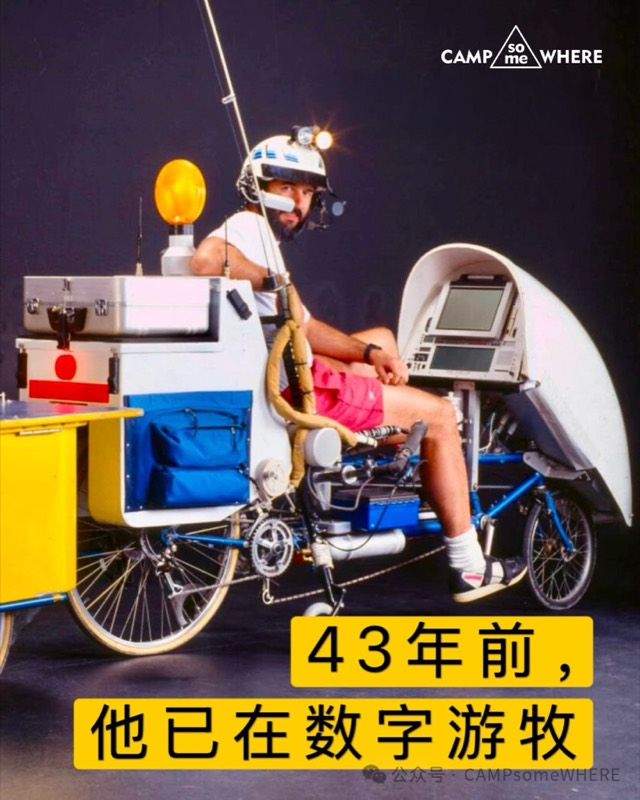
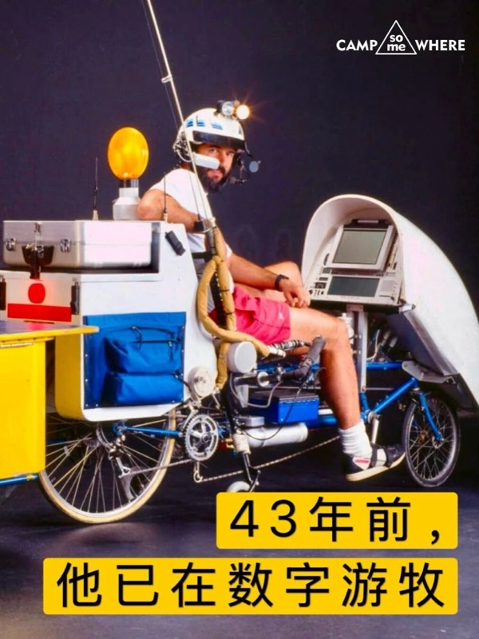

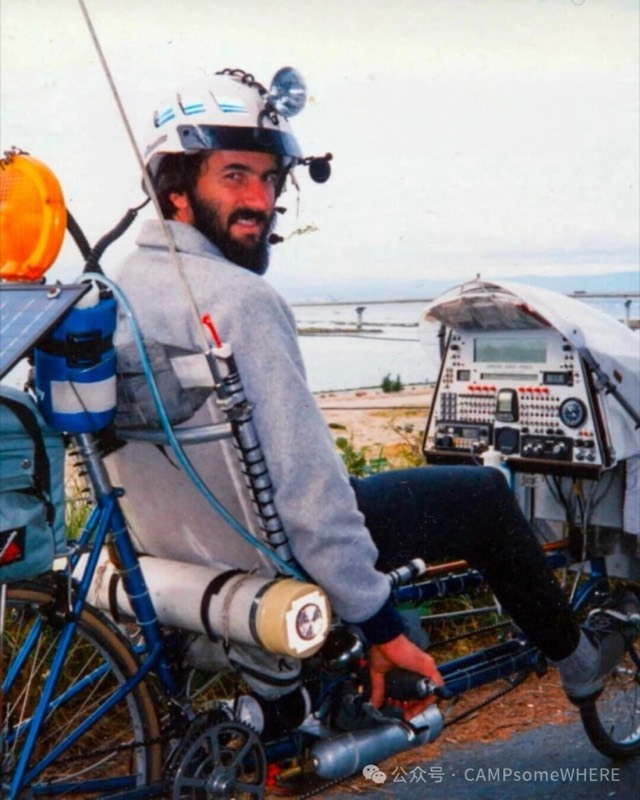

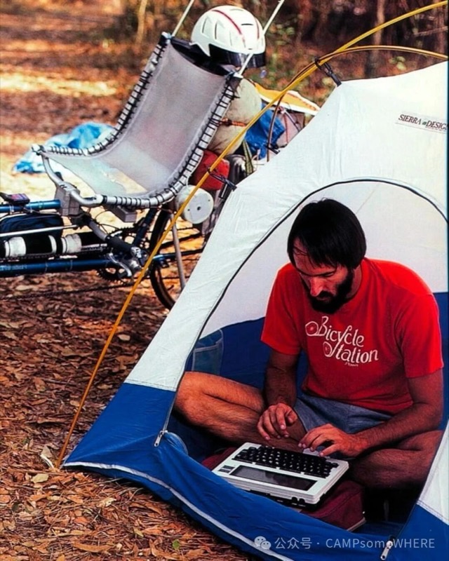
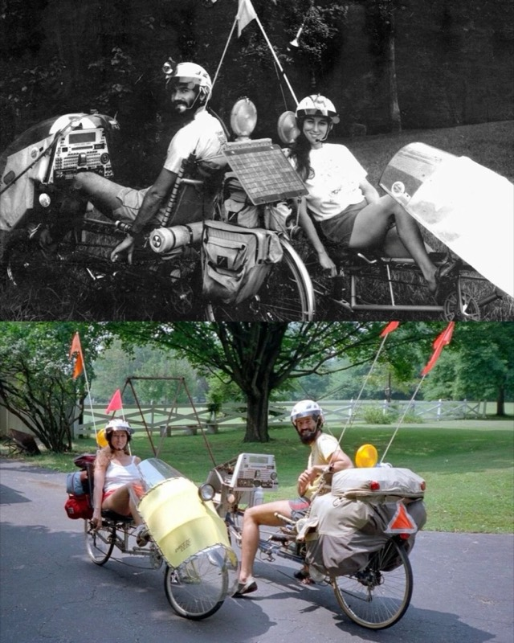

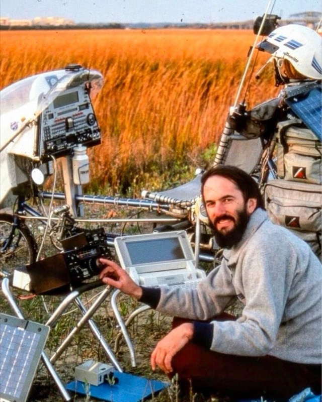
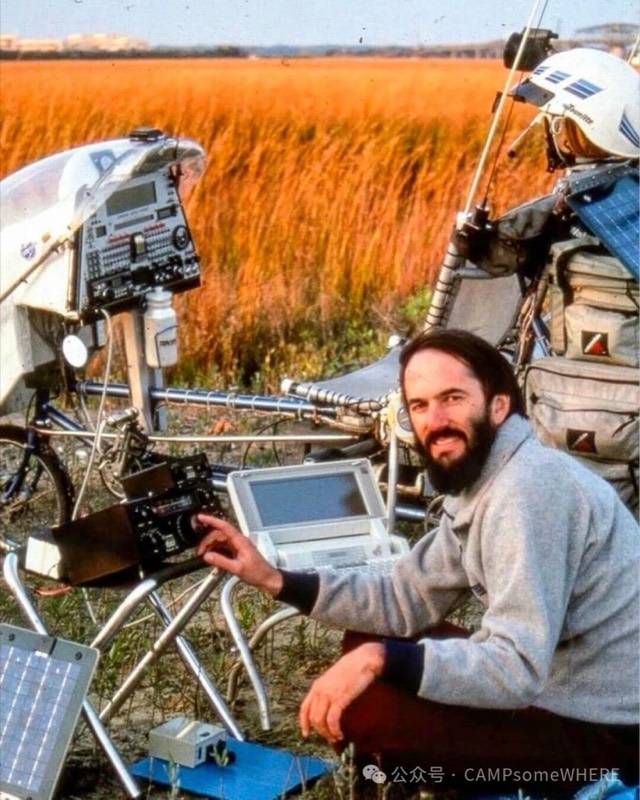
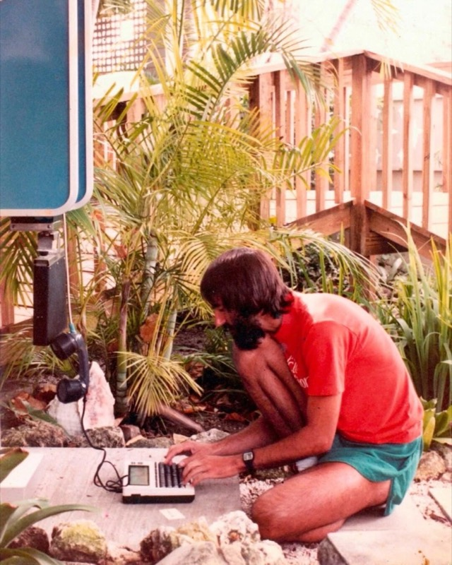

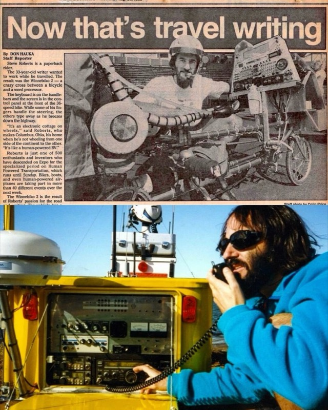

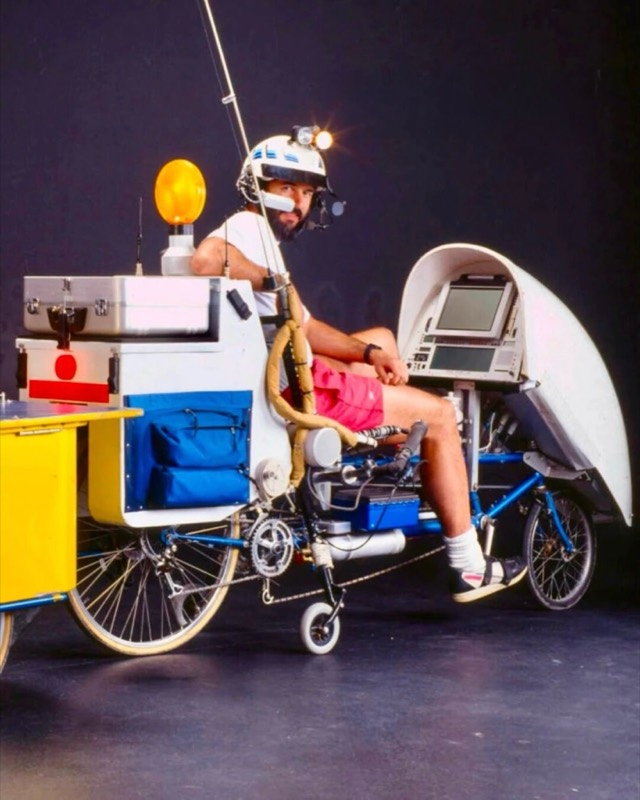

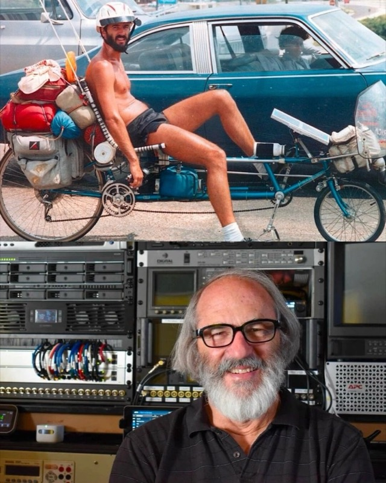
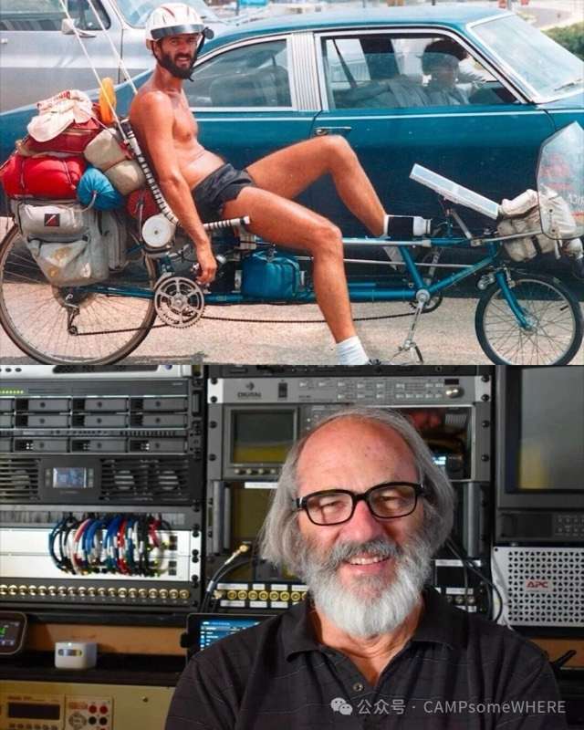

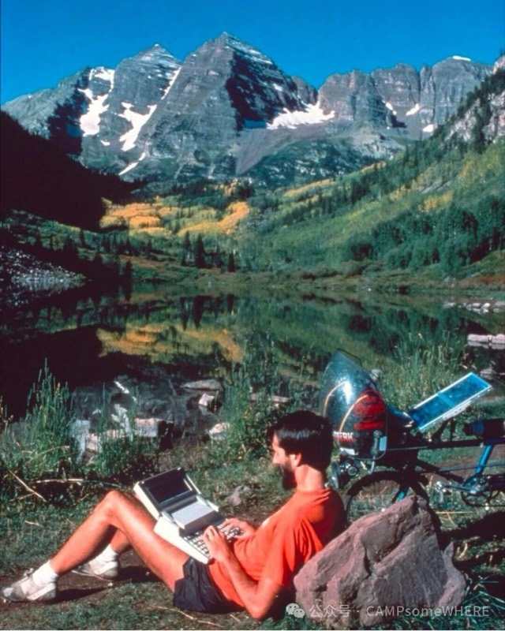
