# and wander × Brompton：骑小布，有了一套官方穿法 | 营事编集室 vol.248

- 发布日期：2026-09-02｜形态：普通图文｜系列：营事编集室（vol.248）｜来源：https://mp.weixin.qq.com/s/4qIAQ1Bchyz9gI8Mn5t6Iw

## 导读

本期导读
01｜and wander × Brompton｜骑小布，这样穿就对了02｜Arc’teryx｜一件硬壳，到底能修到什么时候？03｜MTFV × NOXBASE｜鸽们，骑车别鸽04｜norbit｜背包，正在改变夹克怎么做05｜STONE ISLAND × BEAMS｜品牌档案布的染色实验

## 1. and wander × Brompton｜骑小布，也有了一套户外穿法

英国折叠自行车品牌 Brompton 与日本户外品牌 and wander 首次合作，推出一组围绕骑行与户外移动设计的联名系列。Brompton 中国官方将这次合作概括为「从街头到自然，探索城市与旷野的边际」，并预告 9 月 4 日公开；and wander 海外则给出 9 月 10 日发售的信息。从目前曝光的实物来看，系列以服装为主，也出现了帽子等配件，双方还把 Brompton 折叠自行车的轮廓直接放进 and wander 标志性的三角 Logo。

目前最完整曝光的是一套灰黑色轻量外套与长裤。两者采用细密格纹面料，外套配有连帽、前开拉链及多处拉链口袋，裤装保持较宽松的活动空间；衣服上同时出现 and wander 反光三角标、Brompton 袖标及双方名称。系列还有 T-shirt、短裤等单品。视觉上没有走传统公路骑行服的紧身路线，延续了 and wander 擅长的宽松机能轮廓。官方预告里「to be rained upon / caught in the wind / or simply cycling」也直接把使用条件指向雨、风与日常骑行。

Brompton 最鲜明的使用方式，本来就是在「骑车」和「不骑车」之间频繁切换：骑到车站可以折起来，上公共交通、进办公室、逛街，再继续骑。and wander 的服装逻辑刚好适合这种移动状态——保留户外面料、收纳和反光细节，同时不把穿着者固定在专业骑行造型里。这次联名真正对上的，是小布用户骑车之外的时间：一套衣服从骑行继续穿到步行、通勤和轻户外。

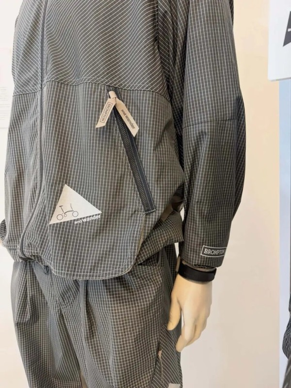
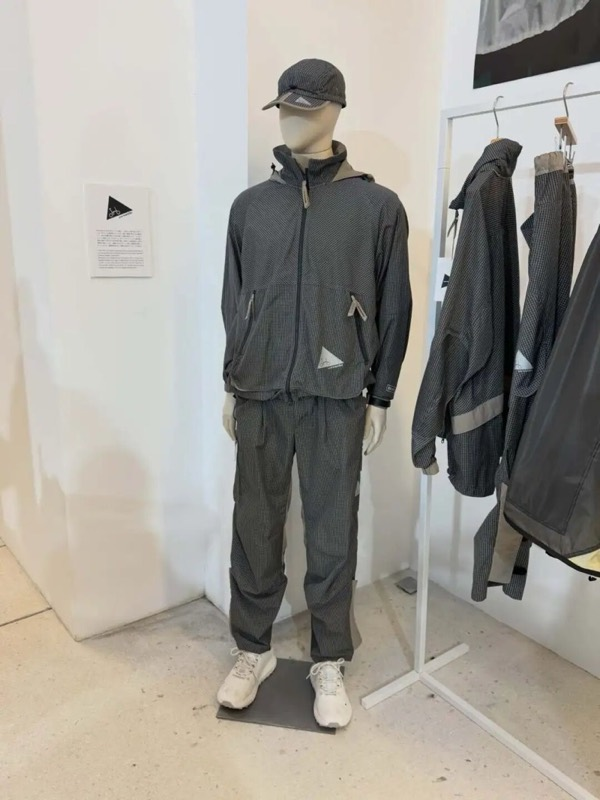
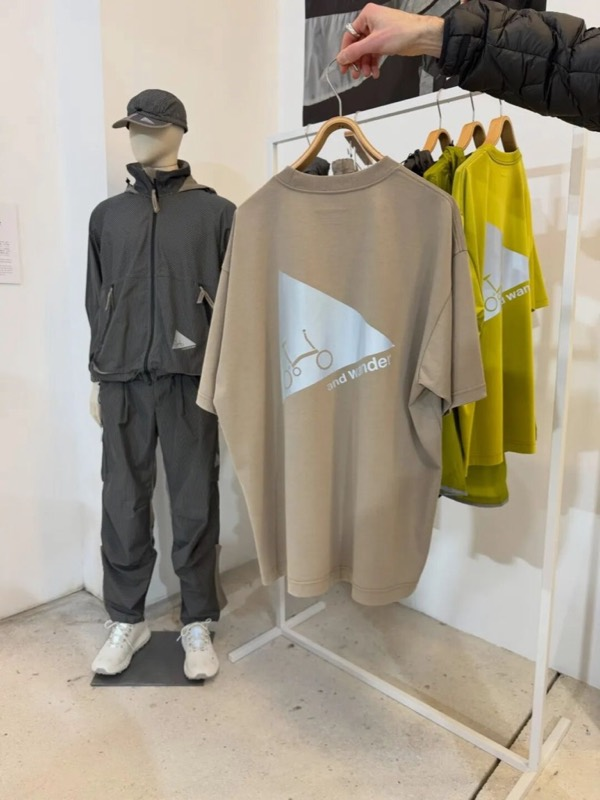
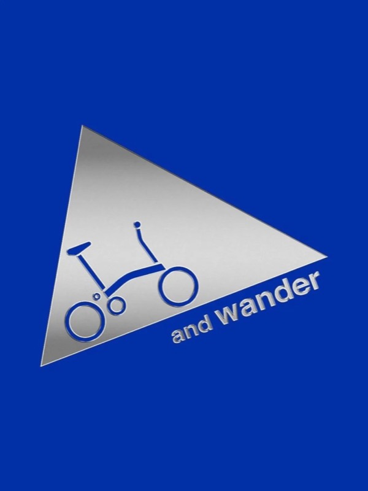

## 2. Arc’teryx｜一件硬壳，到底能修到什么时候？

Arc’teryx 已正式公布 System 0™，这是一套围绕产品设计与循环体系建立的新平台。它不只讨论材料来源，而是把设计、制造、使用、维修、回收与再生放进同一条产品生命周期里。第一件落地产品是 Sperro SV Jacket，一款多运动山地级硬壳，将于 2026 年 9 月 4 日全球发售。官方将它定位为品牌目前最先进的硬壳产品之一，也是 Arc’teryx 第一次尝试把循环设计完整嵌入高性能技术服装。

对使用者来说，最实际的变化发生在「买完以后」。Sperro SV 的设计参考了 Arc’teryx ReBIRD™ 长期积累的维修数据，把装备最容易损坏的位置提前纳入结构设计，拉链滑块也被做得更方便更换；产品提供三年不限次数的非保修维修服务，并通过数字产品护照记录身份与维修生命周期。换句话说，一件硬壳的设计目标不再只是在新品状态下做到足够强，也要考虑几年以后哪里最容易坏、能不能方便维修，以及怎样尽可能延长使用时间。

更进一步的问题是：如果真的修不了了呢？ Sperro SV 使用 GORE-TEX PRO ePE 膜与 ECONYL® 再生尼龙，当产品最终无法继续使用，Arc’teryx 计划通过化学回收将尼龙与膜材分离，再把尼龙送回 Aquafil 制成新的 ECONYL® 纱线。对消费者来说，System 0™ 值得关注的地方就在这里：它在尝试改变高端户外装备的价值计算方式。以后花更多钱买一件硬壳，买到的可能不只有当下的性能，也包括品牌未来几年愿意为它提供多少维修、回收和材料再利用的责任。一件好装备能穿多久，以及穿完之后怎么办，可能会成为同一个购买问题。

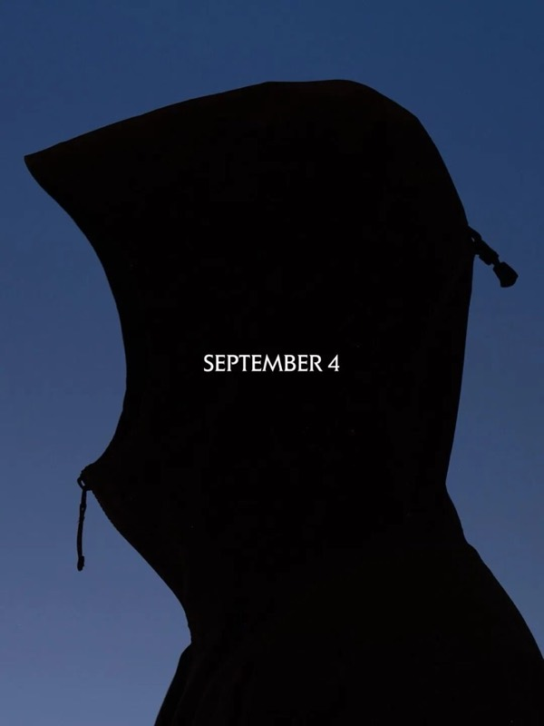

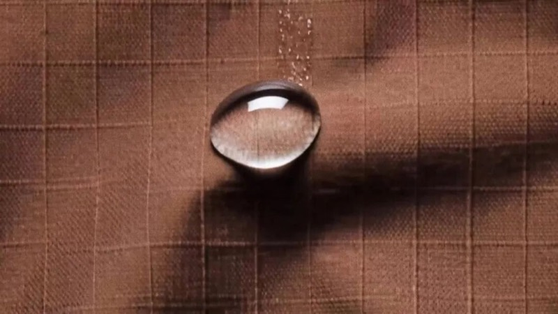

## 3. MTFV x NOXBASE｜鸽们，骑车别鸽

NOXbase 与 MOUNTAINFEVER 推出「都是鸽们」骑行长袖速干衣，发售时间为 9 月 2 日 20:00。这个联名从 NOXbase 在苕溪边开的 Cycle Pit 单车驿站出发：不追速度，不刷数据，也不一定把集合变成任务；沿着苕溪绿道慢慢骑，累了停，饿了吃，想放鸽子最好提前说。MOUNTAINFEVER 对户外的理解也接近这个方向 —— 比起完成多少公里，更在意人为什么出发，以及能不能轻松一点走进自然。

产品本身是一件偏轻量的骑行长袖。面料采用 90g/㎡ 氨纶梯格网料，轻薄、有弹力，梯格镂空结构有助于空气流通和排湿；M 码约 134g，方便骑行、旅行或日常随包携带。设计上用了全衣撞色明线和鸽子满印图案，后腰有 3M 反光条，左袖预留手表位，袖口内侧带弹力指套，领标和洗标也做成无感版本，减少贴身穿着时的摩擦。

这件衣服有意思的地方，不只是把鸽子做成图案，而是把一种车友之间的玩笑变成了穿在身上的暗号。骑行服通常很容易被速度、数据和训练感包围，但「都是鸽们」更像是给另一类骑行状态留了位置。对 CSW 来说，这种轻松感比 “专业骑得快” 更接近很多人真实进入户外的方式。

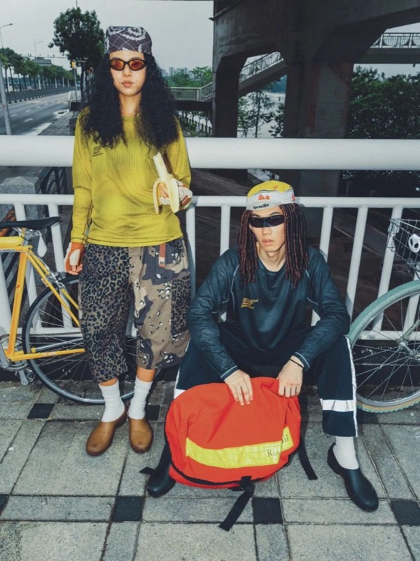
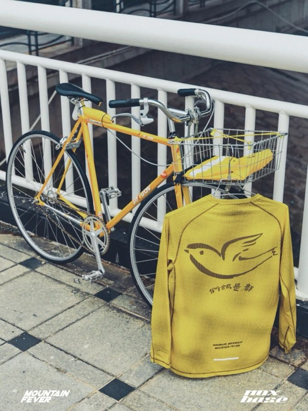
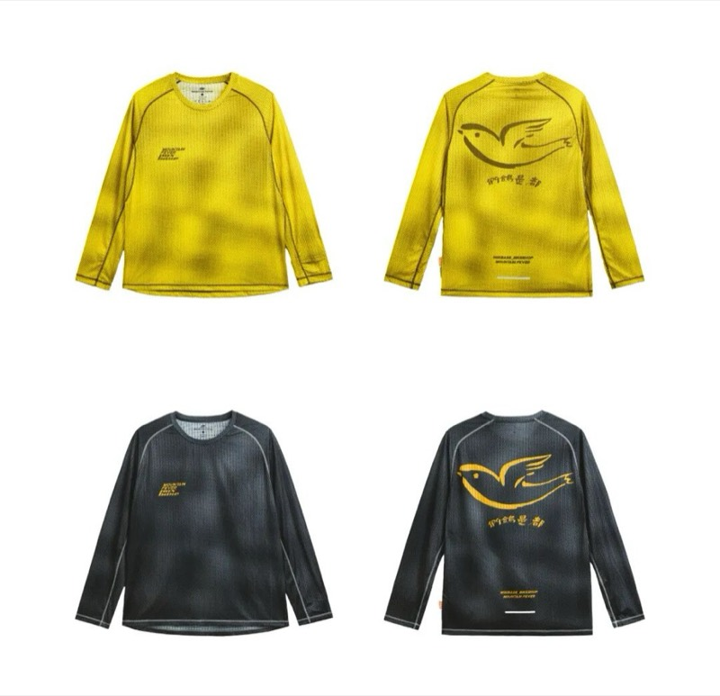
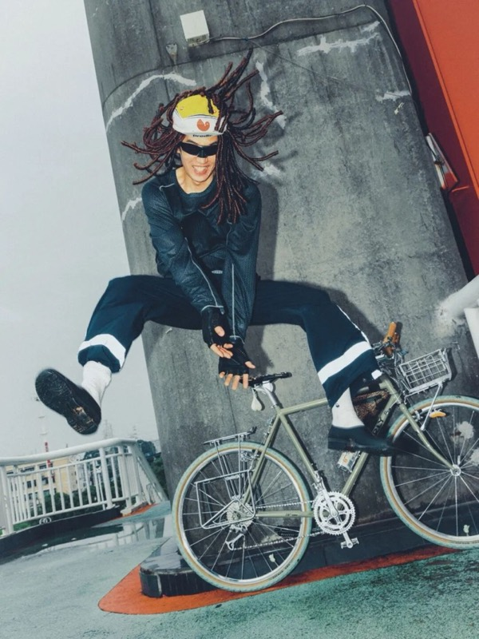
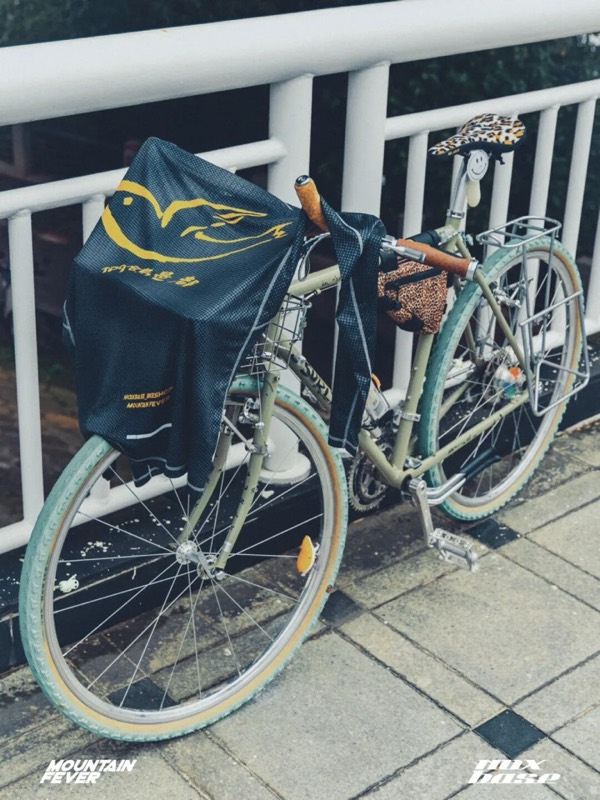

## 4. norbit｜背包，正在改变夹克怎么做

日本机能服装品牌 norbit by Hiroshi Nozawa 长期在城市服装与户外装备之间寻找连接，常从狩猎服、Field Jacket 等传统功能服装中提取结构，再对应当代移动方式重新设计。AW26 的 Back Pack Holder Hoodie Jacket 延续品牌标志性的 Field Jacket 轮廓，但这次解决的是一个很具体的问题：穿着外套背上背包以后，衣服还能不能保持原来的活动空间。

夹克采用轻量三层尼龙，兼顾防泼水、透湿与防水性能，并用宽松版型为中间层留出空间。核心结构藏在背后：后片加入可展开的 box pleat 箱褶，正常穿着时保持收拢，背上背包后则能随背包体积向外展开，给后背增加额外容量，减少衣服被背包向上顶起或持续拉扯。前腰大口袋也可以完整拆下，单独作为 sacoche 使用，同时承担整件夹克的收纳袋功能。官方公布红、白、绿、黑四种颜色，预计 9 月下旬起在指定零售商发售。

这个设计值得看的地方很实际。大多数户外夹克考虑的是人在运动时衣服怎么活动，但背包本身也是户外穿着系统的一部分：背上十几二十升的包之后，后摆会上移、肩背会产生张力，原本合适的衣服轮廓也会发生变化。norbit 没有再增加一个复杂功能，而是给背后留出一块可以随负载改变的空间。衣服适合背包，和衣服看起来适合户外，是两回事。 对经常背包通勤、旅行或轻徒步的人来说，这个箱褶可能比再多一个机能口袋更值得关注。

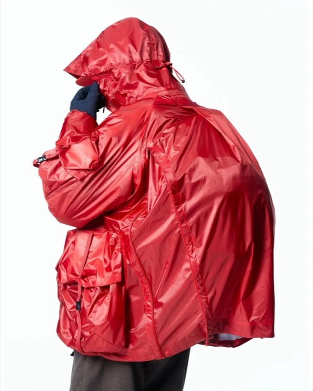
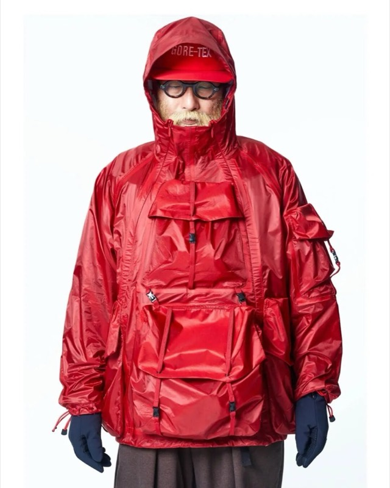
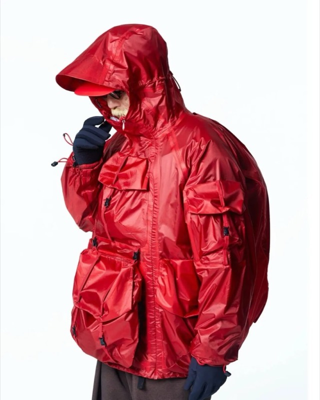
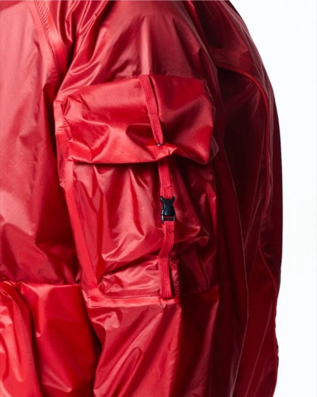

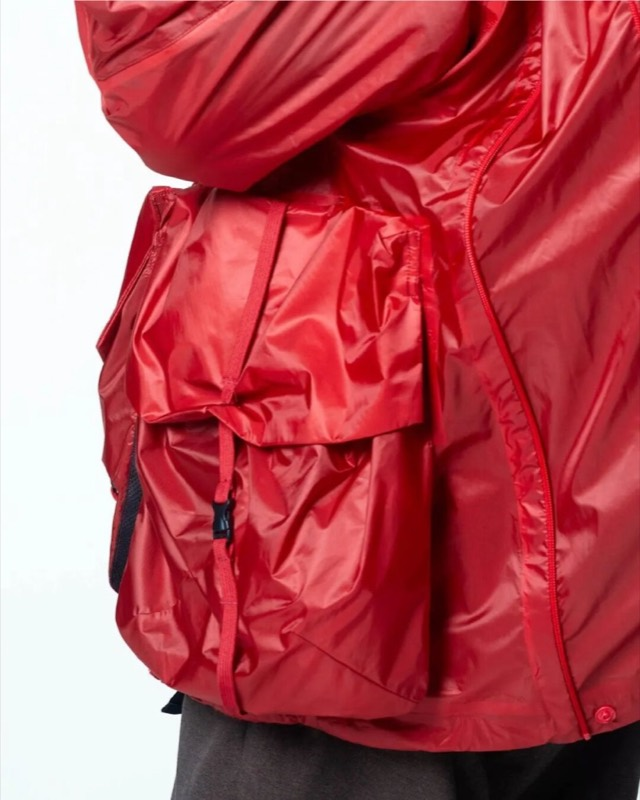

## 5. STONE ISLAND x BEAMS｜品牌档案布的染色实验

STONE ISLAND 和迎来 50 周年的 BEAMS 第一次合作，选了一个很适合双方的切口：不靠大 Logo，也不只是把经典款换个颜色，而是让 BEAMS 熟悉的 Crazy Pattern，碰上 STONE ISLAND 最拿手的成衣染色。

这次系列包括夹克、长裤和 T-shirt，9 月 5 日在 BEAMS 原宿店发售。最值得看的，是那件夹克。它以一件从未正式发售的 STONE ISLAND 试作款为基础，把品牌档案里的 Raso Gommato、Nylon Metal 等不同面料放在同一件衣服上，再一起进入同一缸染料。不同纤维和织物结构吃色不同，最后自然长出深浅、光泽和色调的差别。也就是说，这次的 “拼色” 不是直接拿几块彩色布料拼出来的，而是被染出来的。

长裤用 Cordura 面料，T-shirt 则用异材质口袋延续这个思路。价格分别为夹克 242,000 日元、长裤 110,000 日元、T-shirt 49,500 日元。对第一次合作来说，这个系列最有意思的地方，是它没有把 BEAMS 和 STONE ISLAND 变成两个并排出现的名字。BEAMS 给出 Crazy Pattern 这种一眼能看懂的视觉语言，STONE ISLAND 则用自己的材料实验和成衣染色，把它做成了一件真正属于双方的衣服。

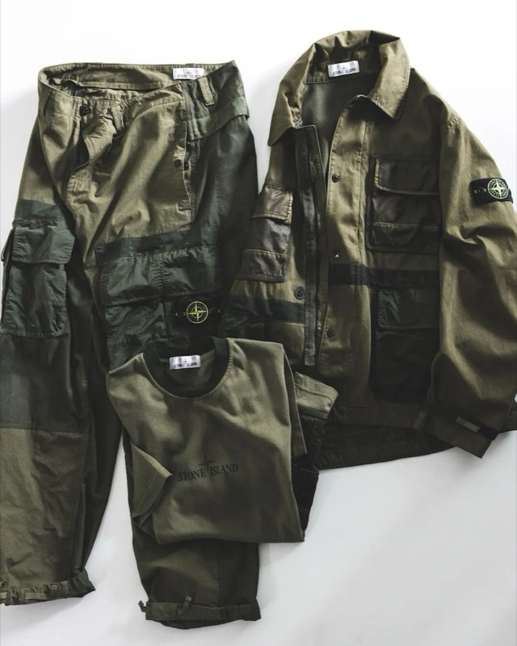
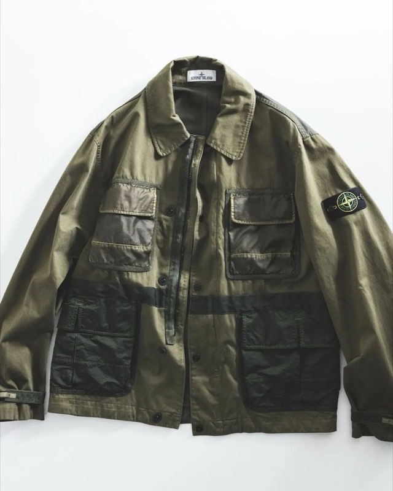
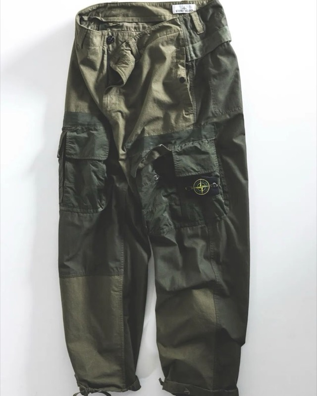
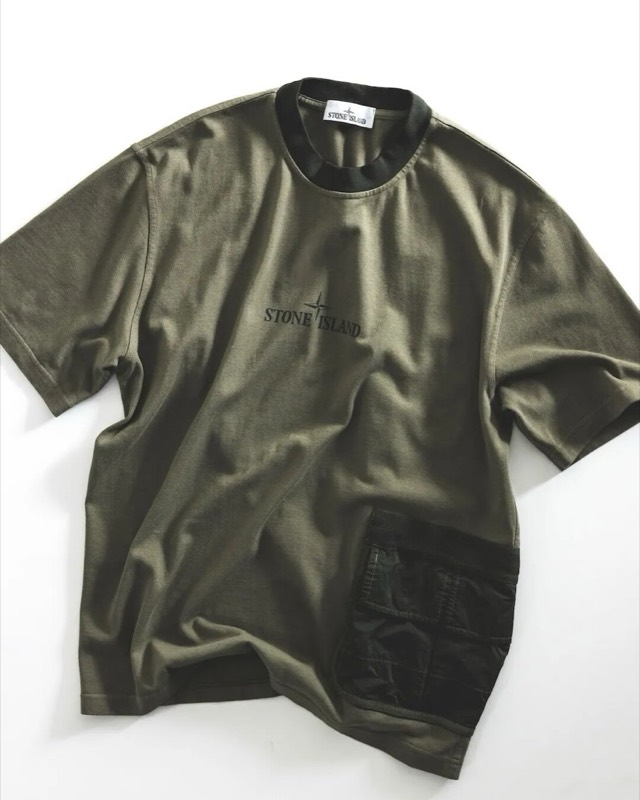

