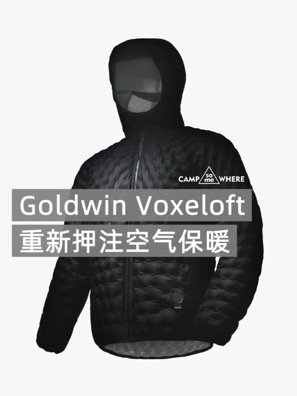
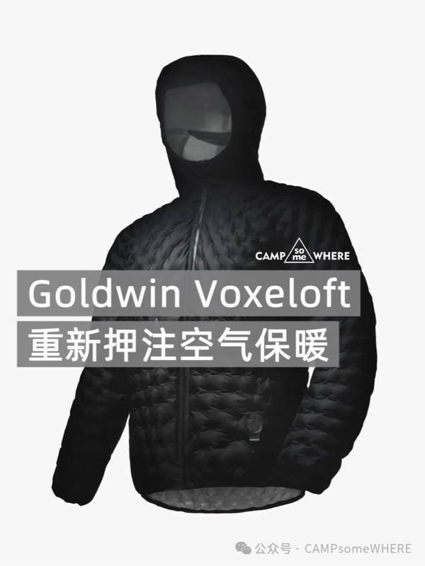
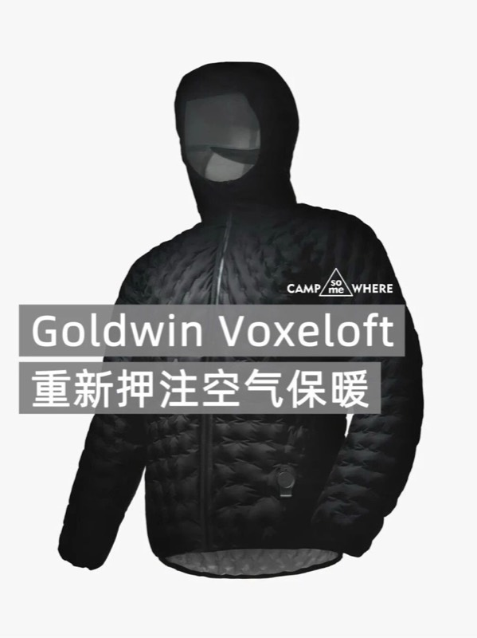
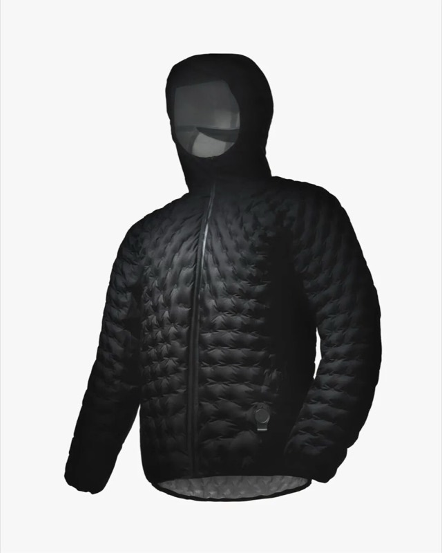
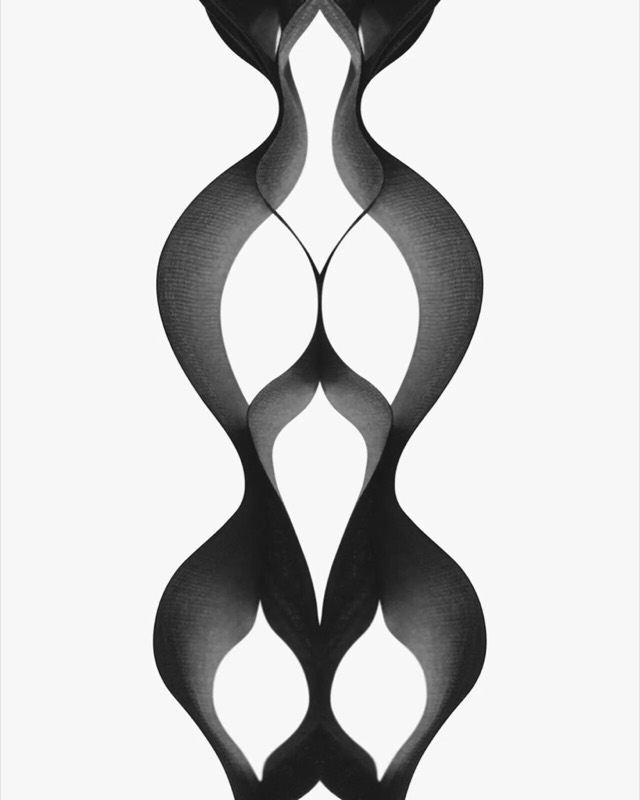
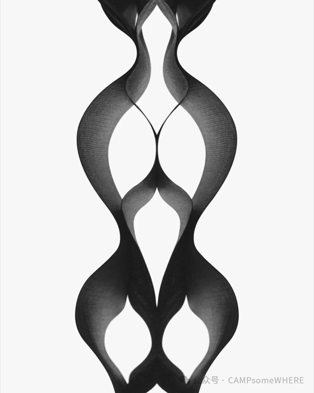
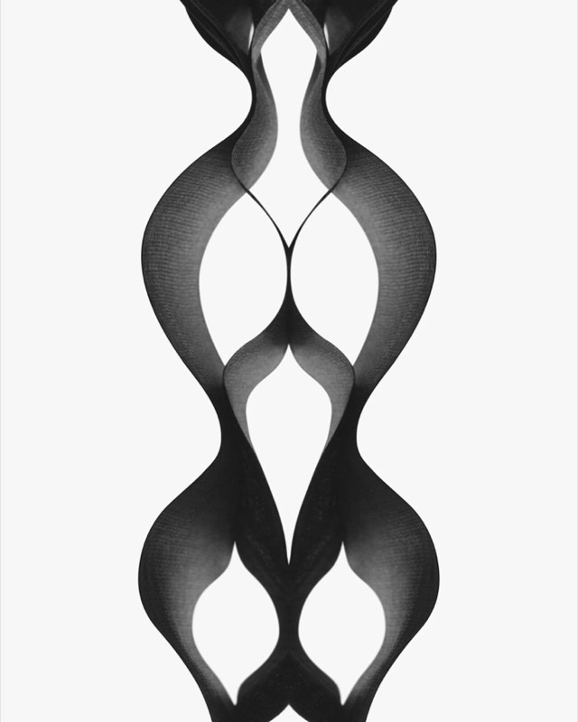
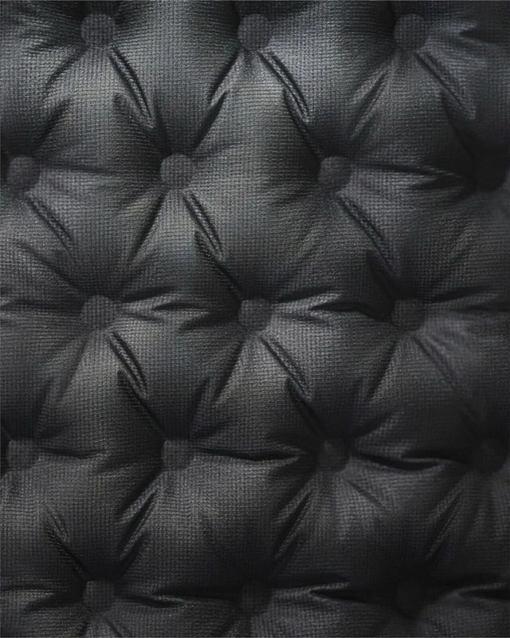
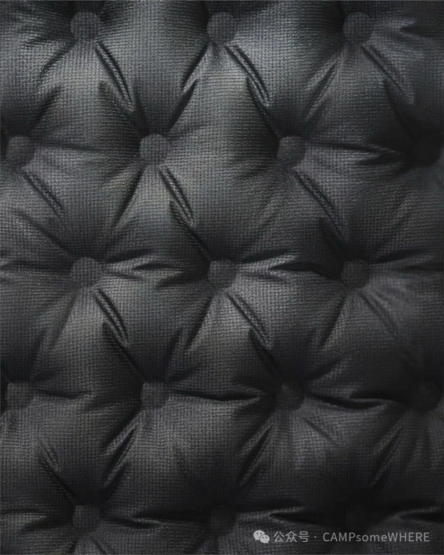
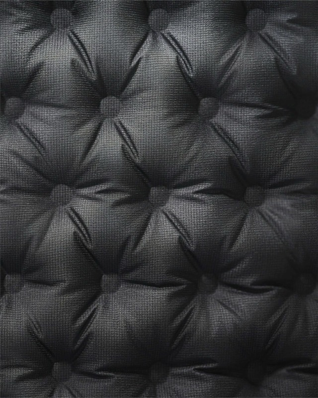

# Goldwin：重新押注空气保暖

- 发布日期：2026-09-01｜形态：贴图文｜系列：贴图文｜来源：https://mp.weixin.qq.com/s/79BIggQkZyh2ejdcIsuvRQ

## 1. Goldwin｜重新押注空气保暖

一件外套怎么保暖，过去习惯先看填充；而Goldwin 最近把问题换成了另一种问法：衣服里的空气，能不能被主动调节？

1、Voxeloft：空气可增减，温度可高低

Voxeloft 外套的核心，在内部的空气层。Goldwin 把空气做成可增减的结构，让外套在冷、热、风、雨之间切换保暖状态。

2、处理山里最烦的温差

徒步和越野跑里，身体状态一直在变：上坡发热、停下变冷、海拔升高、风雨突然进来。Voxeloft 对应的正是这种反复变化的场景。

3、少一次穿脱，少一次风险

传统层次穿衣需要不断脱壳、加中间层、再穿回去。到了山脊、雨中、强风里，或者比赛节奏正紧时，这个动作本身就会消耗时间和体温。Voxeloft 想把调温动作留在外套内部完成。

4、灵感来自住宅的三层窗

Goldwin 官方提到，Voxeloft 的灵感来自高隔热住宅里的三层玻璃。它把多层空气隔热的逻辑转到衣服内部：重点不是把空气做得越厚越好，而是让空气形成更稳定的分层。

5、空气层太厚，反而会漏热

普通保暖也依赖“静止空气”，但空气层一旦太厚，内部就容易产生对流，热量反而更容易流失。Voxeloft 把单个空气层控制在 10mm 以下，用多层结构抑制空气流动。

6、前身和手臂更保暖

Voxeloft Trail Jacket 在前身和手臂外侧设置 3 层空气层，背部为 2 层，帽子和腋下不设置空气层。这个分区说明它不是把整件衣服盲目充气，而是按照运动中的热量分布来安排保温和活动空间。

7、把雨壳和保温层压成一件

这件外套表层使用 PERTEX SHIELD PRO，负责防水透湿和耐用性；内部再用 Voxeloft 空气层调节保温。它真正想压缩的，是薄雨壳和厚保温外套之间的边界。

8、先放到 UTMB 现场，很说明问题

Voxeloft Trail Jacket 在 8 月底法国霞慕尼 Ultra-Trail Village 的 Goldwin 展位限量发售。Goldwin 把它先放到高海拔、长距离、温差剧烈的越野跑现场，让使用场景自己解释技术。

9、990 欧元，更像技术样衣进入市场

据 YAMA HACK 信息，这件外套价格为 990 欧元，约合 16 万日元。这个价格让它更适合作为技术展示来看：Goldwin 先把一个复杂结构做成可售产品，再观察它能否从少量高端场景扩散出去。

10、保暖从材料竞赛进入结构控制

过去谈保暖，常落在羽绒蓬松度、化纤棉、重量和压缩性。Voxeloft 把问题推到另一层：衣服能不能主动改变内部空气状态。对 CSW 来说，这比“Goldwin 又出了一件贵外套”更值得讨论。

