# BRUNT：用装备，唱情歌 | 营事专题室 Vol.12

- 发布日期：2026-09-16｜形态：普通图文｜系列：营事专题室（vol.12）｜来源：https://mp.weixin.qq.com/s/uw9gMsqbdHag--dcxu7ggQ

## 导读

把露营装备做出军事风，还要在上面写几句关于爱情的话。日本品牌 BRUNT 的这点心思，有玩家读懂了，甚至把它出了考题。
来露营，先做一张试卷吧。
5月，在北京的 Rickey Boys 聚会上，玩家们拿起笔，认真答起了有关 BRUNT 的问题：产品名怎么拼、和谁办过活动、哪件装备上写着关于吃饭和喝酒的那段英文……
Rickey Boys 现场，玩家正在填写关于 BRUNT 的试卷。图片来源：Rickey Boys 活动现场资料
CAMPsomeWHERE 受邀来到现场，也想听听，这个品牌究竟有什么吸引力，能让大家连装备上的小字都记在心里。
不过，发起人之一 Koz 起初可没这么买账：“这牌子不就改个颜色吗，干嘛卖那么贵啊。”
后来，他买了第一块 CHECKMATE 桌板，开始研究可以添上去的配件，也慢慢留意到产品的名字和上面的英文。从嫌贵到愿意花时间琢磨，他对 BRUNT 的看法变了。
要聊清楚这段变化，我们先去和歌山，看看做出这些装备的人。

## 1. 一个厨师，为什么想改露营装备？

在日本和歌山县周参见町的一栋海边建筑里，楼上是 BUSH DE COFFEE，楼下是 BUSH DE BRUNT。主理人桥本万吉原本经营餐饮，2016年将咖啡馆迁到见老津，2019年2月又在同一栋建筑的地下开了户外店。客人可以在楼上看海吃饭，也可以下楼看装备。

BUSH DE BRUNT 主理人桥本万吉。

照片刊载于《フィールドライフ》2022年7月27日发布的周参见町报道。图片来源：フィールドライフ／FUNQ

Helinox 东京创意中心在2024年的 BRUNT 快闪活动介绍中，刊登过这家店的室内照片：混凝土墙面前，炉具、桌板、收纳箱和零件占满了不少位置。这里有桥本自己的产品，也有他挑选的其他车库品牌。看着这些陈列，不难理解为什么有人会专程来逛：这种专属于离线世界的氛围感，是必须身临其境才能感受。

《CAMP GOODS MAGAZINE》介绍这家店时，把桥本的做法概括为：自己想要的东西，就自己做。对他来说，“做”也包括改装。已经好用的装备，仍然可以换一种颜色，调整一个部件，变成更合自己心意的样子。

BUSH DE BRUNT 店内。图片来源：Helinox Creative Center Tokyo

桥本的餐饮经历，在产品中也留有痕迹。BRUNT 与 H&O 合作的厨刀，借用了军用刀具的外形，配有专门的收纳套；CAMP HACK 的介绍则谈到了它作为厨房用具的操控感。硬朗的外形最终仍要回到切菜、备餐这些日常动作上。桥本做过厨师，这样的设计与他的生活并不遥远。

BRUNT 官网写着 OUTDOOR VINTAGE MILITARY，户外、复古、军事风格，三个词已经把方向交代得很清楚。沙色、橄榄色和黑色反复出现，金属结构露在外面，表面配上编号式字样、英文，或带有军事趣味的图案。

在 Rickey Boys 的采访中，几位玩家提到了“机能风”和“战术感”。除了配色，BRUNT 装备上外露的金属结构、连接部件和印字，也让他们想起军用器材。这种风格延伸到桌板、支架和日常小物，成为玩家搭配营地时会考虑的一部分。

比如 H&O 与 BRUNT 合作的 Mosquito mine，就是把军事造型用在一只蚊香架上。Helinox 的官方介绍确认了这项合作，也说明它内部配有金属板和适配器，可以安装到三脚架上。2024年与 Helinox 合作的 Lumi Blue 版本，又为这件小物加入了蓝色夜光效果，硬朗的造型里也有玩心。

Mosquito mine / Lumi Blue 的夜光效果。蚊香架原款由 H&O 与 BRUNT 合作，图为2024年 BRUNT × Helinox 联名版本。图片来源：Helinox Creative Center Tokyo

从这些小物再看向整套装备，玩家的选择就更清楚了。Rickey Boys 北京现场，成排的天幕下，桌子、收纳箱和器具被安排在各自的位置。不同人的布置各有偏好，有人喜欢沙色与灰色，也有人以黑色为主调，迷彩穿插其中。看过这些实际搭配，才更容易理解他们对“搭配”的在意。

Rickey Boys 北京现场，沙色、迷彩与黑色天幕下，各有一套玩家的装备布置。图片来源：Rickey Boys 活动现场资料

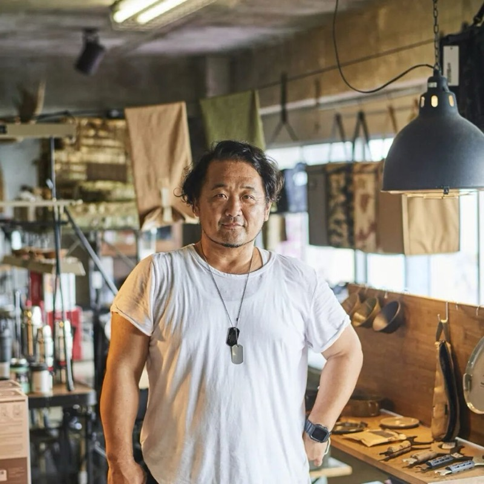
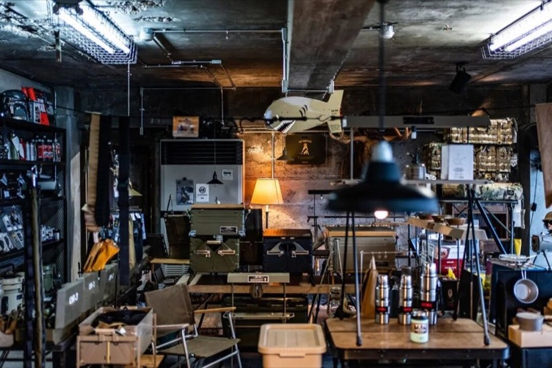
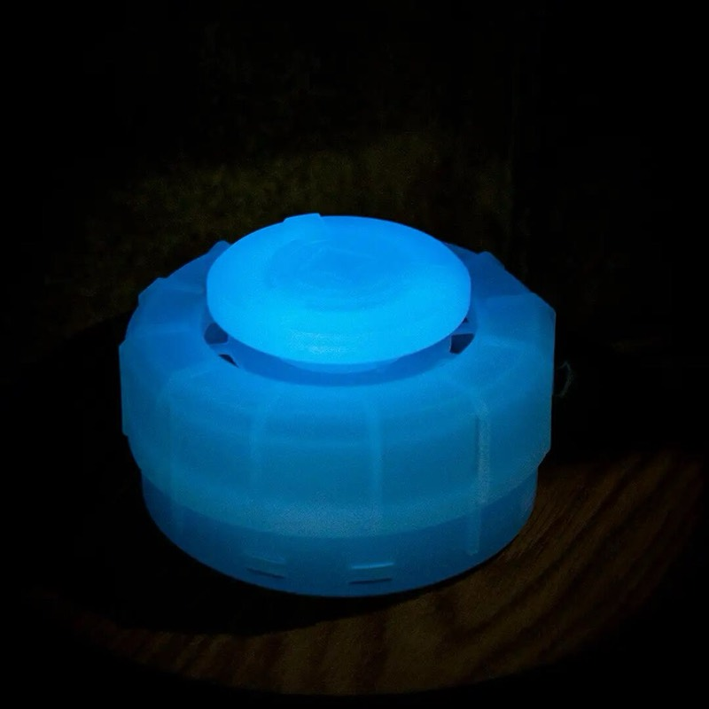
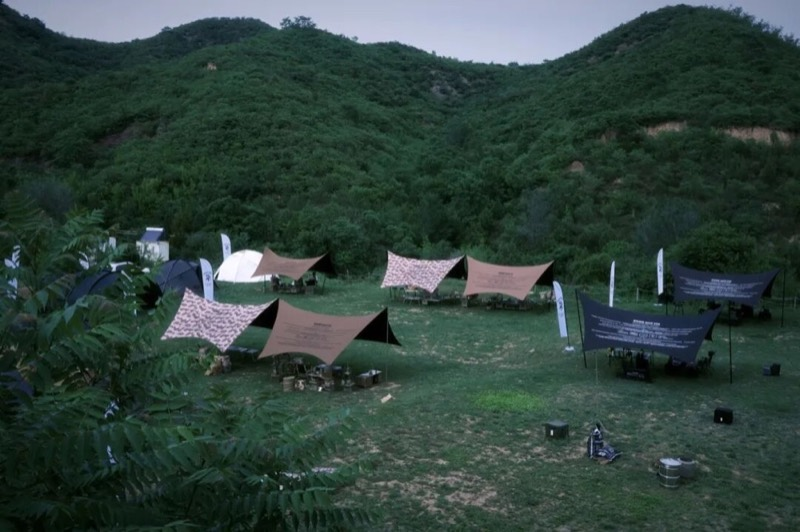

## 2. 从改一个颜色，到改一整组装备

露营装备买多了，很容易遇到一个小烦恼：喜欢的桌子是一个颜色，好用的炉具是另一个颜色。每件都没什么问题，放在一起却总觉得不太协调。

有人不介意，也有人会一直惦记着。BRUNT 的不少改装，恰好做到了后一类玩家在意的地方。颜色相近、材质呼应，连一只小桶都能参与搭配。整套装备布置完成后看着顺眼，本身就是他们花心思的理由。

日本玩家かずき把 BRUNT 装备与其他品牌搭配，沙色与迷彩贯穿整套营地。图片来源：hinata／shiromani camp event 现场报道

BRAVO ONE 是个很具体的例子。它以 Omni 石油炉为基础，由 BRUNT 定制外观。日本玩家 JEFFREY 在社媒记录里说，原款的绿色没有特别吸引他，BRUNT 的沙色却符合他的喜好。同一款炉具，换了外观，他就愿意把它放进自己的营地。

按 JEFFREY 的分享，这种沙色经过反复调配，炉身文字采用丝网印刷，还带着复古感的轻微错位。他喜欢的，是颜色、印字和表面质感放在一起的效果，并不只是“把绿色喷成沙色”这么简单。

BRAVO ONE 的沙色外观与炉身印字。图片来源：JEFFREY／JEFFREY’s LODGE

喜欢一种颜色的人，往往也在意它究竟偏深还是偏浅，表面是怎样的质感。BRUNT 的官方 Instagram 还专门保留了“涂装Q&A”精选，其中一则说明提到，收到不少玩家关于自带装备涂装的咨询。可见，有人想换新装备，也有人想把已经用惯的东西，改成喜欢的样子。

而 4U 小桶又是另一种处理。在 Helinox 的介绍写到，它在制作时便把颜色加入塑料原料，而不是在成品表面喷漆。BRUNT 为不同材料选择不同的做法，目的却相近：让这些原本用途各异的小物，摆在一起时依然协调。

4U 小桶的不同配色。图片来源：Helinox Creative Center Tokyo

在我们之前的 Rickey Boys 现场采访里，几位发起人买回家的第一件 BRUNT 装备都不一样。有人先买一张沙色小桌，放在家里用；有人接触之后，陆续换了其他装备。他们都提到颜色，但继续玩下去，又会碰到另一个吸引人的地方：已经有的东西，还能怎么改？

以 CHECKMATE 为例子去说明则比较合适。MINIMAL WORKS印第安挂架下面本来就能悬挂物品，但顶部却有空位；而加上 CHECKMATE 这块板，就又多了一层可以放东西的地方。

CHECKMATE 的铭牌与固定孔细节。图片来源：トレファクONLINE（实物展示图）

这类改装不一定需要推翻原来的布置。保留熟悉的挂架，加一个部件，就能试试新的用法。BRUNT 也提供 CHECKMATE M 完整套装，把桌板、Indian Hanger 挂架、JAMES HOOK、两根立杆和转接件配在一起。套装有沙色和橄榄色，除黑色转接件外，其余部件都已涂装。玩家在意的统一配色，就这样细化到了整副架子上。

这样的搭配往往也跨越品牌。Rickey Boys 发起人 @yam_ho 曾分享过自己的营帐，按需要把 BRUNT、H&O、Helinox 等不同品牌的装备组合起来，和而不同。

Rickey Boys 发起人之一 @yam_ho 分享的秋季营地，BRUNT 与其他品牌的桌板、座椅和收纳装备搭配使用。图片来源：Instagram／@yam_ho

38paleo 则展示了另一种合作方式。它的基础来自 38explore 的 38PALLET，BRUNT 将天板改为铝制，后来与 Helinox 合作的版本又加入相应图案。它可以配合收纳箱作箱盖，也能作桌面或接上三脚架。一块板，随着搭配不同，可以换一个位置继续用。

BRUNT × Helinox 的 38paleo 桌板，图为2024年活动介绍中的版本。图片来源：Helinox Creative Center Tokyo

在 Rickey Boys现场，他们反复说到的 “买起来有一个持续性”，放在这里就好理解了。新配件带来的，可能是旧装备的一种新用法。对喜欢动手搭配的人来说，买回来只是开始，下一次怎么摆，还可以接着琢磨。

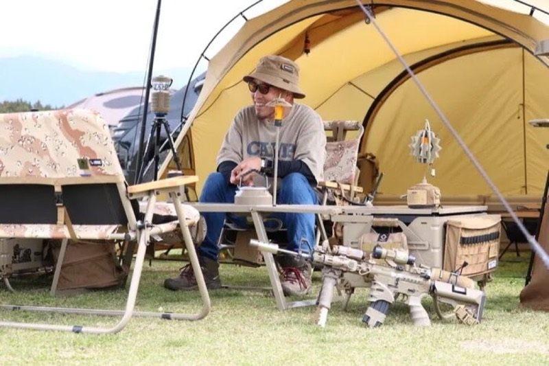
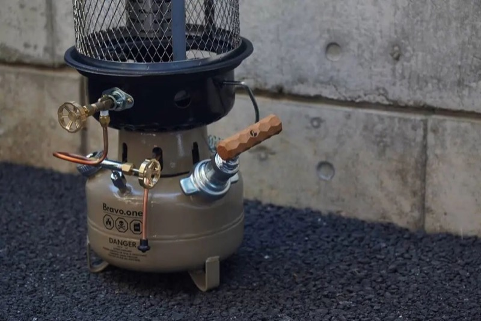
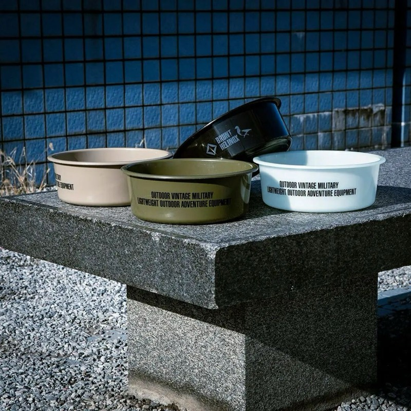
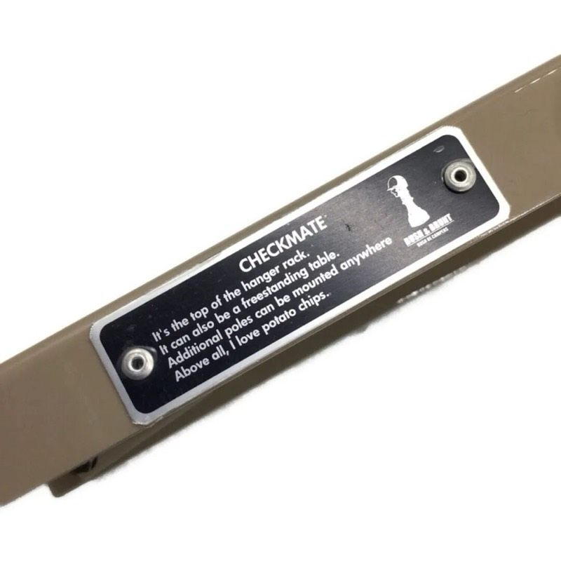
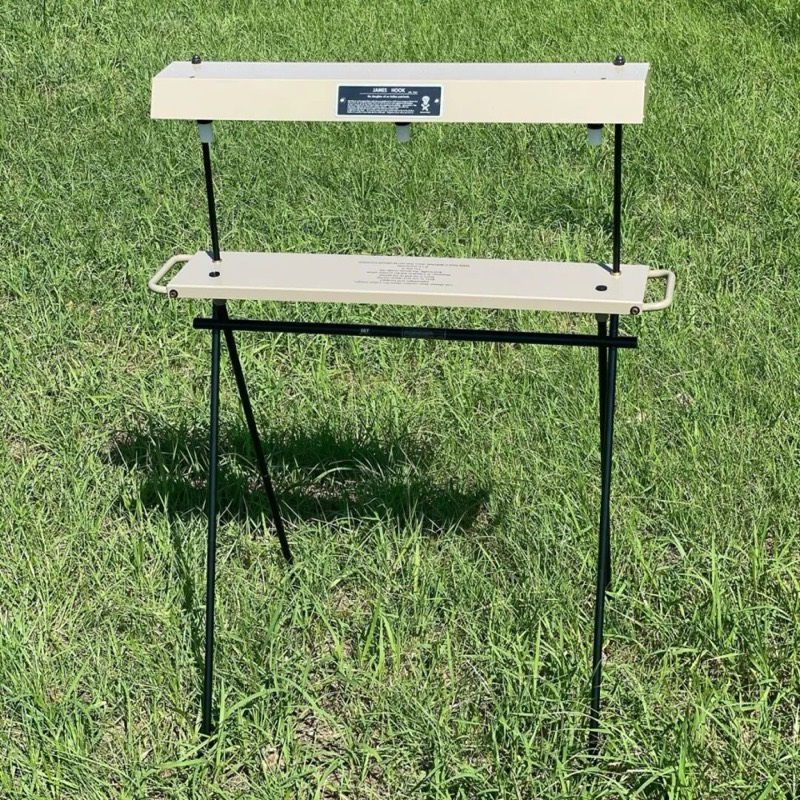
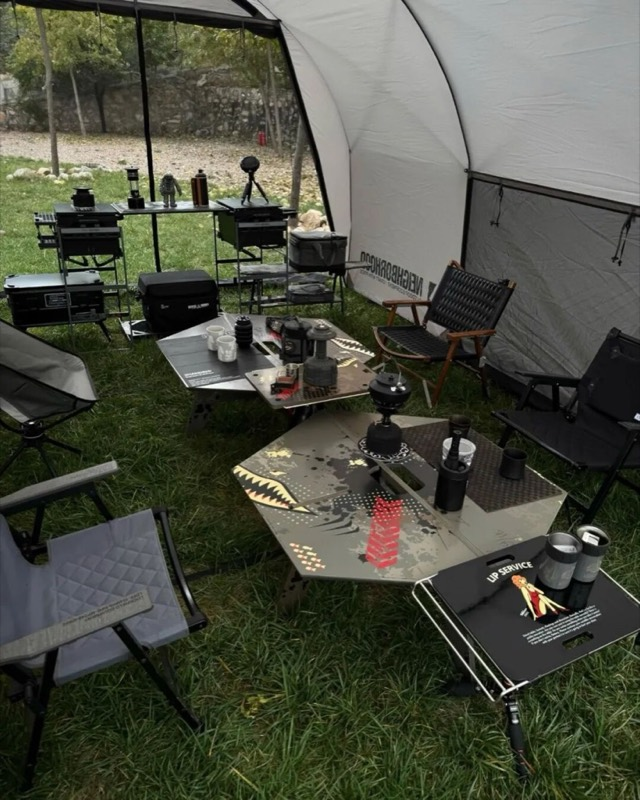
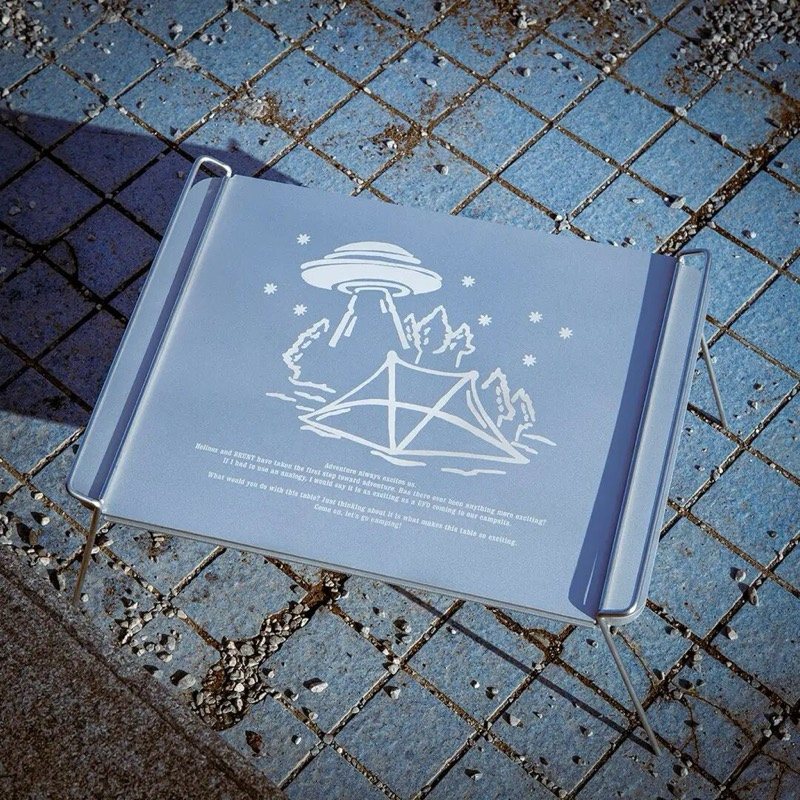

## 3. 装备上的英文情歌，真的有人读

在文章开头，我们说过 Rickey Boys发起人 Koz 对 BRUNT 这个品牌的看法，是有一个变化的过程。让他逐渐意识到这个品牌“有点东西”的契机，就不止是颜色和配件；而是他开始留意到，BRUNT 不止产品各有名字，上面密密排着的英文，也有主理人想传达的哲理。

远看，这些字很像军事风格的一部分。你可能会以为，它又是像现在很多设计师品牌那样，放一些故弄玄虚的假英文上去作为设计元素罢了。但当你靠近读，会发现那并不是在胡言乱语。Helinox 在介绍 BRUNT 时，也提到不少产品印着店主构思的故事。而在 Rickey Boys 的那份试卷上，那道关于吃饭、喝酒的题目，就是从这里来的。

3sides 黑色款，圆盘上印着关于“三方”、吃饭与举杯的英文。图片来源：Outdoor Reuse（实物展示图）

题目对应的是 Three sides，也写作 3sides，日文名叫“三方”。这个名字借自日本传统器物：祭祀时用来承放食物等供品的小台子，新年镜饼、赏月团子也会放在上面。它本来就与郑重地摆放食物有关。

玩家说的“哲理”，在这里就不难理解了。品牌把自己在意的事情写到装备上，使用者读到以后，可能觉得认同，也可能因此记住了这件东西。

BRUNT 的另一盏小灯，语气就轻松得多。这个名叫 rip shot 的小物，以 NITECORE LA10-CRI 为基础制作，上面的文案大意是：冷却的爱情也许能被这束光重新点亮，希望它能打动心上人。

rip shot：小灯的外壳上，写着一个关于爱情的玩笑。图片来源：ナカやん／log-farm.com

一件照明工具，被赋予了帮人追求爱情的任务。日本玩家、露营博客作者ナカやん介绍它时，还专门转录了这段话；在他看来，BRUNT 常把这样的玩心放进产品，读起来很有意思。

在军事风的装备上，看似轻描淡写地书写着一些诗句，这不能不说是一种直男的浪漫吧。

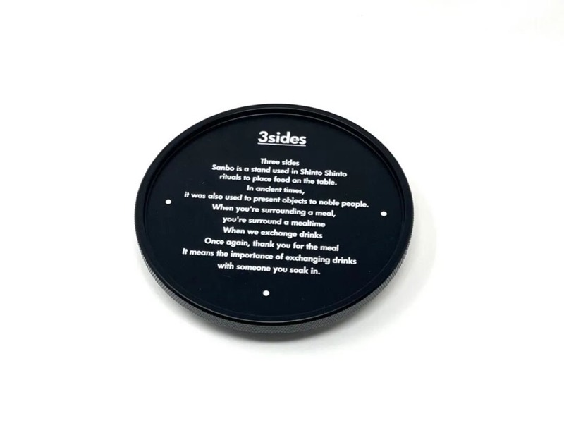
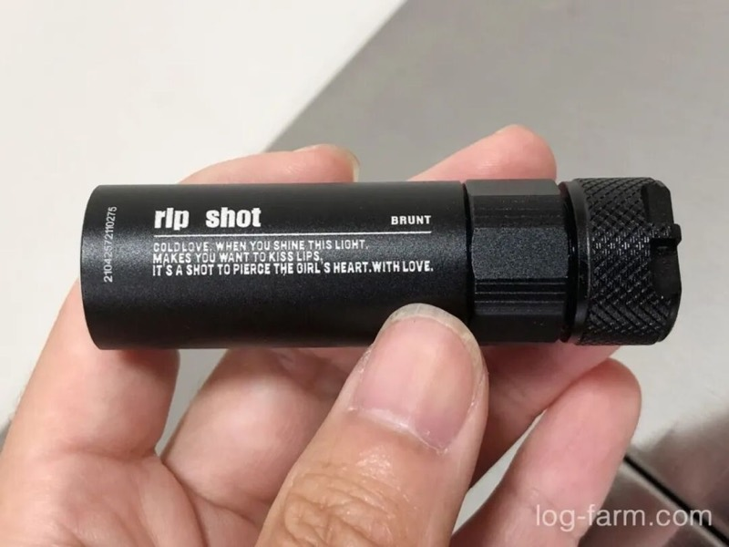

## 4. BRUNT贵吗？

聊了这么多喜欢的理由，再问起 BRUNT 的价格，Rickey Boys 的几位发起人各有看法。

有人认为现在的价格已经能够接受，也有人认为与其他露营装备比较，BRUNT 的价格依然是有门槛；而聊到新玩家怎么开始，还有人建议先买实用配件，不必急着换全套。

外观、改装和文字，都能解释一个人为什么喜欢 BRUNT，却不会替每个人算出同一笔账。有的人满足于加一块桌板，有的人愿意慢慢配齐颜色。选到自己确实想用的东西，已经足够，不需要用买了多少来证明喜欢。

Rickey Boys 的几位发起人，去过日本参加相关活动，所以想在北京也办一次聚会。他们在采访里把自己形容为“搬运工”，希望把体验过的玩法分享给身边的玩家。于是，平时关于装备的聊天，有了一个大家能够见面的现场。

Rickey Boys 的游戏环节，场边的朋友也看得投入。图片来源：Rickey Boys 活动现场资料

采访里，Rickey Boys发起人之一浩夫说，通过 BRUNT，他认识了身边这几位朋友，也认识了全国不少同好。大家最初看上的，可能只是一张沙色桌板。后来，聊配件、交流搭配，再约着一起露营，慢慢就熟了。这样的情谊，比拥有多少装备都来得珍贵吧。

读到这里，大概也能理解，为什么有人起初觉得 BRUNT“只是改个颜色”，后来却越玩越投入。颜色要合眼缘，配件要按自己的想法装，连装备上那几句英文，也藏着主理人的脾气和趣味。而喜欢这些东西的人，又总有聊不完的话。

Rickey Boys 北京聚会合影。图片来源：Rickey Boys 活动现场资料

至于 BRUNT 那副硬朗外表下的心思，一盏 rip shot 已经透露了不少：这个喜欢军事风的家伙，心里倒是装着一堆情歌呢。

延伸观看

CAMPsomeWHERE 的 Rickey Boys 现场视频，记录了几位发起人的采访与聚会花絮。

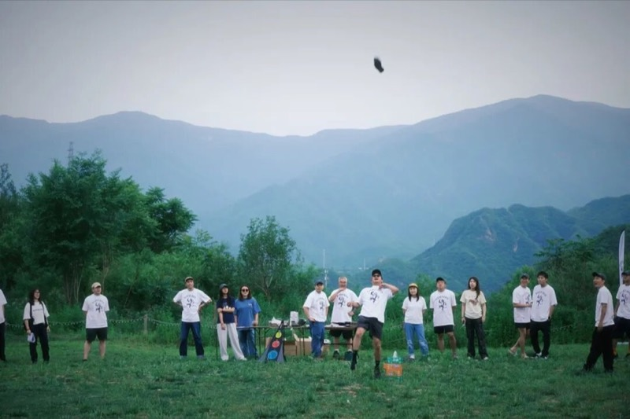
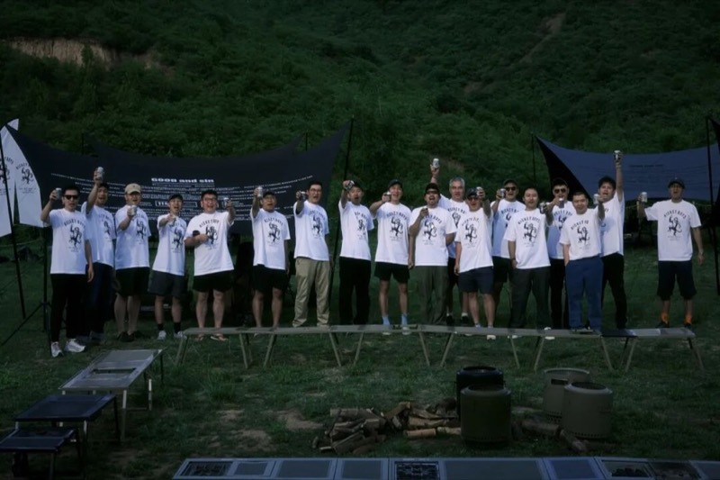

