# Apple Ultra 4：够不够让户外人换表？| 营事编集室 vol.255

- 发布日期：2026-09-11｜形态：普通图文｜系列：营事编集室（vol.255）｜来源：https://mp.weixin.qq.com/s/062AbIDlAL-j12fMx53fZQ

## 导读

本期导读
01｜Vans｜SZA 做了一组很不 Vans 的鞋02｜Apple｜Ultra 4 够不够让户外人换表？03｜壹虎野营｜双人帐往头顶多撑一点04｜NANGA｜连缝线也做拒水处理
05｜GROUNDCOVER｜给行军床搭一顶单人帐

## 1. Apple｜Ultra 4，够不够让户外人换表？

对习惯专业运动表的户外用户，Apple Watch Ultra 要争取的，远不止“电量更大”这一票。长时间记录、导航操作、充电频率，都影响一块表能否带上山。将于9月18日发售的 Ultra 4，把标准运动追踪延长至最长18小时，日常使用最长50小时。它确实增加了续航余量，但这些数字还不足以直接得出“可以替代专业户外表”的结论。

更醒目的45小时，来自 Max Extended Workout 模式。它适用于户外跑步、步行和徒步，同时会关闭提醒、分段及部分指标；25小时的 Extended Workout 模式也限制跑姿指标。对于主要想留下长线轨迹的人，这种取舍有实际意义；需要配速提醒和完整训练数据的人，则要看对应模式保留什么。判断续航，得把记录内容一起算进去。

新增的 Readiness 准备状态，综合近期活动、生命体征与睡眠提供当天的状态参考。Apple 功能说明 但功能清单能否转化为换表理由，还取决于真实路线上的续航、导航体验，以及已有训练记录迁移的成本。目前更稳妥的判断是：Ultra 4 给已经使用 Apple Watch、又想把活动距离拉长的人多了一个选择。至于让习惯专业运动表的人换阵营，一项最长续航纪录还不够。

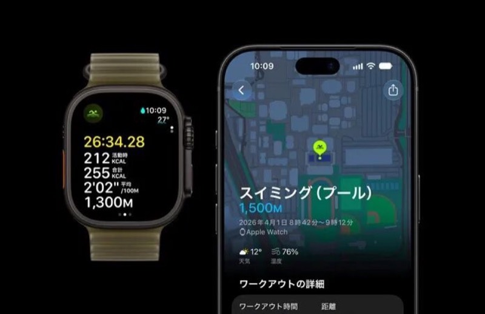

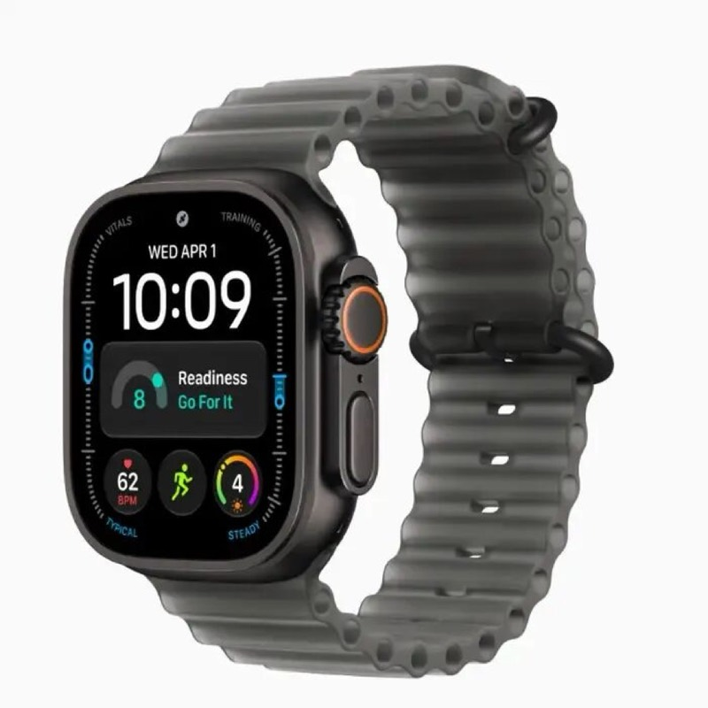

## 2. Vans｜SZA 这次做得很不 Vans

踩下去的鞋跟、露跟的厚舌鞋，再加一双分趾徒步鞋，SZA 的 VANSZA 系列，和印象中的 Vans 拉开了距离。熟悉的帆布鞋与滑板鞋轮廓仍在，但穿法和比例都被她动过手脚：松垮、做旧，混着树木迷彩与工装细节，更像她自己的衣橱。

Authentic Kickdown 最贴近 SZA 的日常习惯：她常年踩着鞋跟穿，这次便把后跟做成可折结构，搭配做旧帆布与 Sage Adams 创作的图案。Knu Skool Mule 则保留厚鞋舌与饱满鞋身，后方直接敞开，原本包裹脚部的滑板鞋变成一脚套入的穆勒鞋。首批鞋服计划于 2026 年 10 月 22 日发售；分趾鞋头、低帮徒步轮廓的 LX Tabi Hiker，则安排在 2027 年 4 月 8 日的第二批登场。

这组“很不 Vans”的感觉，来自几种风格挤在同一双鞋上：Knu Skool 前半截依然厚重，后半截却像拖鞋般随意；Tabi Hiker 又把分趾造型接到户外鞋轮廓上。相比之下，踩跟设计反倒最容易理解。SZA 把自己怎么穿、喜欢什么直接留在鞋型里，Vans 的经典款由此多了些不那么规整、也不急着统一风格的样子。

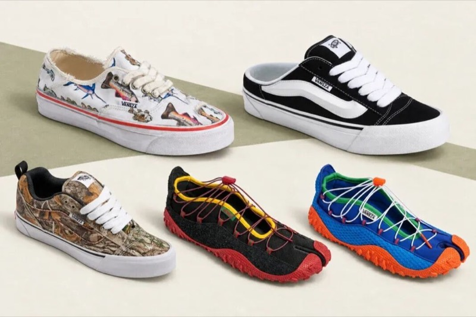
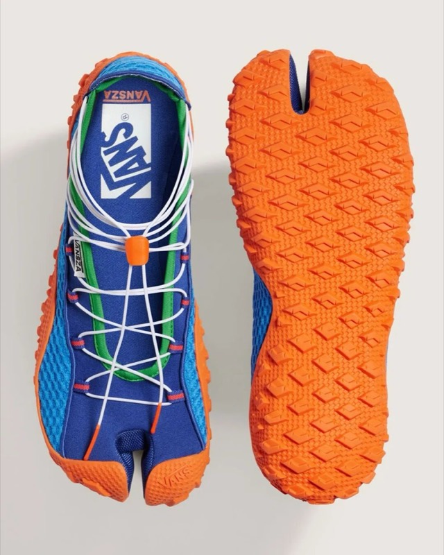
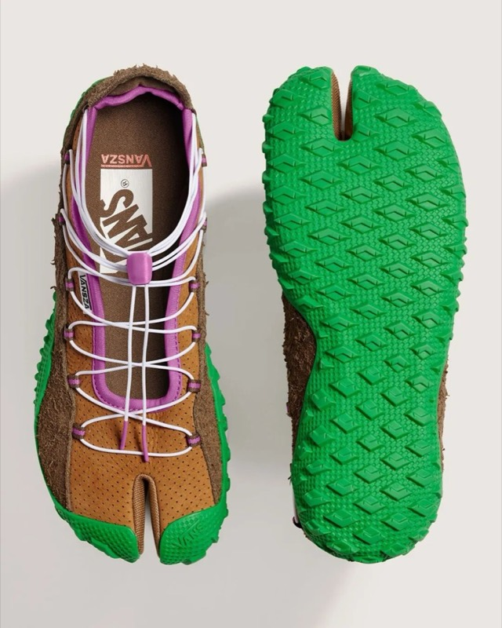

## 3. 壹虎野营｜双人帐的空间，往头顶多撑一点

双人帐能躺下两个人，坐起来是否局促，还要看帐体上方怎么撑。壹虎野营 BASTION 2P（远航者二人帐）采用 H 型帐杆结构，顶部横杆向两侧撑开上部空间，减少帐壁向头脸收拢的压迫感。面向初次露营的人，这套结构也把搭建作为设计重点，让杆件的展开与支撑关系更直观。

帐体采用自立设计，在硬土、石地等不便打钉的位置可以先撑起成形，固定仍需结合地面条件完成。大幅开启的帐门配合两侧窗，兼顾视野与通风；侧面另设风绳固定点。品牌提供的参数显示，外帐采用 75D 涤纶，标示防水指标为 3000 毫米，净重约 2.63 千克，收纳尺寸为 58×18×16 厘米。

这顶帐篷可以关注的，是横杆对上部空间的改善，以及开门、开窗后更开放的停留体验。约 2.63 千克的净重和 58 厘米的收纳长度，则是携带时需要考虑的另一面：周末短途露营可以按运输方式安排，摩托车或自行车出行尤其要先确认装载位置。它的设计取向偏向日常营地过夜，侧面增加风绳，也不足以直接推导出应对大风的能力。

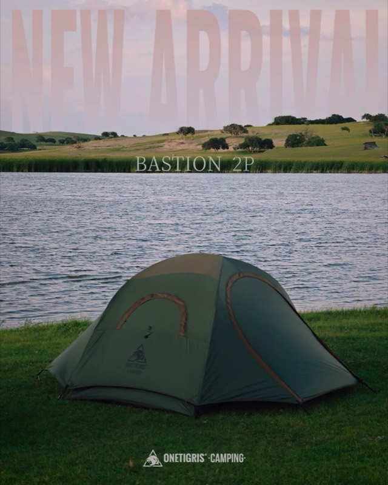
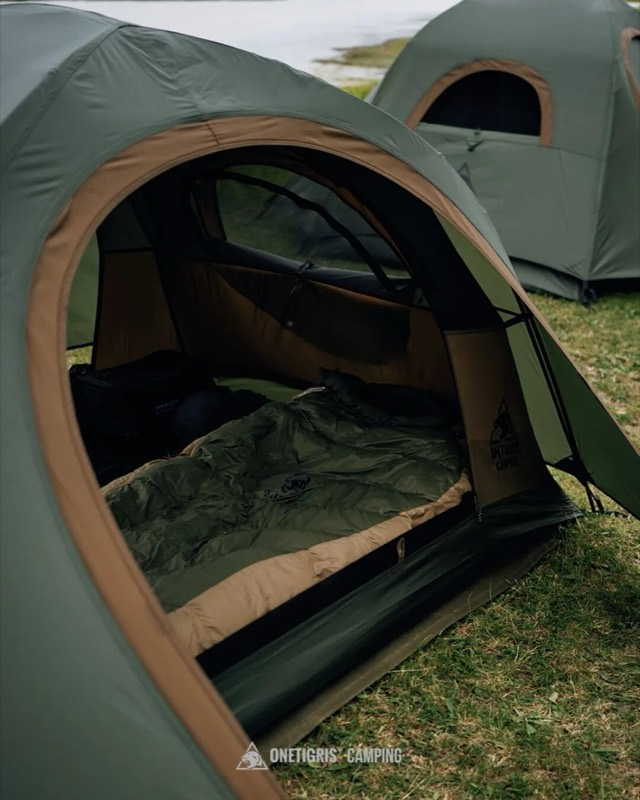
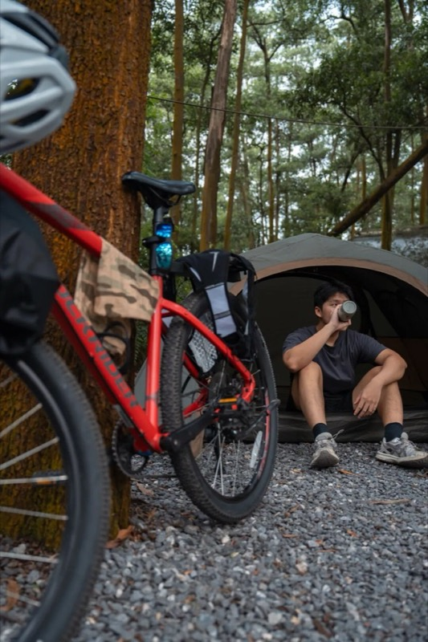
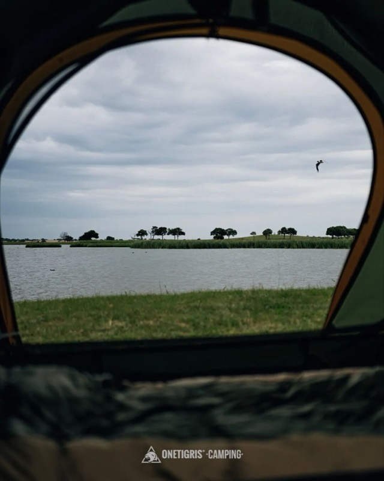

## 4. NANGA｜睡袋防潮，连缝线也做拒水处理

帐篷没漏雨，睡袋也可能碰上帐壁凝水。对羽绒睡袋来说，受潮后能否维持蓬松与保暖，是过夜时比外观更实际的问题。NANGA 的山岳睡袋系列 DRYDRATE BAG，将拒水处理用在三个部位：UDD DX 疏水羽绒、15D 拒水尼龙外层，以及线材本身具备拒水性的绗缝线。缝线虽小，却补充了只看面料防潮时容易漏掉的一项材料细节；这些处理也不等于整条睡袋完全防水。

调整还涉及睡进去之后的空间。按品牌介绍，侧拉链相较 UDD BAG 向胸侧移动，意在减少靠地面一侧的冷风侵入；立体脚箱为脚趾留出余量，减少脚部挤压填充。头肩区域则考虑了穿着羽绒服入睡的状态，让衣服与睡袋叠加保暖时，不至于过分局促。

这组设计对应的是两种具体的过夜麻烦：睡袋碰到水，以及加穿衣物后内部太挤。前者靠材料处理，后者靠剪裁与空间分配。对已有 UDD BAG 的用户，是否值得换新，还需要比较同温标型号的重量、尺寸与价格；仅凭拒水缝线这一项，尚不足以判断整条睡袋的升级幅度。

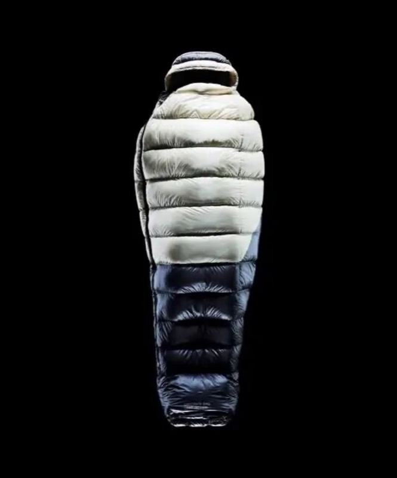
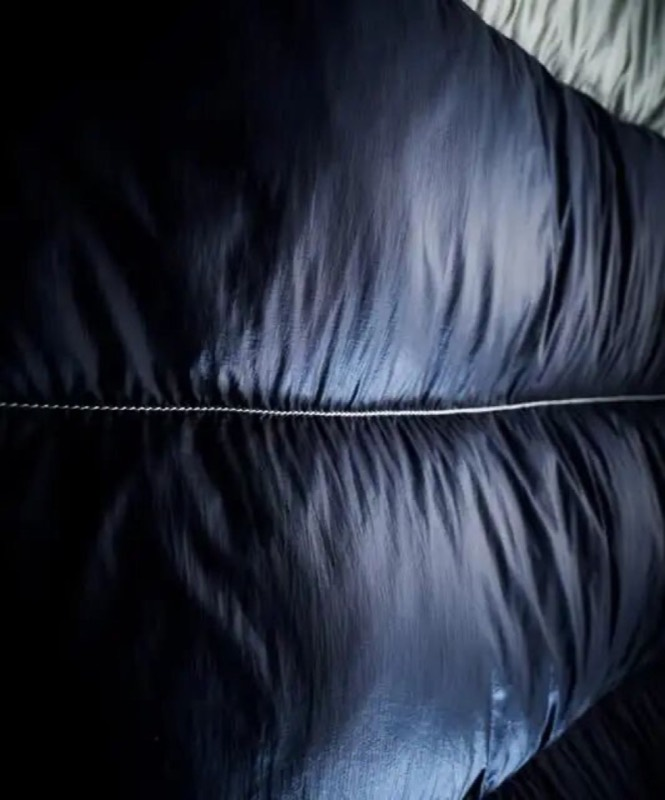
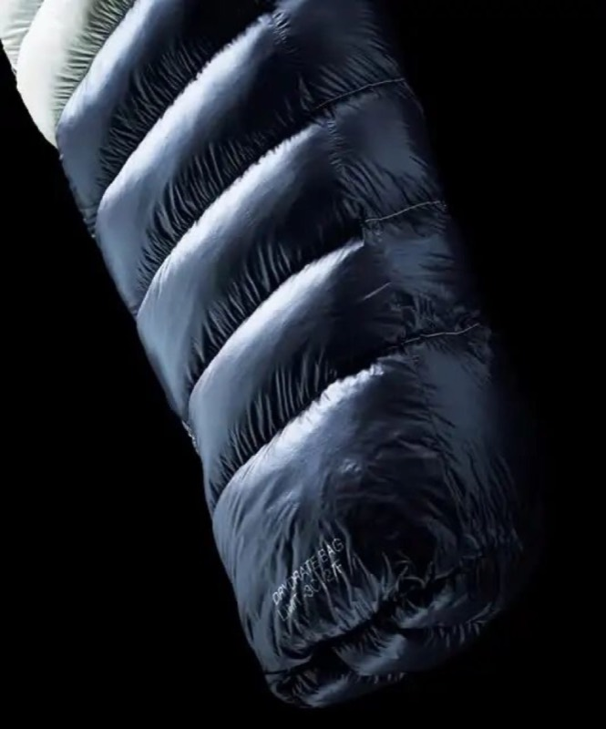

## 5. GROUNDCOVER｜给行军床搭一顶单人帐

给行军床配帐篷，除了能否放进去，还可以看躺下之后能看见什么。韩国品牌 GROUNDCOVER 的 COT TENT X，以拱形帐体罩住行军床，发布图中两侧大面积开口敞开，视线可以穿过床铺望向树林。床面离地，帐体下缘则延伸至地面，保留了床上、床下不同高度的空间。

COT TENT X 展示了低床与加高床腿两种搭配状态，另有大面积网纱面板与顶部小型通风开口。外露帐杆勾出弧形轮廓，白色款搭配黑色杆件与补强细节，黑色款则更突出帐门打开后的剪影。比起笼统地说“紧凑单人小屋”，它更鲜明的特点，是把行军床两侧的视野尽量打开，让躺卧休息也能保持与周围环境的联系。

品牌已于9月10日开放订购，提供 Griffin Grey、白色和黑色，计划9月21日至30日按备货进度陆续发出，也可能提前。首发权益为一张 COT TENT X 专用地布，购买入口设于品牌简介中的 Naver 在线商店。照片中的行军床是否随帐提供、适配哪些床型，仍需以商品清单确认。

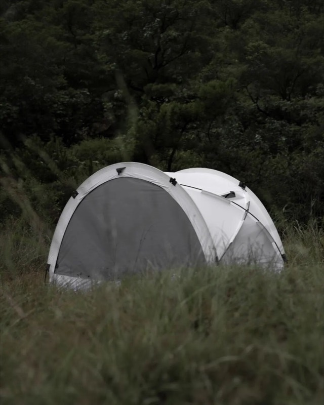
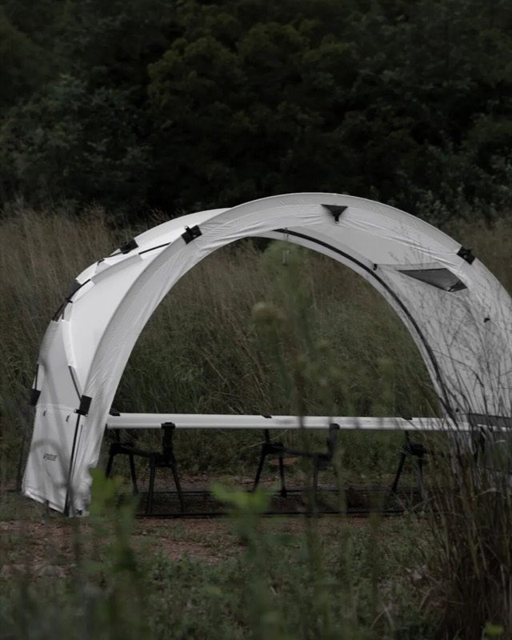
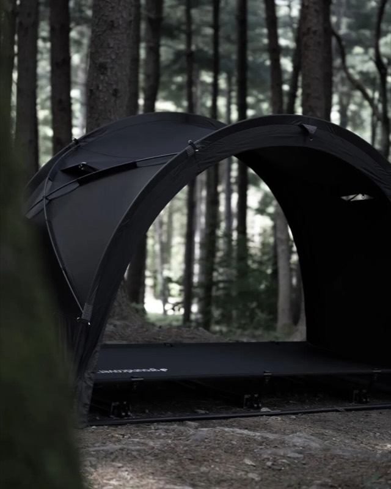
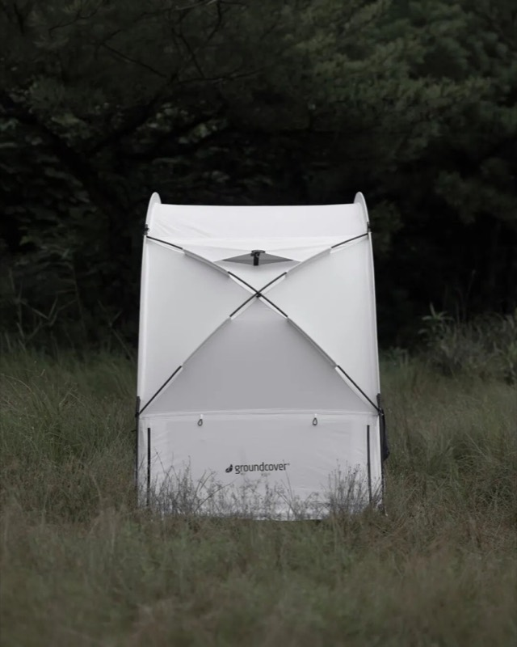
