# KEEN：凉鞋有了大人感 | 营事编集室 vol.246

- 发布日期：2026-08-31｜形态：普通图文｜系列：营事编集室（vol.246）｜来源：https://mp.weixin.qq.com/s/kk9MVmoT0aSP-43-38oyLw

## 导读

本期导读
01｜TNF × eYe Junya Watanabe MAN｜功能细节重新回到衣服表面02｜KEEN｜户外凉鞋也想去更多场合03｜幂里 × TFS｜轻量帐篷有了科幻机能感04｜Nike ACG｜这双 Picklejus 要等到 202705｜Strava｜跑步热力图多了一个用途

## 1. TNF x eYe Junya Watanabe MAN｜功能感回归，极简先离场

The North Face 和 eYe Junya Watanabe MAN 九年后再次合作。它值得看，不只是因为两个名字重新放在一起，而是因为 Junya Watanabe 又做了一件很 “反当下” 的事：当很多户外外套都在变轻、变干净、变得更像城市制服时，他把一件复古 Search and Rescue 救援背心，直接叠到了经典 Mountain Jacket 外面。

这件外套不应该被理解成一件真正的山地救援装备。它更像是 Junya Watanabe 熟悉的功能时装处理：把救援、工装、军装和户外外壳这些元素拆出来，再缝回一件日常可以穿的外套上。Mountain Jacket 原本负责挡风挡雨，救援背心一上身，整件衣服马上变得更重、更忙，口袋、分区、外挂感都跑到最外面。它不再追求那种极简户外的干净体面，而是把 “我身上能装东西、能应对天气、像是要出门办事” 的感觉重新做出来。

同系列还有一件改造版 MA-1 Bomber。MA-1 本来就有军装和工作服底色，短身、利落、方便活动；这次放进 The North Face 的技术面料和防天气语境里，也不是为了证明它能陪你完成一条高山路线，而是让一件时装外套保留更多真实功能的痕迹。Junya Watanabe 最有意思的地方就在这里：他做的不是 “户外风”，而是让衣服看起来真的经历过功能系统的改造。

所以这组联名的看点，应该放在 “功能感如何重新回到衣服表面”。不是所有户外时装都要变得平整、轻薄、好搭；有时候口袋、背心、绑带和多余的一层，反而是衣服最有生命力的地方。对 CSW 读者来说，这件 Mountain Jacket 的启发不在专业性能，而在它提醒我们：户外服装的魅力，很多时候来自那些具体、粗粝、带一点任务感的细节。

该系列包括 Search and Rescue vest Mountain Jacket 与改造版 MA-1 Bomber，价格区间为 775 至 1250 美元。亚洲和欧洲已于 2026 年 8 月 20 日率先发售，美国则在 8 月 27 日发售，目前通过 The North Face 官网及部分指定零售渠道限量上架。

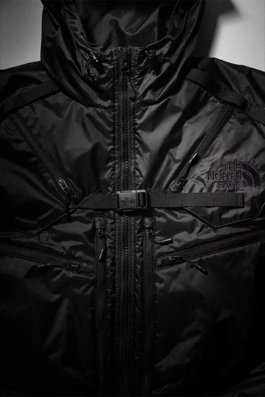
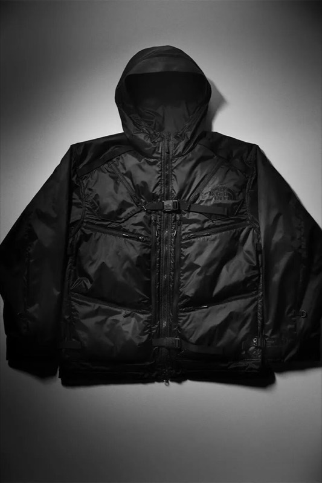
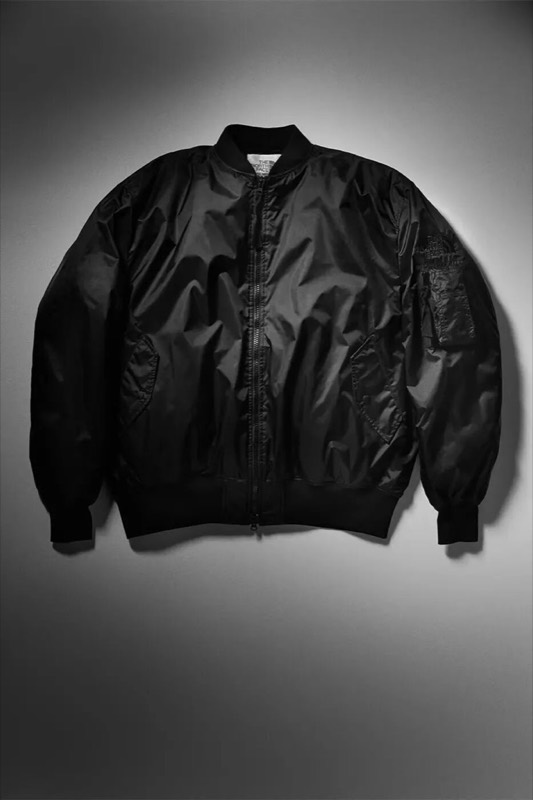
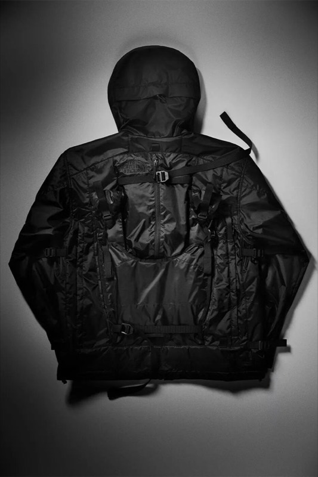

## 2. KEEN｜凉鞋有了大人感

很多人喜欢 KEEN，是因为它好走、透气、脚趾有保护，夏天从城市走到旅行都很方便。但问题也很明显：经典 Newport 这类鞋一眼就是户外凉鞋，去海边、营地、街头都成立，换到通勤、晚餐、展览，甚至稍微正式一点的场合，就容易显得太松弛。

这就是 Nocturnal Pack 系列要解决的痛点。KEEN 没有直接做一双传统皮鞋，而是把自己的开放式鞋身和混合户外结构，压进更黑、更克制的外观里。系列包括 Uneek Loafer，以及两款新鞋型 Newport Oxford 和 Hyperport Derby。Newport Oxford 像是把经典 Newport 冒险凉鞋往 Oxford 鞋方向推了一步，保留透气开口和包覆结构，但换上黑色皮革鞋面；Hyperport Derby 则借用了 Derby 鞋的鞋面比例，让它看起来更像一双日常黑鞋，而不只是凉鞋。

对读者来说，这不是一条 “户外品牌做正装鞋” 的新鲜事，而是一个很现实的穿着问题：当户外鞋已经进入日常衣柜之后，它要怎么继续往更多场合走？Nocturnal Pack 给出的答案不是隐藏 KEEN 的样子，而是把 KEEN 最有辨识度的脚感、开放结构和混合属性，调到一个更容易搭衣服、更不挑场合的状态。你还是能看出它是 KEEN，但它终于没那么像刚从河边回来。

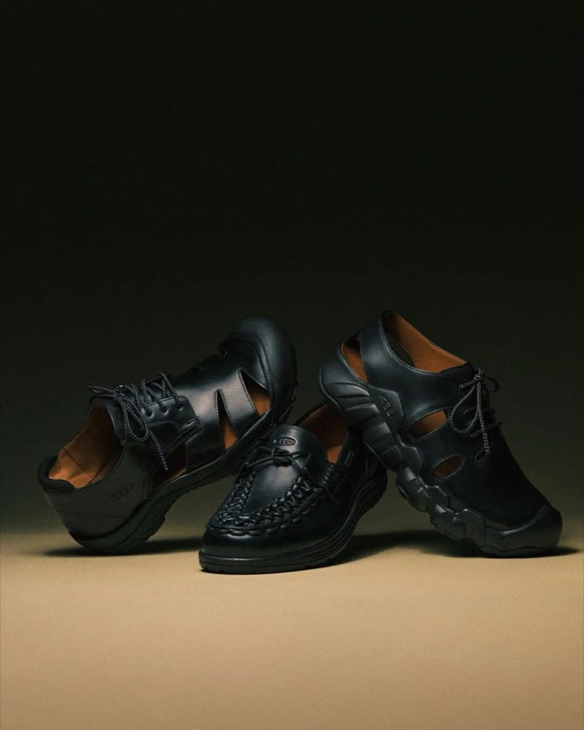
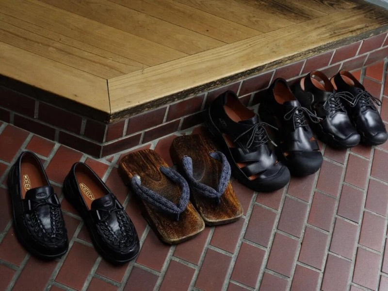
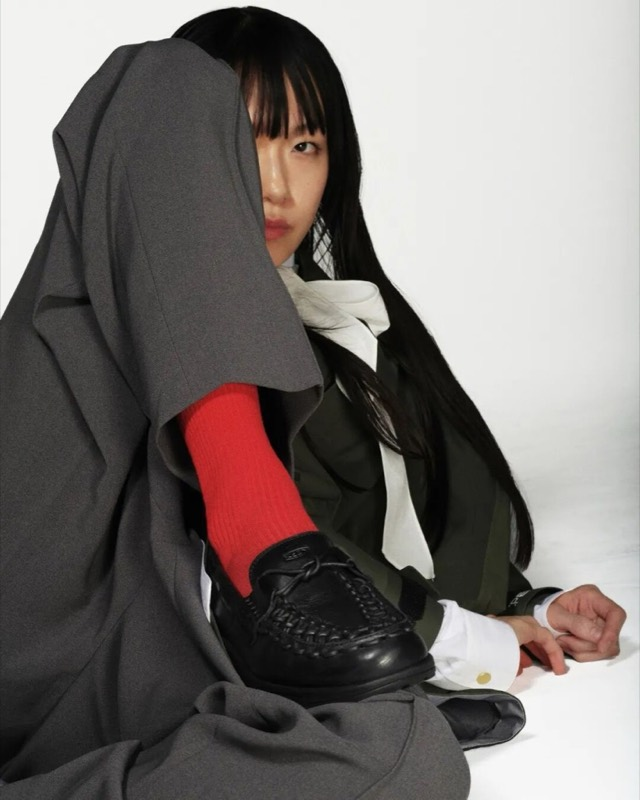
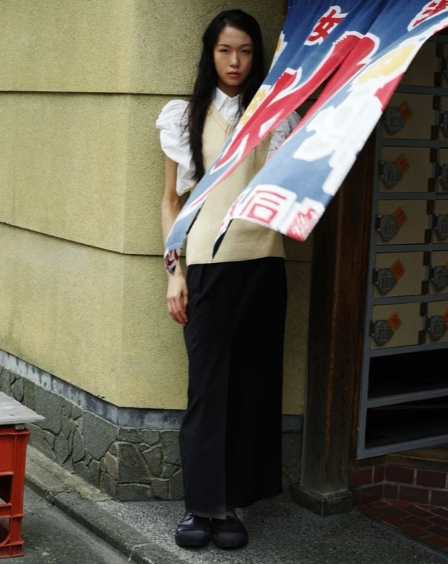
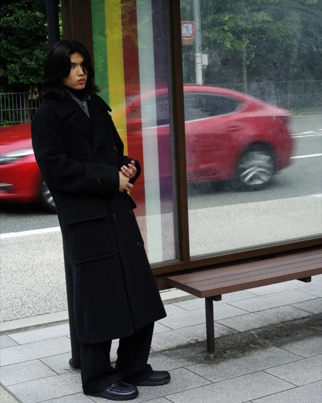
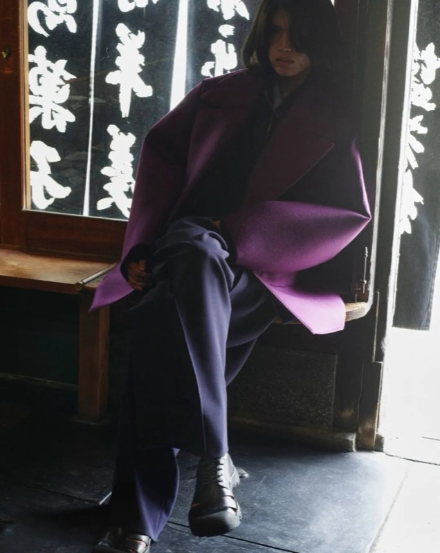
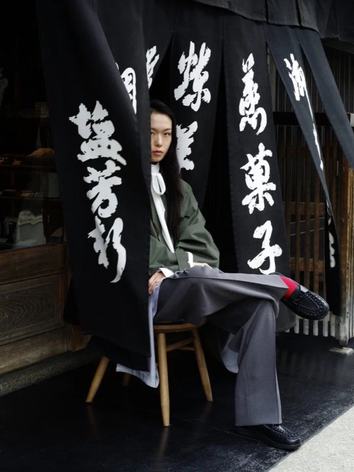

## 3. 幂里 x TFS｜机能帐篷开始赛博

国内新晋户外设计师单位 幂里MUSE VOYAGER 早前因为释出机能感上水器而被露营爱好者所认识，最近品牌与自由之魂带来了一顶联名版繁星3帐篷。自由之魂的繁星系列原本就是国内轻量帐篷里辨识度很高的产品，这次 幂里 MUSE VOYAGER 介入的重点，放在了视觉语言上：一个版本采用黑灰配色、灰色帐杆与黑色印花，另一个版本则把帐杆、印花和内帐都处理成更彻底的全黑状态。

它的有趣之处，是把 幂里 MUSE VOYAGER 一直强调的科幻感、新锐视觉和机能服装气质，放进了自由之魂成熟的帐篷结构里。外帐使用 15D 抗撕裂格纹尼龙，单面涂硅并结合 PU 防水层，标称静水压 3000mm；帐脚位置配有高强度合金扣件，可通过双向拉带调节帐布松紧；风绳使用 Dyneema 大力马线芯，地钉则为 7A04 高硬度铝合金三棱地钉。

这类联名真正值得看的是，它没有重新发明一顶帐篷，而是把一个成熟帐型变成更强烈的营地视觉装置。过去很多轻量帐篷的审美都围绕自然色、低饱和和功能露出展开；幂里 MUSE VOYAGER 这次让繁星 3 进入了更黑、更图形化、更偏机能服装的语境。毕竟，黑化依然是风格户外的入门首选。目前新品上市限时早鸟价 1880，9月10日恢复原价，详情请查看品牌小红书官号。

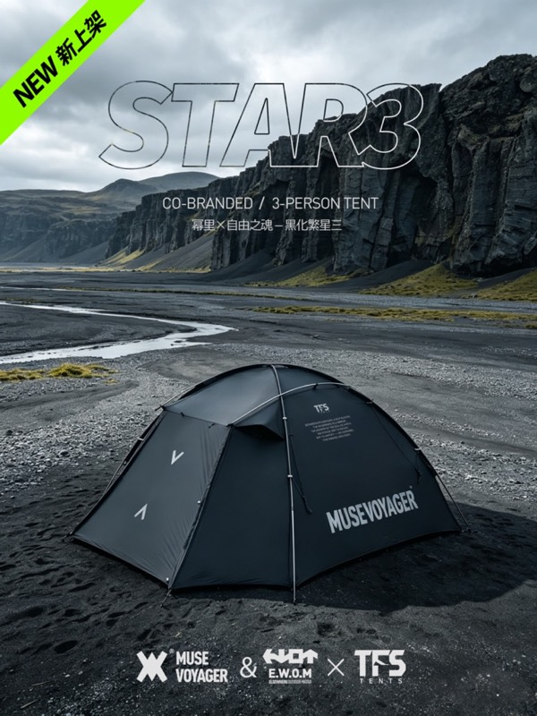
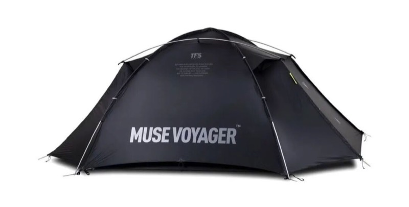
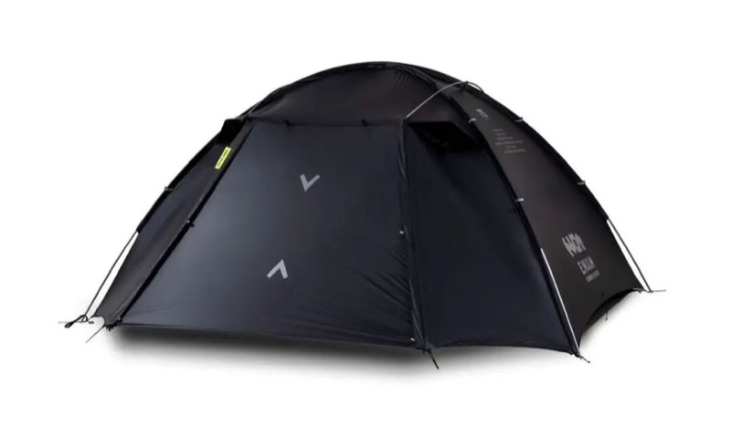
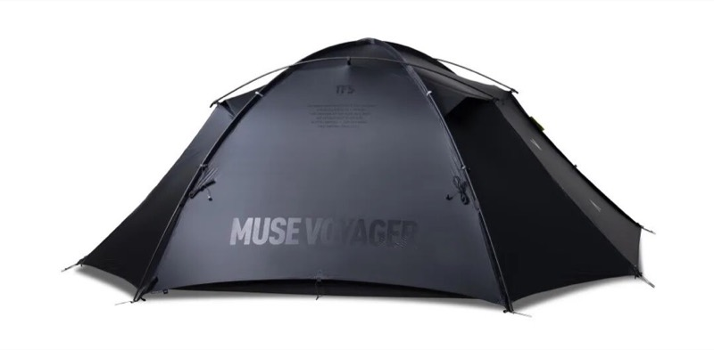
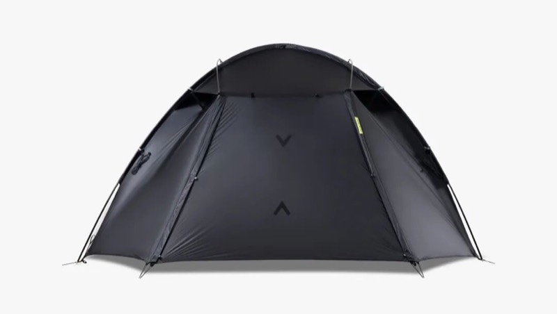
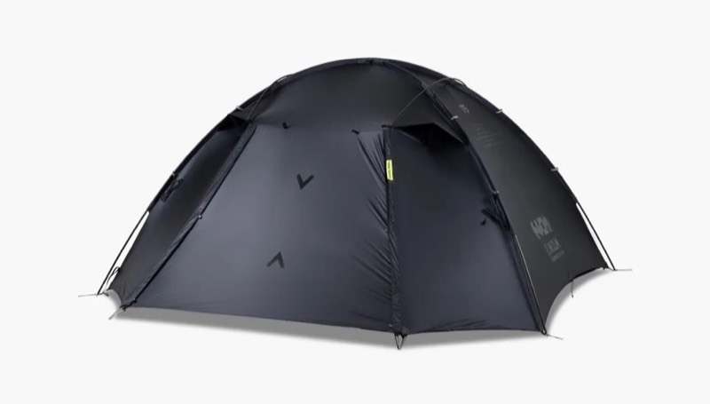

## 4. ACG｜这双跑山鞋，值得等到2027

Nike ACG 的新鞋 Picklejus，最早在今年 UTMB 周期间出现在霞慕尼。相比过去 ACG 更偏山野生活、徒步与户外穿搭的产品印象，这双鞋明显把重心推向了更严肃的长距离山地跑。它的开发背景也直接指向勃朗峰一带漫长、复杂、消耗巨大的山径环境。

Picklejus 这个名字来自耐力跑圈里一个有点神话色彩的民间经验：酸黄瓜汁常被跑者用来应对抽筋。鞋子本身也围柔软的 ZoomX 核心负责缓震；鞋面则是为山径调整过的 Flyknit，加入包裹线缆与疏水纱线，应对湿地、碎石、上下坡和天气变化。外底使用 ACG 自家的 GOATEK 橡胶，鞋底摇椅弧线还呼应了 “pickle” 的形状。

真正值得关注的是， ACG 正在用一双鞋重新解释自己的边界：从 “能去户外” 的装备，走向 “能在大山里长时间移动” 的系统。三年运动员访谈、10 项研究、20 个原型、超过 100 名运动员测试，说明它不是一双简单借 UTMB 热度出现的概念鞋。不过它要到 2027 年底才会正式上市，留给跑者和 ACG 玩家继续等一阵子。

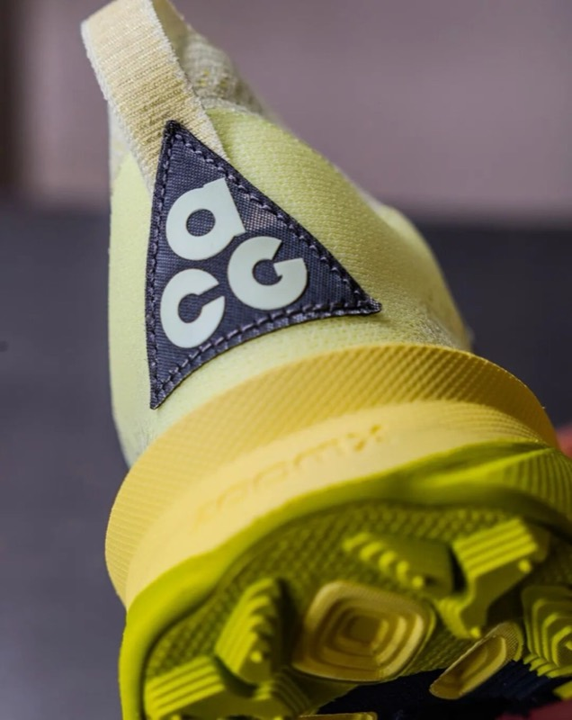
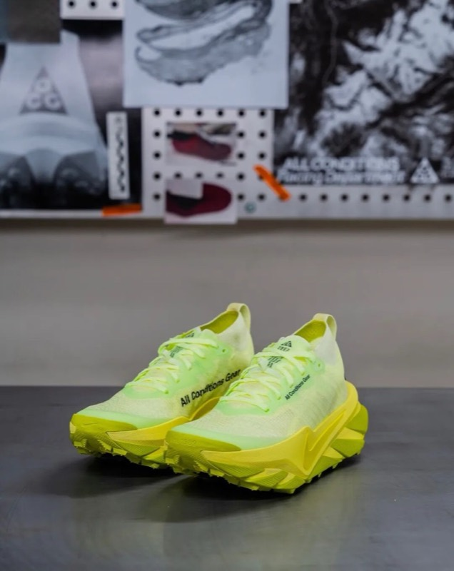
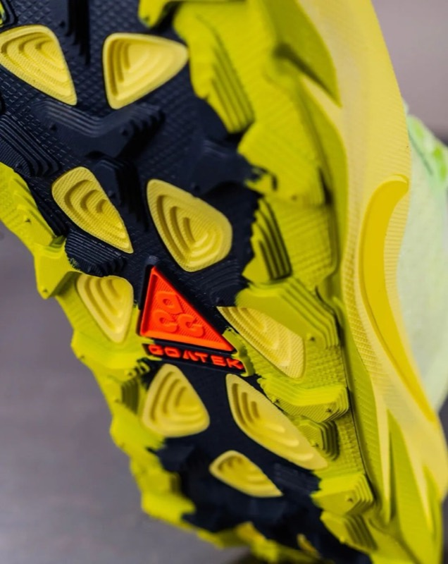
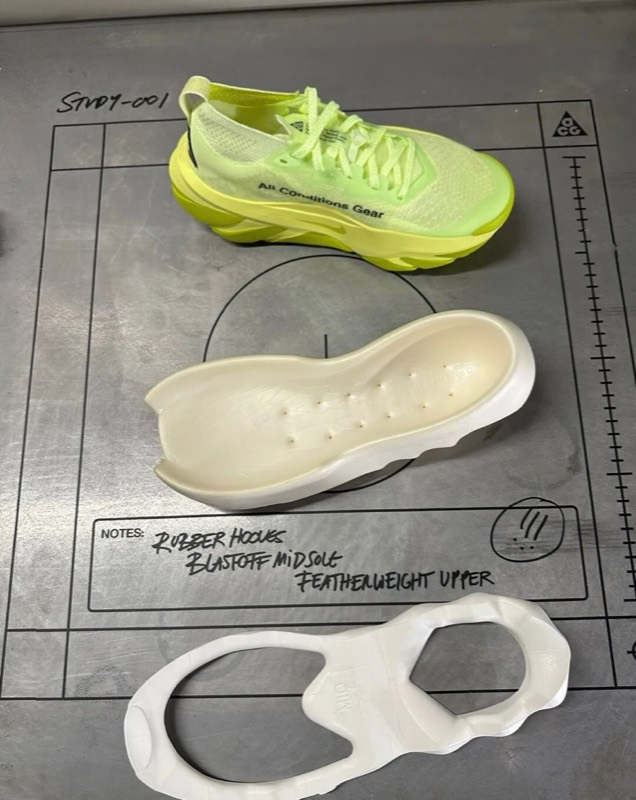
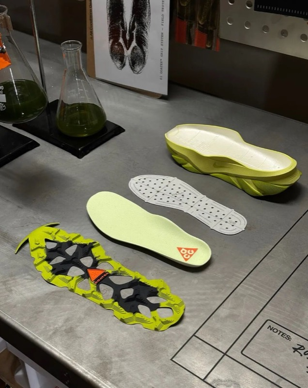
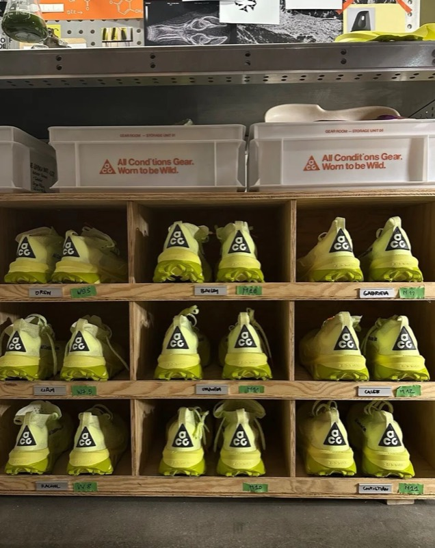

## 5. Strava｜搬家先看跑步热力图

Strava 诞生于 2009 年，最早服务的是骑行者和跑者：记录路线、速度、里程，也把个人训练变成一种带有社交感的竞争。到了今天，它的用途正在被用户重新发明 —— 一些准备搬去新城市的人，开始用 Strava 的全球热力图判断哪里更适合居住。

这个逻辑并不复杂。热力图显示的是大量用户实际跑步、骑行、徒步留下的轨迹密度。某个街区如果长期出现高频的人力移动，往往意味着附近有公园、绿道、自行车道、开放水岸，或者至少存在一群愿意在户外移动的人。对一个陌生城市来说，这比单纯看房价、通勤时间、商业配套，多了一层身体层面的信息：人们到底在哪里走、在哪里跑、在哪里愿意把日常生活放到户外。

当然，Strava 不能直接证明一个地方安全、宜居或社区质量更高。它更像是一张由身体行动生成的城市使用说明书。对户外人群来说，这个启发很直接：判断一座城市，不只看地图上有什么设施，也看真实的人怎样穿过它。当跑步路线、骑行轨迹和公园边界叠在一起，城市生活的好坏，开始有了另一种可视化线索。

国内用户也可以借用这个思路，只是工具不一定只有 Strava。Keep 是更大众的运动入口，咕咚、悦跑圈、行者、两步路则更接近跑步、骑行和户外轨迹社区。再加上高德、百度地图里的绿道、公园、水岸路线，以及小红书上的跑团和骑行集合点，基本能拼出一张本地版 “运动生活地图”。它不能直接告诉你哪里最宜居，却能提示一个更身体化的问题：这个街区，有没有足够多的人愿意出来跑、出来骑、出来走。

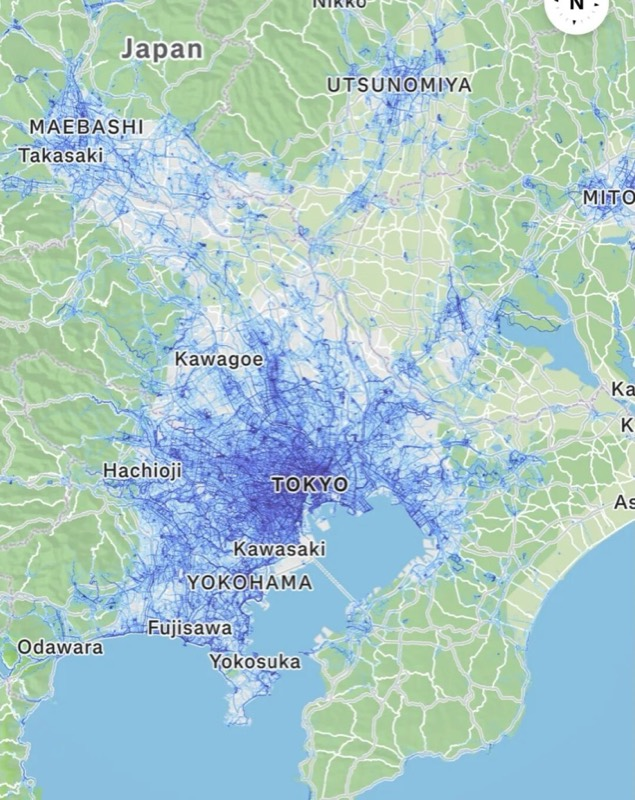
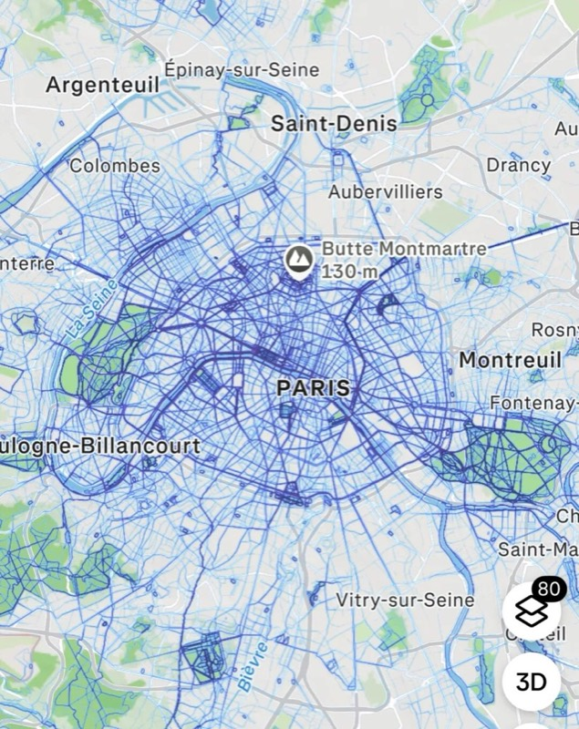
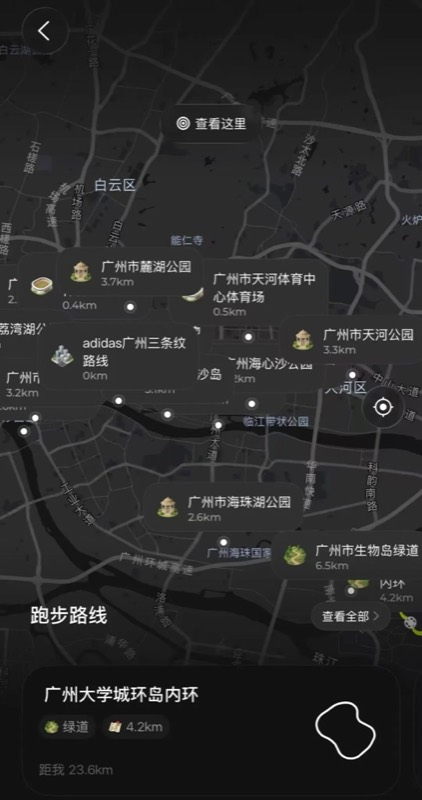
