# norda x BD：一双鞋不够跑山了 | 营事编集室 vol.245

- 发布日期：2026-08-28｜形态：普通图文｜系列：营事编集室（vol.245）｜来源：https://mp.weixin.qq.com/s/9ux3Z0JyYVDc7pkbrd7elQ

## 导读

本期导读
01｜norda × BD｜一双鞋不够跑山了02｜HARDMADE® × 0/0｜一把更贴地的露营椅03｜FILOMELA｜把恶魔做成一只青花瓷首饰盘04｜山由云 YUUUN｜天幕杆少浪费一点高度05｜Db × PMB｜把钓鱼背心接进行李系统

## 1. norda × Black Diamond｜一双鞋不够跑山了

现在的户外联名太多，很多看完只记得新配色。但 norda® 和 Black Diamond 这次值得多看一眼，因为它不是一次短期 capsule，而是双方宣布长期战略合作后的第一个高山越野装备系列。一个是近几年在越野跑圈快速建立辨识度的加拿大跑鞋品牌，靠 Dyneema® 鞋面、Vibram 鞋底和长距离耐用性被记住；一个是从攀登、滑雪到山地装备一路做过来的 Black Diamond，更熟悉高山环境里的支撑、携行和风险。它们放在一起，讨论的就不只是 “跑鞋好不好看”，而是越野跑装备会不会从单品竞争，继续走向系统竞争。

☜左右滑动

首个系列围绕高海拔山地越野移动展开，配色灵感来自高山矿石，并融入 Black Diamond 与 norda® 越野跑运动员 Joe Grant 的专业洞察和实战经验。产品包括全新 000 高山越野跑鞋、Distance 15L 越野背包、Distance Carbon Z FKT 越野杖、Mini Mission Duffle 30L 装备包、Miniwire Carabiner 轻量丝锁扣，以及 T 恤和经典帽款。其中 000 搭载 Vibram 最新中底技术 Vibram Stream Flow，强调在不同速度、距离和复杂地形下保持稳定回馈；背包、越野杖和装备包，则把补给、爬升支撑与出发前后的收纳一起放进同一套高山移动逻辑里。

这次联名真正有意思的地方，是它把 “跑山” 从一双鞋往外推了一步。真正进入山里，跑者面对的从来不是单一动作：脚下要轻、要稳，身体要背补给，爬升时需要杖，结束后还要处理湿衣服和装备。norda® 擅长解决长距离跑者脚下的反馈，Black Diamond 擅长做完整山地装备系统，两者长期合作，说明越野跑正在被更认真地当成一套高山移动方式来看待。首期 Black Diamond x norda® 系列已于 8 月 26 日在法国霞慕尼 Sanglard Sports 线下亮相，并同步登陆 norda® 与 Black Diamond 官网。

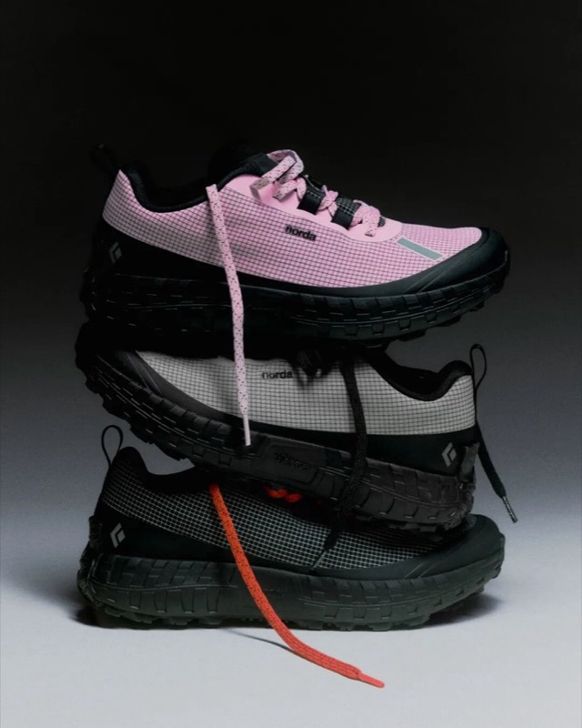
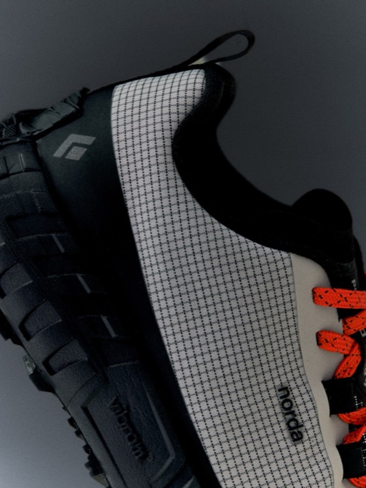
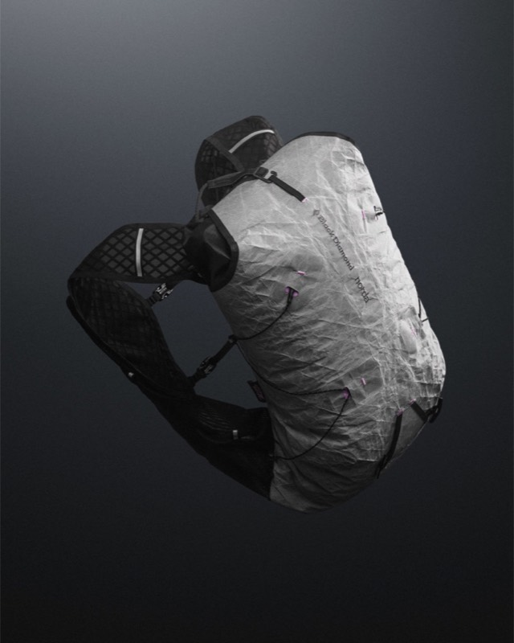
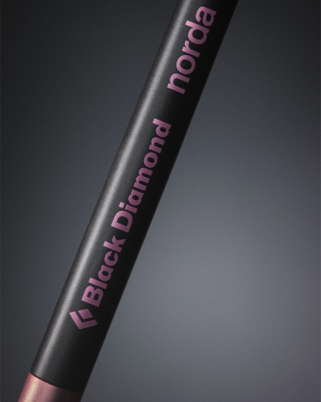
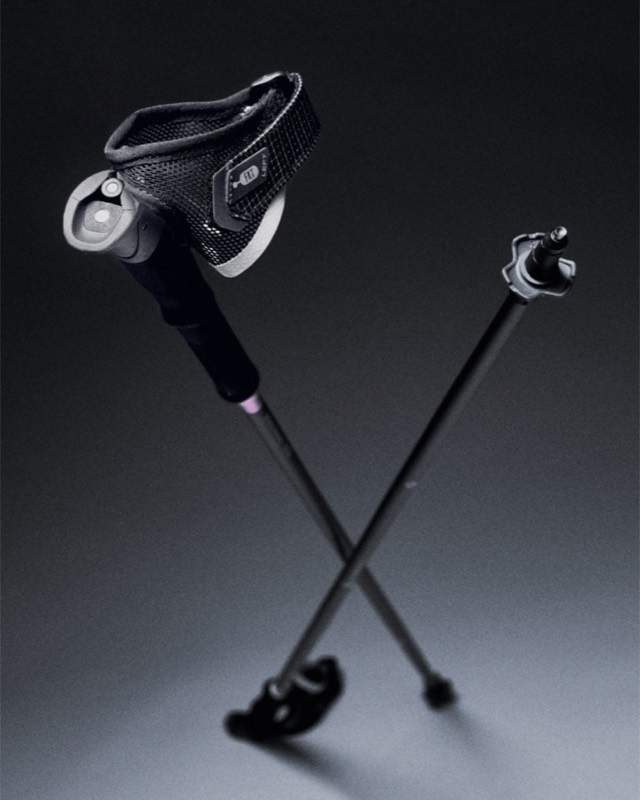
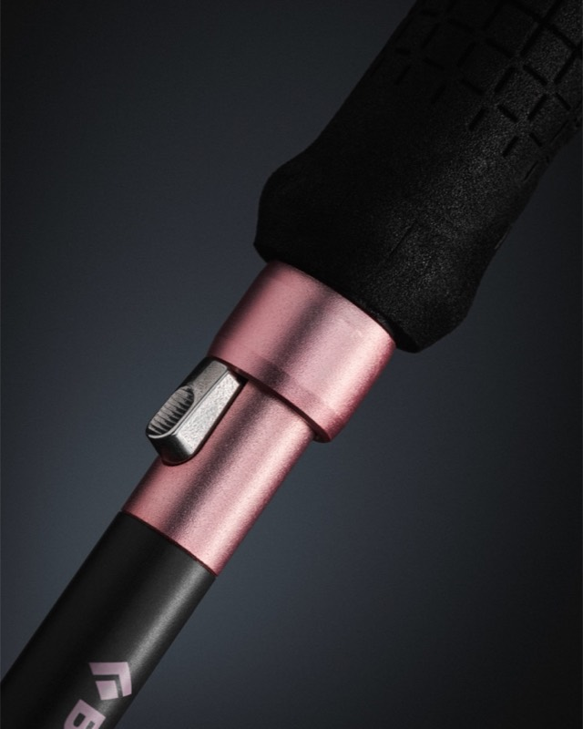
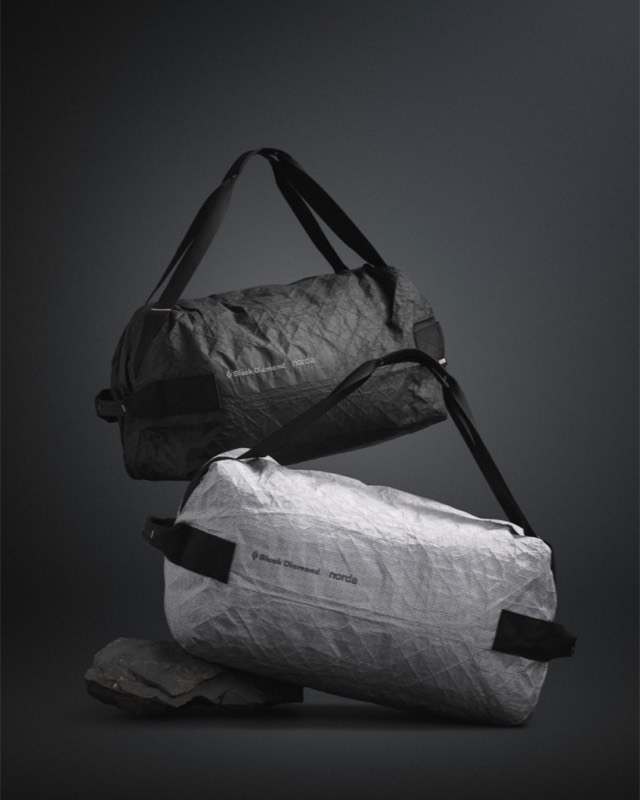
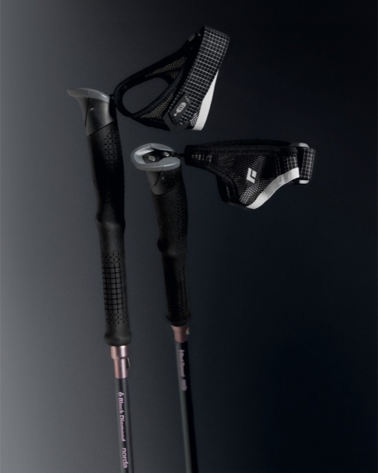
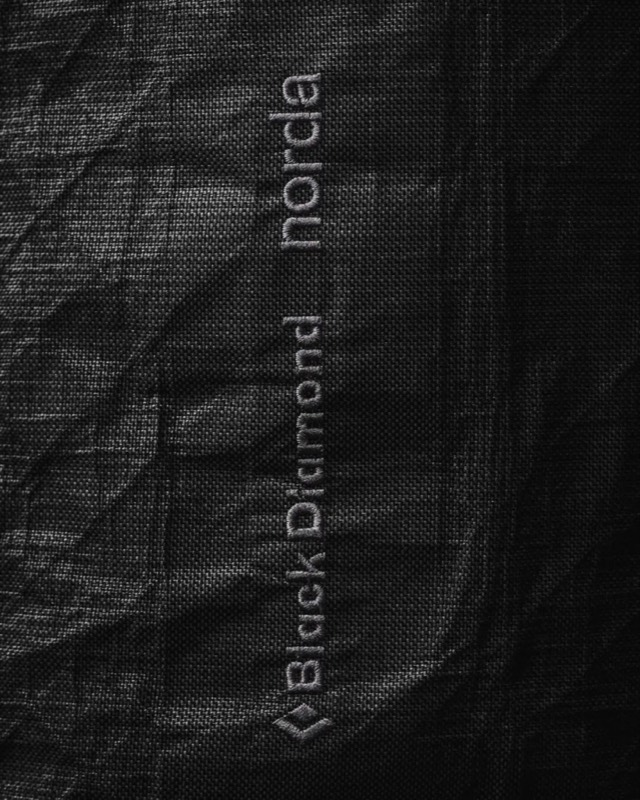

## 2. HARDMADE® × 0/0｜一把更贴地的露营椅

HARDMADE® 推出全新地面椅 GROUND Z，并率先带来与 0/0 neru design works 的联名特别版。HARDMADE® 是近年在国内露营装备语境里持续做结构型产品的品牌，关注轻量化、模块化与使用细节；0/0 neru design works 则来自日本露营文化圈，延续 neru design works 对金属、皮革、木作与营地器物的审美经验，更擅长把装备做成带有收藏感和生活方式气质的物件。这次合作把对象放在 “席地而坐” 这件事上，从榻榻米椅一类贴地坐具获得灵感，重新处理户外低坐体验。

GROUND Z 展开尺寸为 55 × 45 × 55cm，收纳后约 40 × 10 × 14cm，联名特别版重量约 600g。结构上，它突破固定靠背的限制，加入可调设计，可以根据不同体型和坐姿微调支撑角度；腰部位置也做了强化，减少长时间低坐时容易塌腰的问题。坐垫部分采用 IXPE 三层结构，把隔寒、防潮功能直接整合进椅身，材料则包括防水尼龙、PVC 网布、7001 铝合金、SLS 尼龙、YKK 与 WOOJIN 配件等。

值得关注的是，GROUND Z 处理的并不是 “再做一把轻量椅” 这么简单，而是把地面、草坪、碎石地、露营床边这些更松弛的使用场景放进同一个坐具系统里。对于很多露营玩家来说，低坐姿态往往更接近围炉、看景、聊天和在帐前停留的状态；但传统地垫支撑不足，常规椅子又拉开了人与地面的距离。GROUND Z 的意义就在这里：它让 “坐在地上” 这件事变得更舒服、更完整，也更适合被带进轻量化的户外行李里。

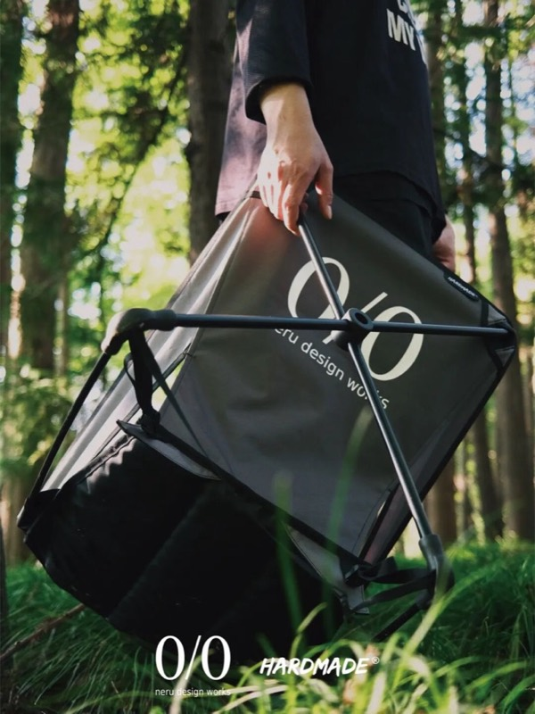
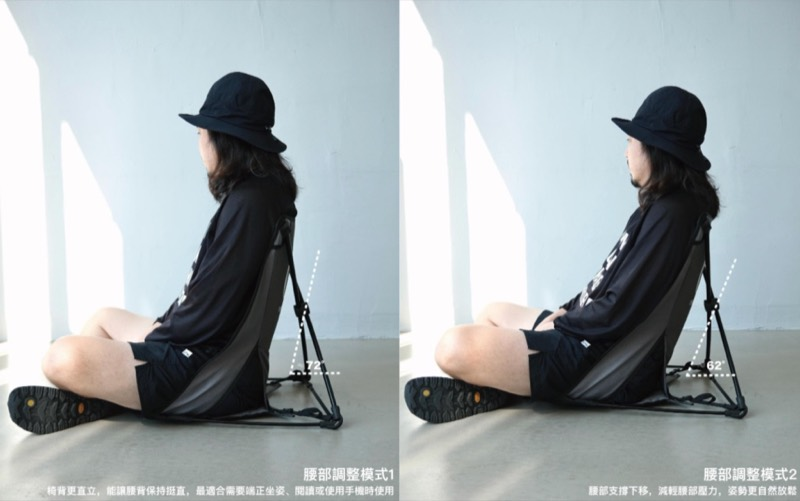
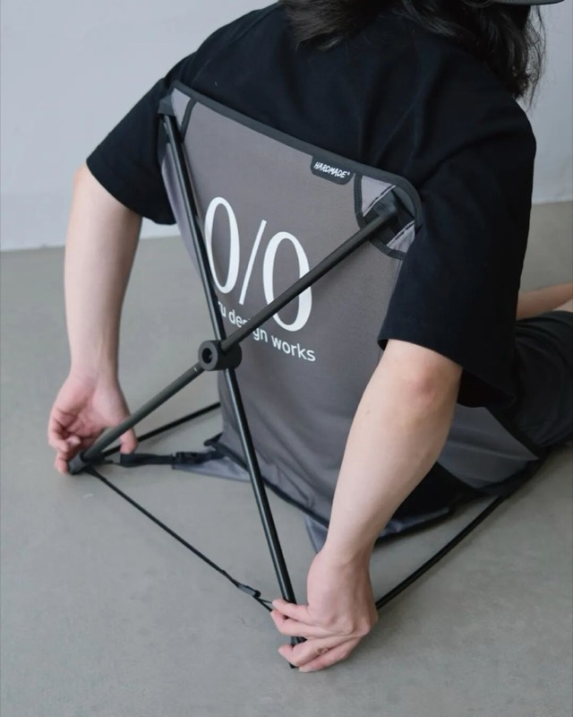
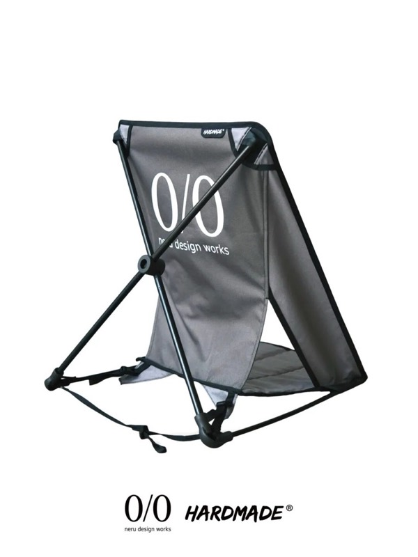
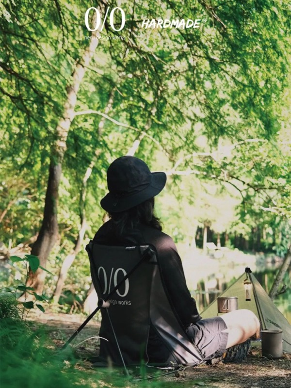
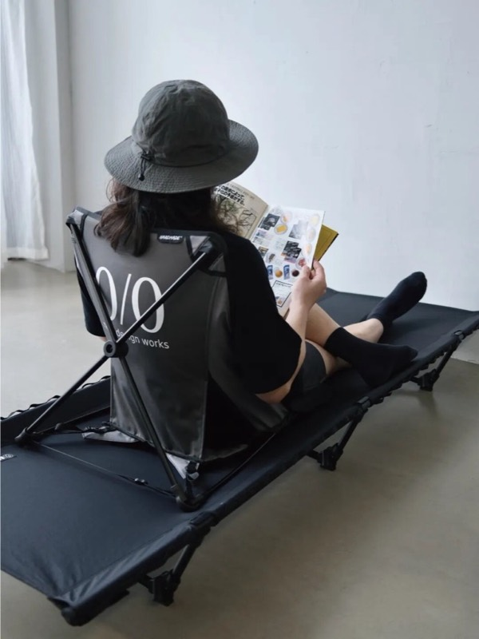

## 3. FILOMELA｜把恶魔做成一只青花瓷首饰盘

设计师品牌 FILOMELA 近日公布 LUCIFER 陶瓷首饰盘的发售信息，将于 2026 年 8 月 28 日 13:00 发售，限量 50 件。FILOMELA 长期围绕艺术器物、家品展开创作，风格中常见暗黑、神话、宗教符号与手工工艺的结合。这次品牌将代表性的「LUCIFER」形象做成陶瓷首饰盘，让原本偏收藏属性的角色，进入更具体的桌面与居家使用场景。

这件首饰盘尺寸为 183 × 65 × 172mm，重量约 320g，采用高精度手工雕刻、贴花 Logo 与手工描金工艺，并使用 Heraeus 24K 金水处理局部细节。造型上，恶魔身体与展开的翅膀共同构成盘面，青花瓷式纹样与金色犄角形成强对比。由于陶瓷釉面由人工完成，每件成品在色泽上都会有轻微差异，购买渠道则为 FILOMELA 内部邀请。

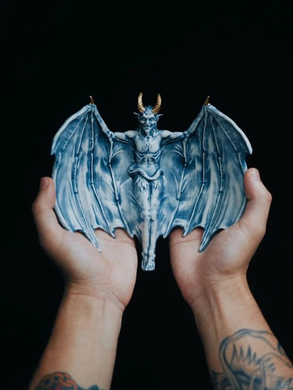
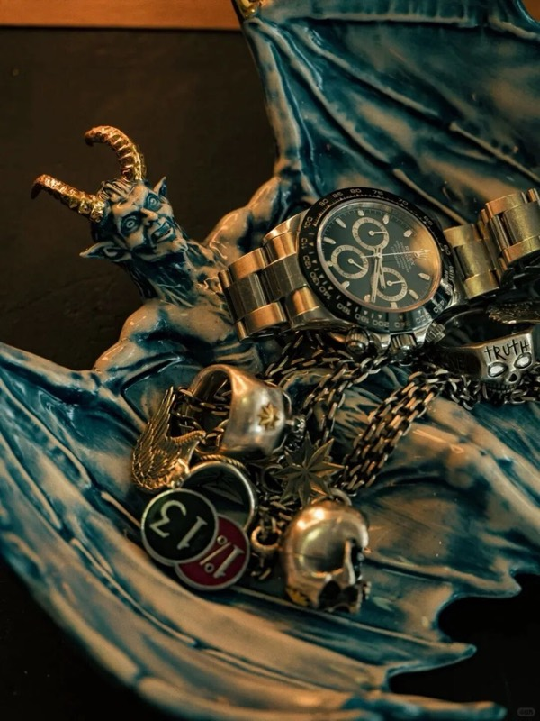
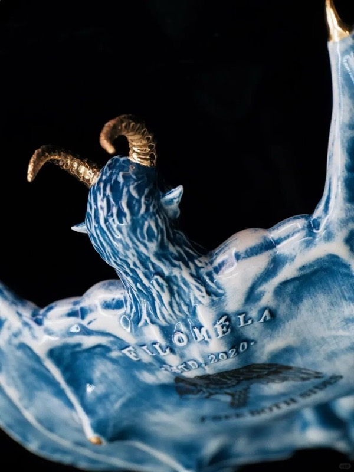
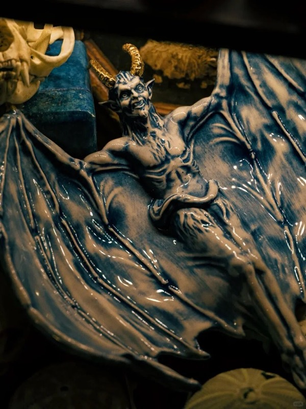
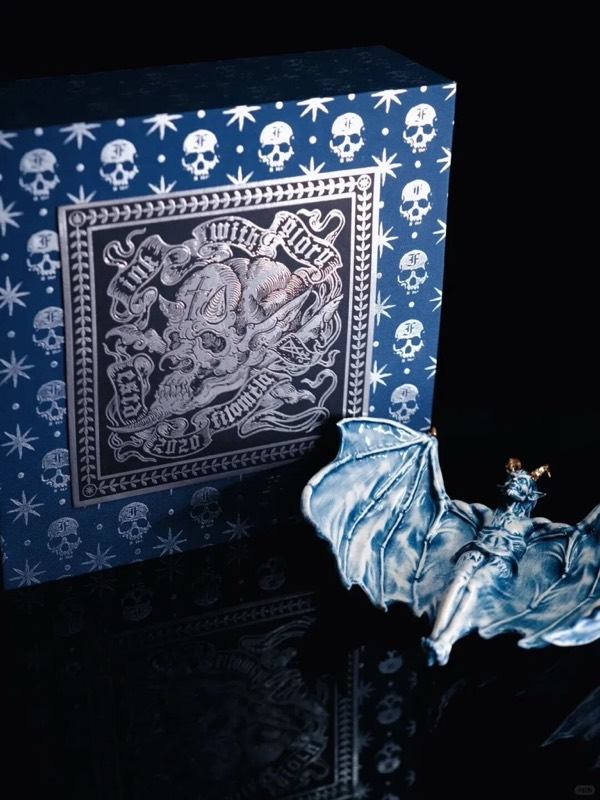

## 4. 山由云 YUUUN｜这根天幕杆，想少浪费一点高度

山由云 YUUUN 近日预告新品「如意天幕杆」。这个品牌一直在做偏细节向的露营装备与配件，视觉上有明显的工业零件感，产品思路也常放在杆件、连接、挂载这些营地系统里不太显眼、但直接影响使用体验的位置。这次的「如意天幕杆」同样从一个具体痛点进入：天幕杆通常又长又占地方，但真正支撑时，顶针部分常常浪费掉一段有效高度。

从目前释出的信息看，「如意天幕杆」采用 3K 全碳纤维，重量约 242g，四折收纳后长度约 43cm，截面约 3.5 × 3.5cm，可以放进背包或手提袋。它的调节范围最高可达 300mm，用来应对户外不平整地面的高度差。更关键的是品牌提到的新专利顶端结构：尖头状态可支撑天幕和门帘，圆头状态则可顶帐篷，例如云岗、云顶一类帐型；两种状态可以快速切换，并通过一体化设计减少零件丢失的麻烦。

☜左右滑动

值得关注的是，这不是单纯把天幕杆做轻，而是把 “有效高度、收纳长度、顶端功能” 一起重新算了一遍。很多营地装备的体验差距，并不总出现在帐篷、桌椅这些大件上，而是在杆头、接口、绳点这些小结构里：少一段无效顶针，收纳短一点，落地时能多适配一种帐型，实际搭建就会顺手很多。「如意」这个名字听起来有点轻松，但它处理的其实是露营里很真实的结构效率问题。

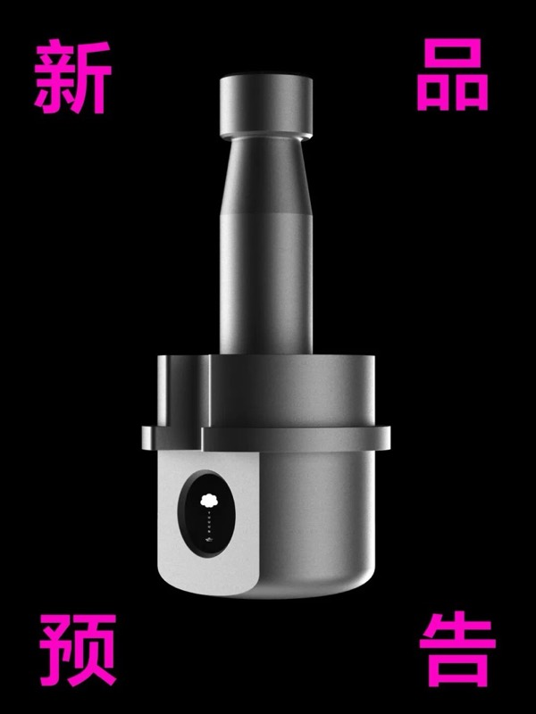
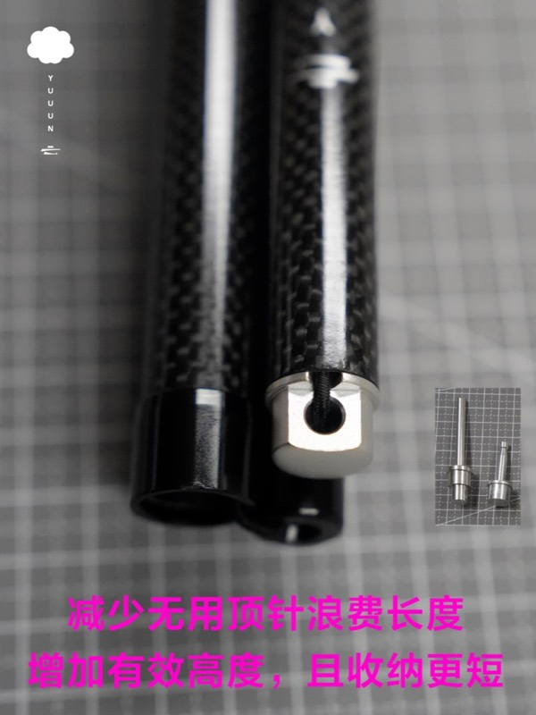
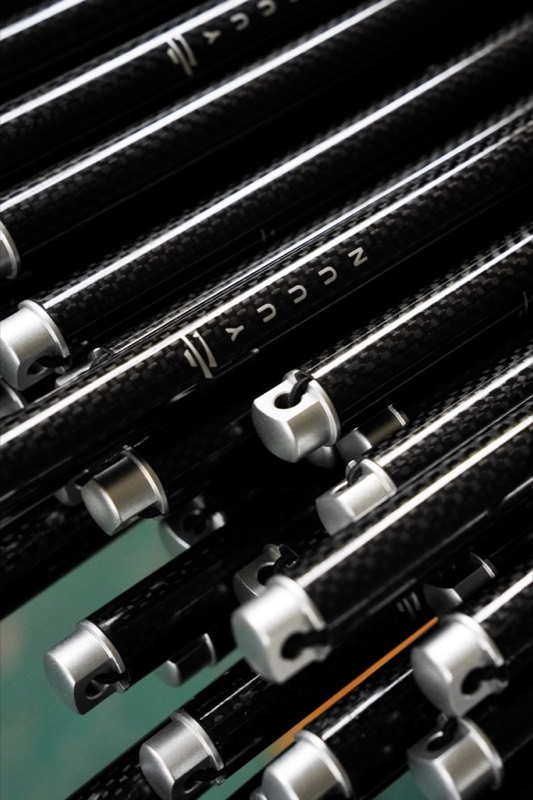
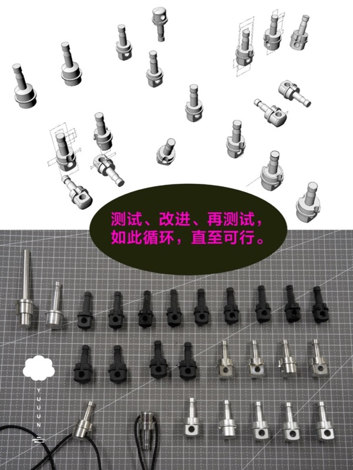
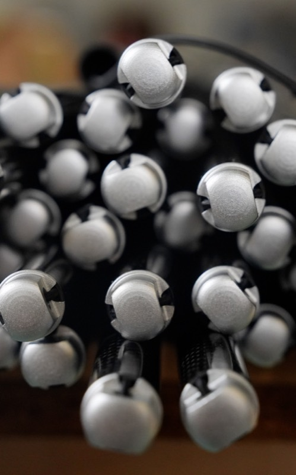
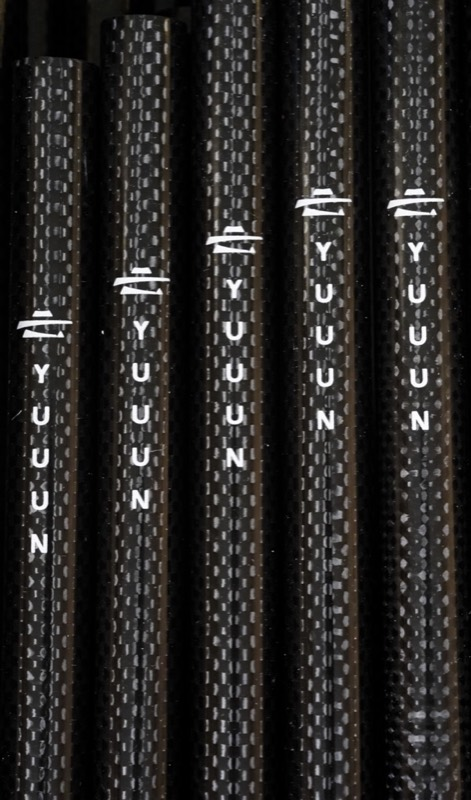

## 5. Db × PMB｜把钓鱼背心接进模块化行李系统

挪威旅行装备品牌 Db 与英国户外服装品牌 Purple Mountain Observatory 合作推出「GONE FISHING」系列。两边都带着某种“局外人”视角进入传统户外领域：Db 长期研究背包、旅行箱与移动收纳系统，Purple Mountain Observatory 则擅长把技术户外服装放进更当代的设计语境。这次双方把对象放在钓鱼装备上，从传统飞钓背心与携行方式重新做了一套现代版本。

系列的核心是一件模块化钓鱼背心，并围绕它延伸出大型 Sling Bag、技术背包等不同携行单品。材料上采用高性能轻量 ALUULA 面料，重点则落在各件装备之间的连接关系：背心不再只是把口袋固定在身体前侧的独立装备，而是可以与不同容量、不同形态的包袋组合，根据河边移动、长距离携行或城市使用切换配置。原本服务于钓具分类与快速取用的传统 fishing vest，由此被放进一套更完整的模块化 luggage ecosystem 中。

近几年飞钓背心已经频繁进入时装和城市户外，但 GONE FISHING 更进一步，把背心、Sling Bag 与 Backpack 看成一组可以拆分、连接的携行系统。钓鱼装备原本高度专门化的收纳逻辑，也因此获得了从山间河流延伸到旅行和城市移动的可能。

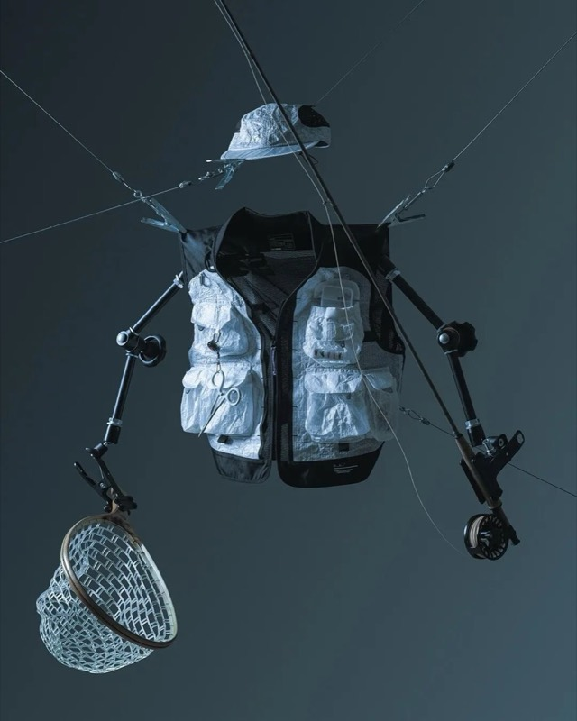
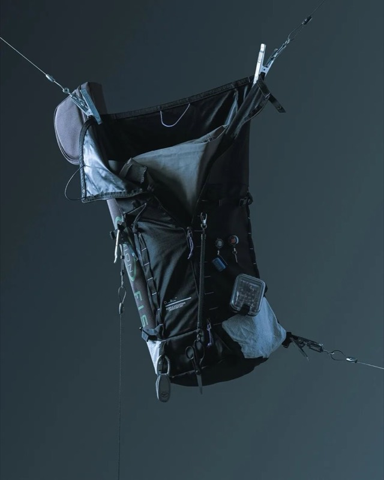
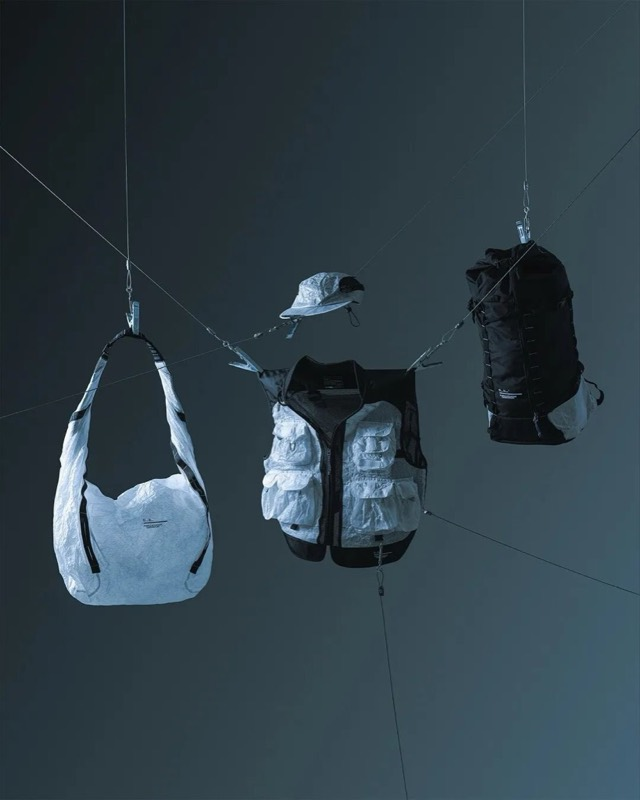
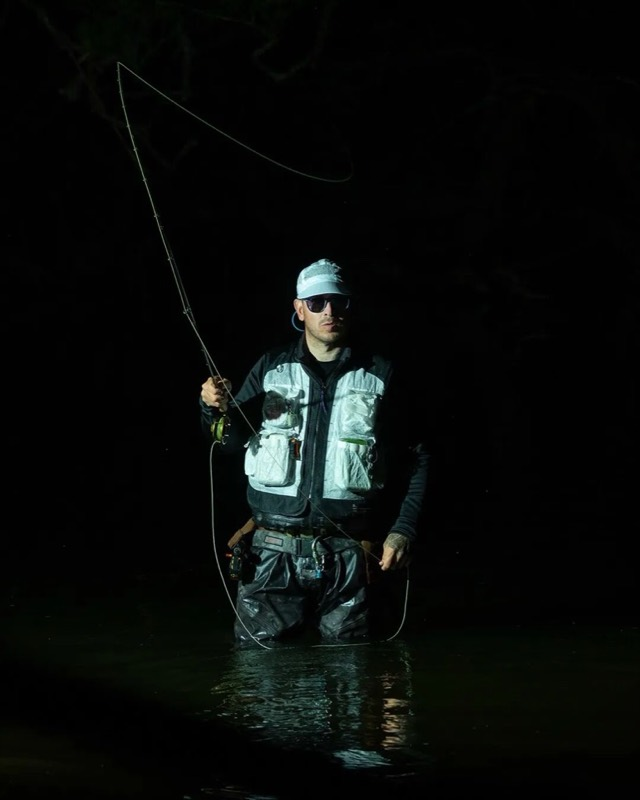
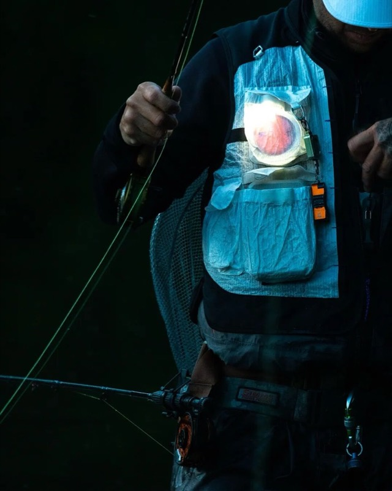
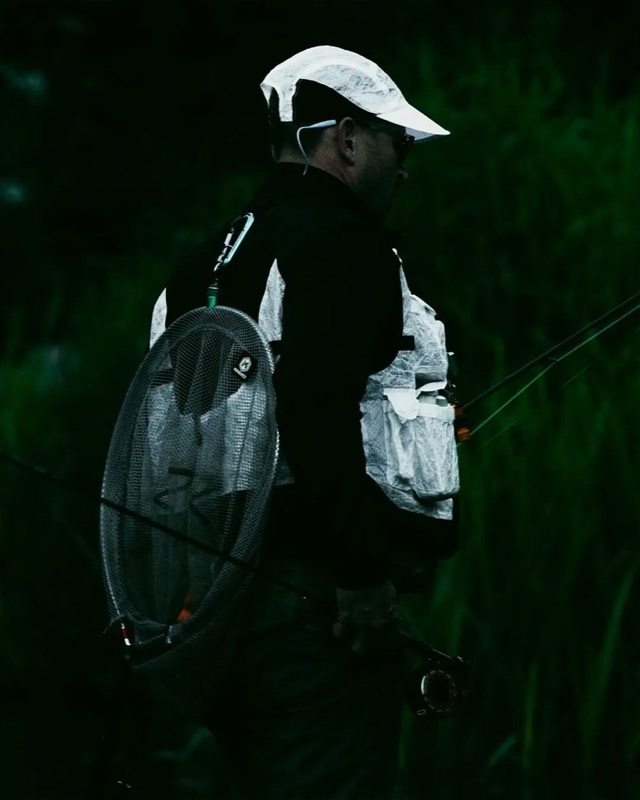

