# 自由之魂：复古的风，吹到了床帐 | 营事编集室 vol.236

- 发布日期：2026-08-13｜形态：普通图文｜系列：营事编集室（vol.236）｜来源：https://mp.weixin.qq.com/s/rEzJY7rZmDjnG1q5ipcgpA

## 导读

本期导读
01｜自由之魂｜床帐被做出一副复古小帐的样子02｜Nothingblue｜38 铜版花灯，限量首发03｜Vibram Furoshiki｜一块“包袱布”，最后变成一双鞋04｜Asimocrafts｜Helinox 长椅，也能改成 IGT 桌05｜PAAGO WORKS｜为了 415km，重做一只背包

## 1. 自由之魂｜新床帐，开始有复古感

自由之魂预告了重新设计的新款床帐系列，型号为 Loft-M 和 Loft-L，分别对应 190cm 与 210cm 两种床体长度。品牌目前展示的是内帐版本：帐体直接固定在离地折叠床架上，外置弧形杆形成支撑，侧面保留大面积网纱门窗；配色除了白色版本，也出现了紫色与黄褐色组合，配上复古字体和 “THE FREE SPIRITS 2011” 标识，气质更接近一只被抬离地面的老派小帐。

这类床帐的重点，是把睡眠系统从 “铺在地上” 改成 “架在床上”。它减少了找平地、铺防潮垫、处理地面湿气和碎石触感的麻烦，又比单独的行军床多出遮蔽、通风和私密性。对于车边露营、基地营、长时间驻扎，或者需要把多人营地里的睡眠区域分开的人来说，它更像一个独立的小睡眠舱，而不是普通帐篷的尺寸变体。

从细节图看，TFS 这次也把结构连接点做得很显眼：金属帐杆、织带鸡眼、加强布和紫色格纹面料都被放到画面里，说明它不只是靠造型吸引人。外帐目前还未公开，品牌表示正式版本会兼顾外观与功能性，并计划在 10 月 上市。秋季夜晚更凉、营地停留时间更长，一张离地的床加一顶完整帐篷，可能会直接改变过夜体验。

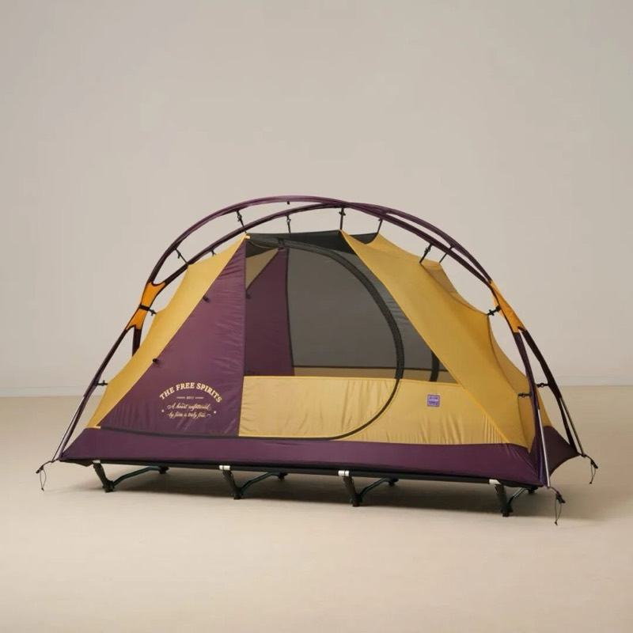
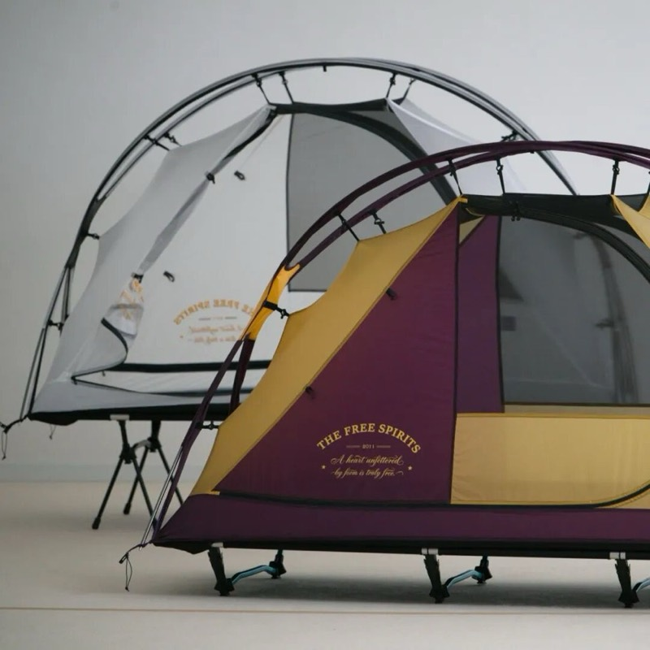
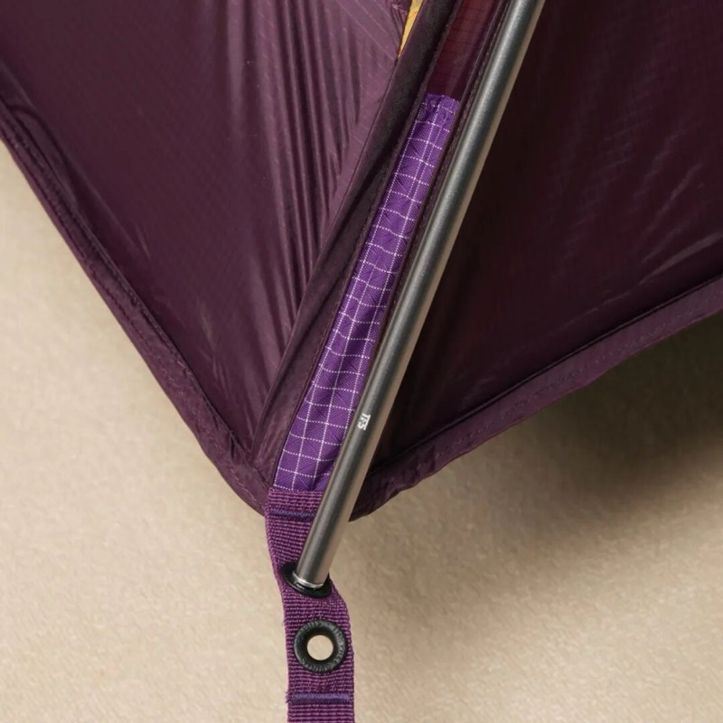
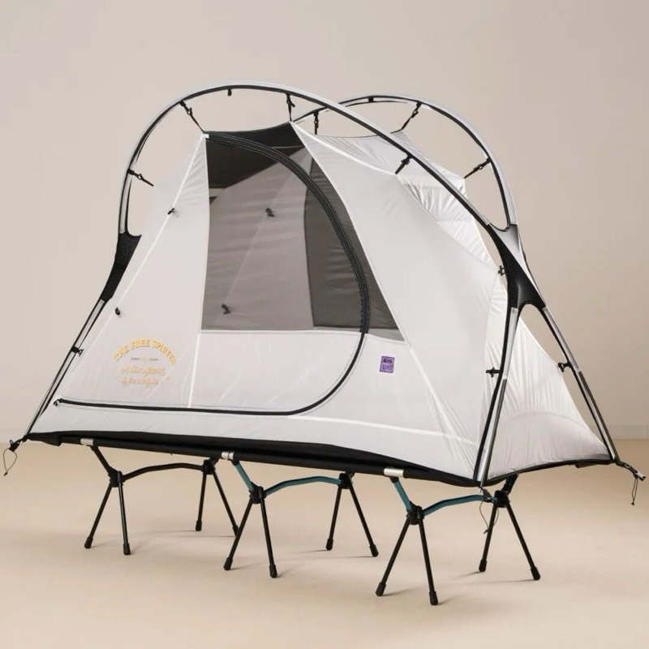

## 2. Nothingblue｜38 铜版花灯，限量首发

香港户外店 Nothingblue 带来 38explore 的 The Rich 铜版限定灯，首发两款花卉图案：Sunflower 与 Jasmine。这次为 Nothingblue 网店限量限定，8 月 13 日中午 12 点开售，售价 HK$730，每款每人限购一支，售完即止。

The Rich 以 38-kT 的灯型为基础，改用黄铜材质制作。相比常规版本，它的重量感更明显，表面光泽也会随着使用时间慢慢变化；铜版还加入了 “烛光模式”，让这只小灯不只是桌面照明，也更接近营地里用来制造气氛的光源。Sunflower 与 Jasmine 两个版本分别对应向日葵和栀子花图案，灯光亮起后，内层铜面会反射外罩上的花形纹样，这是这次限定版最值得看的细节。

Nothingblue 这次选铜版加花卉图案，很符合本地玩家对小装备细节和限定版本的偏好。需要注意的是，品牌也提醒静电触控开关会受环境或手势影响，部分操作方式和旧款不同，入手前最好先理解它不是一支只看参数的功能灯，而是一件更偏收藏和氛围的桌面装备。

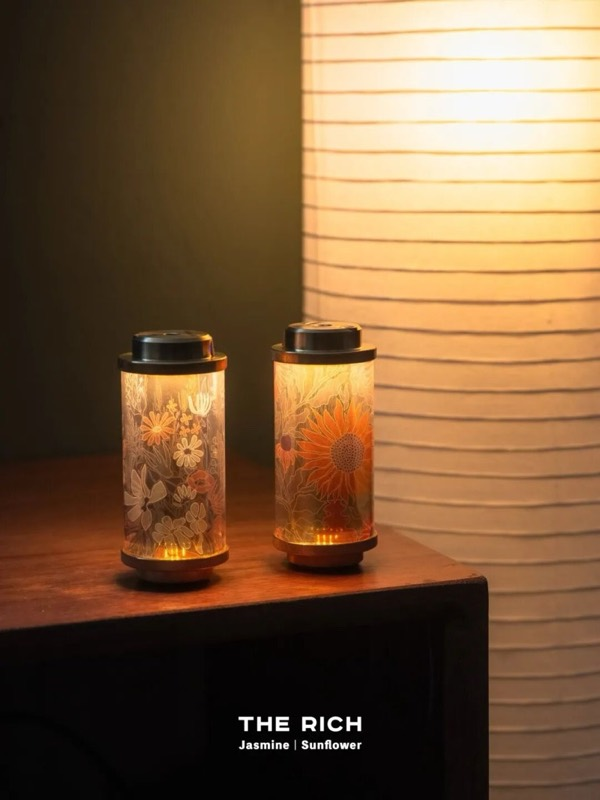
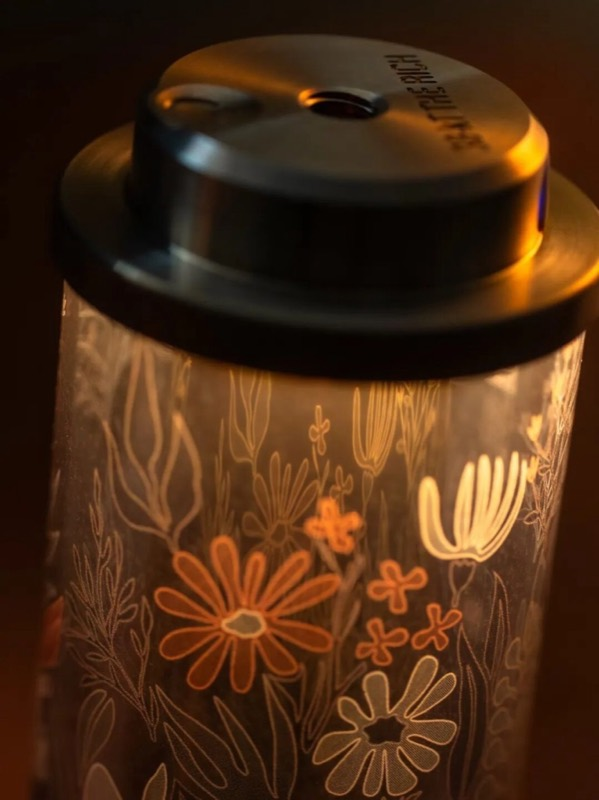
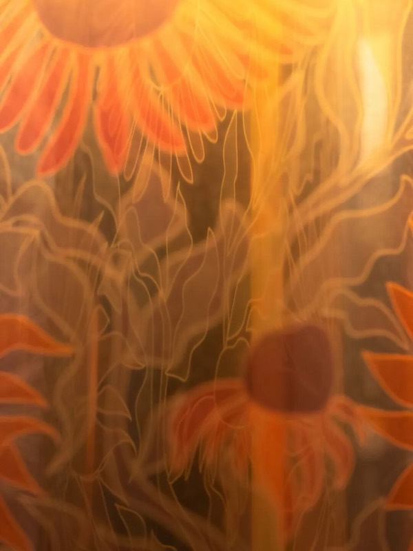
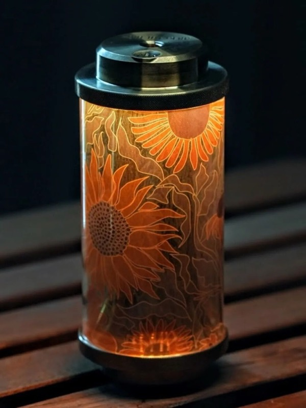
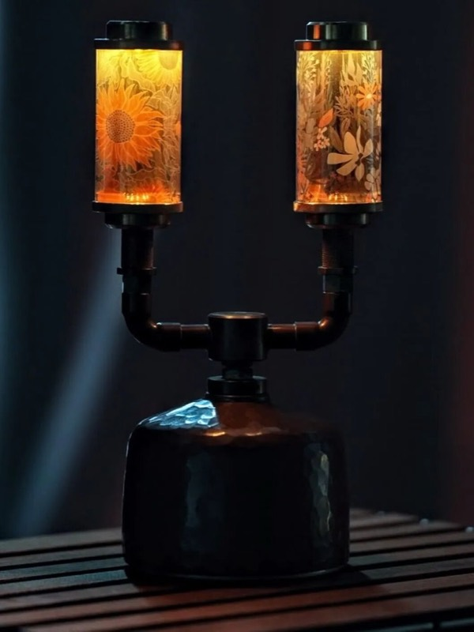

## 3. Vibram Furoshiki｜从 “包袱布” 长出来的鞋

Vibram Furoshiki 的起点，可以追溯到 2011 年。日本设计师 Masaya Hashimoto 当时在米兰设计师 Isao Hosoe 的工作室参与 Vibram 项目，被要求思考一个很实际的问题：鞋底生产需要大量不同尺码的模具，能不能减少模具数量？他的回答没有停留在制鞋工艺本身，而是反过来问：如果鞋底决定了鞋面尺码，为什么不能让鞋面去适应脚？

于是，Furoshiki 的雏形出现了。Hashimoto 想到日本传统的 风吕敷—— 一块可以包裹、携带不同物件的方布。他把一片平面鞋底放在布料中央，让两侧面料像包袱布一样包住脚，再用魔术贴固定。后来这套想法成为 Vibram Furoshiki “The Wrapping Sole”：它没有传统鞋面的鞋带、硬质侧墙和固定楦型，而是用两片柔性 “翅膀” 顺着脚型包覆，鞋子跟着穿着者改变形状。

这也是它和 Vibram 更知名的 FiveFingers 不同的地方。FiveFingers 讨论的是赤足感和脚趾活动，Furoshiki 更像一双为旅行、步行、收纳和日常移动设计的轻量鞋。它 2014 年在 Pitti Uomo 首次公开亮相，2015 年正式上市，之后拿到 2017 年 Design for Asia Awards 大奖、Design Intelligence Award 认可，并在 2018 年获得意大利工业设计重要奖项 Compasso d’Oro。从一块古老包袱布到一双可以包住不同脚型的鞋，Furoshiki 的价值不只在造型特别，而是它把 “鞋必须先规定脚的形状” 这件事，重新拆开想了一遍。

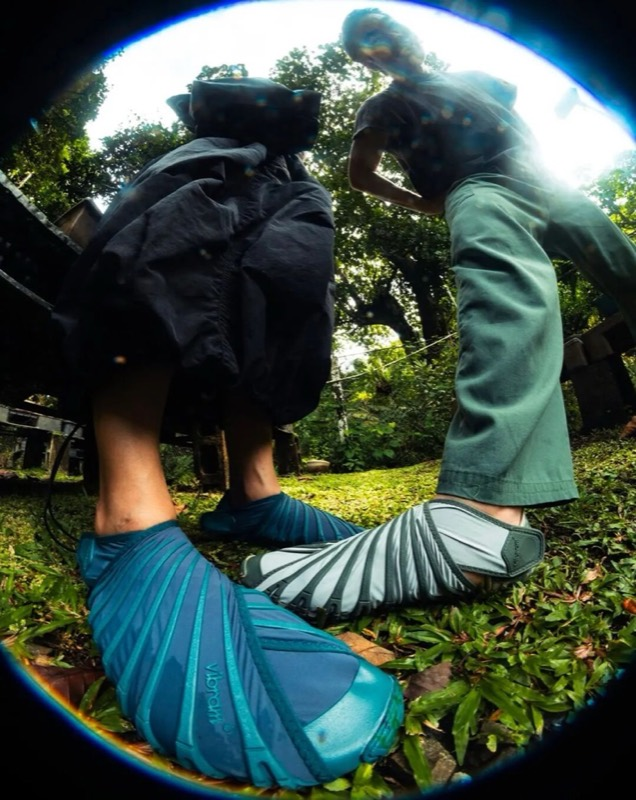
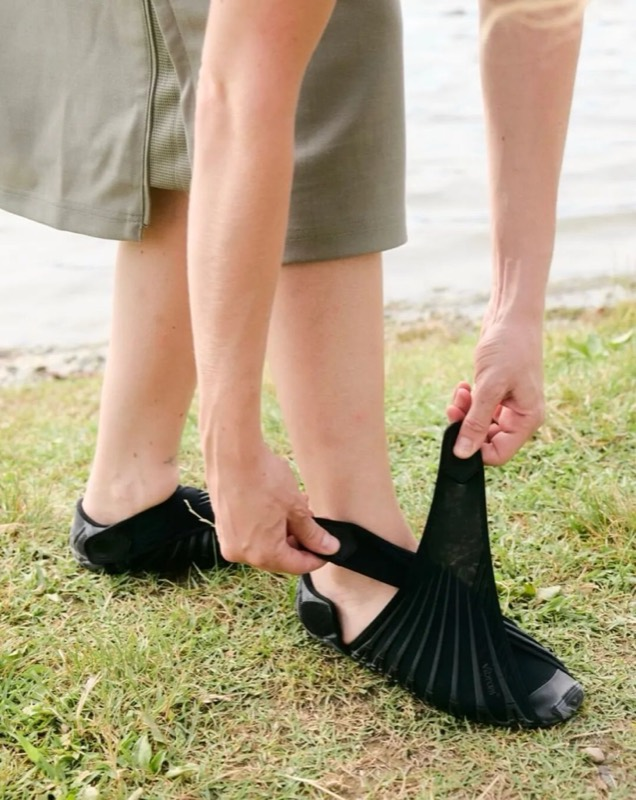
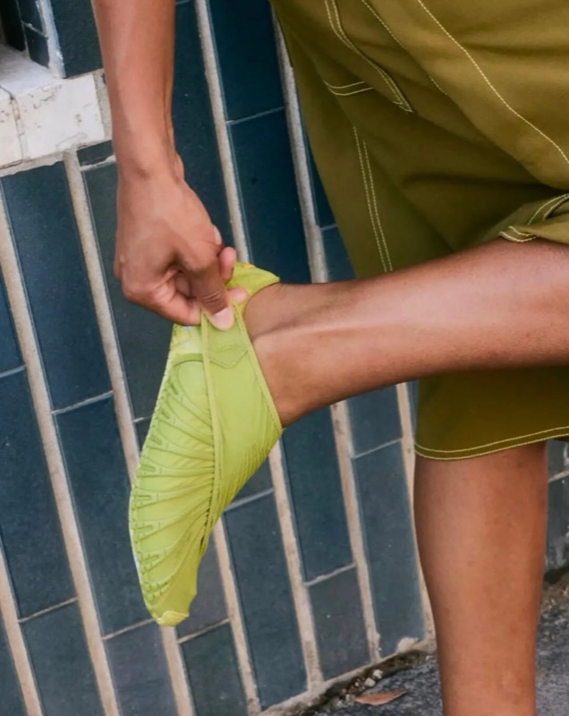
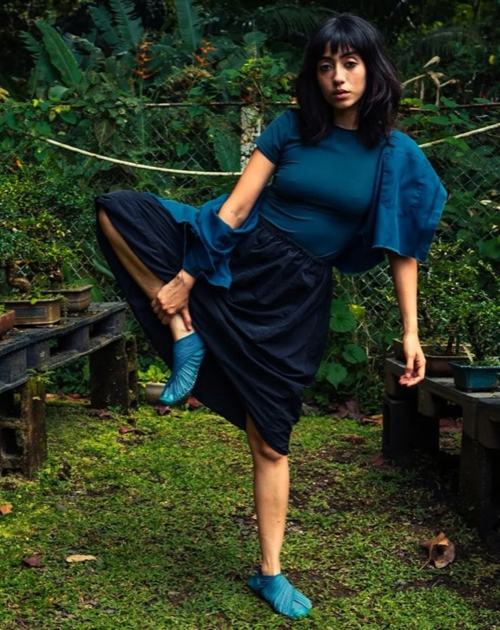
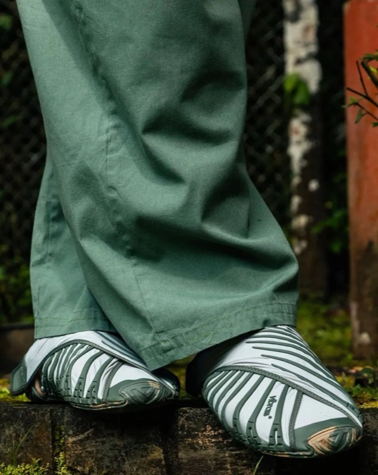

## 4. Asimocrafts｜把 Helinox 长椅改成 IGT 桌

日本车库品牌 Asimocrafts 最近推出 W BENCH，将 Helinox Tokyo 的 Bench 长椅转换成一张可用于 IGT 系统的营地桌。新品将在 8 月 14 日 18:00 于 asimocrafts BASE 店铺先到先得发售，不采用抽选方式，售完即止。

W BENCH 的思路很直接：利用 Helinox Bench 原本的长条框架和高度，把坐具变成桌面系统。产品提供红、黑、银三种颜色，与品牌此前的 FIXTACK 系列保持一致；套装还包含专用收纳包，可以一起放入框架、桌板以及 Helinox 椅子。图中可以看到，装上黑色桌板后，它已经接近一张低矮的模块化厨房桌，炉具、气罐和小物都能围绕 IGT 规格重新安排。

这类改装件很符合日本小型露营品牌的逻辑：不一定重新造一整套家具，而是把玩家已经拥有的椅子、长椅、桌板和燃烧系统重新连接起来。对喜欢 Helinox 轻量框架、又习惯 IGT 桌面生态的人来说，W BENCH 的价值就在于少带一件大桌子，让同一组框架在 “坐” 和 “摆放 / 料理” 之间切换。它不是最基础的露营必需品，但会让装备系统控很难不多看一眼。

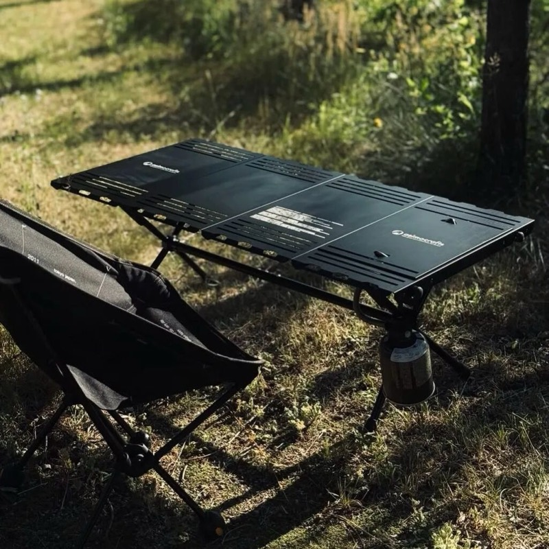
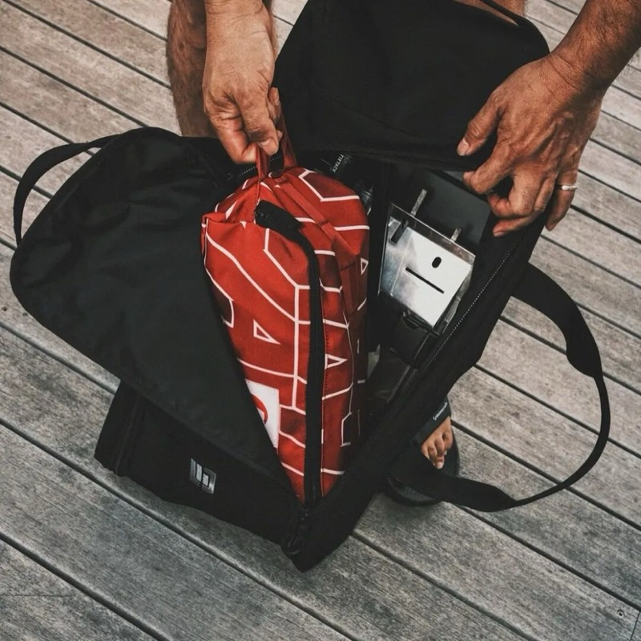
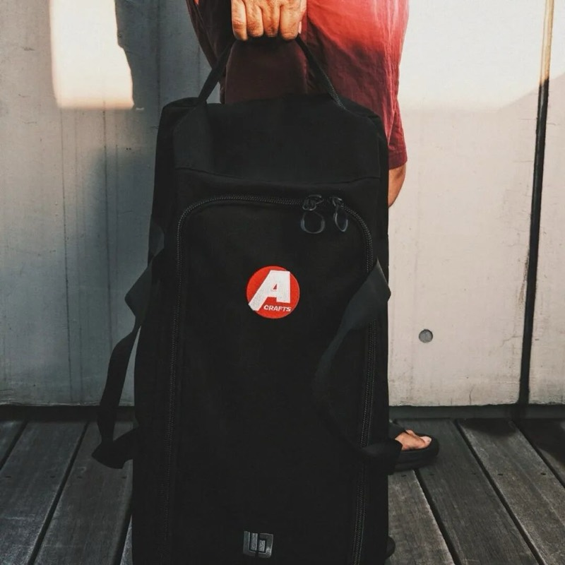

## 5. PAAGO WORKS｜为 TJAR 选手重做一只包

日本装备品牌 PAAGO WORKS 为参加 Trans Japan Alps Race（TJAR） 的选手制作了特别版背包。TJAR 是日本最有代表性的山岳耐力赛事之一，路线从日本海富山湾到太平洋骏河湾，全程约 415km，选手需要靠双脚穿越日本阿尔卑斯山脉。品牌这次支持的是 河内和观 与 山野本阳平 两位选手。

这只特别版背包以 PAAGO WORKS 的长距离系列为基础，但不是简单换色或贴标。品牌重新调整版型，并根据选手的体型和跑动方式设计背负系统；前胸口袋、肩带组件、弹力绳、外挂和取物位置也被拆开重新确认。对于 TJAR 这种数日级别的山岳移动来说，背包多晃一下、肩带多磨一点、补给多花几秒才拿到，都会在 415km 里被不断放大。

这类定制项目有意思的地方，是它把 “职业选手装备” 拆回到很具体的问题：东西该放在哪，极度疲劳时还能不能顺手取出，长时间背负会不会打断摆臂和身体转动。照片里还有写着 “いつか着く”（总有一天会抵达）的应援布，提醒人们 TJAR 不只是速度比赛，也是一段漫长到必须靠装备、身体和心理一起撑住的旅程。PAAGO WORKS 这只包，价值也正在于它服务的不是某个漂亮参数，而是选手真的要一步一步走完的 415km。

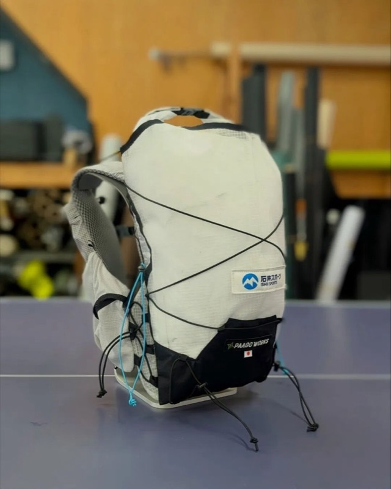
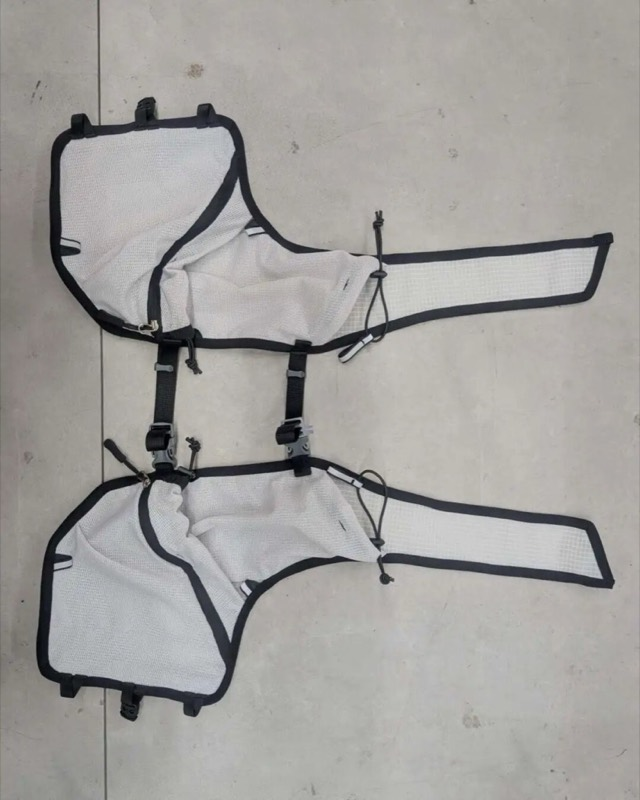
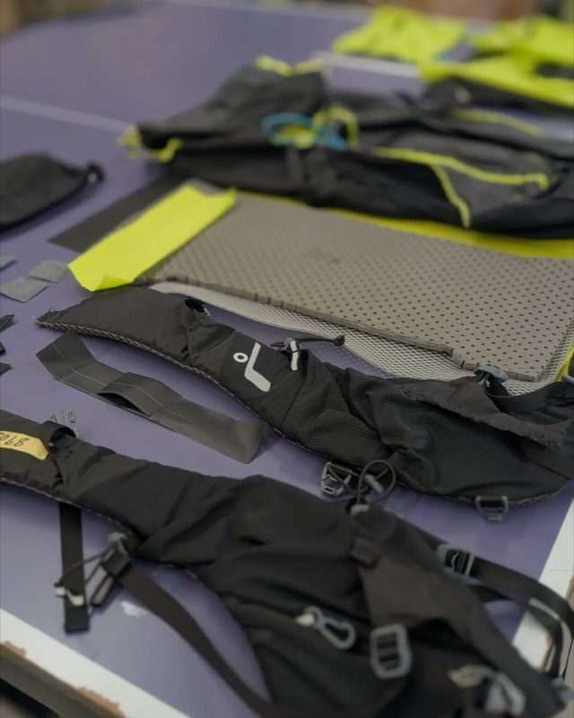
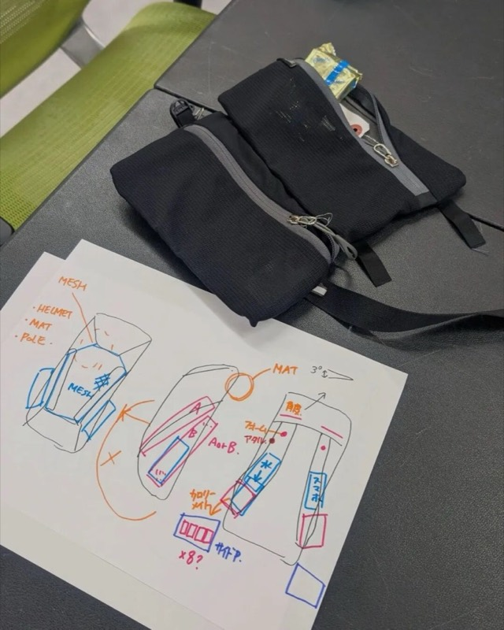
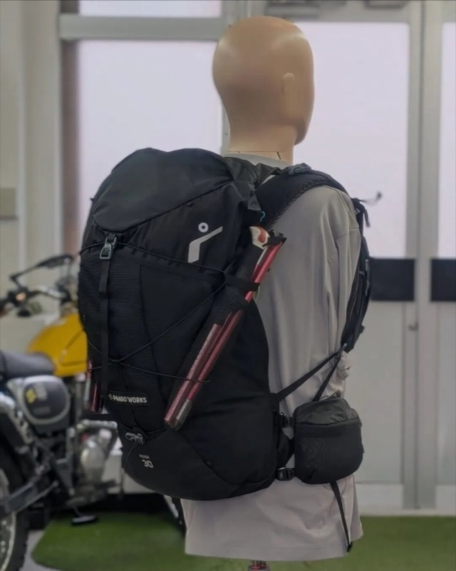
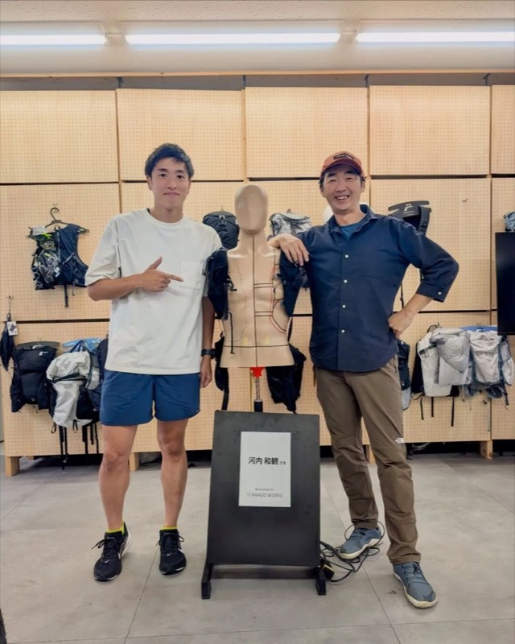

