# Carhartt WIP × OMNIUM：把工装骑上街 | 营事编集室 vol.260

- 发布日期：2026-09-18｜形态：普通图文｜系列：营事编集室（vol.260）｜来源：https://mp.weixin.qq.com/s/k-3Z9WPd7ueh-OiKeL6Rvg

## 导读

本期导读
01｜Carhartt WIP × OMNIUM｜把工装骑上街02｜Brain Dead × adidas｜Samba 后，岩鞋接着来03｜自由之魂 × TENt o TEN｜蓝黄撞色，复古山味04｜MOSS｜八十年代的草图，搭成车边帐05｜gnuhr｜不靠羽绒，压过还能蓬回来

## 1. 自由之魂 × TENt o TEN｜又是复古黄组蓝？

国内帐篷品牌 自由之魂 将与日本札幌户外店 TENt o TEN 推出五周年联名帐篷。合作目前围绕 STARS 2、STARS 3、STARS 4，以及尚未在日本正式发售的 TC 面料版 YOTO PLUS 展开。10月10日，TFS 团队还会到札幌举行展示销售会，现场搭设部分型号，并与日本玩家直接交流。

比起型号本身，这次联名更先让人注意到配色。现阶段释出的样品以深蓝为主色，帐杆、内帐与字样加入偏芥末黄的撞色，整体很像90年代户外装备目录里常见的高饱和组合。STARS 系列本身是典型穹顶睡帐结构，蓝黄配色落在外帐、骨架与内帐分区上后，轮廓被进一步强调；另一款隧道式帐篷则把同样的配色延续到更长的帐体上。对今天习惯黑、灰、卡其的露营市场来说，这组颜色反而显得很直接。

TENt o TEN 表示，最终联名款还会加入店铺自己的颜色与细节，目前售价、正式规格与发售时间尚未公布。它并不是简单换一个周年 Logo，更像是在现成帐型上重新做一套视觉语言。近几年复古户外服装已经频繁回到80、90年代配色，包括帐篷等露营装备。蓝、黄这种曾经很“标准户外”的组合，如今重新大量出现在我们的视线里。

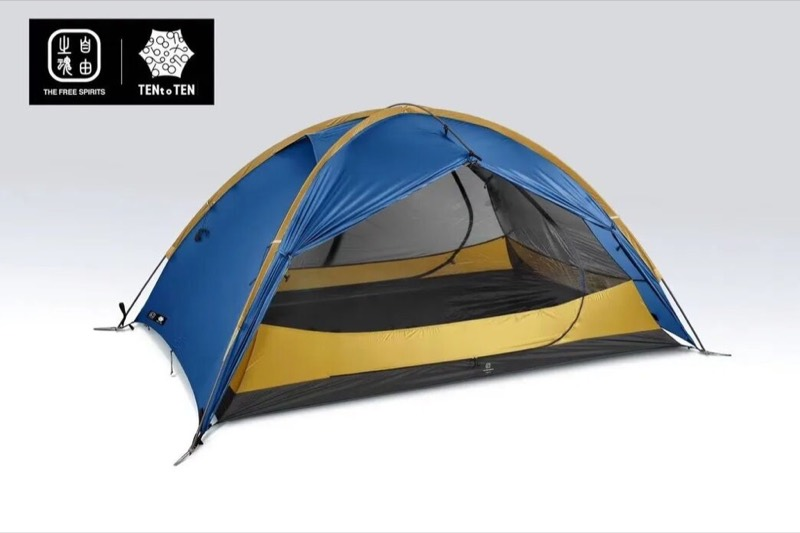
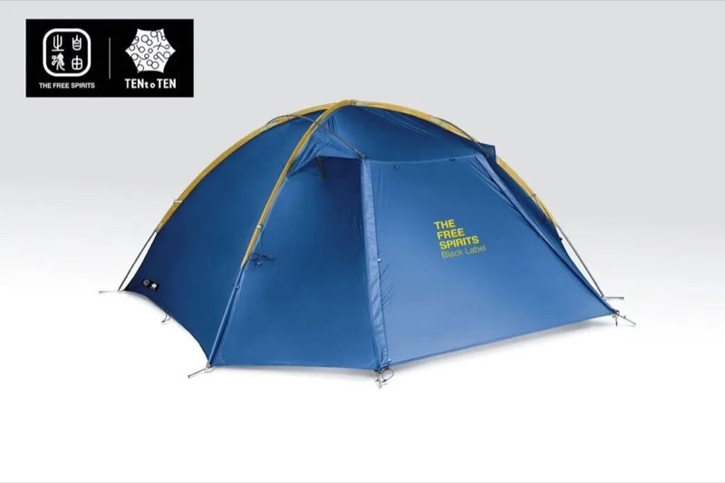
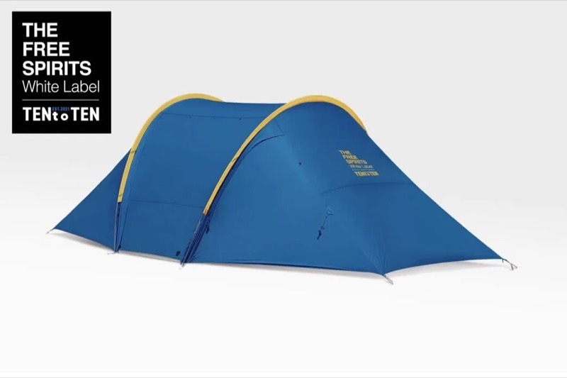

## 2. Carhartt WIP × OMNIUM｜把工装骑上街

Carhartt WIP 与丹麦自行车品牌 OMNIUM 首次合作，选中了带前置货架的 Mini-Max 货运自行车。联名版将标准铬钼钢车架换为不锈钢，再以透明涂层保留焊道和金属受热后的变色。整车全球限量 150 台，定于 9 月 24 日发售，含税售价 4,500 欧元。

裸露金属之外，酸性黄与黑色联名图形贯穿 DT Swiss 货运轮组、货架织带、把套和钛轨坐垫，将高可视配色与工业质感接在一起。脚踏则经由日本 Blue Lug 参与，由 MKS 制作 XC-III「Bear Trap」特别版：哑黑表面配手绘凸字，外框加入 Carhartt WIP 的 C-Logo 镂空，呼应品牌与 BMX 的历史联系。官方还预告，脚踏后续将限量单独销售。

这台车把工装的实用背景与街头骑行连得很具体：货架承担运输，裸露焊道交代制造过程，酸性配色带来鲜明辨识度，脚踏又让熟悉 Blue Lug 和 BMX 的人有细节可追。工装文化在这里延伸到了运送器材、穿行城市的工具上；即使不收藏整车，那副可以单独入手的脚踏，也足以吸引骑行玩家留意。

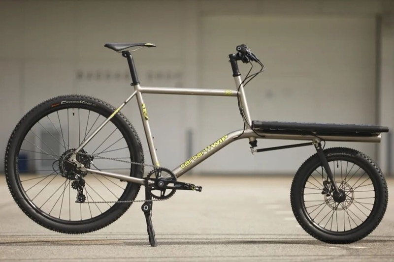
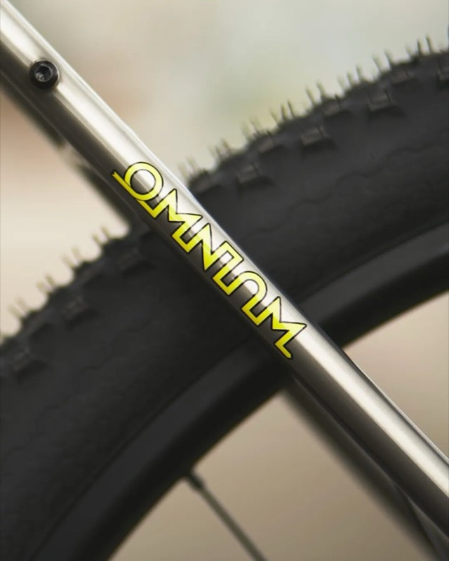
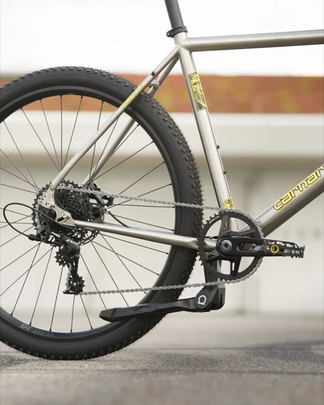
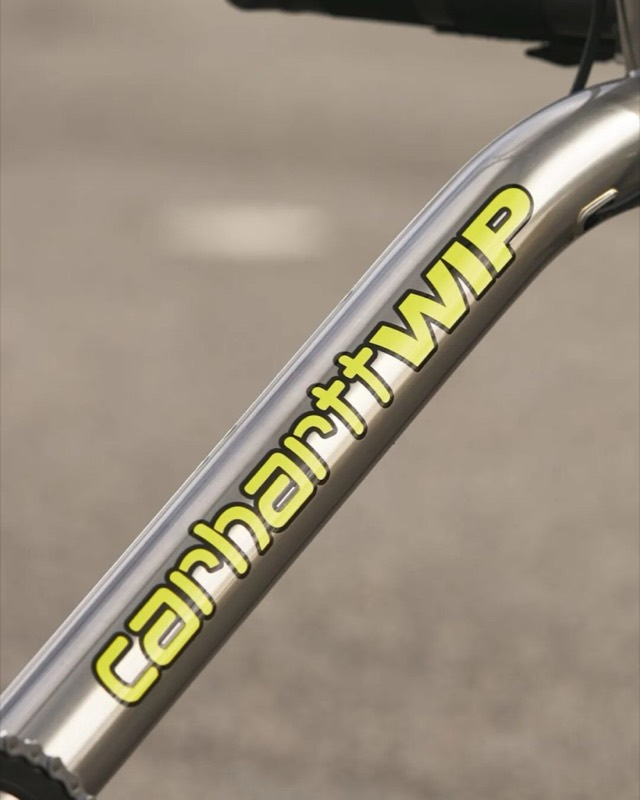
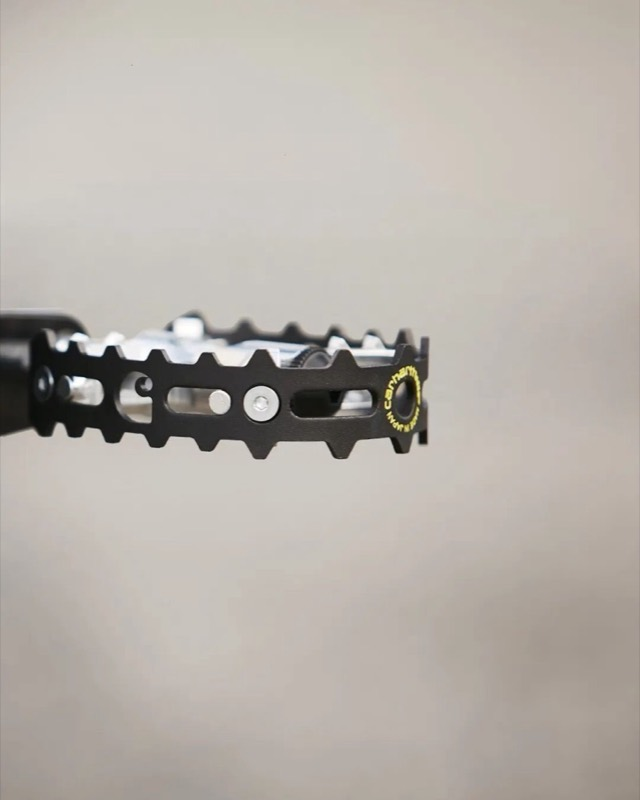
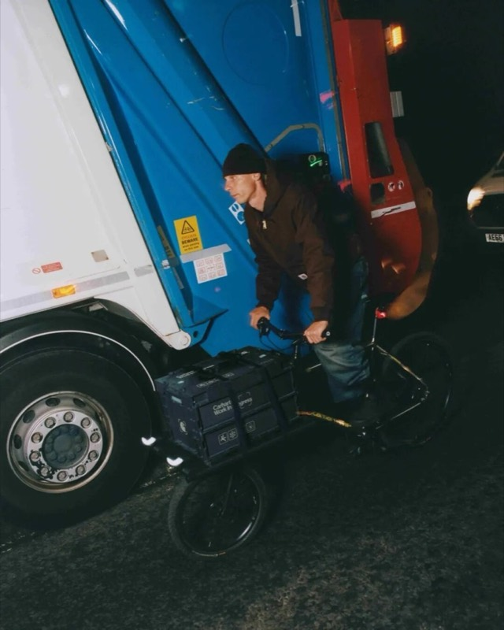
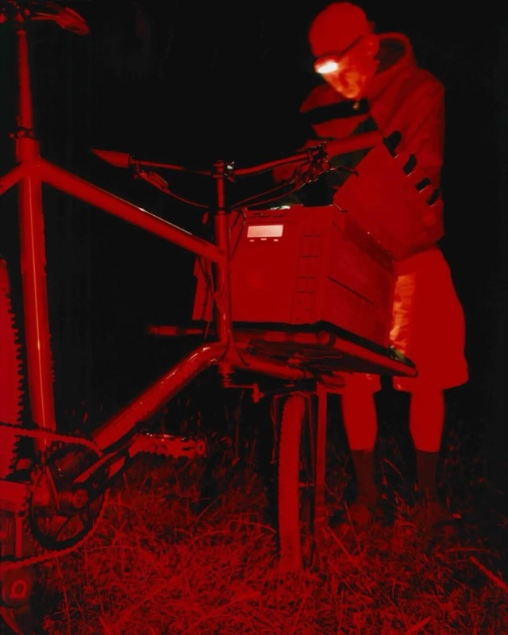
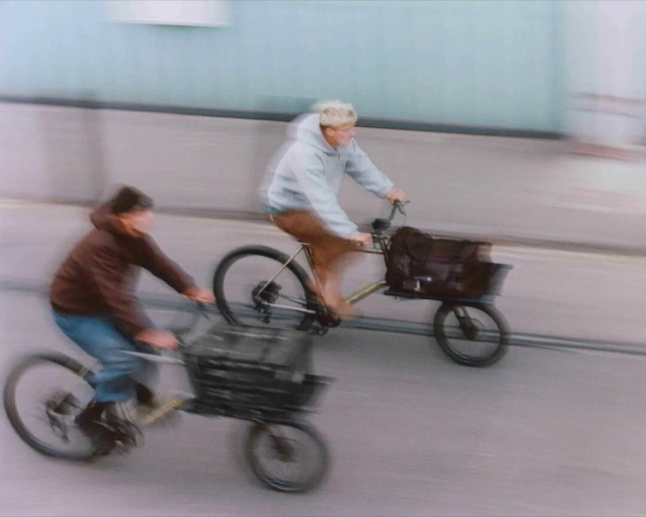

## 3. MOSS｜Bill Moss 的旧草图，搭到了车旁

MOSS｜一张八十年代草图，今天搭到车旁

MOSS 新作 THE EDEN，源自 Bill Moss 在 1980 年代绘制的一张车边帐设计插画。这位兼具画家、雕塑家背景的设计师，将曲线与织物张力带进帐篷设计，留下了 MOSS 鲜明的轮廓。此次品牌从档案中的草图出发，把当年的构想发展为适应现代露营的产品。

草图里的弧线，在 THE EDEN 上化作醒目的黄色顶面。品牌展示了开放遮蔽、搭配围护及车旁搭设等状态：敞开时保留棚下视野，加入围护后形成更完整的休息空间，车旁布置则交代了这张老设计最初的用途。目前品牌已公布限量提前预约安排，9 月内预约可获八折优惠券。

车边帐也接续了 MOSS 早年的汽车露营背景。POP-TENT 与 PARAWING 曾伴随美国旅行车热潮走进营地，帐篷的曲面、棚下的桌椅和停在旁边的汽车，共同构成那个年代的露营景象。THE EDEN 把这段历史带到了今天：熟悉的黄色与弧顶之外，一张档案插画终于有了可以实际搭建的形态。对关注 MOSS 老帐的人来说，这比沿用经典配色更值得细看。

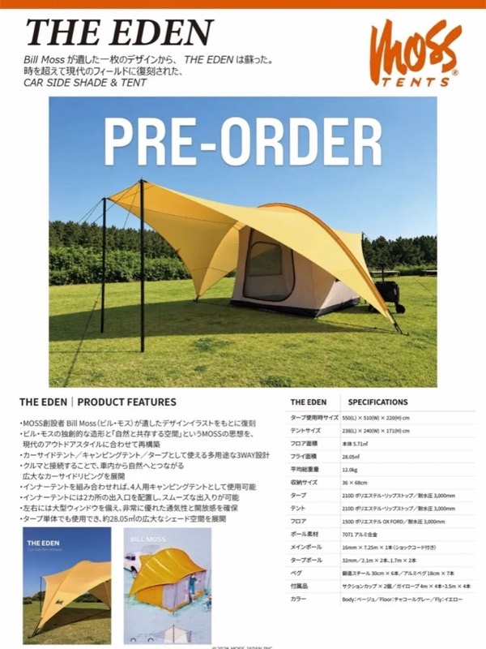
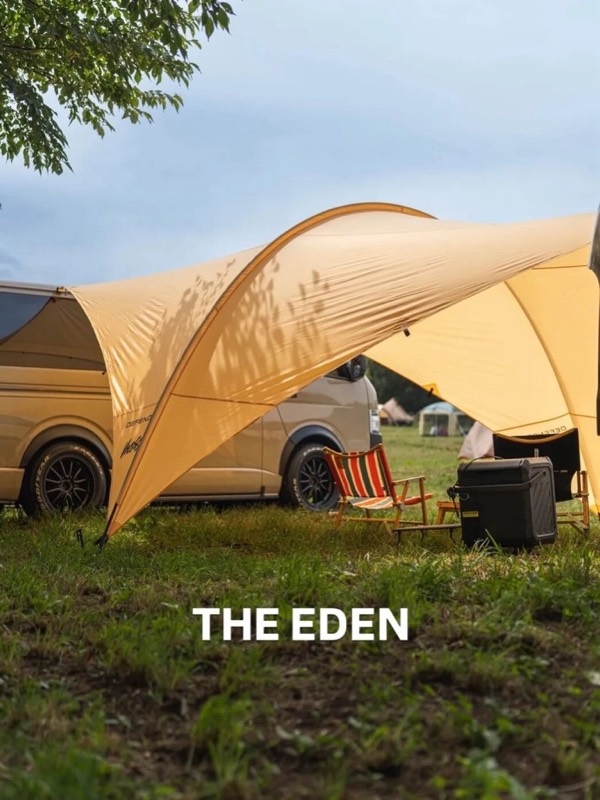
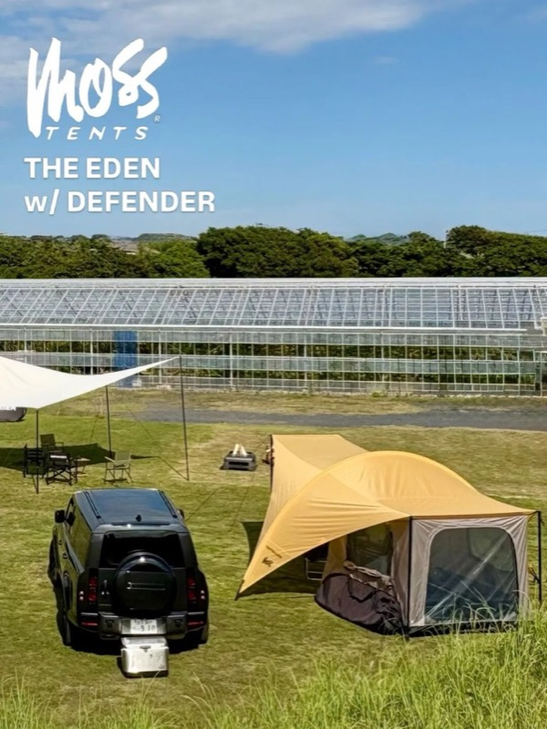
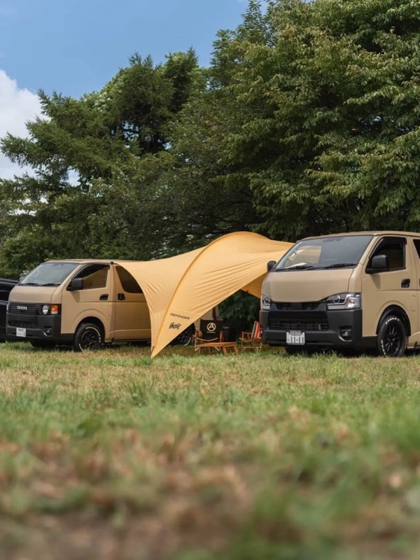
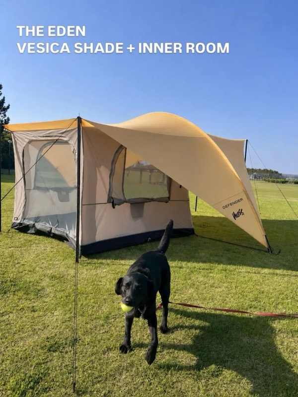
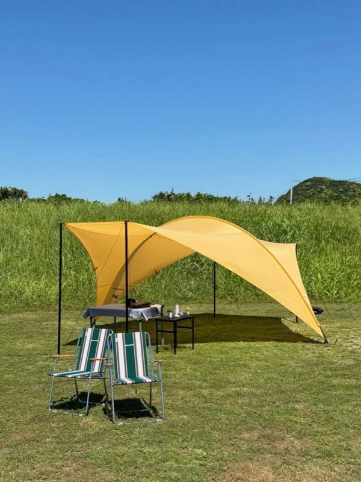

## 4. Brain Dead × adidas｜Samba 之后，岩鞋联名接着来

adidas 刚亮相 Samba Climbing，Brain Dead 与旗下 FIVE TEN 的联名鞋图便接着曝光。前者把大众熟悉的 Samba 带向攀岩，后者直接选中 Guide Tennie Approach 与 NIAD 两款鞋型，将长毛绒面革与撞色放进专业户外鞋的轮廓里。Samba Climbing 目前在 adidas 美国官网标注为即将发售，Brain Dead 联名尚未公布确切日期与售价。

两双联名中，Guide Tennie 属于接近鞋，服务走向岩壁的途中，系带结构也较容易融入日常穿着；此次加入六边形侧面开孔，蓝绿色鞋带搭配毛绒鞋面。NIAD 则采用更窄的套穿轮廓，深蓝鞋面、棕色后跟与向上包覆的橡胶，保留了岩鞋鲜明的形态。相同的材质趣味，落在两种用途不同的鞋上，也给日常穿鞋与关注攀岩装备的人留下了各自的看点。

Brain Dead 与攀岩的联系已有数年。2021 年，它与 Long Beach Rising、白石阿岛共同发起 ALL RISE，支持免费攀岩墙及参与资助，随后把比赛、音乐和联名服饰带到同一场活动中。接在 Samba Climbing 后面看，这次合作又多了一层社群背景：FIVE TEN 提供鞋型，Brain Dead 带来的还有长期参与攀岩的人群与文化。

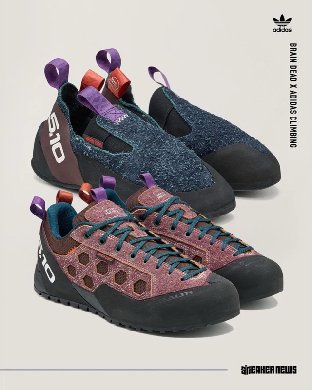
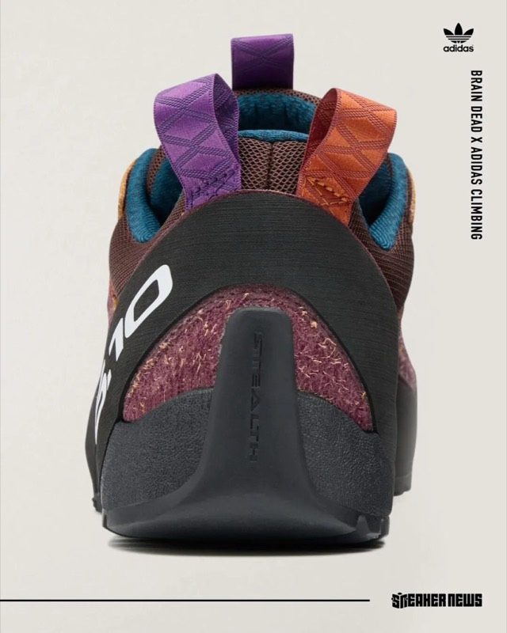
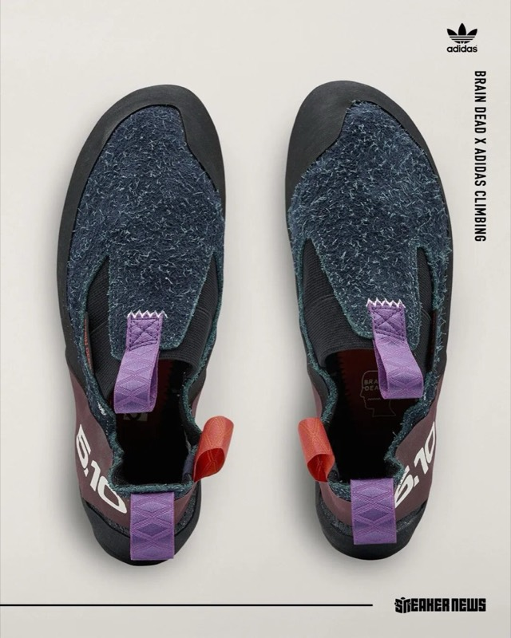

## 5. gnuhr｜一身蓬松，不靠羽绒

进背包压上一路，到营地取出来还能恢复多少蓬松？gnuhr 为 Heatwave Puffer Jacket 公布的实验室数据，回答了这个问题：据品牌官网披露，填充材料经压缩后的蓬松恢复率为 97.7%。这件看着像羽绒服的夹克，使用东丽片状聚酯保温材料，此次送往 IDFL 测试的项目还包括保暖与耐洗表现。

回弹靠的是材料结构。经过机械卷曲的保温层呈起伏状，如同细小弹簧，帮助撑住空气层，也省去了密集的分格绗缝。现售 v1.5 外壳采用含 60% 生物基尼龙的 15D 面料，4 码约重 361 克，日本制造，售价 399 美元。品牌同时公布了耐洗测试 5 级的结果，对需要反复收纳、清洗的保暖衣来说，这两项数据都比单看厚度更有参考价值。

这也符合创始人 Nur Abbas 的徒步习惯。他曾在 Maison Margiela、Nike 等品牌工作，创立 gnuhr 后，将服装设计经验用于轻量装备。Heatwave 主要留给抵达营地后的静态保暖，途中大部分时间待在包里。重量要轻，压过之后还要蓬得回来，才值得一路背着；宽松衣身与简洁表面，则让它回到城市也容易穿搭。

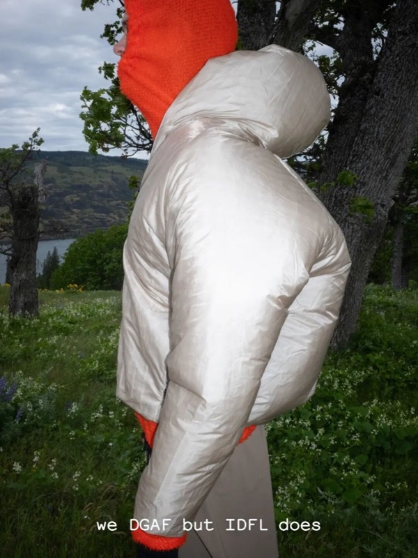
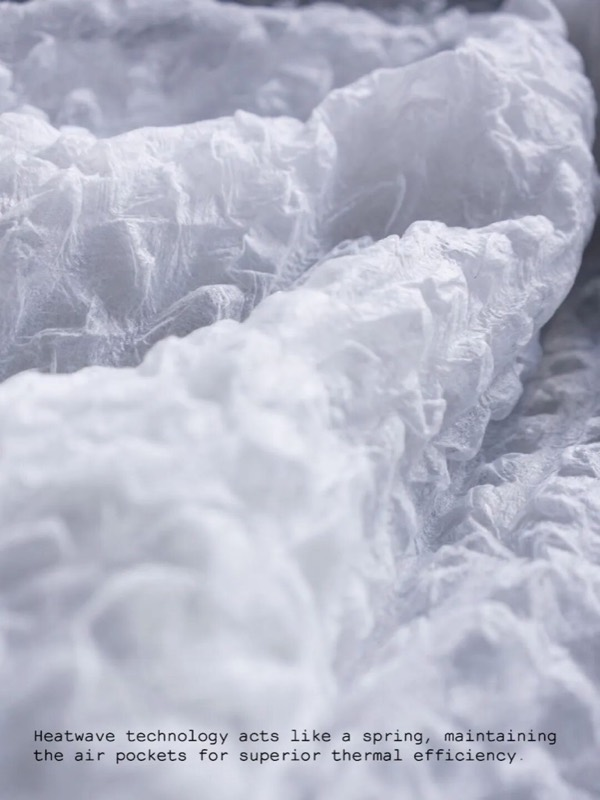
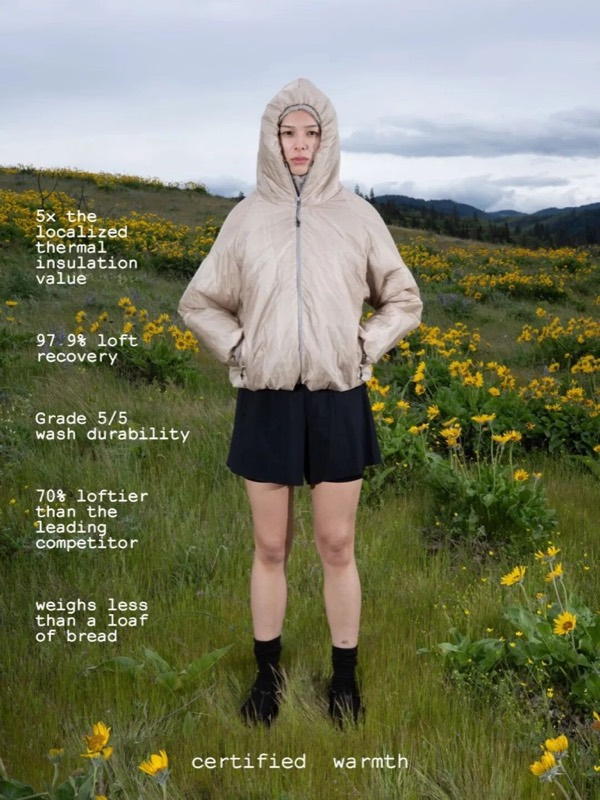
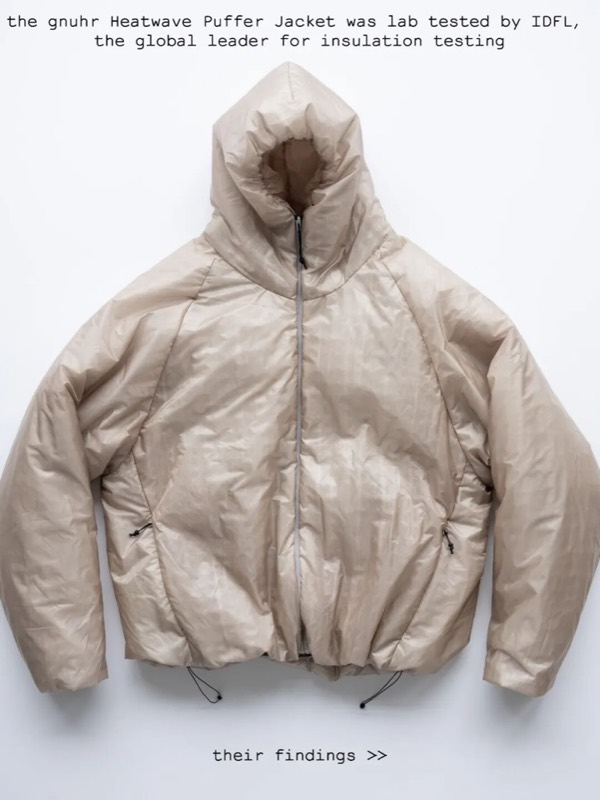

