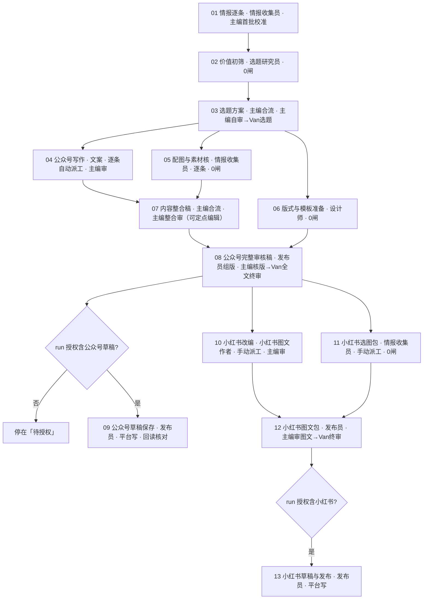

# 资讯日更 · 全流程（v7 · 十三阶段）

> **当前生效的流程定义**，与引擎 `daily_news` v7（迁移 `0033_daily_news_v7.sql`）一致。流程形态与其他文档冲突时，以本文档为准。
> 业务约定（窗口、数量、晨间时间表、授权默认值、送达形态）见《资讯日更 · 生产约定》；交付协议见《资讯日更 · 交付与流转规范》；审核尺子见《资讯日更 · 验收标准》。
> v1 十阶段（公众号先行 → 小红书后接，全程线性、每段双闸）已于 2026-09 归档；`pipeline_wechat_xhs_v2.png` 是 v1 旧图，仅作历史参考。

---

## 核心规则

- **Van 日常只做两类决定**：选题（03）、已排版的完整推文（08，工作日 09:00 前送达）；接入小红书后加一次图文包终审（12）。其余环节要么主编单闸，要么 0 闸；原始资料、机械组包、格式核验、模板复用、后台操作不再请 Van 审批。
- **每个阶段显式声明自己的闸**：引擎不设默认闸，0 闸阶段提交即通过。
- **首批先校准，再决定往哪里深挖**：01 情报逐条有一道主编闸。首批（一般 4–8 条，含原文、原始披露时间、预览图）交齐即由主编定方向——哪些继续投入、哪些停、还缺哪类来源；通过后收集员按校准继续补采，新条目以补件追加。避免弱题被做厚之后才否决。
- **采集过程与判断过程都要留痕**：01 提交前批量上报本次全部采集轮（找过哪些来源、各找到几条、窗口内几条、失败原因与替代来源），每条条目写明来自哪一轮、抓取时间、证据地址与查重结论；判断过的条目不留在「线索」里——淘汰要标 dropped 并给理由码。主编在首批校准闸上先看 `adminctl intake-check` 的结论（必扫来源是否都扫过、找到与登记的落差是否有淘汰记录兜底、条目来源分布是否集中），不必自己去点开每张图；02、03 直接读 `GET /runs/{id}/intake-trace`，不用解压交付物。
- **获取不等于审阅**：采集轮要把「拿到多少」和「看过多少」分开记——接口返回数、去重数、已审数、未审数各有其位。审过的条目必须落状态（进条目或标 dropped 并给理由码）；只加载未展开的如实记为未审，不得事后补成淘汰、不得倒填理由。这条出自 2026-09-16 r44 的实测：某一轮接口返回 100 篇、仅 13 篇进引擎，其余 87 篇的处理情况在引擎里无法追溯。
- **佐证不是候选**：为核实线索去读的官方页与原始出处单独记 `corroborated`——它们算已审，但不登记成条目；判据用「已审 − 佐证」与登记数对账，不会再把「读了官方页去核实」误判成「审过没落状态」。另外每条条目必须填原始披露时间，拿不到确切日期的标待核并写明缺的就是日期，不留空——留空会让窗口判据无从判断它属不属于当期。
- **采集与研究逐条交错**：一条情报有原文、发布时间和预览就可交研究员初筛，不等整包补齐；研究员先过 A 价值、B 资格两道轻检查，都成立才深核，关键事实不明的标「待核」，不计入成熟数量。
- **选题批准后三路并行**：写作、配图与素材核、版式与模板准备同时开工，写作与配图随条目决定自动派工；07 内容整合稿等写作与配图都通过。
- **组版在终审之前**：07 内容整合稿通过后，发布员把当期内容装进模板、完成实际图文排版；08 的完整推文（OSS 单页预览 + 同版 zip）经主编核版后交 Van 终审，通过后才保存公众号草稿并回读。
- **主编是中枢，有定点编辑权**：只对有证据的局部作定点编辑，首稿保留、改动留痕、预算约 10 分钟；新增事实必须有来源。
- **平台写操作单独成阶段、受授权约束**：09 公众号草稿保存、13 小红书草稿与发布只有本期 run 有对应授权才会派工与提交；本地演练、后台草稿、公开发布是三种不同授权。只有本地演练时，08 的本地成品就是最终交付。
- **小红书接 Van 批准的完整审核稿**：只交文案 + 对应资讯的选图包，不做封面卡与内容卡；10 改编与 11 选图包并行，12 图文包由主编先审、Van 终审一次；公众号后台故障不阻塞小红书。首期小红书支线定义保留、不派工（主编在起跑时取消 10 与 11，12、13 随之取消），公众号连续 3 个工作日达标后接入。
- **补件不重跑已批正文**：换图、换资产、补事实走补件，挂在已通过的任务上，只让已开工的直接下游返工。
- **群播报由引擎单写**：派工、待审、退回、阶段通过、待授权、补件、失败、逾期、未接单与无活动提醒都由引擎自动发到编辑部群并真 @ 对应角色；主编答疑、解释编辑判断、报告故障与交付风险照常在群里说。
- **编辑判断为核心**：营事编集室的价值不在资讯收集，而在编辑判断；所有产出都应体现筛选、比较、趋势观察与使用逻辑。

---

## 角色

| 角色 | role_code | 在流程中的活 |
|---|---|---|
| 主编 | editor | 03 选题方案、07 内容整合稿（合流自产）；各主编闸；代录 Van；录入授权；取消与重开 |
| 情报收集员 | collector | 01 情报逐条、05 配图与素材核、11 小红书选图包 |
| 选题研究员 | researcher | 02 价值初筛 |
| 文案 | writer | 04 公众号写作 |
| 小红书图文作者 | xhswriter | 10 小红书改编 |
| 设计师 | designer | 06 版式与模板准备 |
| 发布员 | publisher | 08 公众号完整审核稿（组版）、09 公众号草稿保存、12 小红书图文包、13 小红书草稿与发布 |
| 合规版权审查员 | reviewer | 无固定阶段：主编点名的专项检查，结论以补件挂到受影响交付物 |
| 数据复盘师 | analyst | 不在日更 run 内：发布记录、选择反馈与周期复盘 |
| Van | van | 人类终审：选题、公众号完整审核稿、小红书图文包三道闸（主编代录） |

---

## 流程图

---

## 阶段详解（13 段）

> 本节由 daily_news v8 定义生成，与引擎同源；运行期一律以 `task <id>` 返回为准。改标准请改定义（管理后台或 wfctl），再重新生成本节。

| # | 阶段 | 责任 | 依赖 | 闸 | 派工 | 动作 | 产出 |
|---|---|---|---|---|---|---|---|
| 1 | 01-情报逐条 | 情报收集员 | 入口 | 主编首批校准 | 自动派工 | 普通 | 情报记录 |
| 2 | 02-价值初筛 | 选题研究员 | 01-情报逐条 | 0 闸（提交即通过） | 自动派工 | 普通 | 短名单 |
| 3 | 03-选题方案 | 主编 | 02-价值初筛 | 主编自审 → Van选题（中枢代录） | 合流 · 就绪即自动派给主编 | 普通 | 选题方案 |
| 4 | 04-公众号写作 | 文案 | 03-选题方案 | 主编审 | 自动派工 · 逐条（每个批准可写的条目一个任务） | 普通 | 文章 |
| 5 | 05-配图与素材核 | 情报收集员 | 03-选题方案 | 0 闸（提交即通过） | 自动派工 · 逐条（每个批准可写的条目一个任务） | 普通 | 素材包 |
| 6 | 06-版式与模板准备 | 设计师 | 03-选题方案 | 0 闸（提交即通过） | 自动派工 | 普通 | 模板 |
| 7 | 07-内容整合稿 | 主编 | 04-公众号写作、05-配图与素材核 | 主编整合审 | 合流 · 就绪即自动派给主编 | 普通 | 整合稿 |
| 8 | 08-公众号完整审核稿 | 发布员 | 06-版式与模板准备、07-内容整合稿 | 主编核版 → Van全文终审（中枢代录） | 自动派工 | 普通 | 完整推文 |
| 9 | 09-公众号草稿保存 | 发布员 | 08-公众号完整审核稿 | 0 闸（提交即通过） | 自动派工 | 平台写 · 须授权：公众号草稿 | 发布物 |
| 10 | 10-小红书改编 | 小红书图文作者 | 08-公众号完整审核稿 | 主编审 | 手动派工（主编写派工意见） | 普通 | 小红书文本 |
| 11 | 11-小红书选图包 | 情报收集员 | 08-公众号完整审核稿 | 0 闸（提交即通过） | 手动派工（主编写派工意见） | 普通 | 选图包 |
| 12 | 12-小红书图文包 | 发布员 | 10-小红书改编、11-小红书选图包 | 主编审图文 → Van小红书终审（中枢代录） | 自动派工 | 普通 | 图文包 |
| 13 | 13-小红书草稿与发布 | 发布员 | 12-小红书图文包 | 0 闸（提交即通过） | 自动派工 | 平台写 · 须授权：小红书草稿（小红书发布授权亦可） | 发布物 |

> 条目级：04-公众号写作、05-配图与素材核按条目推进——Van 批准可写的条目由引擎逐条生成写作与配图任务并自动派工；07-内容整合稿等全部已批条目的这两项都通过才就绪。01、02 产出的条目通过条目登记接口（`PUT /runs/{id}/items`）进入引擎；整期目标条数来自触发 inputs，已写成不足时 run 保持进行中并显示缺口，Van 接受缺口后由主编结束。

---

## 派工模式

- 工作流级为自动派工：就绪即由引擎派工并预填上游，不依赖主编在线接单。
- **10-小红书改编、11-小红书选图包为手动派工**：只有当期纳入小红书才派。04-公众号写作随条目决定自动派工，派工单由引擎写明条目、来源与 Van 原话。
- 合流阶段（03、07）就绪即自动派给主编自己。平台写阶段即便自动派工，也要先有授权。
- **接续告警**：派工后 5 分钟未接单提醒执行者、15 分钟升级主编；接单后超过阶段无活动阈值（写作与整合类 10 分钟，组版与保存类 5 分钟）提醒一次。

## 批一条写一条

03 的 Van 闸带条目录入（`decision_type=topic_approve`，`items` = 批准可写的条目键），引擎为每条生成写作与配图任务并自动派工；「继续研究」的条目只开研究，不派写作。补批或撤回单条用条目决定接口，同样附 Van 原话；撤回只取消该条尚未完成的任务，不影响内容整合稿；已写成的条目不能再改决定。批准晚到时，已开工的内容整合稿会标「补件待返工」，由主编决定纳入本期还是留到下期。

## 与 v1 十阶段的对应

| v1 | v3 | 变化 |
|---|---|---|
| 01 采集 → 双闸 → 02 选题 → 双闸 | 01 情报逐条（主编首批校准）→ 02 价值初筛（0 闸）→ 03 选题方案（Van） | Van 两次变一次；主编在首批就定方向 |
| 03 公众号内容 → 双闸 | 04 公众号写作（主编闸）→ 07 内容整合稿（主编）→ 08 完整审核稿（Van） | Van 只看已排版的整期完整推文 |
| 04 公众号视觉 → 双闸 | 06 版式与模板准备（0 闸）并行，版式在 08 组版 | 不再单独走 Van |
| 05 主编合成 → 双闸 | 08 公众号完整审核稿（发布员组版，主编核版 → Van） | 主编不再搬运；组版在终审前 |
| 06 发布 → 双闸 | 09 公众号草稿保存（0 闸 + 授权） | 减少纯操作确认 |
| 07 依赖 06 | 10 小红书改编依赖 08 完整审核稿 | 后台故障不阻塞 |
| 08 / 09 / 10 | 11 选图包 / 12 图文包 / 13 | 不做封面卡；发布受独立授权 |
