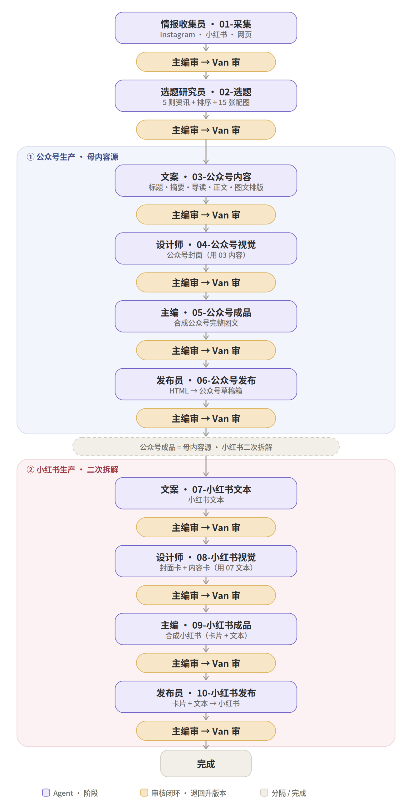

# 资讯日更 · 全流程（公众号先行 → 小红书后接）

> 一条选题先做完**公众号完整图文草稿**并过审，再进入**小红书流程**。
> **公众号是母内容源**；小红书不独立创作，而是对公众号成品的**二次拆解**，一条 = 卡片 + 文本。
> 每段产出后都走「**主编审 → Van 审**」，不过即退回升版本。

---

## 核心规则

- **阶段间顺序**：公众号阶段（03–06）整段跑完、草稿过审后，才进入小红书阶段（07–10）。
- **阶段内顺序**：每段都是**文案 → 设计师**的先后关系（设计要用文案产出的内容才能动手），不是并行。
- **母内容源**：公众号是整个内容生产链的母内容源；小红书是对公众号成品的二次拆解。
- **小红书形态**：一条小红书 = **封面卡 + 内容卡 + 文本**。
- **分工**：02-选题 产出 5 则资讯 + 排序 + 15 张配图；公众号阶段设计师只做封面；文案负责标题 / 摘要 / 导读 / 正文 / 图文排版。
- **审核**：每段产出 → 主编审 → Van 审。主编不过则退回（告知方向 + 位置，**不代改**）、升版本重做；Van 不过同理。Van 过后主编出**派工单**转下一阶段。
- **主编**是唯一对接 Van 的人，只审核 / 合成 / 派工，不编辑内容。
- 交付与流转（文件夹 → zip → OSS → 传链接、index.md 溯源头）见《资讯日更 · 交付与流转规范》。
- **编辑判断为核心**：营事编集室的核心价值不是资讯收集，而是编辑判断。所有 Agent 输出都应体现：筛选、比较、趋势观察、使用逻辑，而非资讯复述。

---

## 角色

| 角色 | 在流程中的活 |
|---|---|
| 主编 | 每段审核、合成成品、出派工单；唯一对接 Van |
| 情报收集员 | 01-采集 |
| 选题研究员 | 02-选题 |
| 文案 | 03-公众号内容、07-小红书文本 |
| 设计师 | 04-公众号视觉、08-小红书视觉 |
| 发布员 | 06-公众号发布、10-小红书发布 |
| Van | 人类终审，每段把第二道闸 |

---

## 流程图



---

## 文字流程

```
共享前段
  01-采集        情报收集员   Instagram · 小红书 · 网页
     → 主编审 → Van 审
  02-选题        选题研究员   5 则资讯 + 排序 + 15 张配图
     → 主编审 → Van 审

① 公众号生产 · 母内容源（文案 → 设计师）
  03-公众号内容  文案     推文标题方案（2-3个）·摘要·本期导读·资讯正文·封面推荐
     → 主编审 → Van 审
  04-公众号视觉  设计师   公众号封面（用 03 内容）
     → 主编审 → Van 审
  05-公众号成品  主编     合成公众号完整图文
     → 主编审 → Van 审
  06-公众号发布  发布员   HTML → 公众号草稿箱
     → 主编审 → Van 审
  ──── 公众号成品 = 母内容源 · 小红书二次拆解 ────

② 小红书生产 · 二次拆解（文案 → 设计师，一条 = 卡片 + 文本）
  07-小红书文本  文案     小红书文本（封面主标题+副标题+卡片文本+标题+导语；导语为固定模板）
     → 主编审 → Van 审
  08-小红书视觉  设计师   封面卡（资讯原图+主标题+副标题） + 内容卡（用 07 文本）
     → 主编审 → Van 审
  09-小红书成品  主编     合成小红书（卡片 + 文本）
     → 主编审 → Van 审
  10-小红书发布  发布员   卡片 + 文本（标题+导语） → 小红书
     → 主编审 → Van 审

完成
```

---

## 阶段详解（10 段）

| 阶段 | 责任 Agent | 上游（内容） | 产出 |
|---|---|---|---|
| 01-采集 | 情报收集员 | 起点 | 资讯包（Instagram / 小红书 / 网页） |
| 02-选题 | 选题研究员 | 01 资讯包 | 5 则资讯 + 排序 + 15 张配图 |
| 03-公众号内容 | 文案 | 02 选题（含 15 张配图） | 推文标题方案（2-3个）·摘要·本期导读·资讯正文·封面推荐 |
| 04-公众号视觉 | 设计师 | 03 公众号内容 | 公众号封面 |
| 05-公众号成品 | 主编 | 03 + 04 | 公众号完整图文 |
| 06-公众号发布 | 发布员 | 05 成品 | HTML → 公众号草稿箱 |
| 07-小红书文本 | 文案 | 06 公众号成品 | 小红书文本（封面主标题+副标题+卡片文本+标题+导语） |
| 08-小红书视觉 | 设计师 | 07 小红书文本 | 封面卡 + 内容卡 |
| 09-小红书成品 | 主编 | 07 + 08 | 小红书成品（卡片 + 文本） |
| 10-小红书发布 | 发布员 | 09 成品 | 小红书发布 |

> **03-公众号内容 · 每则资讯产出规格**
>
> 每则资讯：标题 + 正文。
> - **标题格式**：`品牌｜一句话标题`
> - **正文**：300-500 字，三段式结构 —— 第一段：品牌背景；第二段：核心信息；第三段：编辑判断。
> - **配图**：每则资讯固定 3 张图。图片1：标题下；图片2：第二段前；图片3：第三段前。

> **07-小红书文本 · 二次拆解规格**
>
> 小红书不是公众号压缩版，而是基于公众号内容重新组织传播逻辑。
> - 每则资讯：200-300 字；重点资讯：300-400 字。
> - 排序优先传播力，不强制沿用公众号顺序。

> 表中「上游」指内容来源。实际流转中每段的直接上游都是**主编派工单**（内含上游交付物的完整 https 链接），见《交付与流转规范》。
