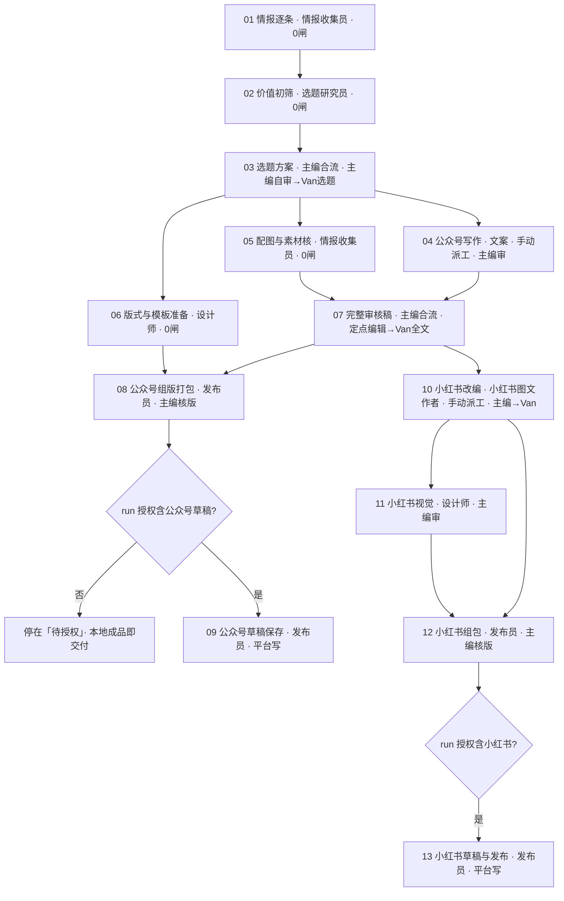

# 资讯日更 · 全流程（v3 · 十三阶段）

> **当前生效的流程定义**，与引擎 `daily_news` v2（迁移 `0009_daily_news_v2.sql`）一致。流程形态与其他文档冲突时，以本文档为准。
> 业务约定（窗口、数量、晨间时间表、授权默认值、送达形态）见《资讯日更 · 生产约定》；交付协议见《资讯日更 · 交付与流转规范》；审核尺子见《资讯日更 · 验收标准》。
> v1 十阶段（公众号先行 → 小红书后接，全程线性、每段双闸）已于 2026-09 归档；`pipeline_wechat_xhs_v2.png` 是 v1 旧图，仅作历史参考。

---

## 核心规则

- **Van 日常只做三类决定**：选题（03）、完整文案（07）、小红书文本（10，仅当期纳入小红书时）。其余环节要么主编单闸，要么 0 闸；原始资料、机械组包、格式核验、模板复用、后台操作不再请 Van 审批。
- **每个阶段显式声明自己的闸**：引擎不设默认闸，0 闸阶段提交即通过。
- **采集与研究逐条交错**：一条情报有原文、发布时间和预览就可交研究员初筛，不等整包补齐。
- **选题批准后三路并行**：写作、配图与素材核、版式与模板准备同时开工；完整审核稿等写作与配图都通过。
- **主编是中枢，有定点编辑权**：只对有证据的局部作定点编辑，首稿保留、改动留痕、预算约 10 分钟；新增事实必须有来源。
- **平台写操作单独成阶段、受授权约束**：09 公众号草稿保存、13 小红书草稿与发布只有本期 run 有对应授权才会派工与提交；本地演练、后台草稿、公开发布是三种不同授权。只有本地演练时，08 的本地成品就是最终交付。
- **小红书直接依赖完整审核稿**：公众号后台故障不阻塞小红书改编；公众号全文通过不等于小红书文本通过。首期小红书支线定义保留、不派工（主编在起跑时取消 10，11–13 一并取消）。
- **补件不重跑已批正文**：换图、换资产、补事实走补件，挂在已通过的任务上，只让已开工的直接下游返工。
- **群播报由引擎单写**：派工、待审、退回、阶段通过、待授权、补件、失败、逾期都由引擎自动发到编辑部群并真 @ 对应角色。
- **编辑判断为核心**：营事编集室的价值不在资讯收集，而在编辑判断；所有产出都应体现筛选、比较、趋势观察与使用逻辑。

---

## 角色

| 角色 | role_code | 在流程中的活 |
|---|---|---|
| 主编 | editor | 03 选题方案、07 完整审核稿（合流自产）；各主编闸；代录 Van；录入授权；取消与重开 |
| 情报收集员 | collector | 01 情报逐条、05 配图与素材核 |
| 选题研究员 | researcher | 02 价值初筛 |
| 文案 | writer | 04 公众号写作 |
| 小红书图文作者 | xhswriter | 10 小红书改编 |
| 设计师 | designer | 06 版式与模板准备、11 小红书视觉 |
| 发布员 | publisher | 08 公众号组版打包、09 公众号草稿保存、12 小红书组包、13 小红书草稿与发布 |
| 合规版权审查员 | reviewer | 无固定阶段：主编点名的专项检查，结论以补件挂到受影响交付物 |
| 数据复盘师 | analyst | 不在日更 run 内：发布记录、选择反馈与周期复盘 |
| Van | van | 人类终审：选题、完整审核稿、小红书改编三道闸（主编代录） |

---

## 流程图

---

## 阶段详解（13 段）

> 本节由 daily_news v2 定义（迁移 `0009_daily_news_v2.sql`）生成，与引擎同源；运行期一律以 `task <id>` 返回为准。改标准请改定义（管理后台或 wfctl），再重新生成本节。

| # | 阶段 | 责任 | 依赖 | 闸 | 派工 | 动作 | 产出 |
|---|---|---|---|---|---|---|---|
| 1 | 01-情报逐条 | 情报收集员 | 入口 | 0 闸（提交即通过） | 自动派工 | 普通 | 情报记录 |
| 2 | 02-价值初筛 | 选题研究员 | 01-情报逐条 | 0 闸（提交即通过） | 自动派工 | 普通 | 短名单 |
| 3 | 03-选题方案 | 主编 | 02-价值初筛 | 主编自审 → Van选题（中枢代录） | 合流 · 就绪即自动派给主编 | 普通 | 选题方案 |
| 4 | 04-公众号写作 | 文案 | 03-选题方案 | 主编审 | 手动派工（主编写派工意见） | 普通 | 文章 |
| 5 | 05-配图与素材核 | 情报收集员 | 03-选题方案 | 0 闸（提交即通过） | 自动派工 | 普通 | 素材包 |
| 6 | 06-版式与模板准备 | 设计师 | 03-选题方案 | 0 闸（提交即通过） | 自动派工 | 普通 | 模板 |
| 7 | 07-完整审核稿 | 主编 | 04-公众号写作、05-配图与素材核 | 主编定点编辑 → Van全文（中枢代录） | 合流 · 就绪即自动派给主编 | 普通 | 审核稿 |
| 8 | 08-公众号组版打包 | 发布员 | 06-版式与模板准备、07-完整审核稿 | 主编核版 | 自动派工 | 普通 | 成品 |
| 9 | 09-公众号草稿保存 | 发布员 | 08-公众号组版打包 | 0 闸（提交即通过） | 自动派工 | 平台写 · 须授权：公众号草稿 | 发布物 |
| 10 | 10-小红书改编 | 小红书图文作者 | 07-完整审核稿 | 主编审 → Van小红书文本（中枢代录） | 手动派工（主编写派工意见） | 普通 | 小红书文本 |
| 11 | 11-小红书视觉 | 设计师 | 10-小红书改编 | 主编审 | 自动派工 | 普通 | 小红书卡片 |
| 12 | 12-小红书组包 | 发布员 | 10-小红书改编、11-小红书视觉 | 主编核版 | 自动派工 | 普通 | 成品 |
| 13 | 13-小红书草稿与发布 | 发布员 | 12-小红书组包 | 0 闸（提交即通过） | 自动派工 | 平台写 · 须授权：小红书草稿（小红书发布授权亦可） | 发布物 |

> 条目级：04-公众号写作、05-配图与素材核按条目推进（条目级推进上线后引擎按「批准可写」的条目逐条建任务；上线前一个任务覆盖派工单列出的全部已批条目）。01、02 产出的条目通过条目登记接口进入引擎。

---

## 派工模式

- 工作流级为自动派工：就绪即由引擎派工并预填上游，不依赖主编在线接单。
- **04-公众号写作、10-小红书改编为手动派工**：前者要把 Van 批准的条目写进派工意见；后者只有当期纳入小红书才派。
- 合流阶段（03、07）就绪即自动派给主编自己。平台写阶段即便自动派工，也要先有授权。

## 过渡期：批一条写一条

条目级推进上线前：03 的 Van 闸批准 ≥1 条即通过，`comment` 同时写 `{"approved":[…],"research":[…],"pending":[…],"target":N}`；04 派工意见只列已批条目；整期缺口写进选题方案，由进度投影展示。缺口补齐后不重开 run：主编对 03 提交补件追加批准条目，04 已开工的自动标「补件待返工」，已通过的重开后再派。

## 与 v1 十阶段的对应

| v1 | v3 | 变化 |
|---|---|---|
| 01 采集 → 双闸 → 02 选题 → 双闸 | 01 情报逐条（0 闸）→ 02 价值初筛（0 闸）→ 03 选题方案（Van） | Van 两次变一次，研究员前移 |
| 03 公众号内容 → 双闸 | 04 公众号写作（主编闸）→ 07 完整审核稿（Van） | Van 只看整期完整稿 |
| 04 公众号视觉 → 双闸 | 06 版式与模板准备（0 闸）并行，版式在 08 组版 | 不再单独走 Van |
| 05 主编合成 → 双闸 | 08 公众号组版打包（发布员，主编核版） | 主编不再搬运 |
| 06 发布 → 双闸 | 09 公众号草稿保存（0 闸 + 授权） | 减少纯操作确认 |
| 07 依赖 06 | 10 小红书改编依赖 07 完整审核稿 | 后台故障不阻塞 |
| 08 / 09 / 10 | 11 / 12 / 13 | 组包归发布员，发布受独立授权 |
