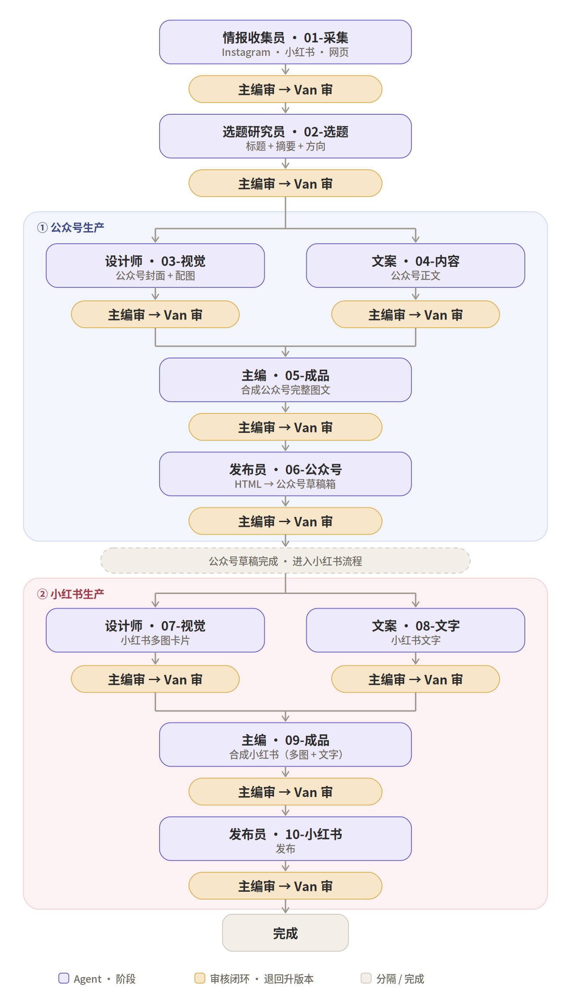

# 资讯日更 · 全流程（公众号先行 → 小红书后接）

> 一条选题先做完**公众号完整图文草稿**并过审，再进入**小红书流程**；小红书从已定稿的公众号成品改编，**一条 = 多图 + 文字**。
> 每个产出阶段后都走「**主编审 → Van 审**」，不过即退回升版本。

---

## 核心规则

- **顺序**：公众号阶段（03–06）整段跑完、草稿过审后，才进入小红书阶段（07–10）。
- **小红书形态**：一条小红书内容包含**多图（卡片）+ 文字**两部分，所以也要「设计师 ∥ 文案」两路做、再合成一条。
- **审核**：每段产出 → 主编审 → Van 审。主编不过则退回该 Agent（告知方向 + 位置，**不代改**）、升版本重做；Van 不过同理。Van 过后，主编出**派工单**转下一阶段。
- **主编**是唯一对接 Van 的人，只审核 / 合成 / 派工，不编辑内容。
- 交付与流转（文件夹 → zip → OSS → 传链接、index.md 溯源头）见《资讯日更 · 交付与流转规范》。

---

## 角色

| 角色 | 在流程中的活 |
|---|---|
| 主编 | 每段审核、合成成品、出派工单；唯一对接 Van |
| 情报收集员 | 01-采集 |
| 选题研究员 | 02-选题 |
| 设计师 | 03-视觉（公众号）、07-视觉（小红书） |
| 文案 | 04-内容（公众号）、08-文字（小红书） |
| 发布员 | 06-公众号、10-小红书 |
| Van | 人类终审，每段把第二道闸 |

---

## 流程图



---

## 文字流程

```
共享前段
  01-采集    情报收集员   Instagram · 小红书 · 网页
     → 主编审 → Van 审
  02-选题    选题研究员   标题 + 摘要 + 方向
     → 主编审 → Van 审

① 公众号生产
  03-视觉    设计师   公众号封面 + 配图   ┐
                                          ├ 各自：主编审 → Van 审
  04-内容    文案     公众号正文          ┘
  05-成品    主编     合成公众号完整图文
     → 主编审 → Van 审
  06-公众号  发布员   HTML → 公众号草稿箱
     → 主编审 → Van 审
  ──────── 公众号草稿完成 · 进入小红书流程 ────────

② 小红书生产（一条 = 多图 + 文字，从公众号成品改编）
  07-视觉    设计师   小红书多图卡片      ┐
                                          ├ 各自：主编审 → Van 审
  08-文字    文案     小红书文字          ┘
  09-成品    主编     合成小红书（多图 + 文字）
     → 主编审 → Van 审
  10-小红书  发布员   发布
     → 主编审 → Van 审

完成
```

---

## 阶段详解（10 段）

| 阶段 | 责任 Agent | 上游（内容） | 产出 |
|---|---|---|---|
| 01-采集 | 情报收集员 | 起点 | 资讯包（Instagram / 小红书 / 网页） |
| 02-选题 | 选题研究员 | 01 资讯包 | 标题 + 摘要 + 三段方向 |
| 03-视觉 | 设计师 | 02 选题 | 公众号封面 + 配图 |
| 04-内容 | 文案 | 02 选题 + 01 情报 | 公众号正文 |
| 05-成品 | 主编 | 03 + 04 | 公众号完整图文 |
| 06-公众号 | 发布员 | 05 成品 | HTML → 公众号草稿箱 |
| 07-视觉 | 设计师 | 06 公众号成品 | 小红书多图卡片 |
| 08-文字 | 文案 | 06 公众号成品 | 小红书文字 |
| 09-成品 | 主编 | 07 + 08 | 小红书成品（多图 + 文字） |
| 10-小红书 | 发布员 | 09 成品 | 小红书发布 |

> 表中「上游」指内容来源。实际流转中每段的直接上游都是**主编派工单**（内含上游交付物的完整 https 链接），见《交付与流转规范》。
